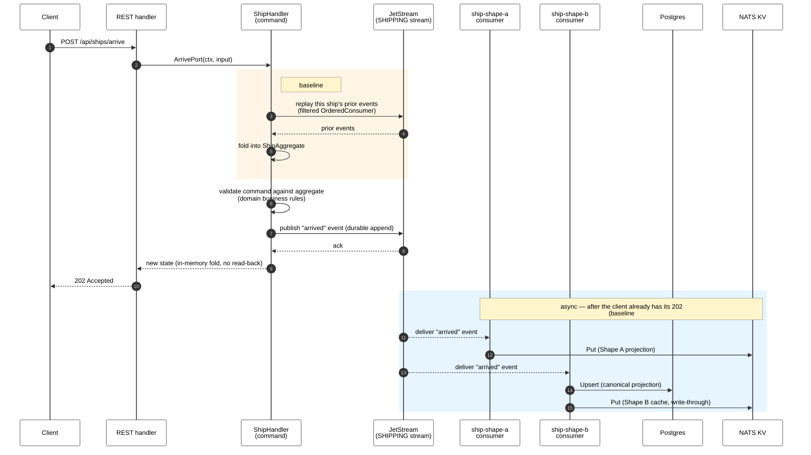
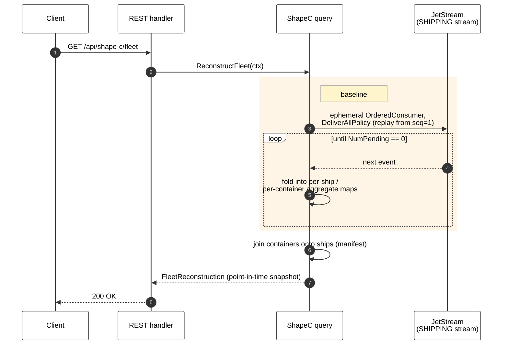

# Performance & Load Testing — Results

**Status: Phase 10 partial pass.** This document is deliberately incomplete. It
captures the **pull-forward baselines** measurable on the current architecture
(Phase 10) and lists the scenarios **deferred** to their gating phase. The full
suite is finalised in Phase 14. See
`.claude/plans/Dictionary-POC-Plan.md` and the harness in
[`perf/`](perf/README.md).

> **Measurement only.** Baselines here document degradation curves; mitigations
> (snapshotting, consumer parallelism, SSE load balancing) are **not** applied
> in Phase 10 — they interact with Phases 11–13 and are Phase 14 work.

---

## Test environment

| Field | Value |
|---|---|
| Date | 2026-07-13 |
| Host | Apple M3 Pro, 12 cores, 18 GB RAM |
| OS | macOS 26.4.1 (Darwin 25.4.0) |
| Stack | `docker compose -f demos/01-dictionary/docker-compose.yml` (all default config) |
| Backend | host `:18080`, `CONTEXT=global` |
| Postgres | `postgres:16-alpine`, `max_connections=100` (default) |
| k6 version | v2.1.0 |
| Docker | 29.6.1 |

> Numbers below are from a **single laptop run** against the dockerized stack —
> a relative-degradation baseline, not an absolute production capacity figure.
> The event stream was reset (`down -v`) before each scenario for isolation.

---

## Phase 10 baselines (captured on current architecture)

Each baseline is labelled by the side of the CQRS split it exercises:

| # | Baseline | Side | Replays / scales with |
|---|---|---|---|
| 1 | Shape C reconstruction | **READ** (query path) | the entire stream — total events across all ships |
| 2 | Single-ship hydration | **WRITE** (command path) | one ship's own event history |
| 3 | Command-throughput ceiling | **WRITE** (ingest → projection) | concurrency; bottleneck on the read-model projection |

### Path execution & data flow

**Write path** — a command is validated and durably published *before* the
client gets a response; the read models (KV, Postgres) update **afterwards**,
asynchronously, off two independent consumers. Baselines #2 and #3 both
exercise this path — #2 stresses step 2 (hydration), #3 stresses steps 5–6
(projection) under concurrency.



**Read path** — Shape C rebuilds state on demand straight from the event log;
nothing is cached. Baseline #1 exercises this path.



No KV or Postgres involved — this is a direct, in-memory reconstruction from
JetStream, which is why its cost tracks *stream depth* rather than any single
aggregate's history.

### 1. Shape C reconstruction vs stream depth — **READ side**

**Read side (query path).** `GET /api/shape-c/fleet` replays the whole stream
from `seq=1` on every call to rebuild the fleet read model on demand.
Harness: `perf/scenarios/shape-c-reconstruction.js` (10 samples per depth).

| Stream depth (events) | p50 (ms) | p95 (ms) | p99 (ms) |
|---|---|---|---|
| 100 | 0.90 | 1.36 | 1.50 |
| 1,000 | 5.71 | 7.54 | 7.90 |
| 10,000 | 44.64 | 46.98 | 47.04 |

**Confirmed ~linear degradation:** ~10× stream depth → ~8× reconstruction
latency. At 10k events a full-fleet replay already costs ~45 ms; extrapolating,
it crosses into hundreds of ms in the low-hundred-thousands of events —
**unusable for interactive reads without snapshotting** (Phase 14 mitigation).

### 2. Single-ship hydration degradation — **WRITE side**

**Write side (command path).** Before accepting a command, `hydrate()` replays
that ship's prior events to rebuild its aggregate state for validation; the HTTP
command latency includes that replay. Harness:
`perf/scenarios/hydration-single-ship.js`, one ship, 10,000 sequential
commands, latency bucketed by prior-event count.

| Prior events on ship | p50 (ms) | p95 (ms) | p99 (ms) |
|---|---|---|---|
| 0–100 | 0.65 | 1.35 | 2.68 |
| 100–1,000 | 2.36 | 3.94 | 4.70 |
| 1,000–10,000 | 18.03 | 31.12 | 42.09 |

**Confirmed degradation:** a ship's own command latency climbs ~28× (0.65 → 18
ms p50) as its history grows to 10k events. A busy ship slows its own writes —
the case for a **snapshot checkpoint** on the write path (Phase 14 mitigation).
Note this is per-aggregate: hydration folds only the ship's own subject, so an
individual ship's history — not total stream depth — drives the cost.

### 3. Raw command-throughput ceiling — **WRITE side**

**Write side (command ingest + async read-model projection).** Concurrent
senders, a **fresh ship per iteration** (histories stay shallow, so this
isolates the pipeline ceiling from hydration cost). Note the bottleneck
surfaced *downstream* of ingest — on the async projection that builds the read
model into Postgres (see the connection-limit finding below). Each level is a
separate 45 s constant-VU run against a reset stack. Harness:
`perf/scenarios/throughput-concurrent-ships.js`.

| Concurrent VUs | Cmd/s | p50 (ms) | p95 (ms) | p99 (ms) | Failed req |
|---|---|---|---|---|---|
| 10 | 3,820 | 1.61 | 6.58 | 11.41 | 0.0% |
| 100 | 2,942 | 24.25 | 94.31 | 163.50 | 15.7% |
| 250 | 2,684 | 65.55 | 258.13 | 413.24 | 24.4% |
| 500 | 2,513 | 133.66 | 567.97 | 1,185.05 | 36.5% |

**Ceiling ≈ 3,800 cmd/s** at low concurrency with zero errors. Throughput does
**not** rise with more senders — it falls while latency and failures climb.

> ⚠️ **The failures are connection-resource exhaustion, not command
> rejection.** The backend logged **zero** command-/publish-path errors. The
> failures coincide with two default-deployment limits:
> - **Postgres `max_connections=100` exhausted** — `FATAL: sorry, too many
>   clients already`. The shared `*sql.DB` (`cmd/main.go`) has **no
>   `SetMaxOpenConns` cap**, so under concurrent projection load the pool opens
>   unbounded connections and saturates the DB's connection limit
>   (`projection failed, will redeliver`).
> - **Host ephemeral-port exhaustion** — `cannot assign requested address`
>   from connection churn under 250–500 concurrent senders.
>
> So the true command-pipeline ceiling is **masked** by connection limits in
> this configuration; the p95/p99 at ≥100 VUs are over surviving requests only.
> Mitigations (Postgres connection **pooling** in the projector, raising
> `max_connections`, and consumer parallelism tuning) are **Phase 14** — flagged
> here, not applied (measurement only). This is arguably the most actionable
> finding of the baseline.

---

## Deferred scenarios (owned by Phase 14)

Not measurable on the current architecture — scripting them now would be thrown
away when the gating phase lands:

| Scenario | Measures | Gated by |
|---|---|---|
| Optimistic-concurrency contention | retry rate + latency cost of the sequence guard | **Phase 11** (guard doesn't exist yet) |
| Cross-stream burst / consumer lag | `SHIPPING` + `TERMINAL` projection lag under write pressure | **Phase 13** (no `TERMINAL` stream yet) |
| Cross-aggregate stale-read window | staleness of the read-model guard under load | **Phase 13** (stream split) |
| SSE fan-out | concurrent watch clients before lag | **Phase 14** (streaming, not request-shaped) |

When Phase 11 and Phase 13 land, Phase 14 also **re-measures the three
baselines above** against the final architecture and records the before/after
delta — in particular, what the Phase 11 sequence guard costs on the write
path relative to this pre-guard baseline.

---

## How to reproduce

See [`perf/README.md`](perf/README.md) for full detail and knobs. In short:

```bash
brew install k6
docker compose -f demos/01-dictionary/docker-compose.yml up --build -d

cd demos/01-dictionary
# reset the stream between scenarios: docker compose down -v && docker compose up -d
k6 run perf/scenarios/shape-c-reconstruction.js                  # depths 100/1k/10k
MAX_EVENTS=10000 k6 run perf/scenarios/hydration-single-ship.js  # single-ship curve
for v in 10 100 250 500; do                                      # throughput ladder
  VUS=$v k6 run --summary-export=throughput-$v.json \
    perf/scenarios/throughput-concurrent-ships.js
done
```
