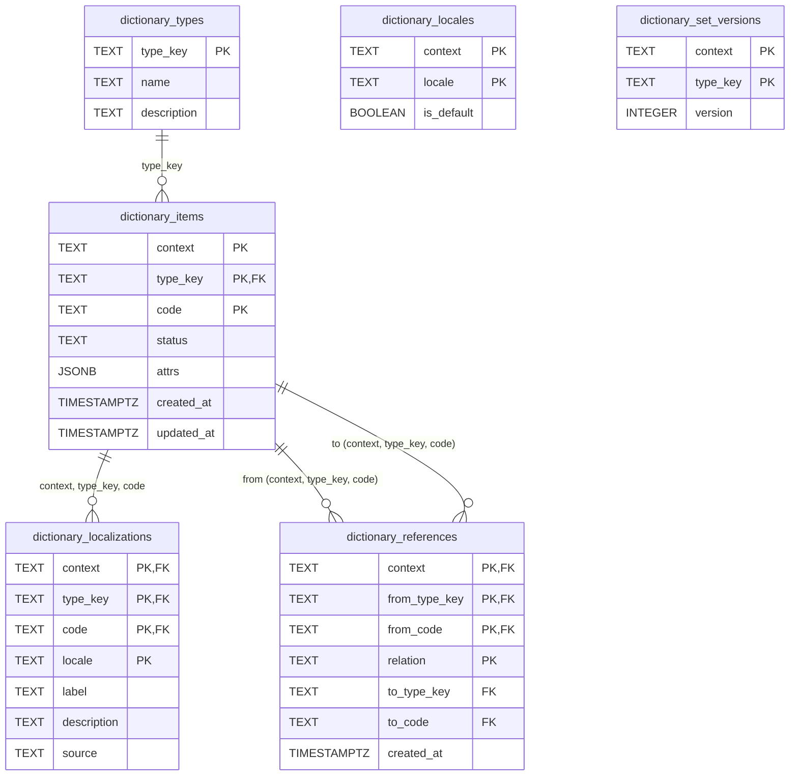

# Dictionary — Reference Data Service

Reference for `refdata-service`: how it's seeded, and its Postgres schema. For
the service's design rationale (Q5 versioned-read cache protocol, event-sourced
vs plain CRUD, KV bucket layout) see [../ARCHITECTURE.md](../ARCHITECTURE.md) §
"Reference Data Service" and `../../../.claude/plans/Dictionary-Service-Plan.md`.

---

## Seeding

`refdata-service/refdata/seed.go` runs once at service startup
(`Startup` → `Seed`, `composition.go`), idempotently registering a
demo-sized subset of standard reference data under the tenant/region context
`emea-acme` (`DefaultContext`, matching the shipping backend's convention).

Seeded types, each a `DictionaryType` (`type_key`, `name`, `description`):

| Type key | Description | Item count |
|---|---|---|
| `currency` | ISO 4217 currency codes (subset) | 35 |
| `country` | ISO 3166-1 alpha-2 country codes (subset) | 52 |
| `incoterm` | Incoterms 2020 delivery terms (complete) | 11 |
| `uom` | UNECE Recommendation 20 unit codes (subset) | 12 |
| `hazard-class` | UN dangerous goods hazard classes (complete) | 9 |
| `ship-status` | AIS navigational status (mirrors backend `ShipStatus`) | 5 |

`ship-status` is the first Shipping-domain enum onboarded into refdata — its
5 codes (`in-transit`, `docked`, `at-anchor`, `not-under-command`,
`restricted-manoeuvrability`) are duplicated by value from
`backend/dictionary/internal/domain/ship.go`'s `ShipStatus` constants; this
module has no Go dependency on the shipping backend, so the codes live here
as plain strings, not an import. The shipping backend does not yet read
these values back through `refdataconsumer` — today they exist in refdata
for lookup/localization purposes only, not as the backend's runtime source
for status codes.

For each type, `Seed` walks a `[]seedItem{code, name, nameEs}` list and:

1. `RegisterType` — upserts the `DictionaryType` row (idempotent; ignores
   `ErrDuplicateItemCode` on repeat runs).
2. For every `seedItem`, `RegisterItem` — creates the `DictionaryItem` with
   `Attrs: {"name": item.name}` (the `en` name only — `Attrs` is a
   set-level display convenience, not the localization mechanism).
3. `SetLocalization` — writes an `en` `Localization` row (`Label: item.name`)
   and an `es` `Localization` row (`Label: item.nameEs`) for the item. This
   is what makes the seed data resolvable through the locale-aware read path
   (`ResolveLabel`, BR-D03) rather than only available via the raw
   `Attrs["name"]`.

Before the per-type loop, `Seed` registers two locales for `emea-acme`:
`AddLocale(ctx, DefaultContext, "en", true)` — `en` as the **default**
locale, so `ResolveLabel` has a fallback to land on when a caller requests a
locale that hasn't been localized (e.g. `fr-FR` with no French translations
entered) — and `AddLocale(ctx, DefaultContext, "es", false)`, a second,
non-default locale seeded purely so the locale switcher and completeness
tooling in the dictionary UI (`frontend-dict`) have more than one populated
locale to exercise.

Net effect: every seeded item has an English `Attrs["name"]` plus proper
`en` and `es` localization rows (the fields the locale-resolution protocol
actually reads). No locale beyond `en`/`es` is seeded — further translations
are added at runtime through the dictionary UI, not by `Seed`.

`Seed` is safe to run repeatedly: `RegisterType`/`RegisterItem` tolerate
duplicates, and `SetLocalization` is an upsert keyed on
`(context, type_key, code, locale)`, so re-seeding does not create duplicate
localization rows or bump the type's set version beyond what the upsert
itself triggers.

## Database Schema

Own Postgres schema (`refdata`), same physical database (`dictionary`) as the
shipping backend, no shared tables — `CREATE SCHEMA IF NOT EXISTS refdata`
(`internal/postgres/migrate.go`). Postgres is the sole source of truth; NATS
JetStream/KV are cache and change-notification only (see ARCHITECTURE.md §
"Reference Data Service").

Notes on the model:

- **Identity has no surrogate key.** `dictionary_items` is keyed on the
  natural composite `(context, type_key, code)` — reference data has no
  external interchange standard forcing a surrogate, unlike `Container`
  (Phase 8.3).
- **No per-item version column.** Versioning is a property of the *type's
  whole set*, not the row — tracked in `dictionary_set_versions` and stamped
  onto the KV cache entry (`kvcache.Entry.Version`) on every mutation
  (BR-D04). `dictionary_items` originally had a `version` column; it's now
  dropped (`ALTER TABLE ... DROP COLUMN IF EXISTS version`) in favor of the
  set-level version.
- **`dictionary_localizations.source`** is `"manual"` or `"ai"` (BR-D07 —
  AI-translation review gating is not yet enforced). `Seed` always writes
  `"manual"`.
- **`dictionary_locales.is_default`** — at most one default locale per
  context; `AddLocale` unsets any prior default in the same transaction
  before upserting.
- **Cascades:** deleting an item cascades to its localizations
  (`ON DELETE CASCADE`) and to references where it is the `from` side; it
  does not cascade on the `to` side (an item cannot be hard-deleted while
  still referenced — BR-D02 — enforced in the domain layer, not by the FK).
