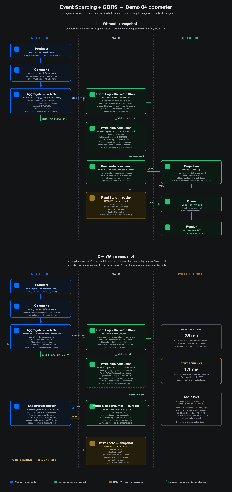

# Demo 04 — JetStream as an Event Source, with CQRS

**One question, answered with a number:**

> Rehydrating an aggregate — how much does a snapshot buy you?

Demo 02 publishes to a stream and folds the result into a KV bucket. It has no
write side: nothing checks a command against the state the log already holds.

Demo 04 adds that write side, then rehydrates the same aggregate two ways —
from sequence 1, and from a snapshot plus the tail — and prints what each one
cost.

## The shape

```
              command  (register / travel / retire)
                 |
                 v
   +-------------------------------+
   |  WRITE SIDE                   |
   |  1. rehydrate the aggregate   |<---- KV  odometer-write   (snapshot)
   |  2. check the business rule   |
   |  3. append, if nobody won the |
   |     race first                |
   +-------------------------------+
                 |
                 v
        stream  ODOMETER     (LimitsPolicy — replay needs it)
             |          |
   write consumer    read consumer
             |          |
             v          v
   KV odometer-write   KV odometer-read  <---- query
        (snapshot)       (read model)
```

Two KV buckets, on purpose. The split is the demo, and you can see it in
`nats kv ls`.

The same thing drawn properly, with the two rehydration modes as two separate
diagrams:



> Source: `diagrams/cqrs-blocks.html`. Re-export it with:
> `node ../01-dictionary/diagrams/export-html-png.mjs diagrams/cqrs-blocks.html diagrams/cqrs-blocks.png 1400`

## What is in here, and what is not

One NATS server, one Go binary, one Compose file, one stream, two KV buckets,
and a small Vue UI that watches all of it. Lesson 02 adds two more buckets,
but only once you run it.

No Postgres, no cluster, no gateway, no operator mode, no Temporal.
Multi-region is demo 02. Accounts and topologies are demo 03. Services are
demo 01.

## Ports

| Thing | Port | Needed for |
|---|---|---|
| NATS client | 4422 | the CLI |
| NATS monitor | 8422 | poking at the server |
| NATS WebSocket | 20403 | the UI reads through this |
| UI dev server | 20401 | the UI |
| Command API (`cqrs serve`) | 20402 | the UI writes through this |

Its own ports, so it runs beside demo 01 (4222) and demo 02 (4621+, 4721+).
The three 5-digit ones follow `20<demo number><increment>`, which keeps them
outside demo 01's 7100-7299 bands. `4422` and `8422` predate the scheme.

## How to run it

You need Docker and Go. Nothing else.

### 1. Start the server

From `demos/04-jetstream-cqrs/`:

```bash
docker compose -f deploy/compose.yaml up -d
```

One NATS server, on port 4422. Wait a few seconds for it to be healthy.

### 2. Build the CLI

```bash
cd cqrs
go build -o cqrs .
```

Every command below takes `-url` if you moved the port. The default is
`nats://127.0.0.1:4422`.

### 3. Put a vehicle into service

```bash
./cqrs register -vehicle V1 -plate "CA 123-456"
```

It prints how it rebuilt the aggregate first, then the sequence it appended at.
The rebuild comes first on purpose: a command is checked against the log, not
against a row in a table.

### 4. Record some trips

```bash
./cqrs travel -vehicle V1 -km 12.5
./cqrs travel -vehicle V1 -km 7.5
```

### 5. Watch a rule refuse a command

```bash
./cqrs travel   -vehicle V1 -km 0            # BR-OD01 — km must be greater than 0
./cqrs register -vehicle V1 -plate "X"       # BR-OD03 — cannot register twice
./cqrs travel   -vehicle V2 -km 5            # BR-OD02 — V2 was never registered
```

Each one fails with the rule it broke. Nothing is written to the stream.

### 6. Run the two projectors

Each one blocks, so give each its own terminal, both in `cqrs/`.

```bash
./cqrs snapshotter
```

```bash
./cqrs projector
```

`snapshotter` keeps the write-side snapshot in KV `odometer-write`.
`projector` keeps the read model in KV `odometer-read`. They read the same
stream and do different jobs. That is CQRS.

### 7. Read the read side

```bash
./cqrs query -vehicle V1
```

One KV get. No replay, no rules. It prints the total km, the trip count, and
the last trip time.

### 8. Compare the two rehydrations

This is the measurement the demo exists for. See **The finding** below.

```bash
./cqrs seed      -vehicle V1 -n 10000
./cqrs rehydrate -vehicle V1 -snapshot=false
```

Now let `snapshotter` catch up — it is asynchronous, so give it ~20 seconds
for 10000 events — then stop it and run:

```bash
./cqrs rehydrate -vehicle V1 -snapshot=true
```

Both lines print events replayed and time taken. Put the two side by side.

### 9. Look at the storage (optional)

Needs the `nats` CLI on your machine.

```bash
nats context add lab4-odometer --server nats://127.0.0.1:4422
nats --context lab4-odometer stream ls
nats --context lab4-odometer kv ls
```

One stream, `ODOMETER`. Two buckets, `odometer-write` and `odometer-read`.
The split is the demo.

Run the worker pool (see **Lesson 02** below) and two more appear:
`odometer-pool` and `odometer-pool-workers`. They are lesson 02's, and they do
not exist until you run it.

### 10. Stop and clean up

```bash
docker compose -f deploy/compose.yaml down -v
```

`-v` deletes the JetStream volume. That wipes the stream and both buckets, so
the next run starts empty.

## Watch it in a browser

The CLI above is the whole demo. The UI shows the same demo moving: one log,
two KV buckets, and how far behind the head of the stream each side is.

You need the NATS server running (step 1) and Node 20 or newer.

### 1. Start the command API

The browser cannot publish to NATS on its own, and it is not allowed to decide
anything either. Every command goes through a thin HTTP shim that calls the
same `domain.go` the CLI calls. The shim holds no rules.

```bash
cd cqrs
go build -o cqrs .
./cqrs serve
```

It listens on `127.0.0.1:20402` and blocks. Give it its own terminal.

### 2. Start the two projectors

Same as step 6 above, each in its own terminal, both in `cqrs/`. Without them
the buckets stay empty and the screen has nothing to fold.

```bash
./cqrs snapshotter
```

```bash
./cqrs projector
```

### 3. Start the UI

```bash
cd frontend
npm install
npm run dev
```

Open <http://localhost:20401>.

The port is fixed on purpose. The command API's CORS list names
`http://localhost:20401` exactly, so a dev server on another port is refused
outright rather than half working.

### What is on the screen

The rail is a lesson index, not a list of data. Three rows, and it never
grows: a guide, and one row per lesson.

| Rail row | What it shows |
|---|---|
| **How it works** | this README, and the diagrams |
| **01 · Stream + CQRS** | four tabs — Overview, the log, and each bucket |
| **02 · Scaling a consumer** | four tabs — Live, Starvation, Redelivery, 1 vs 4 |

Lesson 01's Overview tab is the argument: the lag lane, and both buckets side
by side. Which vehicle you are looking at is a picker at the top of the page,
not a rail row, so ten vehicles do not make ten rail rows.

Every tab prints the command that produced it. A number on a screen you cannot
reproduce in a terminal is a claim, not a demonstration.

No button is ever greyed out by a rule. A trip of 0 km is sent, refused by
`domain.go`, and the refusal names the rule it broke. A rule the browser
enforced would be a rule you could not see working.

Nothing an accepted command returns is written into the panels. The command
gives back a sequence number; the screen learns what it meant from the read
path. That split is the demo.

A command typed in the terminal lands in the same stream and shows up on the
screen. The UI is a second door, not a second truth.

## The finding

Measured 2026-09-16, on one NATS 2.14.3 server in Docker on a laptop, with
10001 events on one vehicle. Best of three runs each way.

| Rehydration | Events read | Time |
|---|---|---|
| From sequence 1, no snapshot | 10001 | **25 ms** |
| From the snapshot, then the tail | 0 | **1.1 ms** |

**About 23x, and it grows with the log.** The replay is linear: every command
on the write side reads all 10001 events again, and reads more tomorrow. The
snapshot read is one KV get and does not care how long the log is. Extend the
log to 100k events and the left-hand number goes up tenfold while the
right-hand one does not move.

### The number used to be wrong, and the reason is worth more than the number

This table read **8.2 s** and **about 600x** until 2026-09-16. Two things were
wrong with it, and the smaller one was the arithmetic.

The replay read the log with `Consumer.Next()`. On an **ordered** consumer that
call resets the consumer every time — the client deletes the server-side
consumer and creates a new one per message. The demo was making **one consumer
per event**. It was visible on the server, because an ordered consumer's name
carries a serial number:

```
5yL5cUQZHSfSpLY8WvMDXR_32469   delivering stream sequence 32478
```

So the 8.2 seconds was about 99% consumer bookkeeping and about 1% reading a
log. `Messages()` creates one consumer and pulls batches over it, which is what
the client's own documentation on `Next()` tells you to do.

The lesson survives the correction, and it is the same lesson: replay is linear
in the length of the log and a snapshot is constant. What changed is that the
number now measures that, and not a mistake in the demo.

Two things the number still does not say:

- **The snapshot is always behind.** The write consumer is asynchronous, so it
  trails the log. Rehydration reads the snapshot and then replays from
  `lastSeq + 1`. Measured mid-catch-up, the same command read 2900 events of
  tail in 12 ms. Code that trusts the snapshot and stops there is a bug.
- **The log is still the only source of truth.** Delete both KV buckets and
  everything comes back. Delete the stream and nothing does.

Reproduce it yourself with **How to run it**, step 8.

## Lesson 02 — scaling a consumer

The rest of this demo folds one event at a time, in order, because a fold is a
fold. `cqrs pool` does it wrong on purpose: N workers bind to **one** durable
consumer and race each other. Throughput goes up. Order goes away.

Three facts decide everything that follows.

- **The position belongs to the consumer, not to a worker.** Adding workers
  adds hands, not places in the queue.
- **`MaxAckPending` is shared by the whole consumer.** Eight workers and a cap
  of three leaves five workers with nothing to do. That is a config answer, not
  a bug.
- **Demand order is not log order.** Worker 3 can be folding event 6 while
  worker 1 has already folded event 7.

The pool folds into its own bucket, `odometer-pool`. It is a third projection
of the same log and it is kept apart from `odometer-read` on purpose: the pool
is deliberately damaged, and a demo that damaged the read model to show that
would have nothing correct left to compare against.

### What the damage looks like

`BR-OD08` is what turns reordering from a silence into a number. A fold refuses
an event whose sequence is behind its own position, terminates it, and counts
it. The run prints the count:

```
events      10001 handed out
folded      9994 acked
dropped     7 refused by BR-OD08 — out of order, terminated, gone
```

**The pool's total is short, never double.** A dropped event is a fact that is
gone: the fold's position never moves back, so nothing repairs it. Compare
`odometer-pool` against `odometer-read` and the difference is the cost of the
extra workers, in kilometres.

`BR-OD08` cannot fire while `-max-pending 1`. One message in flight is one
message in flight, whatever the worker count, so the pool behaves and proves
nothing.

### The four runs

Each one is the same pool under a different condition. They are the four tabs
in the UI.

```bash
./cqrs pool -workers 4 -max-pending 1000 -ack-wait 30s   # Live
./cqrs pool -workers 8 -max-pending 3                    # Starvation
./cqrs pool -workers 4 -ack-wait 30s -kill-at 94         # Redelivery
```

`-kill-at` is real fault injection, not a label. The worker that fetches that
sequence stops fetching and **never acks and never naks** — exactly what the
server sees when a process is killed. It must not nak: a nak redelivers at
once and hides the `AckWait` wait, which is the only thing the flag exists to
show. The event is redelivered after `AckWait`, the watermark refuses to
double-count it (`BR-OD07`), and the fold is stuck until then.

Each run blocks. Stop it with Ctrl-C.

### What the redelivery actually costs

Measured 2026-09-16, on one NATS 2.14.3 server in Docker on a laptop, four
workers. The pool keeps a kill clock in its own process, because nothing else
saw both ends: the server never reports a wait, only a delivery count, and the
worker that gets the event back is never the worker that lost it.

| AckWait | Waited | Handed to | Fold ran on | Outcome |
|---|---|---|---|---|
| `30s` | 30.02s | worker 3 → 4 | +29 events | dropped |
| `5s` | 5.001s | worker 4 → 1 | +30 events | dropped |

```bash
./cqrs pool -workers 4 -ack-wait 30s -kill-at 74040
./cqrs seed -vehicle truck-7 -n 40
./cqrs pool -workers 4 -ack-wait 5s -kill-at 74079
./cqrs seed -vehicle truck-7 -n 40
```

Two things fall out of it.

The wait **is** `AckWait`, to within 20ms in both runs. The server is not
retrying after a failure — it is running a timer out. Set `AckWait` long and
you have chosen exactly how long the fold stays stuck.

And the wait **bought nothing**. The seed after each pool keeps the other
three workers folding, so by the time the event came back the watermark had
moved past it — and both redeliveries were dropped on arrival (`BR-OD07`). In
a pool, a redelivery after `AckWait` is not a recovery. The kilometres are
still gone.

The same two runs are drawn on the UI's **Redelivery** tab.

### Do the two projections agree — yes, and a rebuild is exact

The snapshotter folds into `odometer-write`; the projector folds into
`odometer-read`. Separate processes, separate durables, one log. Measured
2026-09-16: both buckets and both durables were deleted, then both consumers
folded all 74 135 events from sequence 1 again. The log was never touched.

| Vehicle | write `lastSeq` | read `lastSeq` | read `totalKm` |
|---|---|---|---|
| `V1` | 1 | 1 | 0 |
| `V2` | 28 | 28 | 37 |
| `rebuild-probe` | 74135 | 74135 | 25 |
| `truck-7` | 74109 | 74109 | 74327 |
| `ui-1` | 24 | 24 | 12.5 |
| `ui-demo-1` | 5 | 5 | 42 |

```bash
nats --context lab4-odometer kv del odometer-write -f
nats --context lab4-odometer kv del odometer-read -f
nats --context lab4-odometer consumer rm ODOMETER odometer-snapshotter -f
nats --context lab4-odometer consumer rm ODOMETER vehicle-projector -f
./cqrs snapshotter &
./cqrs projector &
```

Same position everywhere, and the same `status` and `plate`. **All ten KV
documents came back byte-identical to what they held before the wipe** —
`lastTripAt` included, to the nanosecond. That is the result worth having:
`project()` uses the event's own stream timestamp and never the wall clock, so
rebuilding the read model next year gives the answer it gave today.

They do **not** agree on `totalKm`, and must not. `Vehicle` — the write-side
aggregate — has no such field: `Travelled` leaves it unchanged, because no
command is ever judged against a distance. Ten thousand trips move the read
model and leave the aggregate byte-for-byte identical. That is why a write-side
snapshot stays tiny however long the log gets, and it is CQRS in one line.

### Does `MaxAckPending` starve workers — no

Measured 2026-09-16, on one NATS 2.14.3 server in Docker on a laptop, eight
workers, 74 109 events in the stream, `-drain` so every run reads the same log.

| MaxAckPending | Time | Events/s | Workers that acked | Folded | Dropped | Loss |
|---|---|---|---|---|---|---|
| **1** | 1m34.1s | 788 | **8 of 8** | 74109 | **0** | 0.0% |
| 3 | 50.0s | 1481 | **8 of 8** | 57529 | 16580 | 22.4% |
| 1000 | 33.2s | 2229 | **8 of 8** | 31912 | 42197 | 56.9% |

The cap of 3 was run twice — 54.6s and 16 722 dropped the second time — so
these are a race, not a constant.

```bash
./cqrs pool -workers 8 -max-pending 1 -drain
./cqrs pool -workers 8 -max-pending 3 -drain
./cqrs pool -workers 8 -max-pending 1000 -drain
```

**No worker starved, at any cap.** Not even at a cap of one: all eight acked,
within 2% of each other (`w1:9263 … w8:9264`). A worker acks, a slot frees,
the next fetch is served. `MaxAckPending` throttles the **consumer**; it does
not idle a worker.

What it really is, is the **loss dial**. A smaller cap is slower and drops
less, because there is less in flight to reorder. At a cap of 1 this pool
folds the whole log and drops **nothing** — same eight workers, same code, a
third of the speed.

The [nats.io worker-pool page][nats-wp] says a low cap "starves a large set of
workers". Both are true, about different things. At an **instant**, yes —
sampled while a capped pool ran, the consumer reported `num_ack_pending 3` and
`num_waiting 4`–`5` of the 8, every time:

```bash
nats --context lab4-odometer consumer info ODOMETER odometer-pool -j
```

Over a **run**, no — every worker gets a turn. Set the cap for the loss you
can accept, not to keep workers busy.

[nats-wp]: https://docs.nats.io/learn/jetstream/worker-pool

The same three runs are drawn on the UI's **Starvation** tab.

### Does it actually go faster — 1 vs 4

Measured 2026-09-15, on one NATS 2.14.3 server in Docker on a laptop, 10029
events in the stream, `-drain` so every run rebuilds from sequence 1 and
answers the same question.

| Workers | Time to drain | Events/s | Folded | Dropped |
|---|---|---|---|---|
| 1 | **23.5 s** | 426 | 10029 | **0** |
| 2 | **12.2 s** | 824 | 10025 | 4 |
| 4 | **6.3 s** | 1600 | 6947 | **3082** |
| 8 | **4.8 s** | 2100 | 4338 | **5691** |

**Yes, it goes faster. 3.7x at four workers.** And read the last column.

At four workers the pool threw away **31% of the log**. At eight, **57%**. The
kilometres in `odometer-pool` are not late, they are gone: a dropped event is
a fact the fold refused, and the fold's position never moves back.

One worker drops nothing, because one worker cannot race itself. That row is
the control, and it is why the table has four rows and not one.

**This is the whole lesson.** You are not buying throughput for free. You are
buying it with correctness, and the price is on the right-hand side of the
table. A pool is the right answer when the work per event is independent —
send an email, resize an image, call an API. It is the wrong answer for a
fold, because a fold is defined by order.

Reproduce it yourself:

```bash
./cqrs seed -vehicle truck-7 -n 10000
for w in 1 2 4 8; do ./cqrs pool -workers $w -drain; done
```

The same four runs are drawn on the UI's **1 vs 4** tab.

`-drain` is what makes the runs comparable: it rebuilds the pool's projection
from sequence 1 and stops when the consumer reports nothing left.

Your dropped counts will not match these exactly. Which worker gets which
message is a race, and a race is not repeatable. The shape is: one worker
drops nothing, and the count climbs hard with the worker count.

## The commands

| Command | What it does |
|---|---|
| `register -vehicle ID -plate P` | put a vehicle into service |
| `travel -vehicle ID -km N` | record one trip |
| `retire -vehicle ID -reason R` | take a vehicle out of service |
| `rehydrate -vehicle ID [-snapshot]` | rebuild the aggregate and report the cost |
| `seed -vehicle ID -n N` | write N trips, to make the replay worth timing |
| `snapshotter` | run the write-side projector (blocks) |
| `projector` | run the read-side projector (blocks) |
| `query -vehicle ID` | read the read store — one KV get, no replay |
| `serve` | run the command API the UI posts to (blocks) |
| `pool -workers N [-max-pending N] [-ack-wait D] [-kill-at SEQ] [-drain]` | N workers racing on one durable consumer (blocks) |

## Status

Phases 04.1 to 04.6 are done. Phase 04.7 — the worker pool — is built and
runs; its four timings are not measured yet. See `docs/Demo-04-Plan.md`.

## Tests

```bash
cd demos/04-jetstream-cqrs/cqrs
ginkgo ./...
```
