# Architecture — Accounts & User Authentication

Reference for `accounts-service`: tenant (NATS account) lifecycle, user
account provisioning, authentication flows, and session management. For the
account-level business rules (BR-AC01–AC06) and user-level rules
(BR-UA01–UA10) see
[BUSINESS_RULES-ACCOUNTS.md](../../../../demos/01-dictionary/BUSINESS_RULES-ACCOUNTS.md).
For the NATS operator-mode infrastructure (resolver, `$SYS.REQ.CLAIMS.*`)
see [accounts_service_plan.md](../../../../.claude/memory/accounts_service_plan.md)
and [nats_sys_claims_subjects.md](../../../../.claude/memory/nats_sys_claims_subjects.md).

---

## System context

```
┌──────────────┐     ┌──────────────┐     ┌──────────────────┐
│  Browser     │────▶│  accounts-   │────▶│  WorkOS          │
│  (Admin UI / │     │  service     │     │  (User Mgmt,     │
│   tenant app)│     │              │     │   SSO, SCIM)     │
└──────────────┘     └──────┬───────┘     └──────────────────┘
                            │
                   ┌────────┼────────┐
                   ▼        ▼        ▼
              ┌────────┐ ┌──────┐ ┌──────────┐
              │Accounts│ │ NATS │ │  Shared   │
              │Postgres│ │Server│ │ creds dir │
              └────────┘ └──────┘ └──────────┘
```

**Source-of-truth boundaries:**

| Concern | Owner | Notes |
|---------|-------|-------|
| Identity & authentication | WorkOS | Email, password/SSO, MFA, email verification |
| Domain attributes | App DB (accounts-postgres) | Tenant association, role, permissions, preferences |
| NATS credentials | Derived artifact | Minted from app DB + tenant's account signing key; never authoritative |

---

## Tenant account lifecycle (NATS accounts)

Tenant accounts are NATS accounts — server-enforced isolation boundaries
with their own JetStream streams, KV buckets, and connection credentials.
Managed via NATS operator mode (decentralized JWTs). See BR-AC01–AC06.

### Scaling note — per-tenant connections

`shipping-service` currently opens **one `nats.Connect` per provisioned tenant
account** (visible in the NATS connections panel as one `shipping-service` row
per account — `acme`, `globex`, etc.). This is necessary because JetStream
streams and KV buckets are per-account resources: to subscribe to `acme`'s
`SHIPPING` stream or write to its KV buckets the connection must authenticate
*as* `acme`. A PLATFORM-account connection cannot reach into another account's
JetStream namespace directly.

This is acceptable for a POC with a small, known tenant set. At production
scale (hundreds of tenants) it becomes a connection-count and credential-
management burden.

**Production-scale fix — NATS stream/KV exports + imports.**
Each tenant account exports its `SHIPPING` stream and KV buckets; the
shipping-service's own account imports them as stream mirrors. One connection
then sees all tenant data without per-account auth. The exports/imports must be
declared at account-mint time in `accounts/provisioner.go` (added to the
account JWT claims) and echoed in `nats.conf`'s import stanzas.

Reference: [NATS stream import/export](https://docs.nats.io/nats-concepts/jetstream/streams#import-and-export)
and the multi-tenant JetStream pattern in the [Synadia per-tenant FIFO blog post](https://www.synadia.com/blog/nats-jetstream-per-tenant-fifo-processing).

### NATS operator-mode trust chain

```
Operator (lab-operator)
  └─ Operator signing key (nats/keys/operator-signing-key.nk)
       │
       ├─ signs → Account JWT (one per tenant)
       │            └─ Account signing key (generated per account, stored in Postgres)
       │                 └─ signs → User JWT (one per service/human user)
       │                              └─ combined with User NKey seed → .creds file
       │
       └─ signs → SYS Account JWT (system account)
                    └─ sys.creds (used by accounts-service to reach $SYS.REQ.CLAIMS.*)
```

**Key artifacts:**

| Artifact | What it is | Who holds it | Sensitivity |
|----------|-----------|--------------|-------------|
| Operator signing key (`.nk`) | Ed25519 seed that signs account JWTs | `accounts-service` (read-only mount) | Highest — controls all accounts |
| Account signing key seed | Ed25519 seed that signs user JWTs for one account | `accounts-postgres` (`signing_key_seed` column) | High — controls one tenant's users |
| Account JWT | Signed claims (public key, JetStream limits, name) | NATS resolver (`$SYS.REQ.CLAIMS.UPDATE`) | Medium — public key + config, no secrets |
| User JWT | Signed claims (account association, permissions) | `.creds` file on disk / short-lived in browser | Medium — grants access but expires |
| User NKey seed | Ed25519 private key for the user identity | `.creds` file (server-side only — BR-UA05) | High — paired with the JWT for auth |

### 1t. Tenant account creation

BR-AC01, BR-AC02 — mint account + user JWTs, push to resolver, write `.creds`.

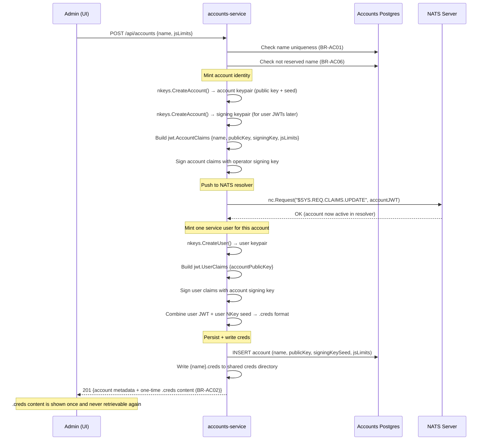

### 2t. Tenant account suspension

BR-AC03 — revoke at resolver, remove `.creds`.

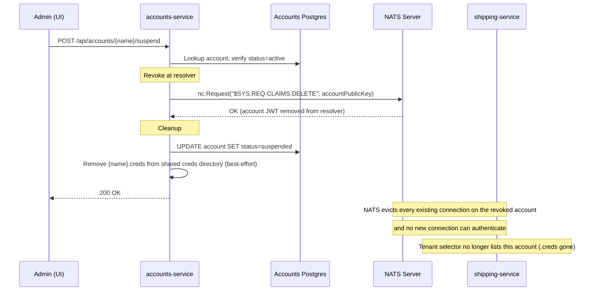

> **Corrected 2026-08-03.** This diagram previously stated that existing
> connections under the account *continue* after the revoke, mirroring the
> (also incorrect) doc comment on `Provisioner.DeleteAccount`. Verified
> against NATS 2.11 on the running stack: connections **are** force-evicted,
> within a couple of seconds, and the server logs
> `account authentication expired` to each affected client. The revoke is a
> hard boundary, not a lazy one. See 2t-a below for what that eviction does
> to clients that were connected at the time.

### 2t-a. Suspension — runtime effect on connected clients

2t above covers what `accounts-service` *does*. This covers what happens to
everyone who was connected when it did it — the cross-service consequence,
which is where the current gaps are.

Verified end to end against the running Docker stack on 2026-08-03 (a
throwaway tenant was minted, connected to, suspended, and observed via
`/connz`, `nats sub`, and `docker logs`), not derived from reading the code.

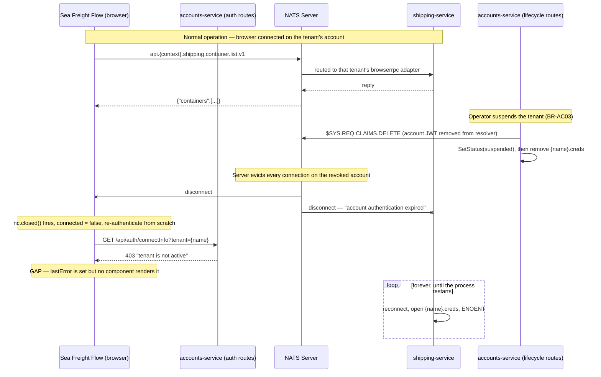

> **Diagram note (Phase 19):** `Auth` and `Accounts` are drawn as separate
> participants because they're separate HTTP route groups with separate
> gating (ungated `/api/auth/*` vs `BasicAuth`-gated `/api/accounts/*`) —
> not because they're separate processes. Since Phase 19 folded
> auth-service into accounts-service, both boxes are the same container and
> the same Postgres connection; see `BUSINESS_RULES-ACCOUNTS.md`'s "Phase
> 19 — auth-service merged in" note.

Three things worth drawing out:

- **An `api.*` request on a suspended account is usually never sent at all** —
  the connection is already gone. A request genuinely in flight at the moment
  of eviction simply never gets a reply and hits the browser's 5s
  `REQUEST_TIMEOUT_MS`.
- **The browser path is correct, close to by accident.** The re-authenticate
  logic in `useNatsConnection.js` exists for the 5-minute browser JWT expiry;
  it handles suspension properly only because `connectInfo` re-checks status
  and refuses. Its one flaw is that `lastError` is never rendered, so the
  operator sees panels quietly stop updating with no explanation.
- **The `shipping-service` path is broken.** Its per-tenant connection is
  evicted like any other, but nothing classifies that as terminal, so
  `nats.go` retries forever against a `.creds` file suspension has already
  deleted. One permanent loop accumulates per suspension, cleared only by a
  restart. This is the exact mirror of BR-030: there is reactive handling for
  a tenant appearing, and none for a tenant going away.

There is also a narrow window between the `$SYS.REQ.CLAIMS.DELETE` and the
Postgres status update in which the auth routes still report the tenant
active and will mint a browser JWT for an account that no longer resolves.
It fails closed — the connection is simply refused — so it is a confusing
error rather than a security hole.

#### Proposed — not implemented

Everything below is a design sketch, not current behaviour. Nothing in this
section exists in the code as of 2026-08-03.

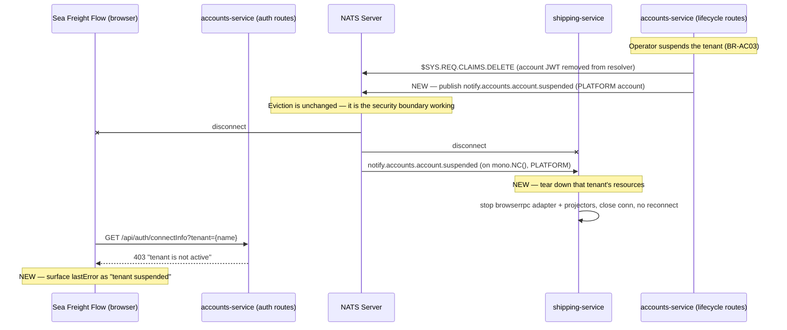

Design notes on the sketch:

- **Eviction stays.** The fix is not to soften the revoke; it is to react to
  it. The red path in the current diagram is correct behaviour.
- **The event mirrors BR-AC08 exactly** — same PLATFORM-account connection
  `accounts-service` already opens to publish `notify.accounts.account.created`,
  same context-free subject family, consumed by `shipping-service` on the same
  `mono.NC()` that already handles the created event.
- **Publish after the revoke succeeds**, keeping BR-AC08's "only announce what
  actually happened" rule. The cost is that `shipping-service` is evicted a few
  milliseconds before the event arrives, so it may spin through one or two
  failed reconnects before teardown lands — bounded, versus unbounded today.
  Publishing *before* the revoke would be fully graceful but risks announcing a
  suspension that then fails.
- **An error-classification backstop belongs alongside the event**, not instead
  of it. `notify.*` is core NATS with no persistence, so a service that is down
  when the event fires misses it permanently, and an account removed outside
  `accounts-service` (an operator running `nsc`, a resolver purge) never
  produces one at all. Classifying connection and JetStream errors as terminal
  (account gone, creds missing, `JSNoAccountErr` 10035, `JSNotEnabledForAccountErr`
  10039) versus transient (network, server restart) makes teardown self-healing.
  Note that 10035's advisory `503` maps to "retryable" in HTTP terms and is
  actively misleading here — account-not-found after a revoke is permanent, and
  treating it as transient is precisely the bug above.

**Reactivation — resolved 2026-08-03 (BR-AC10/BR-032).** This section
originally flagged reactivation as an unverified asymmetry, and it turned out
to be a real one: the teardown above was a one-way door. `EnsureAllTenants`
only runs at process startup and Sea Freight Flow never calls `SwitchTenant`,
so a suspend→reactivate cycle left the tenant dark until `shipping-service`
restarted. `accounts-service` now publishes
`notify.accounts.account.reactivated` once the whole reactivation commits —
crucially *after* the fresh `.creds` file is written, since the consumer
resolves tenants by scanning that directory — and `shipping-service` calls the
existing `EnsureTenantByName` unchanged, rebuilding from scratch because the
teardown had removed the tenant from `TenantResources`.

The three subjects now form a closed lifecycle, all on the same context-free
family over `accounts-service`'s PLATFORM connection:

| Event | Consumer action | Rules |
|---|---|---|
| `notify.accounts.account.created` | provision resources | BR-AC08 / BR-030 |
| `notify.accounts.account.suspended` | tear resources down | BR-AC09 / BR-031 |
| `notify.accounts.account.reactivated` | provision again | BR-AC10 / BR-032 |

### 3t. Tenant account reactivation

BR-AC04 — re-sign and re-push account JWT, mint fresh `.creds`.

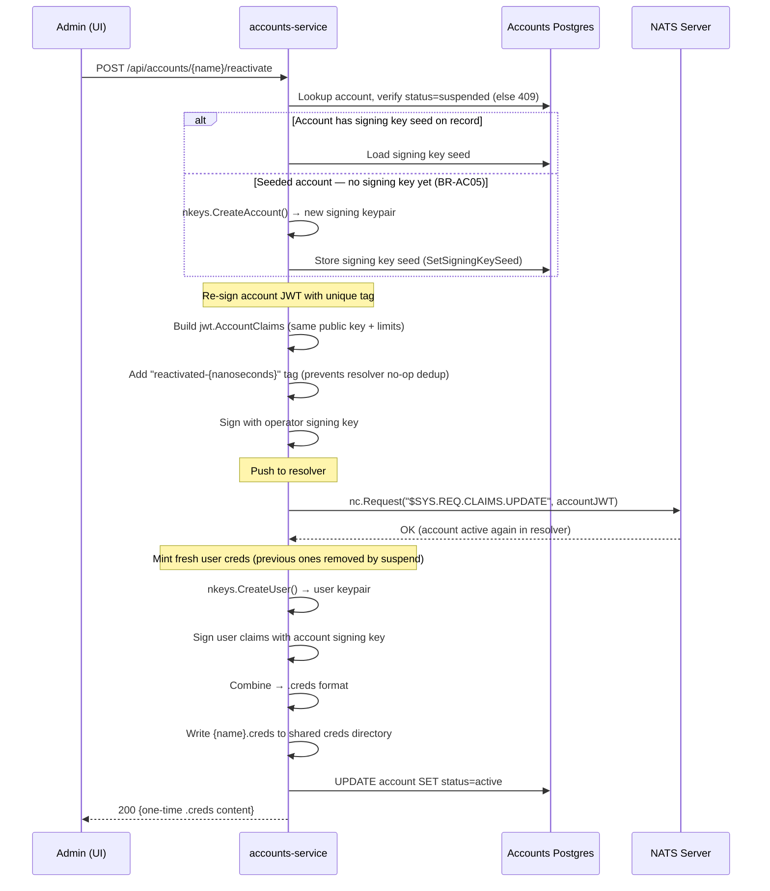

---

## User account lifecycle

User accounts represent human operators within a tenant (NATS account).
See BR-UA01–UA10.

## Sequence diagrams

### 1. User provisioning (invite → first login)

BR-UA01, BR-UA02 — WorkOS-first, JIT-provision downstream.

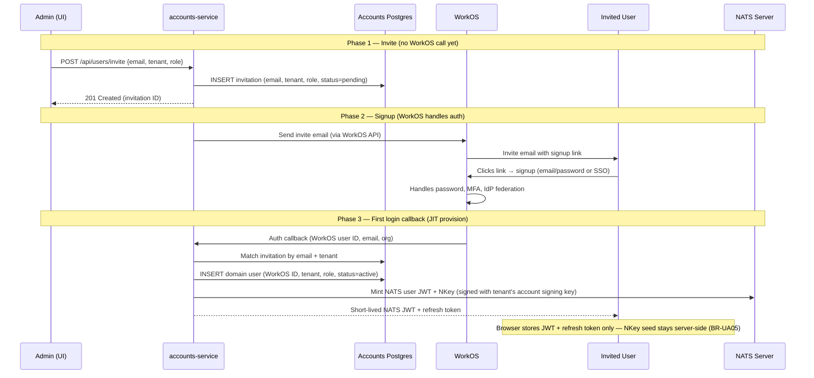

### 2. Subsequent login

BR-UA03 — fresh NATS JWT + refresh token on each login.

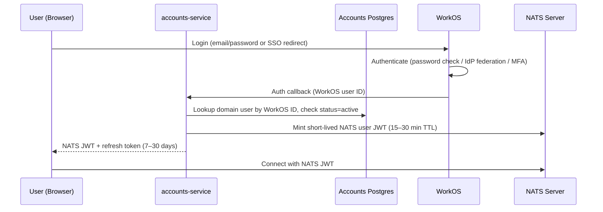

### 3. Token refresh (JWT expired, refresh token still valid)

BR-UA04 — transparent renewal without re-login.

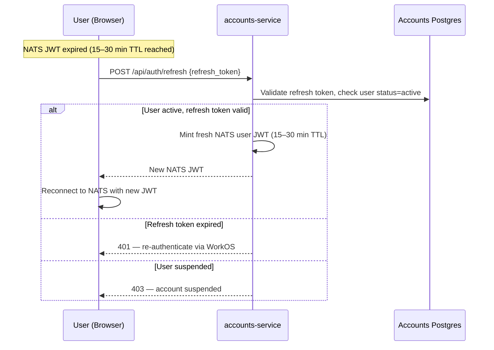

### 4. Admin-initiated revocation

BR-UA06, BR-UA08 — app DB first, then WorkOS.

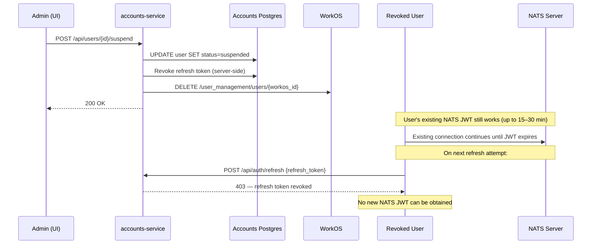

### 5. IdP-initiated revocation (SCIM)

BR-UA07 — same suspension path, triggered by the customer's directory.

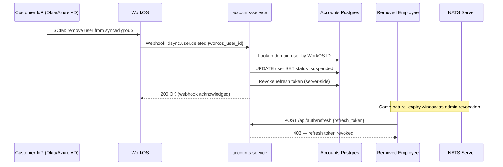

### 6. Explicit logout

BR-UA09 — revoke refresh token server-side + clear client-side.

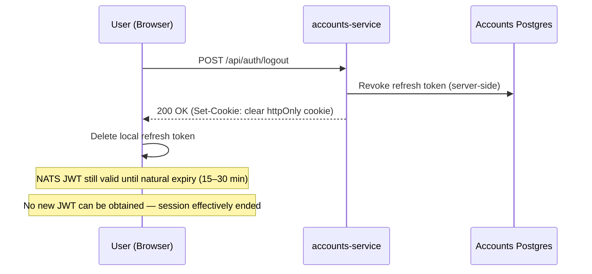

---

## Authentication mode (per-tenant)

BR-UA10 — SSO is a per-tenant configuration option, not a global requirement.

| Tenant type | Auth method | WorkOS config |
|-------------|------------|---------------|
| Small (no IdP) | Email/password via WorkOS User Management | WorkOS org with email auth enabled |
| Enterprise (has IdP) | SAML/OIDC via WorkOS SSO + Directory Sync | WorkOS org with SSO connection + SCIM directory |

The backend's provisioning and session logic (BR-UA01–UA04) does not branch
on which mode the tenant uses — only the tenant's WorkOS organization
configuration differs. Directory Sync (SCIM) webhooks (diagram 5) only fire
for tenants with an IdP connection; email/password tenants manage users
exclusively through the app's admin UI (diagram 4).

---

## Token lifecycle summary

```
WorkOS session ──────────────────────────────────────────────────▶ (longest)
    └─ Refresh token ─────────────────────────▶ 7–30 days
         └─ NATS user JWT ──▶ 15–30 min
              └─ NATS connection (lives until JWT expires or disconnect)
```

| Event | Refresh token | NATS JWT | Effect |
|-------|--------------|----------|--------|
| JWT expires | Still valid | Expired | Client calls `/api/auth/refresh` → new JWT |
| Refresh expires | Expired | Expired | User must re-login via WorkOS |
| Admin revokes | Revoked server-side | Runs out naturally | Locked out within JWT TTL window |
| IdP removes | Revoked server-side | Runs out naturally | Same as admin revocation |
| User logs out | Revoked + cleared | Runs out naturally | Session ended; blast radius = JWT TTL |

---

## Audit trail

BR-AC11. Closes gap #3 from the 2026-08-03 accounts architecture review:
tenant lifecycle changes had no trace beyond `accounts.updated_at` — no
actor, no event log — in tension with BR-AC03's own regulatory-retention
rationale for disallowing hard deletes. Every create/suspend/reactivate now
writes an immutable row to `accounts.audit_events` (same Postgres instance
and schema as `accounts.accounts`, own table) after its state change
succeeds, and best-effort on any failure once a real side effect has been
attempted.

**Table shape:**

| Column | Type | Notes |
|---|---|---|
| `id` | UUID | PK |
| `account` | TEXT | account name — no FK to `accounts.accounts`, since a failed create may need a row for a name that never gets a corresponding account |
| `action` | TEXT | `created` \| `suspended` \| `reactivated` |
| `actor` | TEXT | see "Actor identity" below |
| `source_ip` | TEXT | `r.RemoteAddr` |
| `outcome` | TEXT | `success` \| `failed` |
| `metadata` | JSONB | `{"step": "...", "error": "..."}` on failure; `{"publicKey": "..."}` on a successful create |
| `created_at` | TIMESTAMPTZ | append-only — no `UPDATE`, no `DELETE` |

**Actor identity (placeholder until WorkOS):** this service currently sits
behind one shared HTTP Basic Auth secret (see `accounts_service_plan.md`),
so there is no real per-caller identity yet. `actor` defaults to the shared
username (`admin`), overridable per request via an `X-Actor` header a caller
can set to self-identify. Neither is authenticated, but both are strictly
better than nothing, and become genuinely meaningful once WorkOS-backed
human auth supplies a real principal — same column, no schema change.

**Failure scope:** a request rejected by validation before any resolver or
Postgres mutation is attempted (bad name, reserved name/prefix, duplicate,
"account is not suspended", unknown name) writes nothing — there is no
partial state yet worth recording. Once a handler starts mutating external
state, every further error on that request writes a `failed` row naming the
step and the error, directly surfacing the partial-failure inconsistencies
already called out in gap #4 of the same review (e.g. resolver revoked but
`Store.SetStatus` failed, leaving the resolver and Postgres disagreeing).

### Create

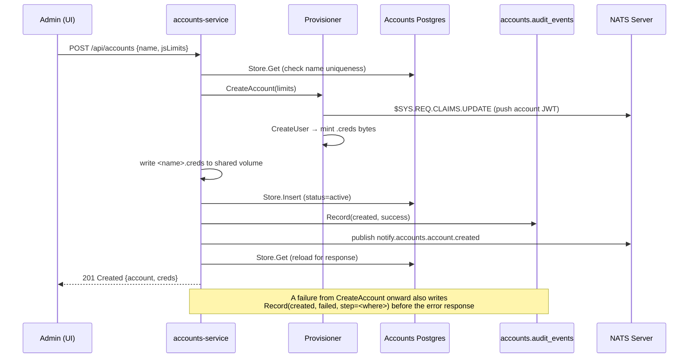

### Suspend

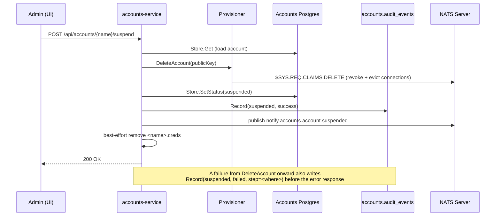

### Reactivate

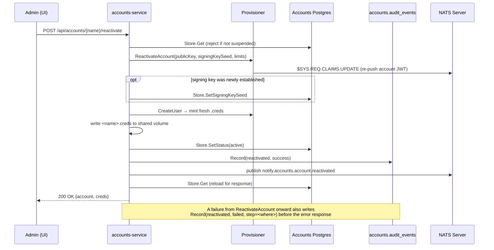

**Not yet built** (deferred, see `accounts_service_plan.md`'s remaining open
gaps): a REST endpoint over `AuditLog.ListByAccount` for the Admin UI to
display a tenant's history, and any retention/export policy beyond "keep
forever."
