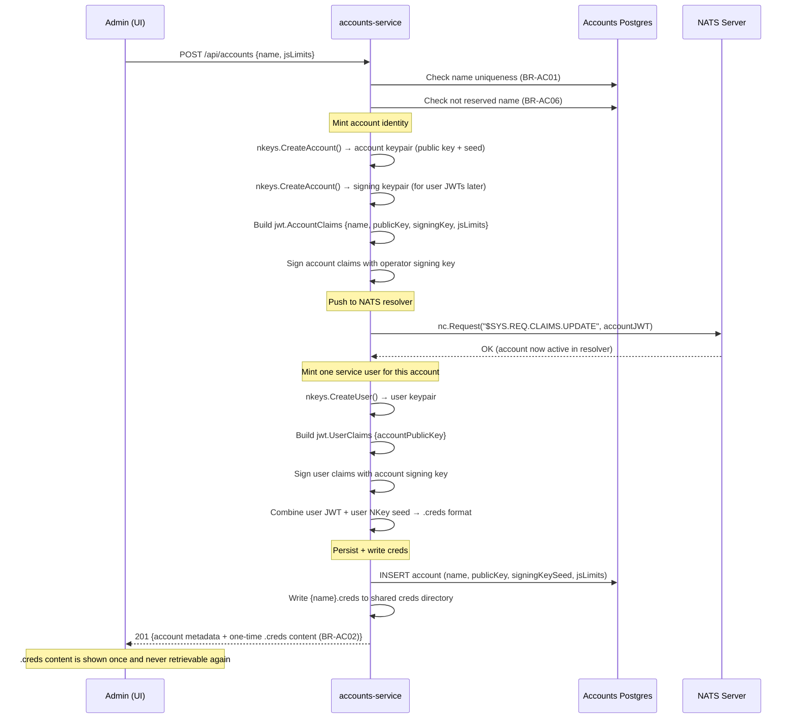
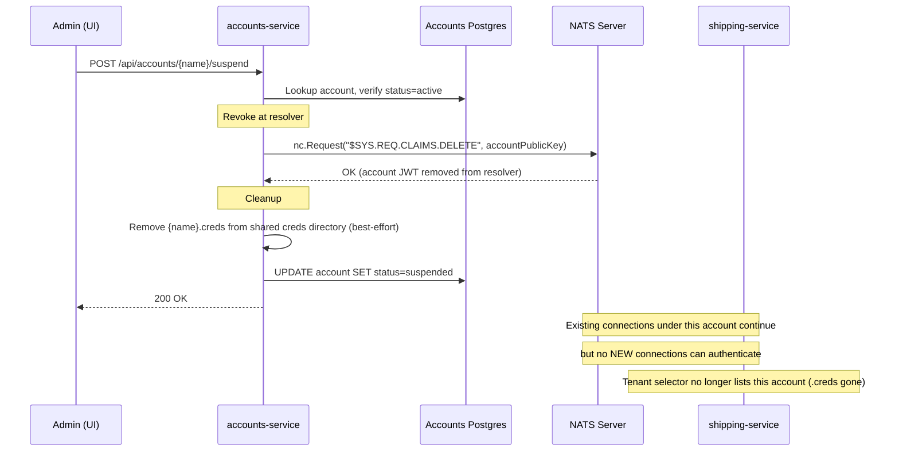
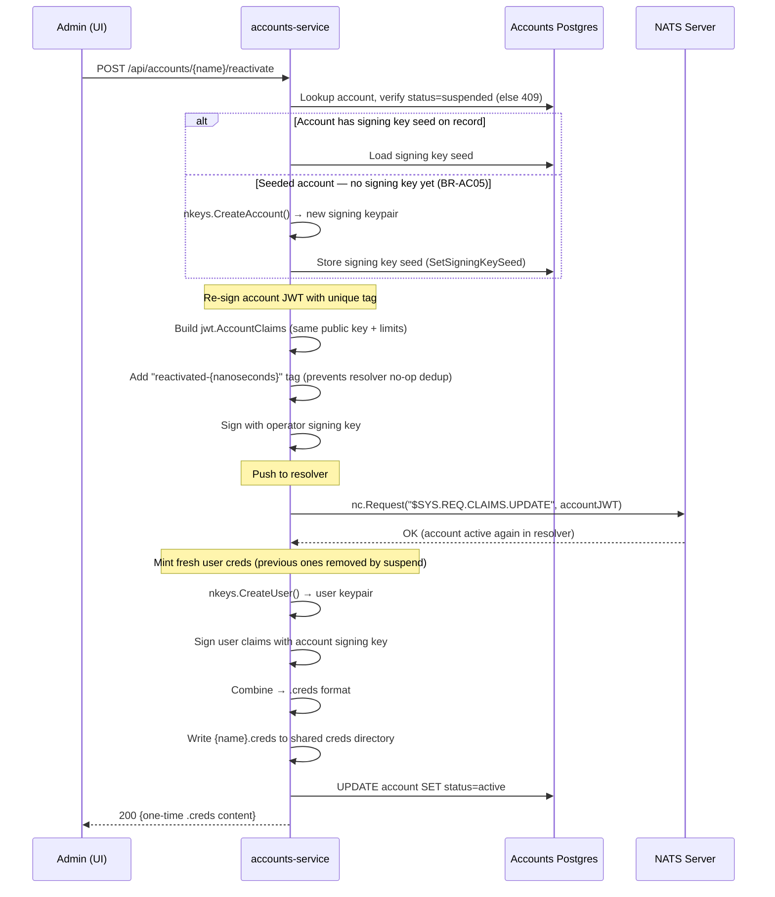
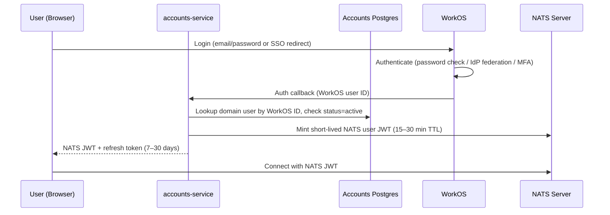
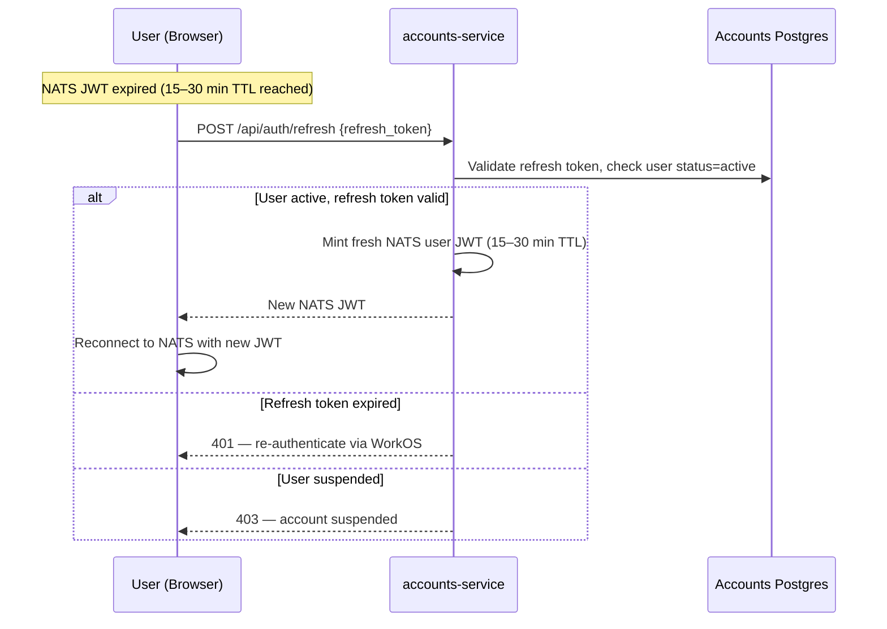
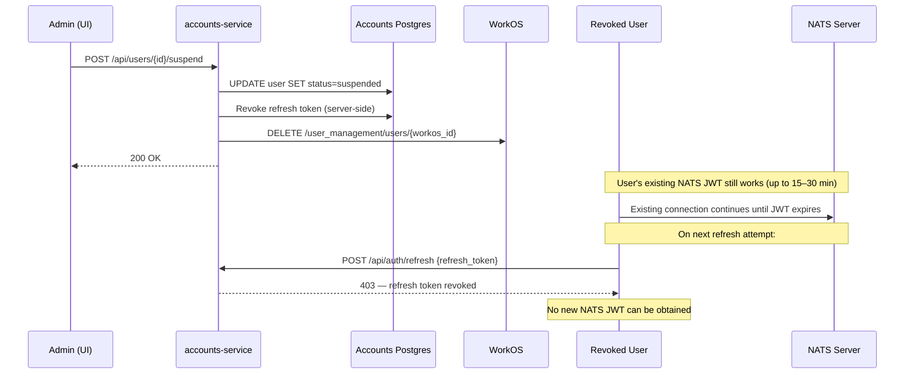
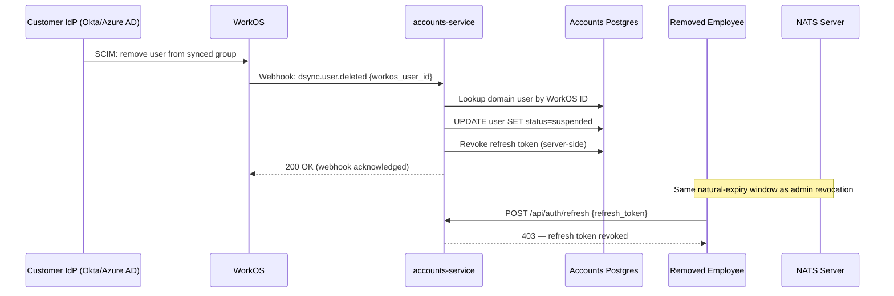
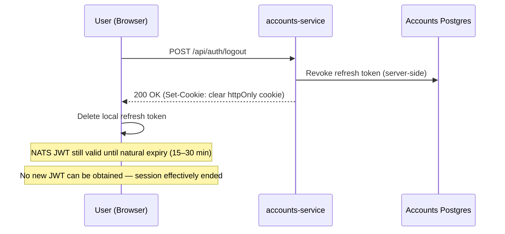

# Architecture — Accounts & User Authentication

Reference for `accounts-service`: tenant (NATS account) lifecycle, user
account provisioning, authentication flows, and session management. For the
account-level business rules (BR-AC01–AC06) and user-level rules
(BR-UA01–UA10) see
[BUSINESS_RULES-ACCOUNTS.md](../../../../demos/01-dictionary/BUSINESS_RULES-ACCOUNTS.md).
For the NATS operator-mode infrastructure (resolver, `$SYS.REQ.CLAIMS.*`)
see [accounts_service_plan.md](../../../../.claude/memory/accounts_service_plan.md)
and [nats_sys_claims_subjects.md](../../../../.claude/memory/nats_sys_claims_subjects.md).

---

## System context

```
┌──────────────┐     ┌──────────────┐     ┌──────────────────┐
│  Browser     │────▶│  accounts-   │────▶│  WorkOS          │
│  (Admin UI / │     │  service     │     │  (User Mgmt,     │
│   tenant app)│     │              │     │   SSO, SCIM)     │
└──────────────┘     └──────┬───────┘     └──────────────────┘
                            │
                   ┌────────┼────────┐
                   ▼        ▼        ▼
              ┌────────┐ ┌──────┐ ┌──────────┐
              │Accounts│ │ NATS │ │  Shared   │
              │Postgres│ │Server│ │ creds dir │
              └────────┘ └──────┘ └──────────┘
```

**Source-of-truth boundaries:**

| Concern | Owner | Notes |
|---------|-------|-------|
| Identity & authentication | WorkOS | Email, password/SSO, MFA, email verification |
| Domain attributes | App DB (accounts-postgres) | Tenant association, role, permissions, preferences |
| NATS credentials | Derived artifact | Minted from app DB + tenant's account signing key; never authoritative |

---

## Tenant account lifecycle (NATS accounts)

Tenant accounts are NATS accounts — server-enforced isolation boundaries
with their own JetStream streams, KV buckets, and connection credentials.
Managed via NATS operator mode (decentralized JWTs). See BR-AC01–AC06.

### NATS operator-mode trust chain

```
Operator (lab-operator)
  └─ Operator signing key (nats/keys/operator-signing-key.nk)
       │
       ├─ signs → Account JWT (one per tenant)
       │            └─ Account signing key (generated per account, stored in Postgres)
       │                 └─ signs → User JWT (one per service/human user)
       │                              └─ combined with User NKey seed → .creds file
       │
       └─ signs → SYS Account JWT (system account)
                    └─ sys.creds (used by accounts-service to reach $SYS.REQ.CLAIMS.*)
```

**Key artifacts:**

| Artifact | What it is | Who holds it | Sensitivity |
|----------|-----------|--------------|-------------|
| Operator signing key (`.nk`) | Ed25519 seed that signs account JWTs | `accounts-service` (read-only mount) | Highest — controls all accounts |
| Account signing key seed | Ed25519 seed that signs user JWTs for one account | `accounts-postgres` (`signing_key_seed` column) | High — controls one tenant's users |
| Account JWT | Signed claims (public key, JetStream limits, name) | NATS resolver (`$SYS.REQ.CLAIMS.UPDATE`) | Medium — public key + config, no secrets |
| User JWT | Signed claims (account association, permissions) | `.creds` file on disk / short-lived in browser | Medium — grants access but expires |
| User NKey seed | Ed25519 private key for the user identity | `.creds` file (server-side only — BR-UA05) | High — paired with the JWT for auth |

### 1t. Tenant account creation

BR-AC01, BR-AC02 — mint account + user JWTs, push to resolver, write `.creds`.



### 2t. Tenant account suspension

BR-AC03 — revoke at resolver, remove `.creds`.



### 3t. Tenant account reactivation

BR-AC04 — re-sign and re-push account JWT, mint fresh `.creds`.



---

## User account lifecycle

User accounts represent human operators within a tenant (NATS account).
See BR-UA01–UA10.

## Sequence diagrams

### 1. User provisioning (invite → first login)

BR-UA01, BR-UA02 — WorkOS-first, JIT-provision downstream.

```mermaid
sequenceDiagram
    participant Admin as Admin (UI)
    participant Backend as accounts-service
    participant DB as Accounts Postgres
    participant WorkOS as WorkOS
    participant User as Invited User
    participant NATS as NATS Server

    Note over Admin,NATS: Phase 1 — Invite (no WorkOS call yet)
    Admin->>Backend: POST /api/users/invite {email, tenant, role}
    Backend->>DB: INSERT invitation (email, tenant, role, status=pending)
    Backend-->>Admin: 201 Created (invitation ID)

    Note over Admin,NATS: Phase 2 — Signup (WorkOS handles auth)
    Backend->>WorkOS: Send invite email (via WorkOS API)
    WorkOS->>User: Invite email with signup link
    User->>WorkOS: Clicks link → signup (email/password or SSO)
    WorkOS->>WorkOS: Handles password, MFA, IdP federation

    Note over Admin,NATS: Phase 3 — First login callback (JIT provision)
    WorkOS->>Backend: Auth callback (WorkOS user ID, email, org)
    Backend->>DB: Match invitation by email + tenant
    Backend->>DB: INSERT domain user (WorkOS ID, tenant, role, status=active)
    Backend->>NATS: Mint NATS user JWT + NKey (signed with tenant's account signing key)
    Backend-->>User: Short-lived NATS JWT + refresh token
    Note over User: Browser stores JWT + refresh token only; NKey seed stays server-side (BR-UA05)
```

### 2. Subsequent login

BR-UA03 — fresh NATS JWT + refresh token on each login.



### 3. Token refresh (JWT expired, refresh token still valid)

BR-UA04 — transparent renewal without re-login.



### 4. Admin-initiated revocation

BR-UA06, BR-UA08 — app DB first, then WorkOS.



### 5. IdP-initiated revocation (SCIM)

BR-UA07 — same suspension path, triggered by the customer's directory.



### 6. Explicit logout

BR-UA09 — revoke refresh token server-side + clear client-side.



---

## Authentication mode (per-tenant)

BR-UA10 — SSO is a per-tenant configuration option, not a global requirement.

| Tenant type | Auth method | WorkOS config |
|-------------|------------|---------------|
| Small (no IdP) | Email/password via WorkOS User Management | WorkOS org with email auth enabled |
| Enterprise (has IdP) | SAML/OIDC via WorkOS SSO + Directory Sync | WorkOS org with SSO connection + SCIM directory |

The backend's provisioning and session logic (BR-UA01–UA04) does not branch
on which mode the tenant uses — only the tenant's WorkOS organization
configuration differs. Directory Sync (SCIM) webhooks (diagram 5) only fire
for tenants with an IdP connection; email/password tenants manage users
exclusively through the app's admin UI (diagram 4).

---

## Token lifecycle summary

```
WorkOS session ──────────────────────────────────────────────────▶ (longest)
    └─ Refresh token ─────────────────────────▶ 7–30 days
         └─ NATS user JWT ──▶ 15–30 min
              └─ NATS connection (lives until JWT expires or disconnect)
```

| Event | Refresh token | NATS JWT | Effect |
|-------|--------------|----------|--------|
| JWT expires | Still valid | Expired | Client calls `/api/auth/refresh` → new JWT |
| Refresh expires | Expired | Expired | User must re-login via WorkOS |
| Admin revokes | Revoked server-side | Runs out naturally | Locked out within JWT TTL window |
| IdP removes | Revoked server-side | Runs out naturally | Same as admin revocation |
| User logs out | Revoked + cleared | Runs out naturally | Session ended; blast radius = JWT TTL |
