# Architecture — Accounts & User Authentication

Reference for `accounts-service`: tenant (NATS account) lifecycle, user
account provisioning, authentication flows, and session management. For the
account-level business rules (BR-AC01–AC06) and user-level rules
(BR-UA01–UA10) see
[BUSINESS_RULES-ACCOUNTS.md](../../../../demos/01-dictionary/BUSINESS_RULES-ACCOUNTS.md).
For the NATS operator-mode infrastructure (resolver, `$SYS.REQ.CLAIMS.*`)
see [accounts_service_plan.md](../../../../.claude/memory/accounts_service_plan.md)
and [nats_sys_claims_subjects.md](../../../../.claude/memory/nats_sys_claims_subjects.md).

---

## System context

```
┌──────────────┐     ┌──────────────┐     ┌──────────────────┐
│  Browser     │────▶│  accounts-   │────▶│  WorkOS          │
│  (Admin UI / │     │  service     │     │  (User Mgmt,     │
│   tenant app)│     │              │     │   SSO, SCIM)     │
└──────────────┘     └──────┬───────┘     └──────────────────┘
                            │
                   ┌────────┼────────┐
                   ▼        ▼        ▼
              ┌────────┐ ┌──────┐ ┌──────────┐
              │Accounts│ │ NATS │ │  Shared   │
              │Postgres│ │Server│ │ creds dir │
              └────────┘ └──────┘ └──────────┘
```

**Source-of-truth boundaries:**

| Concern | Owner | Notes |
|---------|-------|-------|
| Identity & authentication | WorkOS | Email, password/SSO, MFA, email verification |
| Domain attributes | App DB (accounts-postgres) | Tenant association, role, permissions, preferences |
| NATS credentials | Derived artifact | Minted from app DB + tenant's account signing key; never authoritative |

---

## Tenant account lifecycle (NATS accounts)

Tenant accounts are NATS accounts — server-enforced isolation boundaries
with their own JetStream streams, KV buckets, and connection credentials.
Managed via NATS operator mode (decentralized JWTs). See BR-AC01–AC06.

### Scaling note — per-tenant connections

`shipping-service` currently opens **one `nats.Connect` per provisioned tenant
account** (visible in the NATS connections panel as one `shipping-service` row
per account — `acme`, `globex`, etc.). This is necessary because JetStream
streams and KV buckets are per-account resources: to subscribe to `acme`'s
`SHIPPING` stream or write to its KV buckets the connection must authenticate
*as* `acme`. A PLATFORM-account connection cannot reach into another account's
JetStream namespace directly.

This is acceptable for a POC with a small, known tenant set. At production
scale (hundreds of tenants) it becomes a connection-count and credential-
management burden.

**Implemented Phase 21 partition — PLATFORM exports, tenants import.**
PLATFORM owns the cross-cutting `accounts-service` and `refdata-service` and
exports four refdata services, the fixed context-list service, account
lifecycle notifications, and refdata change events. Every tenant JWT imports
that same contract. The four data services are remapped locally to
`refdata.*.v1`; their remote subjects carry the tenant's own human-readable
account name (`rpc.{tenantName}.refdata.*.v1`, e.g. `rpc.acme.refdata.type.list.v1`)
rather than an opaque public key — readable in logs, traces, and the Admin
UI's live Request/Reply view. Security is still operator-enforced, not
client-supplied: the import itself lives inside an operator-signed account
JWT (`accounts/provisioner.go`'s `tenantImports`), so a tenant cannot rewrite
its own import to substitute another tenant's name — doing so would require
re-signing the claim with the operator's private key, which the tenant never
holds. A caller on ACME cannot construct a GLOBEX read by supplying a
different remote subject; its import simply has no such mapping.

`shipping-service` still opens one connection per tenant for that tenant's
own SHIPPING stream and KV buckets. Its permanent PLATFORM connection is now
the restricted `shipping-admin` user, used only for `$SRV.>` discovery and
ordered-consumer inspection/replay of REFDATA. (`shipping-admin` held the
matching grant for RPCTRACE too until Phase 28g retired that stream and its
consumer bridge — see `BUSINESS_RULES-REFDATA.md`'s BR-D29 amendment.)
`$SRV.>` is not exported to tenants because server topology is platform
administration, not tenant data. The normal tenant import carries refdata
change events instead.

**Two PLATFORM connections, not one (historical — see Phase 30h amendment
below).** `shipping-admin` never
receives `$JS.API.>`. Its grant is an explicit allow-list
(`nats/bootstrap-operator.sh`) naming only the ordered-consumer subjects —
`CONSUMER.{CREATE,INFO,DELETE,MSG.NEXT}` for `REFDATA` specifically — so
every other JetStream API subject is denied by omission, a
restriction `TestShippingAdminCanOnlyUseNarrowOrderedConsumerAccess` pins in
place. That is enough to **replay** those two streams, but not to
**enumerate** them: listing needs `$JS.API.STREAM.LIST`, which no entry
covers. So the Admin UI's
cross-account introspection panels (§ 12 of
[ARCHITECTURE-COMMUNICATIONS.md](ARCHITECTURE-COMMUNICATIONS.md)) required a
*second*, unrestricted PLATFORM connection on `platform.creds` —
`monolith.PlatformFullJS`, read only by `introspectableAccounts()` — rather
than widening `shipping-admin` and eroding the boundary for every existing
caller. The capability split is the thing to keep straight when touching
either: **list** needs `PlatformFullJS`, **replay** works on either, and
attempting a list on `shipping-admin` doesn't fail fast — the request hangs
until the client timeout, because a denied publish to `$JS.API.STREAM.LIST`
simply never produces a reply. The credential resolves from
`NATS_PLATFORM_CREDS_PATH`, falling back to `platform.creds` inside
`NATS_CREDS_DIR` (which is why `docker-compose.yml` sets no explicit var for
it); with neither configured — local dev outside operator mode —
`PlatformFullJS` is nil, so every consumer treats PLATFORM as an account that
may legitimately be absent rather than as an error.

> **Phase 30h amendment — `shipping-service` is back down to one PLATFORM
> connection; the second one described above no longer exists.** The whole
> reason `shipping-service` grew a second, unrestricted `PlatformFullJS`
> connection was to serve the Admin UI's cross-account introspection panels
> (§ 12 of `ARCHITECTURE-COMMUNICATIONS.md`) and the `TRACES` stream
> consumer (§ "PLATFORM's cross-account trace store" in
> `BUSINESS_RULES-SHIPPING.md`) — neither job belongs to the shipping
> domain. Phase 30 extracted both into a new, separate PLATFORM-account
> service, `observability-service`, which holds its own single restricted
> connection (`nats/bootstrap-operator.sh`'s `observability` user,
> BR-AC31/BR-AC32) — narrower even than `shipping-admin`'s, scoped to an
> explicit `$JS.API` subject subset rather than the full unrestricted
> namespace `PlatformFullJS` had. `dictionary/composition.go`'s call to
> `RegisterTraceStore` and `monolith.PlatformFullJS()` itself were deleted
> outright (`cmd/main.go`, `internal/monolith`) — `shipping-service` now
> holds exactly the one restricted `shipping-admin` connection described
> above, doing exactly what it always did ($SRV discovery, REFDATA
> ordered-consumer replay), nothing more. The six lifted REST endpoints
> (`GET /api/kv/buckets*`, `GET /api/jetstream/streams|replay`, plus
> Connections/Services/Account Activity/Log) now live on
> `observability-service`'s own port (7205); the Admin UI's proxy repoints
> there, not to `shipping-service`, for every one of them. See § 12's own
> Phase 30 amendment in `ARCHITECTURE-COMMUNICATIONS.md` for the full
> before/after.

Account JWT updates replace the entire claim, so `accounts/provisioner.go`
preserves existing exports/imports whenever it re-signs a claim; freshly
minted runtime accounts receive the same imports as ACME/GLOBEX.

### Four services open per-tenant connections through one shared manager (IMPLEMENTED — Phase 35)

The paragraphs above describe the per-tenant connection model as
`shipping-service`'s, which is how it started. It no longer is:
`pricing-service` (Phase 25f), `organizations-service` (Phase 26), and
`refdata-service` (once it gained browser-facing `api.*` support) each open
one connection per provisioned tenant as well, so that a browser
authenticated into any tenant's account can reach them directly over `api.*`
rather than through `shipping-service` as a conduit.

Through Phase 34 all four implementations independently re-derived the same
five behaviours, and only the fifth line of each differed in any meaningful
way — see the extraction diagram below for that duplication as it stood
before Phase 35:

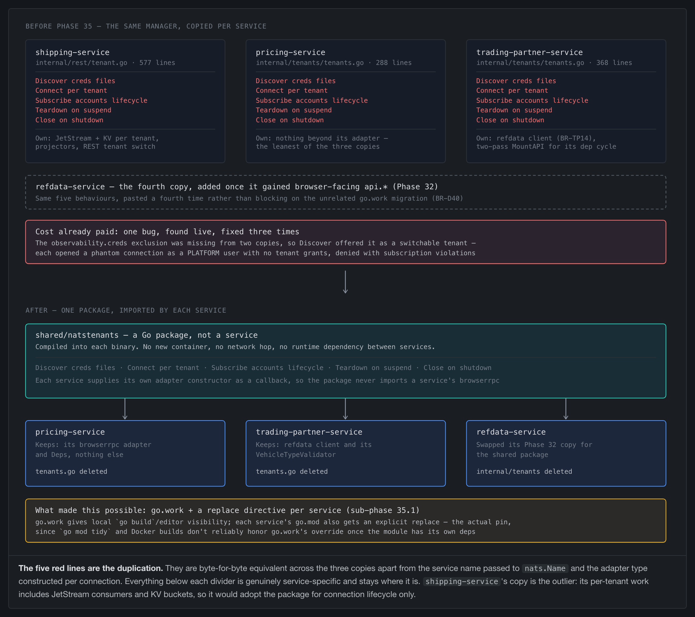

Editable source:
[tenants-manager-extraction.html](../../../../demos/01-dictionary/diagrams/tenants-manager-extraction.html)
— regenerate with, from `demos/01-dictionary/`:

`node diagrams/export-html-png.mjs diagrams/tenants-manager-extraction.html \`
`  ../../obsidian/V3-Platform/Architecture/Dictionary-POC/images/tenants-manager-extraction.png 1024 --clip=figure`

**What was duplicated.** Creds-directory discovery (including the
`nonTenantCredsFiles` exclusion list), `nats.Connect` per tenant, the
`notify.accounts.account.{created,suspended,reactivated}` lifecycle
subscription that provisions and tears down connections reactively, and
shutdown. In `pricing-service` and `organizations-service` these were
near-identical file-scoped copies (`internal/tenants/tenants.go`, 288 and 368
lines); `shipping-service`'s equivalent lived inside
`internal/rest/tenant.go` alongside per-tenant JetStream and KV provisioning,
so its connection-lifecycle portion was the same logic embedded in a larger
file rather than a standalone copy.

**Why it mattered — this had already cost a real bug.** `observability.creds`
(the restricted PLATFORM user added in Phase 30c) was missing from the
`nonTenantCredsFiles` exclusion list in two of the three copies. Both
therefore treated it as a switchable tenant and opened a connection under a
PLATFORM-account user that was never granted tenant-shaped permissions — the
`notify.accounts.account.*` subscription and the `browserrpc` registration
both denied with subscription violations. It was diagnosed from NATS server
logs rather than caught by a test, and fixed three separate times, in three
separate files, at three separate points in time. The failure mode is the
defining one for copied infrastructure code: the copies do not drift
*visibly*, they drift in whichever branch nobody re-read.

**What Phase 35 did.** Extracted the five behaviours into one shared Go
package, `shared/natstenants` (`natstenants.Manager[R any]`, generic over
each service's own per-tenant resource shape), with each service supplying
its own provision/deprovision callbacks so the package never imports any
service's `browserrpc`. It is a **code package compiled into each binary —
not a new service**: no additional container, no network hop, and no runtime
dependency introduced between services. `pricing-service`,
`organizations-service`, and `refdata-service` adopted `Manager[R]`
directly; `shipping-service` adopted it for connection lifecycle only
(`natstenants.Discover`/`SubscribeLifecycle`), keeping its JetStream/KV
provisioning local as planned. `shared/browserrpc` (the `Reply`/`Respond`/
`RespondError`/`ContextFromSubject` reply-plumbing tail shared by all four
adapters) and `shared/natstrace` (the BR-036/BR-037 tracer, consumed by all
five services including `accounts-service`) were extracted alongside it in
the same phase — see `ARCHITECTURE-COMMUNICATIONS.md` § 6 for the latter.

**What made this possible.** Nothing in this repo shared Go code across
services before this phase: seven independent modules (one `go.mod` per
service), no `go.work`, no `replace` directive anywhere, and each
Dockerfile's build context a single service directory
(`build: ./backend/pricing-service`). Phase 35 introduced a repo-root
`go.work` (workspace-mode resolution for local `go build`/editor tooling)
plus an explicit `replace` directive in each consuming service's `go.mod`
(the actual resolution mechanism, robust against `go mod tidy` and Docker
builds) and moved every affected Dockerfile's build context to the repo root
so it can `COPY shared/<pkg>` ahead of the service's own source — the same
pattern the frontend Dockerfiles already used for `shared/unifi-theme`.

### Business unit registration (Phase 22, name/context split + per-tenant default Phase 22b)

Business units (the `{context}` scope — `acme-pacific-fleet`,
`acme-atlantic-fleet`, …) are owned by accounts-service, not
refdata-service. accounts-service holds the authoritative registry (its own
`business_units` table: `account_id`, `name`, `context`, `visible`,
`is_default`, `created_at`), managed through the Admin UI's Accounts panel.
refdata-service's existing `contexts` table remains the store every
context-consuming read already goes through (corpus inheritance,
KV/Postgres scoping) — accounts-service becomes its *writer*, calling
refdata-service's `POST /api/refdata/admin/contexts` at BU-creation time,
rather than refdata-service seeding a fixed list at its own startup. Only
who writes the row changes; the read path (`rpc.*.refdata.*`, BR-D35's
`ListByTenant`) is unchanged.

**Name and context are two fields, not one (Phase 22b).** Through Phase 22 a
business unit had a single `name`, which doubled as the subject-safe
`{context}` token — an operator registering "Pacific Fleet" had to type
`acme-pacific-fleet` directly, and the Admin UI displayed that token as the
label. `name` is now a free-text English display label an operator can
rename at will; `context` is the immutable slug refdata-service, every NATS
subject, and every KV key prefix actually use. The split was purely
additive on refdata-service's side — `refdata.contexts` had carried both a
`context` and a `name` column since Phase 16; accounts-service had simply
been collapsing them by sending the same value for both.

The Add Business Unit dialog derives `context` from `name` as the operator
types (`{tenant}-{slugify(name)}`, skipping a redundant tenant prefix — "Acme
Pacific Fleet" under tenant `acme` still derives `acme-pacific-fleet`), shown
live and editable until submit. Once created, `context` cannot change:
none of refdata-service's data tables (`dictionary_items`,
`dictionary_localizations`, `dictionary_references`, `dictionary_locales`)
carry a foreign key back to `refdata.contexts` — they hold the context value
as a bare text column — so renaming a slug would silently orphan every row
under the old value, plus its `refdata-{context}` KV bucket, its versioned
corpus buckets, and its already-immutable `evt.{context}.…` JetStream
history. `context` is also unique globally across every account, not merely
per account, closing a gap where refdata-service's `Register` upserts on
conflict: two accounts registering the same slug would otherwise let the
second silently overwrite the first's context row.

**Per-tenant default, not a shared literal (revised Phase 22b).** Through
Phase 22, every account with zero registered real business units resolved to
one literal context value, `_default_bu`, shared across the whole
deployment. Because refdata-service's item tables key on `(context,
type_key, code)` with no tenant column, two tenants both resolving to it
wrote to the exact same Postgres rows — a real cross-tenant collision, not
just an aesthetic one. Each account now gets its own default business unit
instead: context `{tenant}-default` (e.g. `acme-default`, `globex-default`),
name `Default`, `is_default: true`, auto-created at account-creation time
the same way `_default_bu` used to be. It is identified by that explicit
column, never by comparing a name or slug against a reserved literal.

`_default_bu` itself survives, but its role changed: it is no longer
assigned to any tenant, and instead becomes the **platform-owned template**
every tenant default is parented to — `_platform` → `_default_bu` →
`{tenant}-default` (see `ARCHITECTURE-DICTIONARY.md`'s Seeding section and
`BUSINESS_RULES-REFDATA.md`'s revised BR-D38). Provisioning a tenant's
default context is therefore more than one call: register the context
(`parent: "_default_bu"`), register its locales explicitly (locales are
**not** covered by refdata-service's corpus-inheritance flattening — a
context with none of its own has no effective default locale even though
its items inherit correctly), then draft and publish its corpus so it
actually contains `_default_bu`'s (and therefore `_platform`'s) inherited
items. Every step is gated on the platform template already having a
published corpus — required not only because refdata-service silently skips
an ancestor with no published corpus (a draft created one instant too early
inherits nothing and still reports success), but because accounts-service
and refdata-service are independent containers with no startup ordering
guarantee between them: on a cold `docker compose up`, the very first call
in the sequence is just as likely to hit connection-refused as "context not
found yet," so the wait retries on both identically.

**"Readonly" is about identity, not visibility.** A default business unit
cannot be renamed (rejected with 409) and there is no endpoint to create one
directly or to delete any business unit at all. `visible` stays fully
toggleable, since the hide-on-first-real-BU flow below depends on exactly
that.

**Mutual exclusivity — relaxed, not strict.** A tenant's default and its
real business units are not hard-exclusive. Registering an account's first
real business unit always surfaces an Admin UI confirmation prompt asking
whether to hide the default — unconditionally, with no attempt to detect
whether it actually holds data (that would require accounts-service reading
into shipping-service/refdata-service's own stores, a cross-service read
dependency this design deliberately avoids). Confirming sets `visible: false`
on that account's default row; declining leaves it visible and selectable
permanently alongside real business units. `visible` is a toggle, directly
editable per row in the Admin UI's business-unit table — not a delete, and
not something migrated automatically. Migrating a default business unit's
underlying data into a named business unit remains explicitly out of scope:
its context id may already be referenced inside published NATS events
(JetStream history, KV entries), and a migration would need to handle that
without silently orphaning or duplicating data — flagged as a known gap to
revisit later, not solved by this design.

**Endpoints (implemented).** `GET /api/accounts/{name}/business-units`,
`POST /api/accounts/{name}/business-units` (accepts `name` and an optional
`context`; derives one when omitted; validates the slug's charset, length,
and global uniqueness; calls `POST /api/refdata/admin/contexts` with `name`
and `context` as distinct values; idempotent on duplicate), `PATCH
/api/accounts/{name}/business-units/{context}` (accepts `visible` and/or
`name`; rejects a `name` change on an `is_default` row; the path segment is
now the immutable slug, not the mutable name, so it can safely identify the
same row across a rename). accounts-service's startup seeding registers
`acme`'s and `globex`'s own `{tenant}-default` context, plus `acme`'s two
demo real business units (`Pacific Fleet`/`acme-pacific-fleet`,
`Atlantic Fleet`/`acme-atlantic-fleet`) — reproduced via the same derivation
function the live registration path uses, not a hand-typed literal. All
three frontend CONTEXTS fallback arrays have been removed; context selectors
are populated dynamically by `loadContexts()` on tenant connect, and in
`seafreight-app`/`frontend/refdata` now carry `{context, name}` pairs so the
Select can show the display name while every subject/API call still uses the
slug. See `BUSINESS_RULES-ACCOUNTS.md` BR-AC15–17 and BR-AC26–29 for the
enforcement rules.

Closing the gap this leaves: refdata-service's corpus/versioned read path
inherits an ancestor's items via `CorpusRepository.CreateDraft`'s
ancestor-chain flattening, but the live, non-versioned read path
(`item_repository.go` et al.) is a flat `WHERE context = $1` with no chain
traversal at all — a tenant default's items are only visible through the
versioned API today, not through the plain `GET /api/refdata/{context}/...`
routes or the live KV cache. Tracked as `Main-POC-Plan.md`'s Phase 106, not
solved by this design.

### Admin UI browser connection (Phase 23, simplified after centralized observability)

`frontend/admin` holds exactly one browser-side NATS WebSocket connection,
authenticated into PLATFORM. Phase 23 originally introduced a second,
tenant-account connection for tenant KV/raw notifications and `obs.api.>`.
Those consumers disappeared in later phases: centralized `obs.trace.>` and
`obs.pubsub.>` projections replaced the direct observability feed, Phase 36.2
removed the tenant selector/live dictionary subscriptions, and the
Organizations screens moved to Tech Lab Operator. Keeping an unconditional
`admin-tenant` connection after that point only exposed the backend's default
`acme` account in `/connz` without serving an observability purpose, so it was
removed.

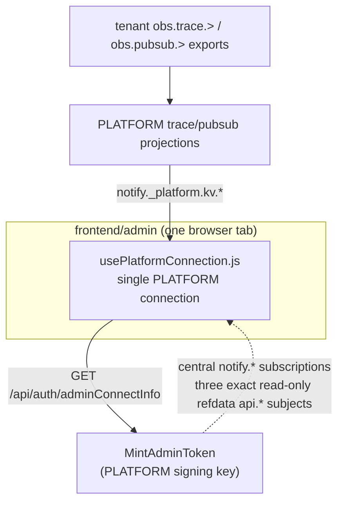

The connection subscribes to account/refdata notifications and the two
central observability projection buckets. It may publish only the exact
read-only refdata queries needed for locale/UI copy and context bootstrap;
there is no broad `api.>` grant and no tenant business surface. The topbar
connection indicator therefore reports the only browser NATS connection the
Admin UI owns.

See `BUSINESS_RULES-ACCOUNTS.md` BR-AC18 for `MintAdminToken`'s exact
permission grant and why it is issued outside the tenant `Status`/
`SigningKeySeed` lifecycle this section otherwise documents.

Cross-account Streams/KV contents are backend-mediated REST snapshots. The
browser passes an account label to select the snapshot, but does not receive a
credential for that account:

| | Reaches every account | Mechanism |
|---|---|---|
| Contents / history snapshot | **yes** | backend-mediated REST — `shipping-service` holds a connection per account and fetches on the browser's behalf |
| Central trace/pub-sub live tail | **yes** | observability-service projects imported tenant envelopes in PLATFORM; browser watches `notify._platform.kv.*` |
| Raw Stream/KV snapshot | **yes** | backend-mediated REST with an explicit account parameter |
| Raw tenant live tail | **no** | deliberately absent; Admin opens no tenant browser connection |

#### Runtime — browser JWT expiry & reconnect

All browser mint paths stamp `claims.Expires = now + ttl`, where `ttl` is the
**configurable** browser/admin JWT expiry setting (BR-AC20) — a durable
`accounts.system_config` row, **default 15 minutes**, editable from the Admin
UI's System → Settings screen and read fresh on every mint. It replaces the
old hardcoded `const tokenTTL = 5 * time.Minute`. The value is hard-bounded to
the **15–30 minute envelope** (BR-AC21, which *is* BR-UA03's rule expressed as
a code constant). There is still **no refresh-token flow** for these browser
connections — § 3 below ("Token refresh") documents the *proposed* production
renewal (BR-UA03/UA04, 15–30 min TTL + refresh token); BR-AC20 realizes the
TTL half of that target but not the in-place renewal. What the POC connections
actually do is reconnect-on-expiry: the NATS server enforces the `Expires`
claim with its own timer and force-closes the connection the moment the JWT
lapses, and the frontend's `conn.closed()` handler
(`frontend/admin/src/nats/connectionFactory.js:61–85`; same shape in
`frontend/seafreight-app/src/nats/useNatsConnection.js`) re-fetches
`connectInfo` and reconnects with a **brand-new** credential.

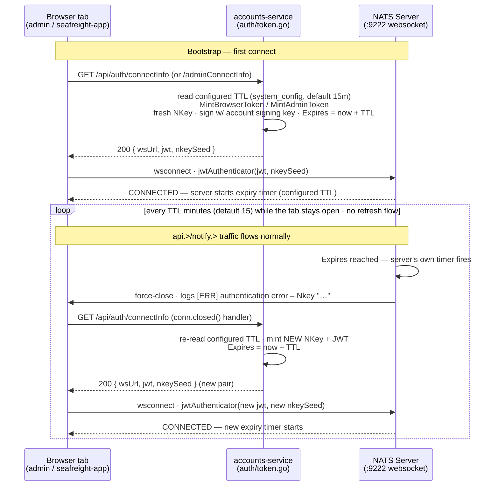

Two consequences worth calling out, both visible in the NATS admin log
viewer:

- **Each `[ERR] authentication error` line is the *old* connection being
  expired, not a *new* one failing to authenticate.** The error is the
  server enforcing `Expires`; the successful reconnect that immediately
  follows is on the success path and is not logged. So a steady cadence of
  auth errors from a long-open tab is expected POC behavior, not a fault.
- **Every log line carries a different Nkey**, because `MintBrowserToken`/
  `MintAdminToken` call `nkeys.CreateUser()` fresh on every mint
  (`auth/token.go:92` / `:143`) — the ephemeral user key is never persisted
  or reused. Each distinct Nkey in the log is therefore exactly one
  iteration of the loop above.

An interval materially longer than the configured TTL between a tab's
successive auth errors indicates a reconnect cycle that didn't fire promptly —
typically the browser tab being backgrounded/throttled so the `conn.closed()`
handler is deferred, rather than a code fault. (The original incident that
surfaced this showed ~5-min spacing because the TTL was the old hardcoded
5 min; with the BR-AC20 default the cadence is now ~15 min.)

### NATS operator-mode trust chain

```
Operator (lab-operator)
  └─ Operator signing key (nats/keys/operator-signing-key.nk)
       │
       ├─ signs → Account JWT (one per tenant)
       │            └─ Account signing key (generated per account, stored in Postgres)
       │                 └─ signs → User JWT (one per service/human user)
       │                              └─ combined with User NKey seed → .creds file
       │
       └─ signs → SYS Account JWT (system account)
                    └─ sys.creds (used by accounts-service to reach $SYS.REQ.CLAIMS.*)
```

**Key artifacts:**

| Artifact | What it is | Who holds it | Sensitivity |
|----------|-----------|--------------|-------------|
| Operator signing key (`.nk`) | Ed25519 seed that signs account JWTs | `accounts-service` (read-only mount) | Highest — controls all accounts |
| Account signing key seed | Ed25519 seed that signs user JWTs for one account | `accounts-postgres` (`signing_key_seed` column) | High — controls one tenant's users |
| Account JWT | Signed claims (public key, JetStream limits, name) | NATS resolver (`$SYS.REQ.CLAIMS.UPDATE`) | Medium — public key + config, no secrets |
| User JWT | Signed claims (account association, permissions) | `.creds` file on disk / short-lived in browser | Medium — grants access but expires |
| User NKey seed | Ed25519 private key for the user identity | `.creds` file (server-side only — BR-UA05) | High — paired with the JWT for auth |

**Reading a raw public key.** Every public key above (operator, account, user) is
an NKey — base32-encoded, with the first character identifying the key
*type*, not the specific identity. Source: the `nkeys` package
(`strkey.go`'s `PrefixByte*` constants); not NATS-specific documentation
beyond that, see also
[docs.nats.io's NKeys/security docs](https://docs.nats.io/running-a-nats-service/configuration/securing_nats/auth_intro/nkey_auth).

| Prefix | Type |
|---|---|
| `A` | Account |
| `U` | User |
| `O` | Operator |
| `N` | Server |
| `C` | Cluster |
| `X` | Curve (X25519) key |

So every account in this lab — SYS, PLATFORM, ACME, GLOBEX, and any
runtime-provisioned tenant — has an `A`-prefixed public key; the prefix
alone never tells you *which* account you're looking at, only that it's an
account and not, say, a user or operator key. The Connections panel's
`shortAccount()` fallback (when a connection's tenant can't be resolved to a
friendly name — see `ARCHITECTURE-COMMUNICATIONS.md`) is exactly the case
where you're staring at a bare key like this and need to know what you're
looking at.

### Credential naming (the user JWT `name` claim)

Every user JWT carries a `name` claim. It is the credential's only human
label: `nsc` writes it into the `.creds` file it generates, `mintUserToken`
(`auth/token.go`) stamps it on every ephemeral browser credential, and the
Admin UI's Connections panel surfaces it in the **Credential** column
(ARCHITECTURE-ADMIN.md §4.1) by decoding it out of `/connz`'s `jwt` field.
Nothing authorizes on it — permissions live in the same JWT's `pub`/`sub`
grants and the account it is issued under — so the name's entire job is to
tell an operator, at a glance, *whose credential this is*.

**This section is a convention, not a business rule.** Nothing enforces it —
`nsc` accepts any string, and `mintUserToken` stamps whatever it is given.
What *is* a rule is BR-058 (BUSINESS_RULES-SHIPPING.md): that the panel reads
this claim, drops the token afterwards, and marks a credential whose name
diverges from its connection's name. BR-058 is what makes a violation of the
convention below visible; it does not prevent one.

Three mint paths produce these names, and the scheme has to cover all three:

| Mint path | Lifetime | Shape |
|---|---|---|
| `nats/bootstrap-operator.sh` | long-lived `.creds` file | one static user per account/role |
| `Provisioner.CreateUser` (`accounts/provisioner.go`) | long-lived `.creds` file | `<tenant>`, minted per new tenant |
| `mintUserToken` (`auth/token.go`) | ephemeral, per browser session | one per frontend app |

**Rule 0 — the name identifies the *credential*, not the connection.**
Everything else follows from this. Several connections presenting one JWT
are one credential, and the name has to stay true for all of them —
which is why the Connections panel documents the column as a credential
identity rather than a per-row one.

**Rule 1 — a dedicated credential is named for its holder, spelled exactly
as that process's `nats.Name()`.** `observability-service`, not
`observability`; `shipping-service`, not `shipping-admin`. The payoff is
that a healthy dedicated credential reads identically in the panel's Name
and Credential columns, so **divergence between the two becomes the
signal**: it means either a legitimately shared credential (Rule 3) or the
wrong `.creds` file mounted. The panel renders that divergence in amber for
exactly this reason.

**Rule 2 — when one holder legitimately needs several credentials, suffix
the account it authenticates into.** `accounts-service-sys` and
`accounts-service-platform`. This is the only case where an account name
belongs in a credential name; everywhere else it is redundant with the
connection's own `name_tag`/Account column.

**Rule 3 — a credential with more than one holder is never named after a
holder; it is named for the grant.** `acme` is correct under this rule —
four services share it because it *is* "all of ACME", and the name says so.
Note that Rule 3 justifies the *name*, not the sharing: `platform`, shared
by `refdata-service`, `accounts-service` and `otlp-bridge`, is accurately
named, but three unrelated processes sharing one unrestricted credential is
its own problem (see the split below).

**Form:** lowercase-kebab, matching the KV/Object-Store convention in
CLAUDE.md's storage-naming section. These names double as `.creds`
filenames, so no spaces and no case games. A `_token`/`_user` suffix was
considered and rejected: it would appear on 100% of values, so it
distinguishes nothing, it mixes `_` into an otherwise `-` separated
identifier against the settled storage-naming rule, it says "credential"
twice in a `.creds` filename, and `_token` would misdescribe the long-lived
file-based credentials outright.

**What deliberately stays out of a credential name:**

- **The account** (Rule 2 excepted) — `name_tag` already carries it.
- **The tenant** — the Account column carries it, which is why
  `browser-<tenant>` should become `seafreight-app`: the app is the holder,
  the tenant is context the row already shows.
- **Ephemerality** — the Type column reads `websocket` for exactly the
  ephemeral browser credentials, so encoding it in the name repeats the
  `browser-<tenant>` mistake.

**Applied to today's credentials** (proposed; **not yet implemented** —
see the two costs below):

| Today | Proposed | Rule |
|---|---|---|
| `shipping-admin` | `shipping-service` | 1 |
| `observability` | `observability-service` | 1 |
| `sys` | `accounts-service-sys` | 2 |
| `platform` (accounts-service) | `accounts-service-platform` | 2 |
| `platform` (refdata-service) | `refdata-service` | 1 — needs the split |
| `platform` (otlp-bridge) | `otlp-bridge` | 1 — needs the split |
| `acme` / `globex` / `<tenant>` | unchanged | 3 |
| `browser-<tenant>` | `seafreight-app` | 1 |
| `admin-app`, `operator-app` | unchanged | 1 — already match their apps |

Two costs make this a deliberate migration rather than a rename pass:

- **The three `platform` rows need one nsc user split into three** before
  Rule 1 can name any of them, since one JWT cannot be named after three
  holders.
- **A rename is delete-and-re-add in `nsc`, so it mints a new user NKey.**
  That requires `docker compose down -v` plus a bootstrap reseed, with the
  compose env vars and volume mounts moving to the new filenames in the
  same change. Note also that a *tenant* credential's filename is
  load-bearing — `shipping-service`'s `SwitchTenant` scans for
  `<tenant>.creds` — which is a second reason Rule 3 leaves `acme`/`globex`
  alone.

### 1t. Tenant account creation

BR-AC01, BR-AC02 — mint account + user JWTs, push to resolver, write `.creds`.

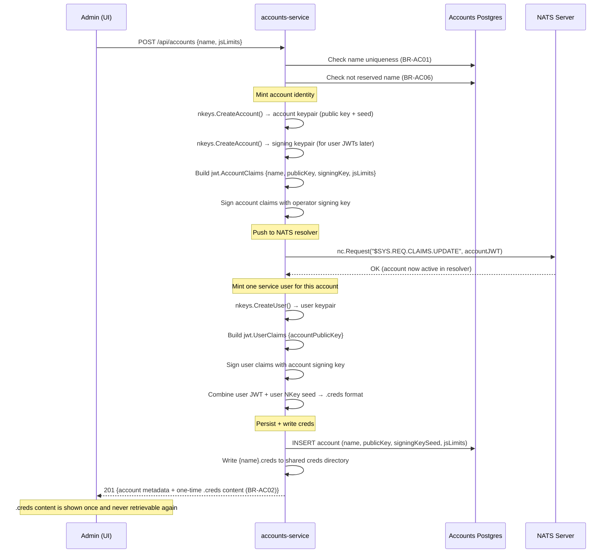

### 2t. Tenant account suspension

BR-AC03 — revoke at resolver, remove `.creds`.

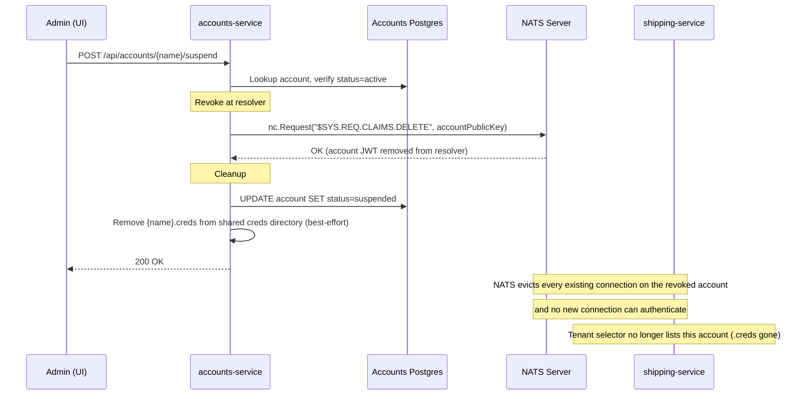

> **Corrected 2026-08-03.** This diagram previously stated that existing
> connections under the account *continue* after the revoke, mirroring the
> (also incorrect) doc comment on `Provisioner.DeleteAccount`. Verified
> against NATS 2.11 on the running stack: connections **are** force-evicted,
> within a couple of seconds, and the server logs
> `account authentication expired` to each affected client. The revoke is a
> hard boundary, not a lazy one. See 2t-a below for what that eviction does
> to clients that were connected at the time.

### 2t-a. Suspension — runtime effect on connected clients

2t above covers what `accounts-service` *does*. This covers what happens to
everyone who was connected when it did it — the cross-service consequence,
which is where the current gaps are.

Verified end to end against the running Docker stack on 2026-08-03 (a
throwaway tenant was minted, connected to, suspended, and observed via
`/connz`, `nats sub`, and `docker logs`), not derived from reading the code.

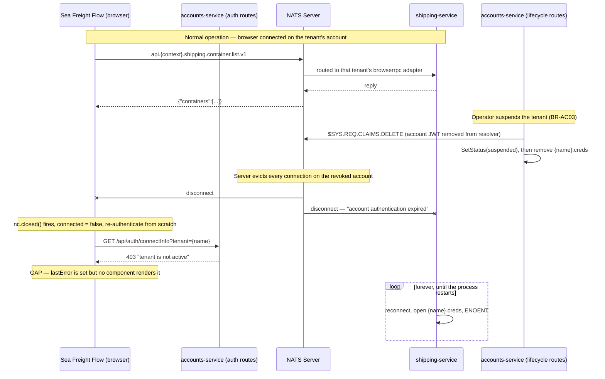

> **Diagram note (Phase 19):** `Auth` and `Accounts` are drawn as separate
> participants because they're separate HTTP route groups with separate
> gating (ungated `/api/auth/*` vs `BasicAuth`-gated `/api/accounts/*`) —
> not because they're separate processes. Since Phase 19 folded
> auth-service into accounts-service, both boxes are the same container and
> the same Postgres connection; see `BUSINESS_RULES-ACCOUNTS.md`'s "Phase
> 19 — auth-service merged in" note.

Three things worth drawing out:

- **An `api.*` request on a suspended account is usually never sent at all** —
  the connection is already gone. A request genuinely in flight at the moment
  of eviction simply never gets a reply and hits the browser's 5s
  `REQUEST_TIMEOUT_MS`.
- **The browser path is correct, close to by accident.** The re-authenticate
  logic in `useNatsConnection.js` exists for the 5-minute browser JWT expiry;
  it handles suspension properly only because `connectInfo` re-checks status
  and refuses. Its one flaw is that `lastError` is never rendered, so the
  operator sees panels quietly stop updating with no explanation.
- **The `shipping-service` path is broken.** Its per-tenant connection is
  evicted like any other, but nothing classifies that as terminal, so
  `nats.go` retries forever against a `.creds` file suspension has already
  deleted. One permanent loop accumulates per suspension, cleared only by a
  restart. This is the exact mirror of BR-030: there is reactive handling for
  a tenant appearing, and none for a tenant going away.

There is also a narrow window between the `$SYS.REQ.CLAIMS.DELETE` and the
Postgres status update in which the auth routes still report the tenant
active and will mint a browser JWT for an account that no longer resolves.
It fails closed — the connection is simply refused — so it is a confusing
error rather than a security hole.

#### Proposed — not implemented

Everything below is a design sketch, not current behaviour. Nothing in this
section exists in the code as of 2026-08-03.

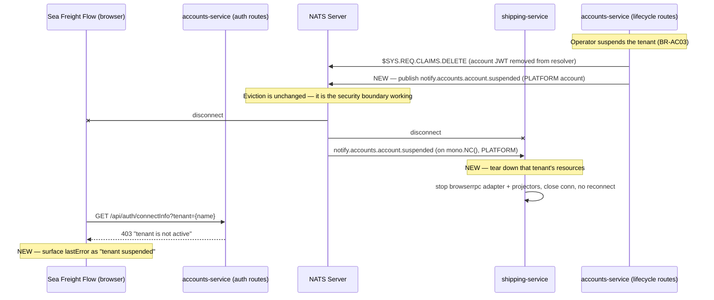

Design notes on the sketch:

- **Eviction stays.** The fix is not to soften the revoke; it is to react to
  it. The red path in the current diagram is correct behaviour.
- **The event mirrors BR-AC08 exactly** — same PLATFORM-account connection
  `accounts-service` already opens to publish `notify.accounts.account.created`,
  same context-free subject family, consumed by `shipping-service` on the same
  `mono.NC()` that already handles the created event.
- **Publish after the revoke succeeds**, keeping BR-AC08's "only announce what
  actually happened" rule. The cost is that `shipping-service` is evicted a few
  milliseconds before the event arrives, so it may spin through one or two
  failed reconnects before teardown lands — bounded, versus unbounded today.
  Publishing *before* the revoke would be fully graceful but risks announcing a
  suspension that then fails.
- **An error-classification backstop belongs alongside the event**, not instead
  of it. `notify.*` is core NATS with no persistence, so a service that is down
  when the event fires misses it permanently, and an account removed outside
  `accounts-service` (an operator running `nsc`, a resolver purge) never
  produces one at all. Classifying connection and JetStream errors as terminal
  (account gone, creds missing, `JSNoAccountErr` 10035, `JSNotEnabledForAccountErr`
  10039) versus transient (network, server restart) makes teardown self-healing.
  Note that 10035's advisory `503` maps to "retryable" in HTTP terms and is
  actively misleading here — account-not-found after a revoke is permanent, and
  treating it as transient is precisely the bug above.

**Reactivation — resolved 2026-08-03 (BR-AC10/BR-032).** This section
originally flagged reactivation as an unverified asymmetry, and it turned out
to be a real one: the teardown above was a one-way door. `EnsureAllTenants`
only runs at process startup and Sea Freight Flow never calls `SwitchTenant`,
so a suspend→reactivate cycle left the tenant dark until `shipping-service`
restarted. `accounts-service` now publishes
`notify.accounts.account.reactivated` once the whole reactivation commits —
crucially *after* the fresh `.creds` file is written, since the consumer
resolves tenants by scanning that directory — and `shipping-service` calls the
existing `EnsureTenantByName` unchanged, rebuilding from scratch because the
teardown had removed the tenant from `TenantResources`.

The three subjects now form a closed lifecycle, all on the same context-free
family over `accounts-service`'s PLATFORM connection:

| Event | Consumer action | Rules |
|---|---|---|
| `notify.accounts.account.created` | provision resources | BR-AC08 / BR-030 |
| `notify.accounts.account.suspended` | tear resources down | BR-AC09 / BR-031 |
| `notify.accounts.account.reactivated` | provision again | BR-AC10 / BR-032 |

### 3t. Tenant account reactivation

BR-AC04 — re-sign and re-push account JWT, mint fresh `.creds`.

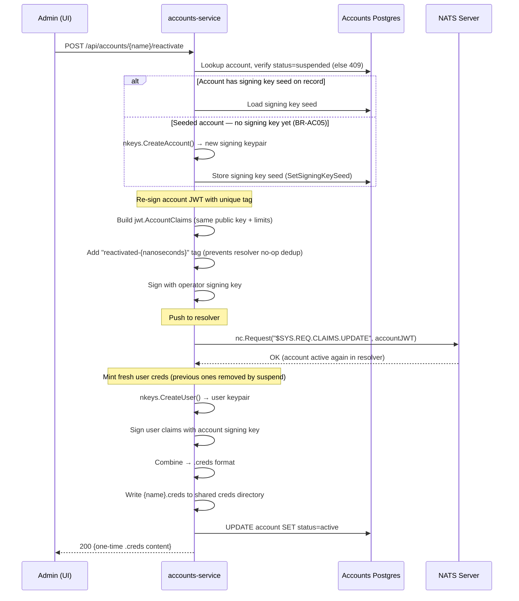

---

## User account lifecycle

User accounts represent human operators within a tenant (NATS account).
See BR-UA01–UA10.

## Sequence diagrams

### 1. User provisioning (invite → first login)

BR-UA01, BR-UA02 — WorkOS-first, JIT-provision downstream.

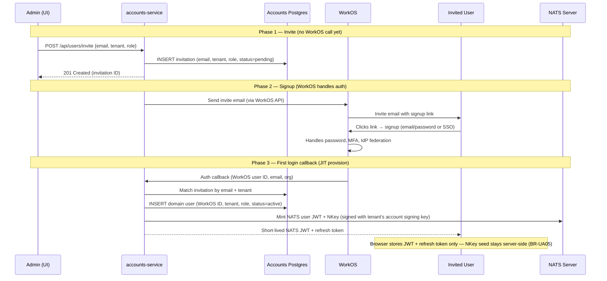

### 2. Subsequent login

BR-UA03 — fresh NATS JWT + refresh token on each login.

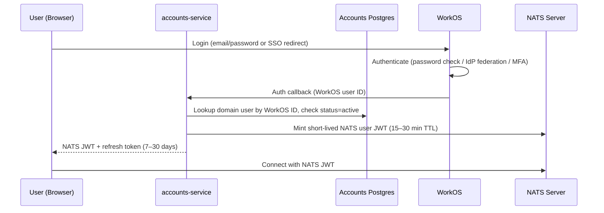

### 3. Token refresh (JWT expired, refresh token still valid)

BR-UA04 — transparent renewal without re-login.

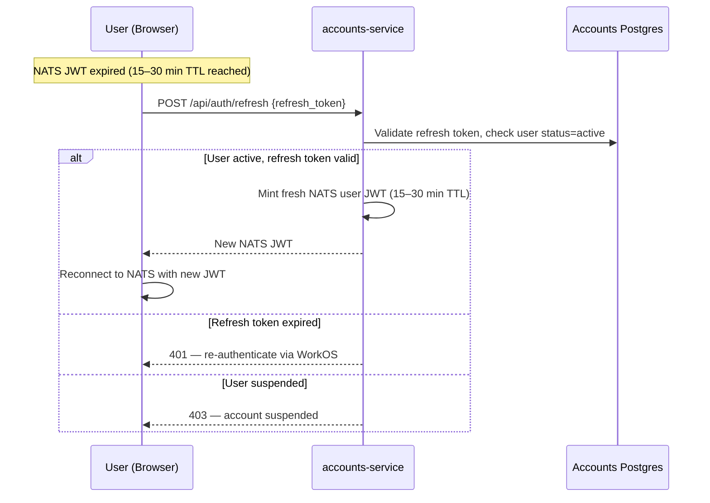

### 4. Admin-initiated revocation

BR-UA06, BR-UA08 — app DB first, then WorkOS.

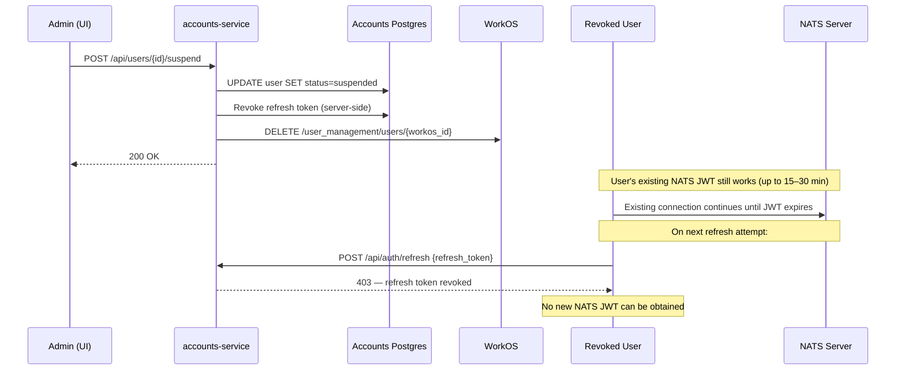

### 5. IdP-initiated revocation (SCIM)

BR-UA07 — same suspension path, triggered by the customer's directory.

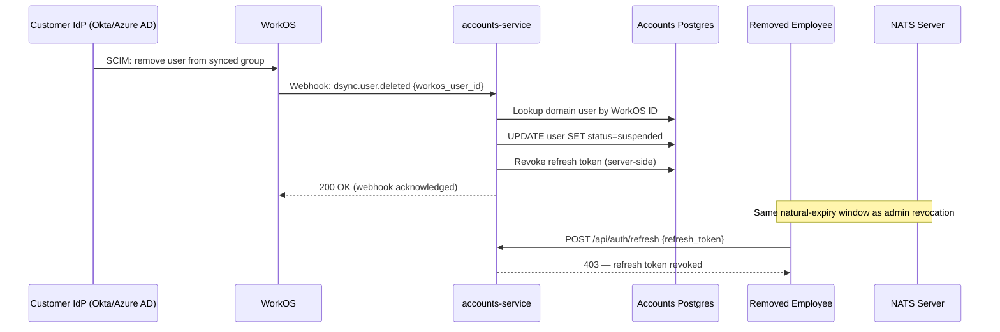

### 6. Explicit logout

BR-UA09 — revoke refresh token server-side + clear client-side.

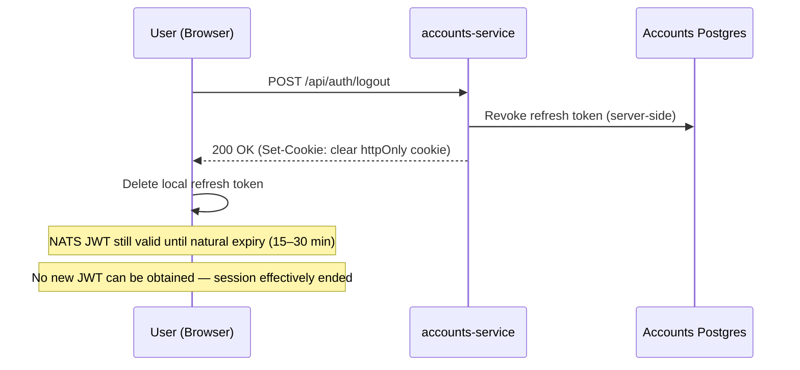

---

## Authentication mode (per-tenant)

BR-UA10 — SSO is a per-tenant configuration option, not a global requirement.

| Tenant type | Auth method | WorkOS config |
|-------------|------------|---------------|
| Small (no IdP) | Email/password via WorkOS User Management | WorkOS org with email auth enabled |
| Enterprise (has IdP) | SAML/OIDC via WorkOS SSO + Directory Sync | WorkOS org with SSO connection + SCIM directory |

The backend's provisioning and session logic (BR-UA01–UA04) does not branch
on which mode the tenant uses — only the tenant's WorkOS organization
configuration differs. Directory Sync (SCIM) webhooks (diagram 5) only fire
for tenants with an IdP connection; email/password tenants manage users
exclusively through the app's admin UI (diagram 4).

---

## Token lifecycle summary

```
WorkOS session ──────────────────────────────────────────────────▶ (longest)
    └─ Refresh token ─────────────────────────▶ 7–30 days
         └─ NATS user JWT ──▶ 15–30 min
              └─ NATS connection (lives until JWT expires or disconnect)
```

| Event | Refresh token | NATS JWT | Effect |
|-------|--------------|----------|--------|
| JWT expires | Still valid | Expired | Client calls `/api/auth/refresh` → new JWT |
| Refresh expires | Expired | Expired | User must re-login via WorkOS |
| Admin revokes | Revoked server-side | Runs out naturally | Locked out within JWT TTL window |
| IdP removes | Revoked server-side | Runs out naturally | Same as admin revocation |
| User logs out | Revoked + cleared | Runs out naturally | Session ended; blast radius = JWT TTL |

---

## Audit trail

BR-AC11. Closes gap #3 from the 2026-08-03 accounts architecture review:
tenant lifecycle changes had no trace beyond `accounts.updated_at` — no
actor, no event log — in tension with BR-AC03's own regulatory-retention
rationale for disallowing hard deletes. Every create/suspend/reactivate now
writes an immutable row to `accounts.audit_events` (same Postgres instance
and schema as `accounts.accounts`, own table) after its state change
succeeds, and best-effort on any failure once a real side effect has been
attempted.

**Table shape:**

| Column | Type | Notes |
|---|---|---|
| `id` | UUID | PK |
| `account` | TEXT | account name — no FK to `accounts.accounts`, since a failed create may need a row for a name that never gets a corresponding account |
| `action` | TEXT | `created` \| `suspended` \| `reactivated` |
| `actor` | TEXT | see "Actor identity" below |
| `source_ip` | TEXT | `r.RemoteAddr` |
| `outcome` | TEXT | `success` \| `failed` |
| `metadata` | JSONB | `{"step": "...", "error": "..."}` on failure; `{"publicKey": "..."}` on a successful create |
| `created_at` | TIMESTAMPTZ | append-only — no `UPDATE`, no `DELETE` |

**Actor identity (placeholder until WorkOS):** this service currently sits
behind one shared HTTP Basic Auth secret (see `accounts_service_plan.md`),
so there is no real per-caller identity yet. `actor` defaults to the shared
username (`admin`), overridable per request via an `X-Actor` header a caller
can set to self-identify. Neither is authenticated, but both are strictly
better than nothing, and become genuinely meaningful once WorkOS-backed
human auth supplies a real principal — same column, no schema change.

**Failure scope:** a request rejected by validation before any resolver or
Postgres mutation is attempted (bad name, reserved name/prefix, duplicate,
"account is not suspended", unknown name) writes nothing — there is no
partial state yet worth recording. Once a handler starts mutating external
state, every further error on that request writes a `failed` row naming the
step and the error, directly surfacing the partial-failure inconsistencies
already called out in gap #4 of the same review (e.g. resolver revoked but
`Store.SetStatus` failed, leaving the resolver and Postgres disagreeing).

### Create

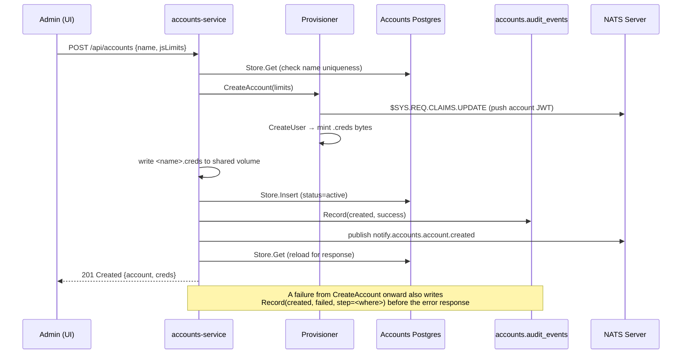

### Suspend

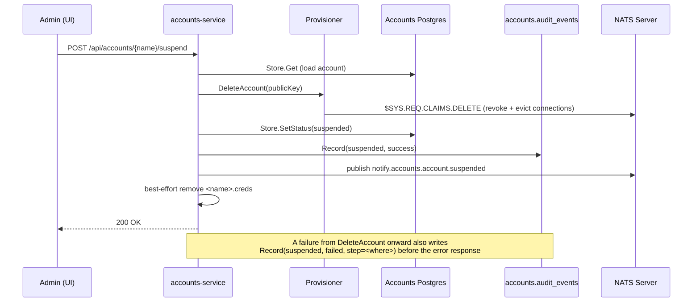

### Reactivate

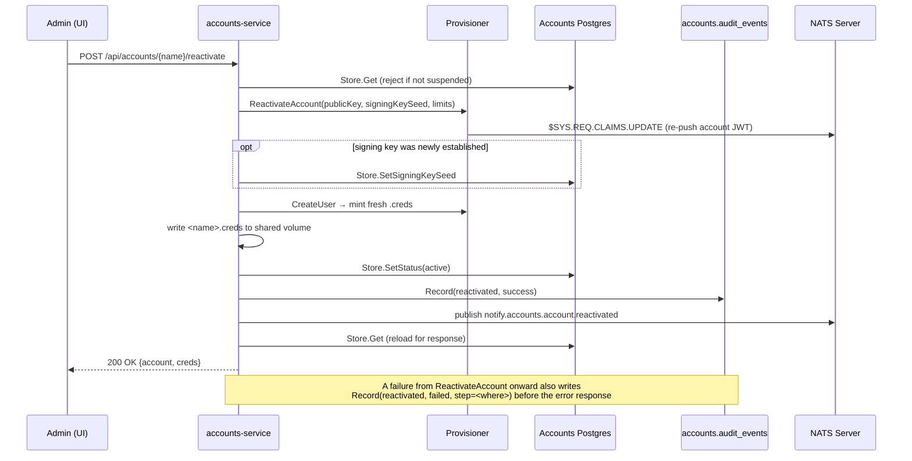

**Not yet built** (deferred, see `accounts_service_plan.md`'s remaining open
gaps): a REST endpoint over `AuditLog.ListByAccount` for the Admin UI to
display a tenant's history, and any retention/export policy beyond "keep
forever."
