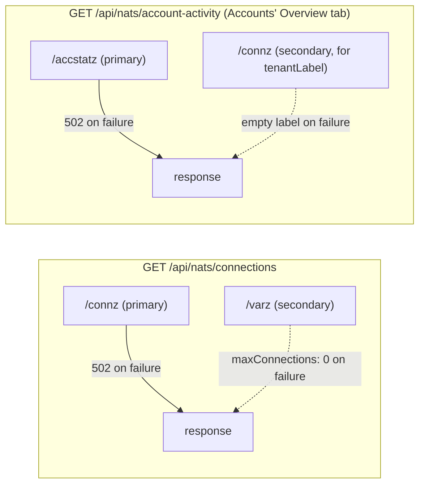
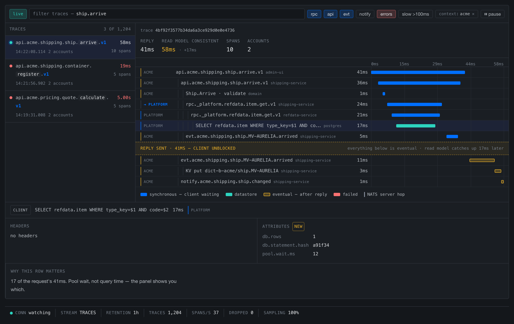
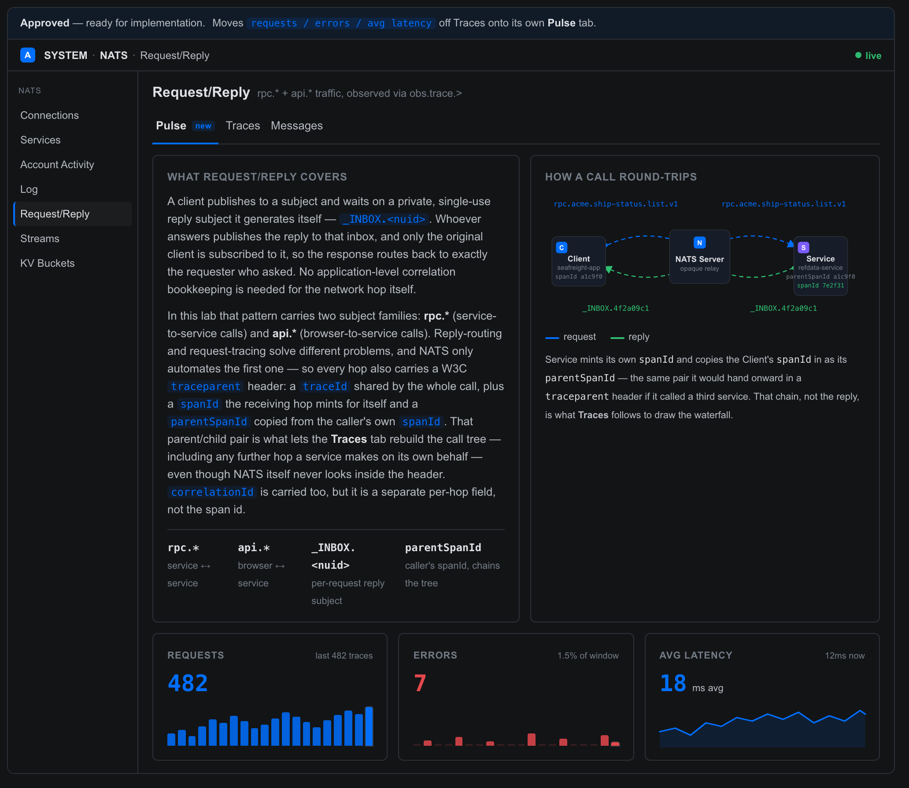

# Admin UI — SYSTEM → NATS Navbar Group

Scope: the six panels nested under `frontend/admin`'s SYSTEM → NATS nav
group — Connections, Services, Log, Request/Reply & Traces, Streams, KV
Buckets (`frontend/admin/src/App.vue`'s `sections` array, `eyebrow: 'NATS'`).
These are the Admin UI's *observability* surface: every one of them is
read-only, reaches across every NATS account this backend can see rather
than just the active tenant, and exists so an operator can answer "what's
actually happening on this deployment?" without opening `nats` CLI or a raw
`:8222` curl.

> **Phase 45 — Account Activity is no longer one of these six.** It moved
> out of this navbar group entirely: `Accounts` (its own top-level SYSTEM
> entry, not nested under this `eyebrow: 'NATS'` sub-group) gained an
> `Overview` tab that absorbed it, so Accounts is now the one home for both
> the business roster and NATS-account health. §4.3 below keeps its design
> history as a historical record — the same reasoning still governs
> `AccountsOverviewPanel.vue` today — but every other section in this doc
> (panel counts, layout/archetype/color inventories) now describes the six
> panels actually left in this group.

This doc is the architecture **and** UI-design reference for that group
specifically — it complements, rather than replaces, the docs that already
own deeper pieces of it:

- [ARCHITECTURE-COMMUNICATIONS.md](ARCHITECTURE-COMMUNICATIONS.md) §6 owns
  the `obs.trace.*` wire protocol Request/Reply & Traces observes (the
  predecessor `obs.rpc.*`/`obs.api.*` channel this panel used before Phase
  28g is retired — §6's Phase 28g amendment) — including the W3C
  `traceparent` propagation the trace view is built on (§2.2) — §11 owns
  Connections' account-label resolution, §12 owns the cross-account
  diagnostic-scope argument Streams/KV Buckets (and Connections/Services)
  all share.
- [ARCHITECTURE-ACCOUNTS.md](ARCHITECTURE-ACCOUNTS.md) owns the NATS
  operator-mode trust chain and the "two PLATFORM connections" split that
  determines which credential each snapshot endpoint uses.
- [ARCHITECTURE.md](ARCHITECTURE.md) owns the CQRS shape taxonomy (Shape
  A/B/C) — no longer visualized by a panel in this group; the CQRS Shapes
  panel that once did was retired (§4.8's history).

What's genuinely new here, and not written down anywhere else: the shared
**UI design system** these six panels all draw from (§2), the three
recurring **backend data-flow archetypes** they mix and match (§3), and —
for the three panels where a real design argument happened — the **design
history** of how each panel arrived at its shipped shape, including the
alternatives that were rejected and why (§4.1, §4.3, §4.5).

---

## 1. Panel index

| Panel | Nav key | Component(s) | Backend endpoint(s) |
|---|---|---|---|
| Connections | `connections` | `ConnectionsPanel.vue` | `GET /api/nats/connections` |
| Services | `services` | `ServicesPanel.vue` | `GET /api/nats/services` |
| Log | `log` | `LogPanel.vue` | `GET /api/nats/log` |
| Request/Reply & Traces | `rpc` | `RpcPanel.vue`, `PulsePanel.vue`, `TraceWaterfall.vue`, `SubjectPath.vue` | `GET /api/kv/buckets/platform/trace-request-reply/entries` + live `notify._platform.kv.trace-request-reply.>` — all three tabs read the same feed (pulse: unfiltered, grouped by trace, Phase 44; traces: grouped by trace, toolbar-filtered; messages: flattened one row per span, Phase 28g retirement; bucket renamed `traces` → `trace-request-reply` in Phase 28l) |
| Streams | `streams` | `JetStreamPanel.vue`, `StreamView.vue` | `GET /api/jetstream/streams`, `GET /api/jetstream/replay` |
| KV Buckets | `kv` | `KvInspector.vue` | `GET /api/kv/buckets`, `GET /api/kv/buckets/{account}/{bucket}/entries` + live `notify.*.kv.{bucket}.>` |

All six are wired in `App.vue`'s `<template>` as `v-else-if="activeView === '<key>'"` sections; the five that manage their own internal scroll region (Connections, Services, Request/Reply & Traces, Streams, KV Buckets) render inside `class="group group--flush"` so their content fills the remaining viewport instead of being capped at page height. Log renders as a plain (non-flush) `group` section.

**Account Activity moved out of this group in Phase 45** — its component
(now `AccountsOverviewPanel.vue`) is Accounts' `Overview` tab
(`AccountsView.vue`), reachable via the `accounts` nav key, not a
`v-else-if` branch in this list. `GET /api/nats/account-activity` is
unchanged; Phase 45 additionally added
`GET /api/nats/account-activity/history` (BR-043) alongside it.

---

## 2. Shared UI design system

Every panel here is built from `shared/unifi-theme/` tokens and
`shared/ui-shell/AppShell.vue` — this repo's one visual identity, not a
per-panel invention (see CLAUDE.md's "Frontend Design System" for the
tokens/layout API). What's specific to *this* navbar group is how those
tokens compose into four recurring layout patterns, one recurring
summary-card rule, and one color vocabulary.

### 2.1 Four recurring layouts

1. **Card list** — Services (and, outside this navbar group but sharing the
   same CSS, Accounts' `Overview` tab). A vertical stack of
   `.svc-card`/`.acct-card` rows: a status dot, a name, optional tag(s), a
   row of right-aligned inline stat pairs (`<b>value</b><label>unit</label>`),
   and a chevron that expands the card in place for per-instance/per-account
   detail. Chosen because the underlying data — "a handful of named things,
   each with a few live counters, worth expanding for detail" — is the same
   shape both times; the Overview tab's card is deliberately a copy of
   Services' `.svc-card`, not a new pattern (§4.3's historical note).
2. **Rail + detail split-pane** — Streams, KV Buckets, Request/Reply &
   Traces' *traces* view (and, in its own idiom, that panel's *messages*
   row-list + bottom detail). A left rail lists every
   item — streams for Streams, buckets for KV Buckets, traces for the trace
   view — grouped into
   collapsible `.account-group` bands, with a colored `.account-dot` (green =
   the browser's own authenticated tenant account, gray = a read-only/other
   account); selecting a row fills a detail pane on the right.
   `JetStreamPanel.vue` and `KvInspector.vue` explicitly share this CSS
   (`.account-group`/`.account-dot`/`.rail-item`) so the two "pick one thing
   from a list, inspect it on the right" panels read as one pattern rather
   than two.
3. **Plain table** — Connections, and the
   *messages* view of Request/Reply & Traces. A PrimeVue `DataTable`,
   filterable, one row per entity; no card, no expansion (Connections' detail
   opens as a bottom panel instead, closer to that messages view's pattern
   than to a card's inline expansion).
4. **Tail view** — Log, and (as a secondary element) KV Buckets' "Recent
   updates" feed below its Contents table. A scrolling, append-only list —
   full-height monospace lines for Log, a compact reverse-chronological
   `<ul>` for KV's feed — with a Live/Paused toggle and auto-scroll that only
   sticks to the bottom if the reader was already near it (Log's
   `stickToBottomIfNear`: jumping the view out from under someone who
   scrolled up to read history "would be actively hostile").

### 2.2 The "one ratio, one type size" summary-card rule

Connections and Services each open with a `.summary-row` of 3–4 cards
(`.summary-card` → `.summary-label` + `.summary-value`) — as does Accounts'
`Overview` tab, outside this navbar group but built to the same rule. The
rule governing every one of them, established while building Connections'
Total card and then applied to Services (and later Account
Activity/Overview) from the start:

- **One value per card, at one type size across the whole row** — 20px/600,
  pairs included (`N / max` ratios, `in / out` pairs). No per-card `.small`
  modifier, ever. A counter too long for its card is fixed by *shortening
  the number* (`src/format.js`'s `compactCount` → `1.2M`, exact figure
  always in the `title` tooltip) and by letting `.summary-row` wrap
  (`repeat(auto-fit, minmax(min(165px, 100%), 1fr))`) — never by shrinking
  the font. The original 4-column fixed grid left only ~94px of text room at
  a typical viewport width, which is what had forced smaller fonts as a
  workaround in the first place; fixing the grid and adding `compactCount`
  removed the need for that workaround everywhere at once.
- **A ratio card shows `value / max`, with a bar under it — never two
  stacked gauges, and never a caption whose only job is to say the healthy
  case is healthy.** Connections' Total card is `connections / maxConnections`
  (the real ceiling, from `/varz`) with a capacity bar beneath it, turning
  amber at 80%.
- **Facts that only matter in an exceptional state render only in that
  state.** Connections' "N of M shown, page P of Q" note appears solely
  when `/connz` actually paged (an amber line, with the page-size vs.
  connection-ceiling distinction spelled out in its tooltip) — not as a
  permanent "nothing hidden" caption. The Overview tab's slow-consumer
  banner and per-account alarm follow the identical rule (§4.3's historical
  note): silent at zero, visible only once nonzero.

### 2.3 Color semantics

One vocabulary, reused rather than reinvented per panel:

| Meaning | Token / class | Where |
|---|---|---|
| Healthy / live / watching | `#2fbf71` green, `.dot.ok`, `watching` `Tag` | Service/account status dots, topbar connection badge, KV/Streams "watching" tag |
| Warning / approaching a limit | `--p-amber-400` amber, `.usage-warn` | Capacity bars ≥80%, `[WRN]` log lines |
| Critical / needs action | `--p-red-400`/`#f87171`, `.errv`/`.err-line`, `.dot.crit` | Slow-consumer alarm, error counts, `[ERR]` log lines, RPC error status |
| Interactive accent | `--lab-accent` `#006fff` | Nav selection, positional subject-token highlighting, active facet chips |
| Read-only / snapshot-only | muted gray, `snapshot` `Tag` | Streams' per-stream header tag (no live tail exists for that panel — see §4.6) |

---

## 3. Shared backend patterns

### 3.1 Three data-flow archetypes

Every panel's backend traffic is one of three shapes, or a hybrid of two of
them. Naming them once here avoids re-deriving "is this live?" per panel:

| Archetype | Description | Panels |
|---|---|---|
| **Poll-only** | A REST endpoint re-fetched on an interval; no NATS subscription backs it at all. | Log (4s poll), Connections/Services (10s poll), Streams' rail and KV Buckets' rail (15s poll) — also, outside this group, Accounts' `Overview` tab (10s poll, plus its own 10s poll against the Phase 45 history route on a duration change) |
| **Snapshot + live notify** | One-shot REST bootstrap, immediately followed by a live NATS subscription (`notify.*` for anything published afterward. | KV Buckets' selected-bucket detail (`notify.*.kv.{bucket}.>`), Request/Reply & Traces (both tabs — `GET /api/kv/buckets/platform/trace-request-reply/entries` + `notify._platform.kv.trace-request-reply.>`, Phase 28g retirement) |
| **Live-only** | A direct NATS subscription with no REST snapshot/replay at all — nothing to catch up on, or catching up was deliberately out of scope. | No panel currently instantiates this archetype — Request/Reply & Traces' old `api.*` half (`obs.api.>`) was the one example, retired in Phase 28g along with the rest of that channel. Kept here as a named shape in case a future panel needs it, not as a claim that one exists today. |

**The trace view is a variant of snapshot+notify, not a fourth archetype**
(Phase 28). A NATS **KV watch** replays every existing key and then stays
live on one subscription, so bootstrap and live feed are the same mechanism
rather than a REST fetch raced against a subscribe. That collapses the one
known weakness of the archetype: the two-mechanism form has a documented
duplicate/gap window between "replay returned" and "subscription
established" (BR-D29's consumer note — acceptable for a debug feed, not for
anything load-bearing), and the KV form structurally cannot have one. Worth
preferring wherever the panel's data can be modelled as keyed current state
instead of a message log.

**Streams is the one documented gap.** `StreamView.vue`'s own comment states
plainly that it has no live tail — a stream's message table is a plain
snapshot, re-fetched on reselect/reconnect, full stop. The *backend*
(`replay.go`)'s doc comment still describes a `notify.{context}.shipping.raw.*`
live-tail subject as the intended follow-on to the bootstrap fetch — that
capability was built for a different consumer and the Streams panel never
wired up the client-side subscribe half. Worth fixing if "watch a stream
live" becomes a real requirement; until then, Streams is poll-only in
practice, and its detail header's `snapshot` tag (§2.3) is telling the
truth, not a hedge.

**Historical note:** the now-retired CQRS Shapes panel (§4.8) used to have a
deliberate exception to "give everything a live feed" — a **manual,
on-demand** replay (`GET /api/shape-c/fleet`, fired on mount and again only
when the operator clicked "Reconstruct"), because the point of that shape
was to demonstrate Fowler's Event Sourcing property — that current state
derives entirely from history — and a Reconstruct button that visibly
redoes the full replay made that demonstration concrete in a way a
silently-live view wouldn't. Phase 31 retired that shape once the POC's
comparison was decided, before the panel itself was retired outright — its
table ended its life entirely snapshot+live-notify, with no manual-replay
exception left.

### 3.2 Primary/secondary monitoring reads

Connections and Services share one backend shape even though they proxy
different NATS monitoring endpoints — a pattern Account Activity (now
Accounts' `Overview` tab, outside this group) also follows: a **primary**
read that the request fails on (502) if it's unreachable, and zero or more
**secondary** reads whose failure the caller absorbs rather than propagates.

`fetchMonitor` (`nats_ops.go`) is the one helper both secondary reads go
through — a plain GET-and-decode with no special error handling, used
precisely because the *caller* decides whether a given read is primary
(inline, fails the request) or secondary (`fetchMonitor` + a logged warning,
degrades gracefully). Services has no secondary read at all — `$SRV.STATS`
discovery either finds instances or doesn't, there's no adjacent monitoring
endpoint to enrich it with.

### 3.3 Cross-account, not tenant-scoped

Connections, Streams, and KV Buckets — plus Accounts' `Overview` tab,
outside this group — all read **every account this backend reaches**, never
just the active tenant — deliberately,
because "what exists / what's happening on this deployment" is a different
question from "what is this tenant's data," and forcing the former through a
tenant switch answers it one account at a time. See
[ARCHITECTURE-COMMUNICATIONS.md §12](ARCHITECTURE-COMMUNICATIONS.md) for
the full argument (written against Streams/KV Buckets, applies identically
here) and [ARCHITECTURE-ACCOUNTS.md](ARCHITECTURE-ACCOUNTS.md) § "Two
PLATFORM connections, not one" for which credential each snapshot read
actually uses (`PlatformFullJS` for listing, since `shipping-admin` is
deliberately denied `$JS.API.STREAM.LIST`).

**Services is the one exception, and its narrower scope is deliberate, not
an oversight.** It has no server-wide monitoring endpoint to proxy — `$SRV.STATS`
is a broadcast/collect protocol scoped to whichever NATS connections *this
process itself* holds, which in practice means PLATFORM (`deps.NC`) plus
the currently active tenant (`deps.TenantNC`), not every account
simultaneously. A service registered on an account this backend holds no
connection on (`accounts-service`, on the SYS account) structurally can't
appear — the same account-isolation gap Connections' label resolution hits
(§3.4), just showing up here as "doesn't appear" instead of "appears
unlabeled."

### 3.4 Account-label resolution (BR-028)

Connections and Services both show a friendly account name ("PLATFORM",
"acme") instead of a raw NKey wherever this process can resolve one — see
[ARCHITECTURE-COMMUNICATIONS.md §11](ARCHITECTURE-COMMUNICATIONS.md)
for the two-tier browser-composed resolution `ConnectionsPanel.vue` uses,
and [BUSINESS_RULES-SHIPPING.md](../../../../demos/01-dictionary/BUSINESS_RULES-SHIPPING.md)
BR-028 for the backend rule both enforce (`tenantLabelsByAccount`,
matching this process's own connections by local socket address, then
applying that mapping by account to every row). Accounts' `Overview` tab
(outside this group) reuses the identical `tenantLabelsByAccount` fan-out as
a secondary read (§3.2, BR-034) rather than inventing a second resolver —
the only difference from Connections/Services is which primary payload
(`/accstatz`'s `acc` field instead of `/connz`'s `account` field) the
resolved map is applied to.

---

## 4. Panels

### 4.1 Connections

**What it shows.** Every live NATS connection on the server, across every
account — one row per socket, independent of the active tenant.

**Backend + data flow.** Poll-only, `GET /api/nats/connections` (§3.1, §3.2)
— `/connz` primary, `/varz` secondary for `maxConnections`. Account labels
resolved server-side (§3.4) then composed with a second, browser-side
resolver against `accounts-service`'s roster (COMMUNICATIONS §11).

**UI design.** Plain table (§2.1.3): filterable `DataTable`, one row per
connection, clicking a row opens a bottom detail pane (subscriptions list,
full account NKey). Summary row follows §2.2 exactly: **Total**
(`connections / maxConnections` ratio + capacity bar, amber at 80%), **TCP
(NATS)**, **WebSocket**, **Msgs In/Out** — all four at the same 20px/600
type size.

**Design history — from two gauges to one ratio.** The Total card went
through three shapes before shipping. It started as a bare count (`18`),
then grew a second, independent "page size" gauge once `/connz`'s own
`limit`/`total` paging envelope was added — two stacked bars, one for
`connections / maxConnections` and one for `shown / total-on-this-page`.
That was rejected as confusing: *"It should only show total/maximum. For
example if the maximum is 65536 and the total is 18 then we should show `18
/ 65536`."* The root problem wasn't the number of bars, it was that only one
of the two ratios was real — `/connz`'s `limit` is a page size the *client's
request* chose, not a property of the server, so pairing it with the
connection count read as a second capacity ceiling that didn't exist.
Fixed by demoting the paging fact to a conditional-only note (§2.2, "facts
that only matter in an exceptional state render only in that state") and
keeping exactly one ratio, one bar, on the Total card. See
`.claude/memory/admin_stat_card_one_ratio_rule.md` and
`.claude/memory/connz_limit_is_page_size_not_capacity.md` in the repo for
the full exchange this rule came out of.

### 4.2 Services

**What it shows.** Every service registered via `nats.go/micro`
(discovered by broadcasting `$SRV.STATS` and collecting replies, the same
protocol `nats micro stats` uses), with per-instance, per-endpoint
request/error/latency stats.

**Backend + data flow.** Poll-only, `GET /api/nats/services`. No secondary
read (§3.2) — discovery either finds instances within the fixed collection
window or it doesn't.

**UI design.** Card list (§2.1.1) — `.svc-card`: dot, name, version,
inline stat pairs (instances, endpoints), chevron. Expanding a card reveals
one row per instance, each with its own endpoint table (request/error
counts, average latency, a proportional volume bar) and a tenant tag when
the instance's `micro.Config.Metadata` carries one (BR-028, §3.4). Summary
row: **Services**, **Instances**, **Endpoints**, **Requests / Errors**
(errors rendered in the crit red from §2.3 when nonzero, otherwise plain).

### 4.3 Account Activity (relocated to Accounts' `Overview` tab, Phase 45)

**No longer part of this navbar group** — kept here, same treatment as
§4.8's retired CQRS Shapes panel, because the design history below still
governs the component that superseded it. `AccountActivityPanel.vue` (the
standalone SYSTEM · NATS panel described below) was deleted; its content
and behavior live on as `AccountsOverviewPanel.vue`, the first tab of
Accounts (`AccountsView.vue`, nav key `accounts`) — moved there because
Accounts itself moved PLATFORM → SYSTEM in the same phase, making it the
one home for both the business roster and NATS-account health rather than
a SYSTEM/NATS item sitting apart from it.

**What it shows.** Per-account traffic and health — connection/subscription
counts, sent/received message and byte volume, and `slow_consumers` — from
the NATS server's own `/accstatz`. Introduced Phase 27; nothing showed this
data before it existed.

**Backend + data flow.** Poll-only, `GET /api/nats/account-activity`
(§3.2) — `/accstatz` primary, `/connz` secondary for `tenantLabel` (§3.4).

**UI design.** Card list (§2.1.1), deliberately copied from Services'
`.svc-card` rather than invented — accstatz is the same shape of data, "a
handful of named things, each with a few live counters, worth expanding for
detail." Summary row: **Accounts**, **Connections**, **Subscriptions**,
**Msgs In/Out**, following §2.2 exactly.

**Phase 45 additions — trend history and gated search, on top of the
unchanged card-list/summary-row shape above.** Two gaps the original design
never addressed, found in mockup review (`.claude/memory/accounts_overview_pulse_design.md`):
the expand-to-detail interaction restated the same numbers already visible
in the collapsed row, and there was no way to filter the list once it grew
past a handful of accounts.

- **Trend charts replace the flat number grid on expand** (BR-043). A new
  60-minute in-memory ring buffer in `observability-service`
  (`account_activity_history.go`) polls `/accstatz` every 10s — the same
  cadence the frontend already polled at — and
  `GET /api/nats/account-activity/history?duration=5m|30m|1h` buckets it
  (30s/2min/5min buckets respectively, so a short window doesn't collapse
  to one or two fat bars). Two charts render per expanded card: a
  connections/subscriptions line pair, and an in/out throughput bar chart.
  The one correctness point worth restating here: `/accstatz`'s byte/message
  counters are cumulative since server start, so the history route reports
  **deltas** between buckets, not the raw values — charting the raw
  counters would draw an ever-climbing line, not a throughput bar. The
  fleet summary cards each grow a sparkline too, summed client-side from
  the per-account series rather than a separate fleet-aggregate endpoint.
  Not persisted across restarts — deliberately transient telemetry, same
  reasoning this repo already applies to what does vs. doesn't get
  event-sourced ([ARCHITECTURE.md](ARCHITECTURE.md) § "Event Sourcing vs
  Plain CRUD").
- **A name filter, gated on account count** (BR-044). Below 4 accounts the
  list is short enough to just read, so the search box is omitted entirely
  rather than shown-but-useless; past that threshold it filters the
  already-fetched list client-side (case-insensitive substring against the
  resolved label), with a "No accounts match "…"." empty state rather than
  a blank list.

Round 2 of the mockup review (a "fleet pulse" alternative that removed the
collapse/expand interaction entirely, giving every account's charts
permanent screen space) was rejected before implementation — it doesn't
scale as accounts are added, and it breaks the collapsed-by-default
convention Services/Account-Activity-turned-Overview both otherwise share.
See the memory file above for the full round-by-round history and the
mockups it links to.

**Design history — placement, and the one deliberate move.** Before
building anything, three placements were compared for where this data
should live:

| Option | Shape | Why not chosen |
|---|---|---|
| Columns on the Accounts table | Add Conns/Msgs/Data columns to the existing 9-column PLATFORM → Accounts table | Pushes the table to 12–13 columns and conflates "what this account is allowed to use" (Accounts' actual job — storage/consumer limits) with "what it's doing right now" (a live server reading) |
| Alert-only banner | Nothing routine shown; a small banner in Connections only when some account has `slow_consumers > 0` | Correctly silent by default, but throws away the routine traffic numbers with no home for them |
| **New panel (chosen)** | A new "Account Activity" item under SYSTEM → NATS, one card per account | `/accstatz` comes off the same `:8222` monitor port as `/connz`/`/varz` — it belongs on the shelf with Connections/Services, not inside accounts-service's identity/lifecycle domain |

The placement argument settled, one design move was deliberate rather than
incidental: **`slow_consumers` gets no routine tile.** At zero — every
account, all day, on a healthy stack — the row says nothing about it at
all: no permanent "0 slow" stat competing with real numbers for attention,
following §2.2's exceptional-state rule exactly. The moment an account's
`slow_consumers` is nonzero: its status dot turns from `.dot.ok` green to
`.dot.crit` red, its card border tints red, its "subs" stat is *replaced* by
a red "slow" stat (not added alongside it — subs isn't the number that
matters in that moment), and expanding the card opens on a named alarm line
("N slow consumers on this account right now — a subscriber isn't draining
fast enough...") instead of a bare column. A summary-row banner mirrors the
same condition at the aggregate level. One card looking different from the
three others *is* the entire signal — see BR-034 in
`BUSINESS_RULES-SHIPPING.md` for the enforced rule and its test coverage.

### 4.4 Log

**What it shows.** A tail of NATS's own `log_file`, filterable by level
(`[ERR]`/`[WRN]`/`[INF]`/`[DBG]`/`[TRC]`) and free-text substring — a
lightweight `grep`/`tail -f` over the server's own log, not a production
log pipeline.

**Backend + data flow.** Poll-only (the one panel in this group with zero
NATS subscription at all) — `GET /api/nats/log`, re-fetched every 4s plus a
debounced re-fetch on filter change. `tail` is capped server-side at 1000
lines regardless of what's requested; at most the log file's last 8MB is
ever read from disk (the file has no rotation, per its own `nats.conf`
comment, so an unbounded read would grow with server uptime). Returns 503
if `NatsLogPath` was never configured (e.g. running outside Docker).

**UI design.** Tail view (§2.1.4): a filter bar (level select, free-text
input, tail-count select) above a monospace scrolling viewport, one line per
log entry, colored by level (§2.3: red `[ERR]`, amber `[WRN]`, default
`[INF]`, dimmed `[DBG]`/`[TRC]`). A Live/Paused toggle starts and stops the
poll; a "more matches than shown" banner appears when the 1000-line ceiling
truncated the result. Both the frontend and backend doc comments frame this
explicitly as a deliberate scope cut: REST-polled like every other panel
here rather than a push/follow transport, no general grep DSL, "a lab
convenience, not a production log pipeline."

### 4.5 Request/Reply & Traces

**What it shows.** Two views of the same traffic behind a
`[traces] [messages]` toggle. *Traces* (the default, Phase 28) shows one row
per **trace** — every hop one originating request caused, across services,
NATS accounts, and the asynchronous CQRS tail. *Messages* is the original
flat view: one row per `correlationId`, pairing a single request with its
single reply — headers, payload, latency, size, errors — so the two read
together instead of as two unrelated events.

Both views are kept because they answer different questions. A trace
answers "what did this request cause, and where did the time go"; the flat
list answers "is anything at all arriving on this subject," which a trace
list is worse at.

Before Phase 28 only the flat view existed, and its correlation key was
`req.Reply()` — the requestor's `_INBOX` subject, which is generated fresh
by each requestor and never propagated onward. A
`browser → shipping-service → refdata-service` call therefore rendered as
**two unrelated rows**, and `evt.*` / `notify.*` / KV writes rendered as
none at all: with no reply inbox there is no correlation id even in
principle, so the entire async tail was unjoinable to the command that
caused it. Traces key on a W3C `traceId` minted in the browser and carried
in a `traceparent` header through every hop
([ARCHITECTURE-COMMUNICATIONS.md](ARCHITECTURE-COMMUNICATIONS.md) §2.2, §6;
BR-036/BR-D39 for the envelope, BR-037 for propagation). `correlationId` is
retained as a per-hop detail field — it is *not* the span id, and it stays
useful for tying a span back to a `/connz` row or a server log line.

**Backend + data flow.** Snapshot + live notify (§3.1) in the **KV-watch
variant**, so the bootstrap and the live feed are one subscription and the
flat view's duplicate/gap window (BR-D29) does not apply. Services publish
spans to `obs.trace.>` on the PLATFORM account; a **single** durable
consumer on the `TRACES` stream (LimitsPolicy, `MaxAge` 1h, `MaxBytes`
capped) assembles each trace into the `traces` bucket keyed
`_platform.trace.{traceId}`, and the panel watches that bucket. One writer by
construction, so there is no read-modify-write race on a partially
assembled trace. Tenant-account services reach PLATFORM through a per-tenant
`obs.trace.>` stream export imported into PLATFORM (BR-AC30) — closing the
cross-account gap the old, now-retired `obs.api.*` channel could never
close (it was published on the tenant account itself, so it was only ever
visible for whichever tenant was active, never cross-account).

The store split is itself a worked example of the question this demo exists
to ask ([ARCHITECTURE.md](ARCHITECTURE.md) § "Event Sourcing vs Plain
CRUD"): the raw span log lives in JetStream because it must be replayable,
the assembled trace lives in KV because every read is a lookup by id and
wants a free `watch`, and Postgres is not involved at all because nothing
here is transactional and everything expires — KV as the read model
directly, applied to the lab's own telemetry (the same pattern the retired
Shape A once demonstrated for ships, before Phase 31).

*Messages* reads the same spans rather than a second feed: a `traceSpan` is
a strict superset of the pre-Phase-28 `obsEnvelope`, which is also why the
flat view survived the migration unchanged.

**UI design.** Rail + detail split-pane (§2.1.2) for *traces* — a trace list
rail on the left (status dot, subject, time, accounts crossed, duration,
span count), a waterfall to its right, and a span detail pane beneath.
*Messages* keeps the plain-table + paired **Request** / **Reply** detail it
already had, each pane with a headers table and a syntax-tinted JSON body,
mirroring the channel's actual two-message structure rather than a
single-message drawer. Subjects render via `SubjectPath.vue` in both views
as dot-separated clickable chips (last token as the "verb," bold and
accented; second-to-last as an "id" chip), exploiting the fixed 6-token
subject arity (ARCHITECTURE-COMMUNICATIONS.md §2.2) — clicking a token adds
a positional facet chip to the toolbar. The toolbar also carries free-text
search, family toggles, status toggles (ok success-green / error crit-red /
pending warn-amber, §2.3), and a Pause/Resume that freezes the *visible*
rows without stopping ingestion underneath.

The mockup above is the reviewed design, showing the trace from this section's
running example: a ship arrival that crosses ACME → PLATFORM for a reference
-data lookup, replies at 41ms, and reaches read-model consistency at 58ms. The
selected span is the `SELECT` that accounts for 17 of those 41ms — and its
attributes separate `pool.wait.ms` from actual query time, which is the kind of
answer the flat view cannot give at all. Editable source:
[admin-traces-panel.html](../../../../demos/01-dictionary/diagrams/admin-traces-panel.html);
re-export with `node diagrams/export-html-png.mjs` (see
ARCHITECTURE-COMMUNICATIONS.md §6 for the full command form — this one adds
`--clip=".wrap > .panel,.strip"` so only the panel chrome is captured, not the
mockup's explanatory tables).

Two devices in the waterfall carry information rather than decoration, and
both show something a general-purpose tracing UI structurally cannot:

- **The account swimlane.** A left gutter names the NATS account each span
  executed in, and a `⇥` marks any span whose account differs from its
  parent's. In an operator-mode deployment where tenancy *is* the account
  boundary and services reach each other only through JWT
  imports/exports, "which account did this run in, and where did it cross"
  is the question hardest to answer from application logs — and the one
  the Topology panel already reads statically from account JWTs. This is
  the same information observed dynamically, from real traffic.
- **The reply-ack rule.** A dashed band splits the waterfall at the point
  the reply was sent: synchronous work above (the client is blocked),
  eventual work below (the projection, the KV write, the notify). The
  header therefore states **two** durations — `reply` and `read model
  consistent` — because in a CQRS system those are different numbers and
  the gap between them is the thing worth watching. Following §2.2's
  exceptional-state rule, a trace with no async tail renders no ack line
  at all rather than an empty band; a rejected command legitimately has no
  tail, and that absence is itself the information.

Span bars reuse §2.3's vocabulary and extend it only where §2.3 has no
existing meaning: interactive accent `--lab-accent` for synchronous
application work, crit-red for failed spans, plus two additions — a
datastore teal and an outlined eventual-amber. Those two encode *kind* of
work, not health, so they are deliberately not health colors and do not
compete with §2.3's green/amber/red axis. Server-hop spans (Phase 63,
renumbered 2026-08-17 from Phase 29 to Phase 41, then 2026-08-18 to Phase
36, then 2026-08-18 again to Phase 43, then 2026-08-20 to Phase 63 when the
40–49 block was shifted to 60–69 — the design gate deferred implementation
and it is still not started; Phase 36 has since been freed and reused for an
unrelated phase) render as a grey hairline tick rather than a
bar, because they have no meaningful duration.
Rows are 26px, matching this group's DataTable density.

**Design history — the viewer, then the placement.**

| Option | Shape | Why not chosen |
|---|---|---|
| Jaeger or Grafana Tempo as the viewer | OTel SDK in each service → OTLP → Jaeger/Grafana UI | A second UI, and one that cannot show the account swimlane or the reply-ack boundary — it has no concept of a NATS account or a read model. Jaeger is still adopted, but as a dev-time correctness oracle for this panel (Phase 28g), not as the product. |
| Jaeger UI embedded via `?uiEmbed=v0` | iframe inside the Admin UI | Nominally one UI; actually a different theme, nav, and auth inside a frame. Jaeger's JSON API is also explicitly undocumented and subject to change. |
| A ninth panel alongside Request/Reply | new `traces` nav key + its own component | Two panels reading overlapping data, and a ninth nav entry, to show two views of one feed. |
| Replace Request/Reply outright | flat view retired | Loses "has this subject seen any traffic at all," which the flat list answers better than a trace list does. |
| **A view toggle inside this panel** | **`[traces] [messages]`, nav unchanged at eight** | **Chosen.** The `traceSpan` superset means both views read one feed, §2.1.2 already existed so no fifth layout was invented, and the nav is untouched. |

The one deliberate omission: **no *unscoped* aggregation, and therefore no
`.summary-row` in the §2.2 sense.** No calls/sec-since-boot, no error-rate
computed over the full retention window, no p95 card. Every other panel in
this group that opens with summary cards is reporting a *current level* —
connections against a ceiling, storage against a limit, slow consumers right
now — whereas a trace list is a log of discrete past events, and an aggregate
over an arbitrary historical window is a number that looks authoritative and
isn't. Aggregation over a real historical window belongs to the metrics
axis, where `$SRV.STATS` already reports `numRequests`, `numErrors`, and
`averageProcessingTime` per endpoint (§4.2).

The pulse strip (Phase 28p, promoted to its own *Pulse* tab below) is a
deliberate, narrower exception to this, not a violation of it: it aggregates
only over the live-buffered trace set — however far back that buffer
happens to reach — never a fixed calendar interval computed against the 1h
retention window. It cannot claim the false authority a p95-over-1h card
would, because it never claims anything about history beyond what's actually
buffered. (Pre-*Pulse*-tab, this window was additionally narrowed by
whichever of the Traces toolbar's errors/slow/rest-nats filters were active,
since the strip sat directly above that toolbar and read the same
`displayedSummaries`; see the *Pulse* tab entry below for whether that
filter-sharing survives the move to a separate tab.)

**Amended (Phase 34.4) — two more toolbar filters, deliberately distinguished
by trust level.** Alongside the existing free-text search (substring match
on the root span's subject), the *Traces* toolbar gained two more inputs:

- **Subject prefix** (`api._platform.refdata.admin` etc.) — a prefix match
  on the root subject. Labeled "server-enforced": the subject a connection
  may actually publish/subscribe to is a NATS permission grant
  ([ARCHITECTURE-COMMUNICATIONS.md](ARCHITECTURE-COMMUNICATIONS.md) §2.4,
  BR-D41's `api.*.refdata.admin.*` split), so this axis reflects a boundary
  the server itself polices, not merely what a caller claims.
- **Requester** (`seafreight-app`, `shipping-service/<instance-id>`, ...) —
  a substring match on the `Nats-Requestor` header (BR-027/BR-041), now read
  from the span's own `requester` field (Phase 34.3 added this to the
  `traceSpan` wire envelope specifically so the UI wouldn't need to parse
  `headers` by hand). Labeled "self-declared": useful for filtering by which
  service or app caused a trace, but this is never proof — nothing on the
  wire stops a caller from putting any string here, and no handler treats it
  as identity (see the header rows in the span detail pane below, which
  already showed `Nats-Requestor`/`Nats-Responder` this same way before this
  phase).

Both render as a `.search-box`-styled input with a distinct icon
(shield / person) and a `title` tooltip spelling out the trust distinction —
deliberately not styled identically to the plain free-text search, so a
reader scanning the toolbar sees three visually similar but not identical
controls and has reason to ask what the difference is, rather than treating
"subject prefix" and "requester" as interchangeable ways to search the same
thing.

**Shipped (Phase 44) — a `Pulse` tab.** Splits the pulse strip (the
`requests`/`errors`/`avg latency` histograms, previously described above as
living in `TraceWaterfall.vue`) off the *Traces* view entirely, onto its own
tab in front of it — `[Pulse] [Traces] [Messages]`. The new tab
(`PulsePanel.vue`) pairs a plain-language summary of what request/reply
covers (the `_INBOX.<nuid>` reply-routing mechanism, the `rpc.*`/`api.*`
families, and — the thing neither this section nor the panel used to state
— that `parentSpanId` is what actually chains a multi-hop call into the tree
*Traces*' waterfall reconstructs; `traceId` alone only says the hops belong
to the same call, not how they nest) with an animated Client → NATS Server →
Service diagram, then the pulse cards themselves, given more room than the
strip previously had.

Editable source:
[admin-rpc-overview-mockup.html](../../../../demos/01-dictionary/diagrams/admin-rpc-overview-mockup.html);
re-export with
`node diagrams/export-html-png.mjs diagrams/admin-rpc-overview-mockup.html ../../obsidian/V3-Platform/Architecture/Dictionary-POC/images/admin-rpc-overview-mockup.png 1024 --clip=".mock"`
from `demos/01-dictionary/`. Naming was the one open question — **Pulse**
(the strip's own existing internal name in the code) is what shipped, over
**Overview**.

This was approved deliberately in tension with "the one deliberate omission"
above, rather than by stepping around it: that bullet argues this panel
should carry no *unscoped* aggregation, and giving the pulse strip a whole
tab with an explanatory card and enlarged cards is *more* visual prominence
for an aggregate view, not less. The resolution — recorded in that bullet
now, not just here — is that the strip's own defense (it aggregates the
live-buffered window, never a fixed calendar interval against the 1h
retention window) is a real, narrower claim than the unscoped aggregation
the omission bullet was rejecting, so promoting its prominence doesn't
revive what was rejected.

**Data scope, resolved at implementation:** the pulse strip used to read
`displayedSummaries` — the *Traces* toolbar's errors/slow/rest-nats-filtered
view — only because it was physically rendered above that toolbar. As a
separate tab it is no longer co-rendered with that toolbar, so `PulsePanel.vue`
aggregates the *full* unfiltered live-buffered trace set instead, independent
of whatever `Traces` has filtered to — the simpler option, and the one a
tab-level separation most naturally implies, over hoisting filter state into
`stores/ui.js` and sharing it across tabs. `PulsePanel.vue` keeps its own
bootstrap/subscribe/trace-grouping rather than sharing `TraceWaterfall.vue`'s,
matching this panel's existing precedent (`RpcPanel.vue`'s *Messages* tab
already duplicates the same pair for a flat-by-span aggregation — `Pulse` is
a third aggregation shape over the same feed). `ui.rpcTab`'s default changed
to `'pulse'`, since it's now first in the tab bar and carries the panel's
explanatory content.

### 4.6 Streams

**What it shows.** Every JetStream stream registered across every account
this backend reaches — each tenant's `SHIPPING` plus PLATFORM's `REFDATA`
and `TRACES` (`RPCTRACE`'s successor, Phase 28f; `RPCTRACE` itself was
retired in Phase 28g) — with full retained-message inspection per stream.

**Backend + data flow.** Rail: poll-only, `GET /api/jetstream/streams`
(15s). Detail: **snapshot-only** — `GET /api/jetstream/replay?account=&stream=`,
re-fetched on every reselect/reconnect, with **no live tail** (§3.1's
documented gap: the backend's own doc comment still describes a
`notify.{context}.shipping.raw.*` live-tail subject, but the panel's
client-side subscribe half was dropped in an earlier simplification and
never rewired). `KV_*`-backed streams are excluded so this panel doesn't
just duplicate KV Buckets next door.

**UI design.** Rail + detail split-pane (§2.1.2), CSS-identical to KV
Buckets' rail. Left rail groups streams into collapsible per-account bands;
right detail is a paginated table (Seq / event tag / Subject via
`SubjectPath.vue` / Time / click-to-expand Payload), a header line with
account/`snapshot` tags (§2.3 — genuinely a snapshot, not a hedge) and
message/byte/seq/consumer counts, and a one-line explanation of *why* this
particular account has no live tail available (mirrors KV Buckets'
`liveUnavailableReason` for cross-account rows). See
[ARCHITECTURE-COMMUNICATIONS.md §12](ARCHITECTURE-COMMUNICATIONS.md) for why
this panel is cross-account rather than tenant-scoped, and
[ARCHITECTURE-ACCOUNTS.md](ARCHITECTURE-ACCOUNTS.md) for which PLATFORM
credential the listing call uses.

### 4.7 KV Buckets

**What it shows.** Every registered KV bucket across every account reached
— every tenant's `ships`/`container`/`meta` plus PLATFORM's
refdata caches — contents snapshot plus a genuinely live "recent updates"
feed for the selected bucket.

**Backend + data flow.** Rail: poll-only, `GET /api/kv/buckets` (15s).
Detail: **snapshot + live notify** (§3.1) — `GET
/api/kv/buckets/{account}/{bucket}/entries` bootstraps current contents,
then a live subscribe to `notify.*.kv.{bucket}.>` picks up anything
afterward, but *only* when the selected bucket's account equals the
browser's currently-connected tenant — PLATFORM buckets (refdata-service
doesn't yet publish those `notify.*` subjects) and other tenants' buckets
(NATS account isolation) both fall back to snapshot-only, each with its own
stated reason rather than a silently stale feed.

**UI design.** Rail + detail split-pane (§2.1.2) — the pattern KV Buckets
and Streams share pixel-for-pixel. Rail is 340px wide specifically because
refdata's longer bucket names (`refdata-acme-atlantic-fleet-v1`) were
ellipsizing at a narrower width, with its own name/account filter box.
Detail pane: a header (bucket/account/`watching`-or-`snapshot` tag §2.3,
key/revision/history/byte/TTL counts), a **Contents** section — the one
table in this group that's a plain `<table>` rather than a PrimeVue
`DataTable`, sortable by key, click-a-row to expand the full JSON value —
and a **Recent updates** tail view (§2.1.4) below it: a capped,
reverse-chronological list of live PUT/DEL/PURGE events, each op
color-coded (PUT ok-green, DEL warn-amber, PURGE crit-red, §2.3).

### 4.8 CQRS Shapes (retired)

**Historical note:** this panel showed a ship's current state served from
KV as a write-through cache in front of canonical Postgres, with explicit
Read/Evict controls demonstrating cache-hit vs. miss→Postgres→backfill —
Shape B's pattern, made concrete on screen. It originally existed to let an
operator compare Shape B side-by-side against the two shapes Phase 31 later
retired (KV as the read model directly, and pure event-sourced
reconstruction from the `SHIPPING` stream); see `obsidian/POC-Dictionaries/`
for the findings write-up on why Shape B won that comparison. Once the
comparison it was built for was over, the panel itself — `ShapePanel.vue`,
its nav entry, and the admin-only `/api/admin/read-path/*` REST routes it
called — was retired as obsolete, along with the "Ship entries" summary
card on the Overview panel that read the same KV store. The shape taxonomy
itself remains current and is owned by
[ARCHITECTURE.md](ARCHITECTURE.md) §"Shape Classification — Variant
Identifiers"; only this group's UI visualization of it is gone. Shape B's
single-entity KV-cache-then-Postgres-fallthrough behavior these routes once
exposed is unaffected by the panel's removal and remains covered directly
at the query layer (`integration_test.go`) — see BUSINESS_RULES-
SHIPPING.md's BR-038/BR-039.

---

## 5. Extending this group

Adding a seventh panel to this navbar group means, in order: (1) decide which
of the three data-flow archetypes in §3.1 fits — poll-only is the default,
reach for snapshot+notify only if genuinely-live matters and a `notify.*`
subject already exists or is worth adding, and prefer its KV-watch variant
when the data can be modelled as keyed current state, since one watch gives
bootstrap and live feed together with no gap window; (2) if it proxies a NATS
monitoring endpoint, follow §3.2's primary/secondary split rather than
letting one flaky secondary read fail the whole panel; (3) pick a layout
from §2.1 by matching the data's shape — a handful of named things with a
few counters is a card list, "pick one from many, inspect on the right" is
a rail+detail split, anything else is a plain table — rather than
inventing a fifth; (4) apply §2.2's summary-card rule if the panel opens
with at-a-glance numbers, including its two hard rules (one type size
across the row; exceptional-state facts render only in that state); (5)
reuse §2.3's color vocabulary rather than introducing a new semantic color.
