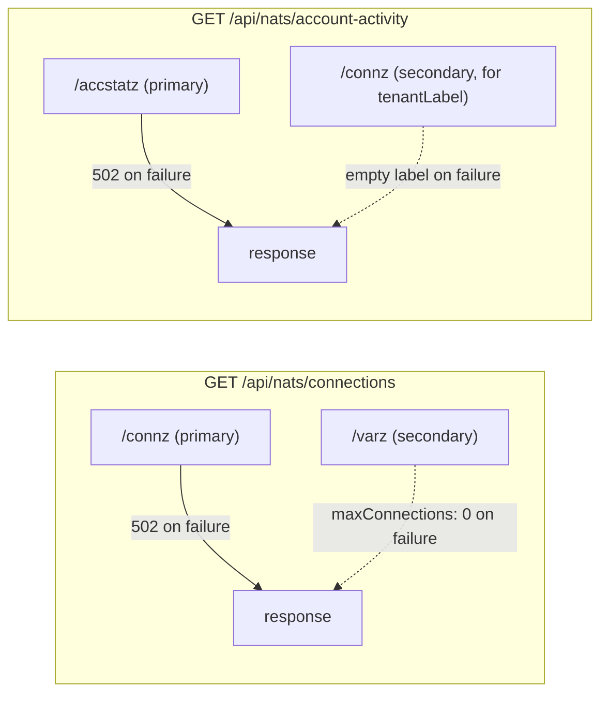

# Admin UI — SYSTEM → NATS Navbar Group

Scope: the eight panels nested under `frontend/admin`'s SYSTEM → NATS nav
group — Connections, Services, Account Activity, Log, Request/Reply,
Streams, KV Buckets, CQRS Shapes (`frontend/admin/src/App.vue`'s `sections`
array, `eyebrow: 'NATS'`). These are the Admin UI's *observability* surface:
every one of them is read-only, reaches across every NATS account this
backend can see rather than just the active tenant, and exists so an
operator can answer "what's actually happening on this deployment?" without
opening `nats` CLI or a raw `:8222` curl.

This doc is the architecture **and** UI-design reference for that group
specifically — it complements, rather than replaces, the docs that already
own deeper pieces of it:

- [ARCHITECTURE-COMMUNICATIONS.md](ARCHITECTURE-COMMUNICATIONS.md) §6 owns
  the `obs.rpc.*`/`obs.api.*` wire protocol Request/Reply observes, §11 owns
  Connections' account-label resolution, §12 owns the cross-account
  diagnostic-scope argument Streams/KV Buckets (and Connections/Services)
  all share.
- [ARCHITECTURE-ACCOUNTS.md](ARCHITECTURE-ACCOUNTS.md) owns the NATS
  operator-mode trust chain and the "two PLATFORM connections" split that
  determines which credential each snapshot endpoint uses.
- [ARCHITECTURE.md](ARCHITECTURE.md) owns the CQRS shape taxonomy (Shape
  A/B/C) that the CQRS Shapes panel visualizes.

What's genuinely new here, and not written down anywhere else: the shared
**UI design system** these eight panels all draw from (§2), the three
recurring **backend data-flow archetypes** they mix and match (§3), and —
for the two panels where a real design argument happened — the **design
history** of how each panel arrived at its shipped shape, including the
alternatives that were rejected and why (§4.1, §4.3).

---

## 1. Panel index

| Panel | Nav key | Component(s) | Backend endpoint(s) |
|---|---|---|---|
| Connections | `connections` | `ConnectionsPanel.vue` | `GET /api/nats/connections` |
| Services | `services` | `ServicesPanel.vue` | `GET /api/nats/services` |
| Account Activity | `account-activity` | `AccountActivityPanel.vue` | `GET /api/nats/account-activity` |
| Log | `log` | `LogPanel.vue` | `GET /api/nats/log` |
| Request/Reply | `rpc` | `RpcPanel.vue`, `SubjectPath.vue` | `GET /api/rpctrace/replay` + live `obs.api.>`/`notify._platform.rpctrace.entry` |
| Streams | `streams` | `JetStreamPanel.vue`, `StreamView.vue` | `GET /api/jetstream/streams`, `GET /api/jetstream/replay` |
| KV Buckets | `kv` | `KvInspector.vue` | `GET /api/kv/buckets`, `GET /api/kv/buckets/{account}/{bucket}/entries` + live `notify.*.kv.{bucket}.>` |
| CQRS Shapes | `shapes` | `ShapePanel.vue` ×2, `ShapeCPanel.vue` | KV notify (A/B), `GET /api/shape-b/ships/*`, `GET /api/shape-c/fleet` |

All eight are wired in `App.vue`'s `<template>` as `v-else-if="activeView === '<key>'"` sections; the six that manage their own internal scroll region (Connections, Services, Account Activity, Request/Reply, Streams, KV Buckets) render inside `class="group group--flush"` so their content fills the remaining viewport instead of being capped at page height. Log and CQRS Shapes render as plain (non-flush) `group` sections.

---

## 2. Shared UI design system

Every panel here is built from `shared/unifi-theme/` tokens and
`shared/ui-shell/AppShell.vue` — this repo's one visual identity, not a
per-panel invention (see CLAUDE.md's "Frontend Design System" for the
tokens/layout API). What's specific to *this* navbar group is how those
tokens compose into four recurring layout patterns, one recurring
summary-card rule, and one color vocabulary.

### 2.1 Four recurring layouts

1. **Card list** — Services, Account Activity. A vertical stack of
   `.svc-card`/`.acct-card` rows: a status dot, a name, optional tag(s), a
   row of right-aligned inline stat pairs (`<b>value</b><label>unit</label>`),
   and a chevron that expands the card in place for per-instance/per-account
   detail. Chosen because the underlying data — "a handful of named things,
   each with a few live counters, worth expanding for detail" — is the same
   shape both times; Account Activity's card is deliberately a copy of
   Services' `.svc-card`, not a new pattern (§4.3).
2. **Rail + detail split-pane** — Streams, KV Buckets (and, in its own
   idiom, Request/Reply's row-list + bottom detail). A left rail lists every
   item — streams for Streams, buckets for KV Buckets — grouped into
   collapsible `.account-group` bands, with a colored `.account-dot` (green =
   the browser's own authenticated tenant account, gray = a read-only/other
   account); selecting a row fills a detail pane on the right.
   `JetStreamPanel.vue` and `KvInspector.vue` explicitly share this CSS
   (`.account-group`/`.account-dot`/`.rail-item`) so the two "pick one thing
   from a list, inspect it on the right" panels read as one pattern rather
   than two.
3. **Plain table** — Connections, CQRS Shapes' Shape A/B/C tables, and
   Request/Reply's top row-list. A PrimeVue `DataTable`, filterable, one row
   per entity; no card, no expansion (Connections' detail opens as a bottom
   panel instead, closer to Request/Reply's pattern than to a card's inline
   expansion).
4. **Tail view** — Log, and (as a secondary element) KV Buckets' "Recent
   updates" feed below its Contents table. A scrolling, append-only list —
   full-height monospace lines for Log, a compact reverse-chronological
   `<ul>` for KV's feed — with a Live/Paused toggle and auto-scroll that only
   sticks to the bottom if the reader was already near it (Log's
   `stickToBottomIfNear`: jumping the view out from under someone who
   scrolled up to read history "would be actively hostile").

### 2.2 The "one ratio, one type size" summary-card rule

Connections, Services, and Account Activity each open with a `.summary-row`
of 3–4 cards (`.summary-card` → `.summary-label` + `.summary-value`). The
rule governing every one of them, established while building Connections'
Total card and then applied to Services and Account Activity from the
start:

- **One value per card, at one type size across the whole row** — 20px/600,
  pairs included (`N / max` ratios, `in / out` pairs). No per-card `.small`
  modifier, ever. A counter too long for its card is fixed by *shortening
  the number* (`src/format.js`'s `compactCount` → `1.2M`, exact figure
  always in the `title` tooltip) and by letting `.summary-row` wrap
  (`repeat(auto-fit, minmax(min(165px, 100%), 1fr))`) — never by shrinking
  the font. The original 4-column fixed grid left only ~94px of text room at
  a typical viewport width, which is what had forced smaller fonts as a
  workaround in the first place; fixing the grid and adding `compactCount`
  removed the need for that workaround everywhere at once.
- **A ratio card shows `value / max`, with a bar under it — never two
  stacked gauges, and never a caption whose only job is to say the healthy
  case is healthy.** Connections' Total card is `connections / maxConnections`
  (the real ceiling, from `/varz`) with a capacity bar beneath it, turning
  amber at 80%.
- **Facts that only matter in an exceptional state render only in that
  state.** Connections' "N of M shown, page P of Q" note appears solely
  when `/connz` actually paged (an amber line, with the page-size vs.
  connection-ceiling distinction spelled out in its tooltip) — not as a
  permanent "nothing hidden" caption. Account Activity's slow-consumer
  banner and per-account alarm follow the identical rule (§4.3): silent at
  zero, visible only once nonzero.

### 2.3 Color semantics

One vocabulary, reused rather than reinvented per panel:

| Meaning | Token / class | Where |
|---|---|---|
| Healthy / live / watching | `#2fbf71` green, `.dot.ok`, `watching` `Tag` | Service/account status dots, topbar connection badge, KV/Streams "watching" tag |
| Warning / approaching a limit | `--p-amber-400` amber, `.usage-warn` | Capacity bars ≥80%, `[WRN]` log lines |
| Critical / needs action | `--p-red-400`/`#f87171`, `.errv`/`.err-line`, `.dot.crit` | Slow-consumer alarm, error counts, `[ERR]` log lines, RPC error status |
| Interactive accent | `--lab-accent` `#006fff` | Nav selection, positional subject-token highlighting, active facet chips |
| Read-only / snapshot-only | muted gray, `snapshot` `Tag` | Streams' per-stream header tag (no live tail exists for that panel — see §4.6) |

---

## 3. Shared backend patterns

### 3.1 Three data-flow archetypes

Every panel's backend traffic is one of three shapes, or a hybrid of two of
them. Naming them once here avoids re-deriving "is this live?" per panel:

| Archetype | Description | Panels |
|---|---|---|
| **Poll-only** | A REST endpoint re-fetched on an interval; no NATS subscription backs it at all. | Log (4s poll), Connections/Services/Account Activity (10s poll), Streams' rail and KV Buckets' rail (15s poll) |
| **Snapshot + live notify** | One-shot REST bootstrap, immediately followed by a live NATS subscription (`notify.*` or a raw `obs.*`/`rpctrace` subject) for anything published afterward. | KV Buckets' selected-bucket detail (`notify.*.kv.{bucket}.>`), Request/Reply's `rpc.*` half (`RPCTRACE` replay → `notify._platform.rpctrace.entry`), CQRS Shape A/B rows (reuses `dictionary.js`'s existing `dict-a`/`dict-b` snapshot+notify store) |
| **Live-only** | A direct NATS subscription with no REST snapshot/replay at all — nothing to catch up on, or catching up was deliberately out of scope. | Request/Reply's `api.*` half (`obs.api.>`, live-only by design — Layer isolation means only the active tenant's traffic is visible anyway) |

**Streams is the one documented gap.** `StreamView.vue`'s own comment states
plainly that it has no live tail — a stream's message table is a plain
snapshot, re-fetched on reselect/reconnect, full stop. The *backend*
(`replay.go`)'s doc comment still describes a `notify.{context}.shipping.raw.*`
live-tail subject as the intended follow-on to the bootstrap fetch — that
capability was built for a different consumer and the Streams panel never
wired up the client-side subscribe half. Worth fixing if "watch a stream
live" becomes a real requirement; until then, Streams is poll-only in
practice, and its detail header's `snapshot` tag (§2.3) is telling the
truth, not a hedge.

CQRS Shape C is the deliberate exception to "give everything a live feed":
it's a **manual, on-demand** replay (`GET /api/shape-c/fleet`, fired on
mount and again only when the operator clicks "Reconstruct") because the
whole point of the panel is to demonstrate Fowler's Event Sourcing property
— that current state derives entirely from history — and a Reconstruct
button that visibly redoes the full replay makes that demonstration
concrete in a way a silently-live view wouldn't.

### 3.2 Primary/secondary monitoring reads

Connections, Services, and Account Activity share one backend shape even
though they proxy different NATS monitoring endpoints: a **primary** read
that the request fails on (502) if it's unreachable, and zero or more
**secondary** reads whose failure the caller absorbs rather than propagates.

`fetchMonitor` (`nats_ops.go`) is the one helper both secondary reads go
through — a plain GET-and-decode with no special error handling, used
precisely because the *caller* decides whether a given read is primary
(inline, fails the request) or secondary (`fetchMonitor` + a logged warning,
degrades gracefully). Services has no secondary read at all — `$SRV.STATS`
discovery either finds instances or doesn't, there's no adjacent monitoring
endpoint to enrich it with.

### 3.3 Cross-account, not tenant-scoped

Connections, Account Activity, Streams, and KV Buckets all read **every
account this backend reaches**, never just the active tenant — deliberately,
because "what exists / what's happening on this deployment" is a different
question from "what is this tenant's data," and forcing the former through a
tenant switch answers it one account at a time. See
[ARCHITECTURE-COMMUNICATIONS.md §12](ARCHITECTURE-COMMUNICATIONS.md) for
the full argument (written against Streams/KV Buckets, applies identically
here) and [ARCHITECTURE-ACCOUNTS.md](ARCHITECTURE-ACCOUNTS.md) § "Two
PLATFORM connections, not one" for which credential each snapshot read
actually uses (`PlatformFullJS` for listing, since `shipping-admin` is
deliberately denied `$JS.API.STREAM.LIST`).

**Services is the one exception, and its narrower scope is deliberate, not
an oversight.** It has no server-wide monitoring endpoint to proxy — `$SRV.STATS`
is a broadcast/collect protocol scoped to whichever NATS connections *this
process itself* holds, which in practice means PLATFORM (`deps.NC`) plus
the currently active tenant (`deps.TenantNC`), not every account
simultaneously. A service registered on an account this backend holds no
connection on (`accounts-service`, on the SYS account) structurally can't
appear — the same account-isolation gap Connections' label resolution hits
(§3.4), just showing up here as "doesn't appear" instead of "appears
unlabeled."

### 3.4 Account-label resolution (BR-028)

Connections, Services, and Account Activity all show a friendly account
name ("PLATFORM", "acme") instead of a raw NKey wherever this process can
resolve one — see [ARCHITECTURE-COMMUNICATIONS.md §11](ARCHITECTURE-COMMUNICATIONS.md)
for the two-tier browser-composed resolution `ConnectionsPanel.vue` uses,
and [BUSINESS_RULES-SHIPPING.md](../../../../demos/01-dictionary/BUSINESS_RULES-SHIPPING.md)
BR-028 for the backend rule both Connections and Services enforce (`tenantLabelsByAccount`,
matching this process's own connections by local socket address, then
applying that mapping by account to every row). Account Activity reuses the
identical `tenantLabelsByAccount` fan-out as a secondary read (§3.2, BR-034)
rather than inventing a second resolver — the only difference from
Connections/Services is which primary payload (`/accstatz`'s `acc` field
instead of `/connz`'s `account` field) the resolved map is applied to.

---

## 4. Panels

### 4.1 Connections

**What it shows.** Every live NATS connection on the server, across every
account — one row per socket, independent of the active tenant.

**Backend + data flow.** Poll-only, `GET /api/nats/connections` (§3.1, §3.2)
— `/connz` primary, `/varz` secondary for `maxConnections`. Account labels
resolved server-side (§3.4) then composed with a second, browser-side
resolver against `accounts-service`'s roster (COMMUNICATIONS §11).

**UI design.** Plain table (§2.1.3): filterable `DataTable`, one row per
connection, clicking a row opens a bottom detail pane (subscriptions list,
full account NKey). Summary row follows §2.2 exactly: **Total**
(`connections / maxConnections` ratio + capacity bar, amber at 80%), **TCP
(NATS)**, **WebSocket**, **Msgs In/Out** — all four at the same 20px/600
type size.

**Design history — from two gauges to one ratio.** The Total card went
through three shapes before shipping. It started as a bare count (`18`),
then grew a second, independent "page size" gauge once `/connz`'s own
`limit`/`total` paging envelope was added — two stacked bars, one for
`connections / maxConnections` and one for `shown / total-on-this-page`.
That was rejected as confusing: *"It should only show total/maximum. For
example if the maximum is 65536 and the total is 18 then we should show `18
/ 65536`."* The root problem wasn't the number of bars, it was that only one
of the two ratios was real — `/connz`'s `limit` is a page size the *client's
request* chose, not a property of the server, so pairing it with the
connection count read as a second capacity ceiling that didn't exist.
Fixed by demoting the paging fact to a conditional-only note (§2.2, "facts
that only matter in an exceptional state render only in that state") and
keeping exactly one ratio, one bar, on the Total card. See
`.claude/memory/admin_stat_card_one_ratio_rule.md` and
`.claude/memory/connz_limit_is_page_size_not_capacity.md` in the repo for
the full exchange this rule came out of.

### 4.2 Services

**What it shows.** Every service registered via `nats.go/micro`
(discovered by broadcasting `$SRV.STATS` and collecting replies, the same
protocol `nats micro stats` uses), with per-instance, per-endpoint
request/error/latency stats.

**Backend + data flow.** Poll-only, `GET /api/nats/services`. No secondary
read (§3.2) — discovery either finds instances within the fixed collection
window or it doesn't.

**UI design.** Card list (§2.1.1) — `.svc-card`: dot, name, version,
inline stat pairs (instances, endpoints), chevron. Expanding a card reveals
one row per instance, each with its own endpoint table (request/error
counts, average latency, a proportional volume bar) and a tenant tag when
the instance's `micro.Config.Metadata` carries one (BR-028, §3.4). Summary
row: **Services**, **Instances**, **Endpoints**, **Requests / Errors**
(errors rendered in the crit red from §2.3 when nonzero, otherwise plain).

### 4.3 Account Activity

**What it shows.** Per-account traffic and health — connection/subscription
counts, sent/received message and byte volume, and `slow_consumers` — from
the NATS server's own `/accstatz`. The newest panel in this group (Phase
27); nothing showed this data before it existed.

**Backend + data flow.** Poll-only, `GET /api/nats/account-activity`
(§3.2) — `/accstatz` primary, `/connz` secondary for `tenantLabel` (§3.4).

**UI design.** Card list (§2.1.1), deliberately copied from Services'
`.svc-card` rather than invented — accstatz is the same shape of data, "a
handful of named things, each with a few live counters, worth expanding for
detail." Summary row: **Accounts**, **Connections**, **Subscriptions**,
**Msgs In/Out**, following §2.2 exactly.

**Design history — placement, and the one deliberate move.** Before
building anything, three placements were compared for where this data
should live:

| Option | Shape | Why not chosen |
|---|---|---|
| Columns on the Accounts table | Add Conns/Msgs/Data columns to the existing 9-column PLATFORM → Accounts table | Pushes the table to 12–13 columns and conflates "what this account is allowed to use" (Accounts' actual job — storage/consumer limits) with "what it's doing right now" (a live server reading) |
| Alert-only banner | Nothing routine shown; a small banner in Connections only when some account has `slow_consumers > 0` | Correctly silent by default, but throws away the routine traffic numbers with no home for them |
| **New panel (chosen)** | A new "Account Activity" item under SYSTEM → NATS, one card per account | `/accstatz` comes off the same `:8222` monitor port as `/connz`/`/varz` — it belongs on the shelf with Connections/Services, not inside accounts-service's identity/lifecycle domain |

The placement argument settled, one design move was deliberate rather than
incidental: **`slow_consumers` gets no routine tile.** At zero — every
account, all day, on a healthy stack — the row says nothing about it at
all: no permanent "0 slow" stat competing with real numbers for attention,
following §2.2's exceptional-state rule exactly. The moment an account's
`slow_consumers` is nonzero: its status dot turns from `.dot.ok` green to
`.dot.crit` red, its card border tints red, its "subs" stat is *replaced* by
a red "slow" stat (not added alongside it — subs isn't the number that
matters in that moment), and expanding the card opens on a named alarm line
("N slow consumers on this account right now — a subscriber isn't draining
fast enough...") instead of a bare column. A summary-row banner mirrors the
same condition at the aggregate level. One card looking different from the
three others *is* the entire signal — see BR-034 in
`BUSINESS_RULES-SHIPPING.md` for the enforced rule and its test coverage.

### 4.4 Log

**What it shows.** A tail of NATS's own `log_file`, filterable by level
(`[ERR]`/`[WRN]`/`[INF]`/`[DBG]`/`[TRC]`) and free-text substring — a
lightweight `grep`/`tail -f` over the server's own log, not a production
log pipeline.

**Backend + data flow.** Poll-only (the one panel in this group with zero
NATS subscription at all) — `GET /api/nats/log`, re-fetched every 4s plus a
debounced re-fetch on filter change. `tail` is capped server-side at 1000
lines regardless of what's requested; at most the log file's last 8MB is
ever read from disk (the file has no rotation, per its own `nats.conf`
comment, so an unbounded read would grow with server uptime). Returns 503
if `NatsLogPath` was never configured (e.g. running outside Docker).

**UI design.** Tail view (§2.1.4): a filter bar (level select, free-text
input, tail-count select) above a monospace scrolling viewport, one line per
log entry, colored by level (§2.3: red `[ERR]`, amber `[WRN]`, default
`[INF]`, dimmed `[DBG]`/`[TRC]`). A Live/Paused toggle starts and stops the
poll; a "more matches than shown" banner appears when the 1000-line ceiling
truncated the result. Both the frontend and backend doc comments frame this
explicitly as a deliberate scope cut: REST-polled like every other panel
here rather than a push/follow transport, no general grep DSL, "a lab
convenience, not a production log pipeline."

### 4.5 Request/Reply

**What it shows.** Live `rpc.*` (backend-to-backend) and `api.*`
(browser-to-service) request/reply traffic, paired into one row per
`correlationId` so a call's request and reply — headers, payload, latency,
size, errors — read together instead of as two unrelated events.

**Backend + data flow.** A genuine hybrid, one family per NATS account
(§3.1):

- `api.*` — **live-only**: the browser subscribes directly to `obs.api.>`
  on its own tenant connection (the JWT already grants it); no replay, no
  backend involvement at all.
- `rpc.*` — **snapshot + live notify**: `GET /api/rpctrace/replay` bootstraps
  every currently-retained `RPCTRACE` entry, then a live subscribe to
  `notify._platform.rpctrace.entry` on the platform connection picks up
  anything published afterward.

This SSE-free two-subscription design (Phase 23) replaced an earlier single
merged SSE stream — see [ARCHITECTURE-COMMUNICATIONS.md §6](ARCHITECTURE-COMMUNICATIONS.md)
for the full evolution (obs.rpc.* fire-and-forget design, the `RPCTRACE`
JetStream stream added under BR-D29, headers/timestamp/payloadBytes added
under BR-D36/BR-026, `Nats-Requestor`/`Nats-Responder` identity headers
under BR-027) — that section owns the wire protocol; this one owns the
panel built on top of it.

**UI design.** Hybrid of plain table and split-pane: a filterable row-list
(Status/Family/Subject/Time/Latency/Size) on top; selecting a row opens a
bottom detail split into paired **Request** / **Reply** panes, each with a
headers table and a syntax-tinted JSON body — mirroring the channel's
actual two-message structure rather than a single-message drawer. Subjects
render via `SubjectPath.vue` as dot-separated clickable chips (the last
token styled as the "verb," bold and accented; the second-to-last as an
"id" chip), exploiting the fixed 6-token subject arity
(ARCHITECTURE-COMMUNICATIONS.md §2.2) — clicking a token adds a positional
facet-filter chip to the toolbar. Toolbar also carries free-text search,
family toggle chips (`rpc` purple / `api` blue), status toggle chips (ok
success-green / error crit-red / pending warn-amber, §2.3), and a
Pause/Resume control that freezes the *visible* row set without stopping
ingestion underneath.

### 4.6 Streams

**What it shows.** Every JetStream stream registered across every account
this backend reaches — each tenant's `SHIPPING` plus PLATFORM's `REFDATA`
and `RPCTRACE` — with full retained-message inspection per stream.

**Backend + data flow.** Rail: poll-only, `GET /api/jetstream/streams`
(15s). Detail: **snapshot-only** — `GET /api/jetstream/replay?account=&stream=`,
re-fetched on every reselect/reconnect, with **no live tail** (§3.1's
documented gap: the backend's own doc comment still describes a
`notify.{context}.shipping.raw.*` live-tail subject, but the panel's
client-side subscribe half was dropped in an earlier simplification and
never rewired). `KV_*`-backed streams are excluded so this panel doesn't
just duplicate KV Buckets next door.

**UI design.** Rail + detail split-pane (§2.1.2), CSS-identical to KV
Buckets' rail. Left rail groups streams into collapsible per-account bands;
right detail is a paginated table (Seq / event tag / Subject via
`SubjectPath.vue` / Time / click-to-expand Payload), a header line with
account/`snapshot` tags (§2.3 — genuinely a snapshot, not a hedge) and
message/byte/seq/consumer counts, and a one-line explanation of *why* this
particular account has no live tail available (mirrors KV Buckets'
`liveUnavailableReason` for cross-account rows). See
[ARCHITECTURE-COMMUNICATIONS.md §12](ARCHITECTURE-COMMUNICATIONS.md) for why
this panel is cross-account rather than tenant-scoped, and
[ARCHITECTURE-ACCOUNTS.md](ARCHITECTURE-ACCOUNTS.md) for which PLATFORM
credential the listing call uses.

### 4.7 KV Buckets

**What it shows.** Every registered KV bucket across every account reached
— every tenant's `dict-a`/`dict-b`/`container`/`meta` plus PLATFORM's
refdata caches — contents snapshot plus a genuinely live "recent updates"
feed for the selected bucket.

**Backend + data flow.** Rail: poll-only, `GET /api/kv/buckets` (15s).
Detail: **snapshot + live notify** (§3.1) — `GET
/api/kv/buckets/{account}/{bucket}/entries` bootstraps current contents,
then a live subscribe to `notify.*.kv.{bucket}.>` picks up anything
afterward, but *only* when the selected bucket's account equals the
browser's currently-connected tenant — PLATFORM buckets (refdata-service
doesn't yet publish those `notify.*` subjects) and other tenants' buckets
(NATS account isolation) both fall back to snapshot-only, each with its own
stated reason rather than a silently stale feed.

**UI design.** Rail + detail split-pane (§2.1.2) — the pattern KV Buckets
and Streams share pixel-for-pixel. Rail is 340px wide specifically because
refdata's longer bucket names (`refdata-acme-atlantic-fleet-v1`) were
ellipsizing at a narrower width, with its own name/account filter box.
Detail pane: a header (bucket/account/`watching`-or-`snapshot` tag §2.3,
key/revision/history/byte/TTL counts), a **Contents** section — the one
table in this group that's a plain `<table>` rather than a PrimeVue
`DataTable`, sortable by key, click-a-row to expand the full JSON value —
and a **Recent updates** tail view (§2.1.4) below it: a capped,
reverse-chronological list of live PUT/DEL/PURGE events, each op
color-coded (PUT ok-green, DEL warn-amber, PURGE crit-red, §2.3).

### 4.8 CQRS Shapes

**What it shows.** The same read model — a ship's current state — built
three different ways side by side: **Shape A** (KV as the read model
directly, no Postgres), **Shape B** (KV as a write-through cache in front
of canonical Postgres, with explicit Read/Evict controls to demonstrate
cache-hit vs. miss→Postgres→backfill), and **Shape C** (pure event
sourcing — current fleet and container state reconstructed by replaying the
entire `SHIPPING` stream from `seq=1`, no KV, no Postgres at all). The shape
taxonomy itself — what A/B/C mean, and the event-sourcing-vs-CRUD design
heuristic behind picking one — is owned by
[ARCHITECTURE.md](ARCHITECTURE.md) §"CQRS Pattern — Code Mapping"; this
section covers only the Admin UI panel built on top of it.

**Backend + data flow.** Three different archetypes, one per shape (§3.1):
Shape A/B rows reuse the same snapshot+notify KV store (`dictionary.js`)
KV Buckets is built on, pre-wired to `dict-a`/`dict-b` specifically; Shape
B's Read/Evict buttons are one-shot REST calls (`GET
/api/shape-b/ships/{context}/{shipID}`, `DELETE
/api/shape-b/cache/{context}/{shipID}`); Shape C is a **manual, on-demand**
replay (`GET /api/shape-c/fleet`), fired on mount and again only when the
operator clicks "Reconstruct" — deliberately not live, because the panel's
whole pedagogical point is that current state derives entirely from
history, and a button that visibly redoes the full replay makes that
demonstration concrete: "Clear KV / Postgres, click Reconstruct: the
correct fleet still appears."

**UI design.** Plain tables (§2.1.3): Shape A and B render side by side in
a flex row (`ShapePanel.vue`, one component reused via a `shape` prop),
Shape C full-width below (`ShapeCPanel.vue`, its own collapsible section).
Shape B additionally shows a second table below a divider — the canonical
Postgres projection, which persists even after the KV cache above it is
evicted, making the cache-miss path visible rather than asserted. Ship
status color-coding (in-transit blue, docked green, at-anchor amber,
not-under-command red, restricted-manoeuvrability orange) is one map shared
verbatim across all three shapes' components, with label text resolved via
refdata rather than hardcoded — colors are a frontend concern, decoupled
from the reference-data text describing them.

---

## 5. Extending this group

Adding a ninth panel to this navbar group means, in order: (1) decide which
of the three data-flow archetypes in §3.1 fits — poll-only is the default,
reach for snapshot+notify only if genuinely-live matters and a `notify.*`
subject already exists or is worth adding; (2) if it proxies a NATS
monitoring endpoint, follow §3.2's primary/secondary split rather than
letting one flaky secondary read fail the whole panel; (3) pick a layout
from §2.1 by matching the data's shape — a handful of named things with a
few counters is a card list, "pick one from many, inspect on the right" is
a rail+detail split, anything else is a plain table — rather than
inventing a fifth; (4) apply §2.2's summary-card rule if the panel opens
with at-a-glance numbers, including its two hard rules (one type size
across the row; exceptional-state facts render only in that state); (5)
reuse §2.3's color vocabulary rather than introducing a new semantic color.
