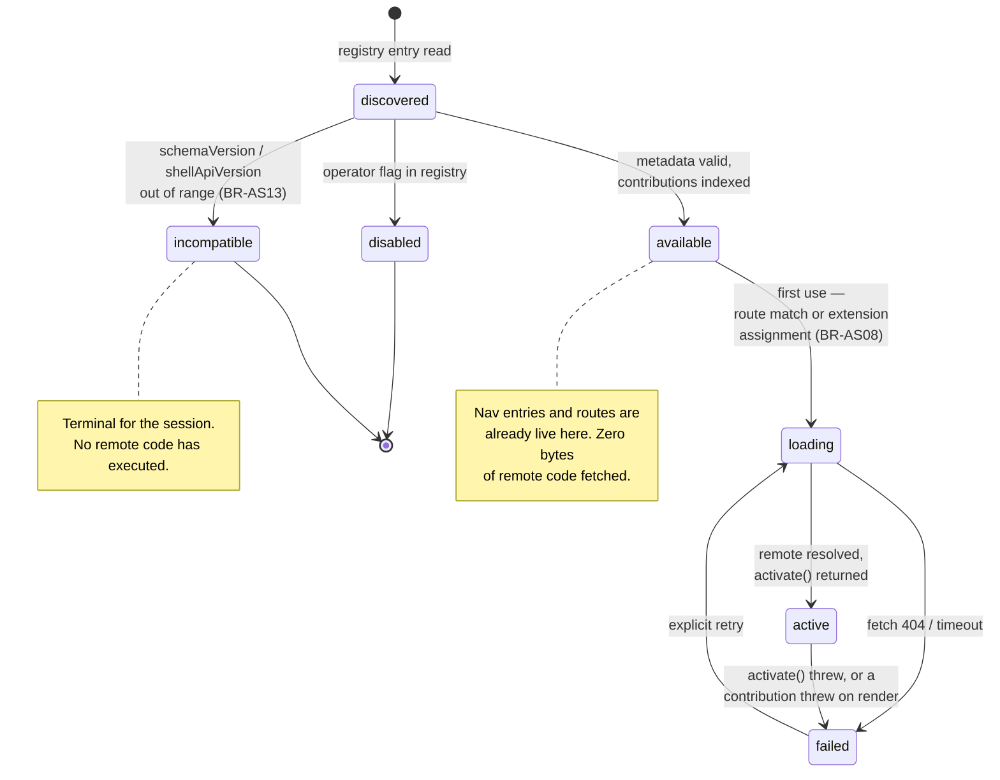
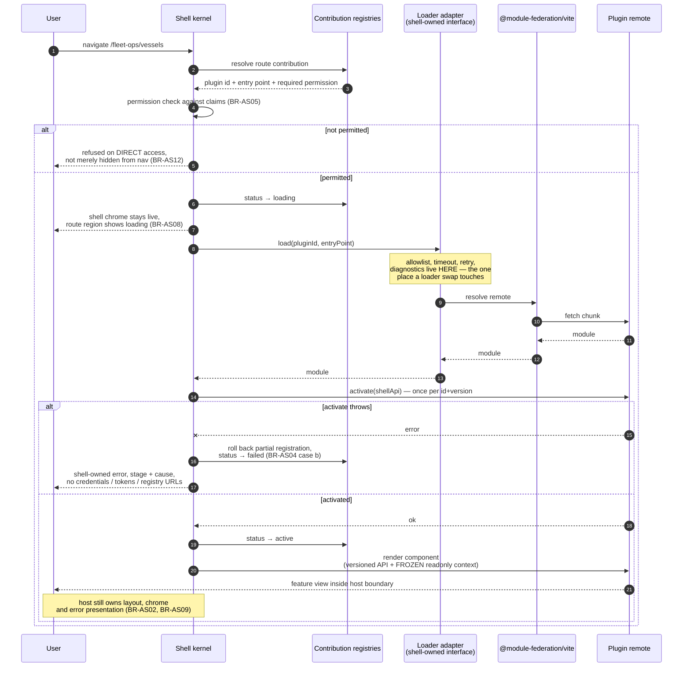
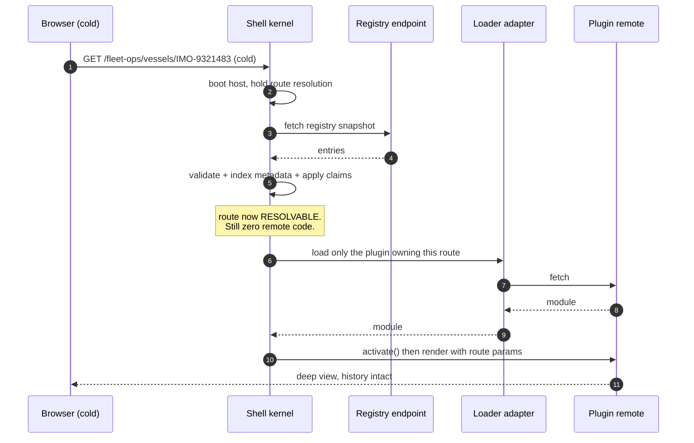
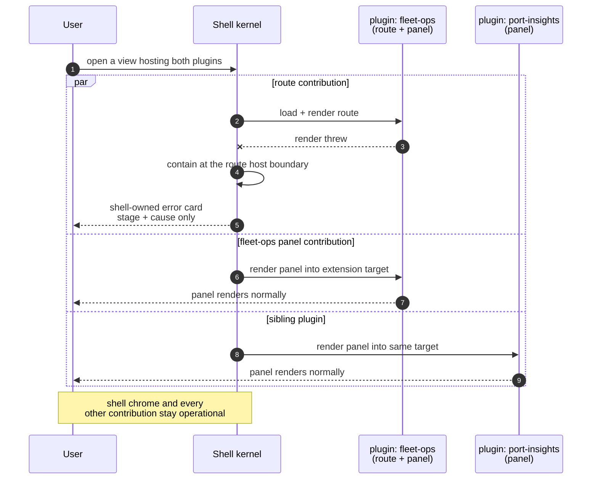
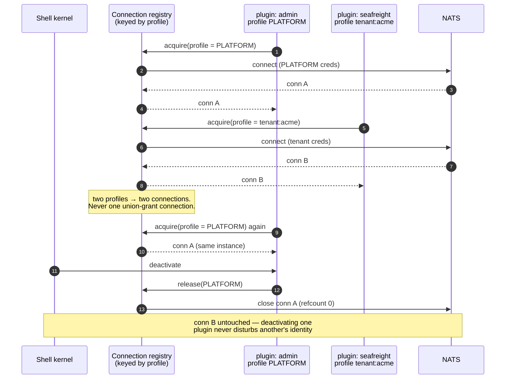
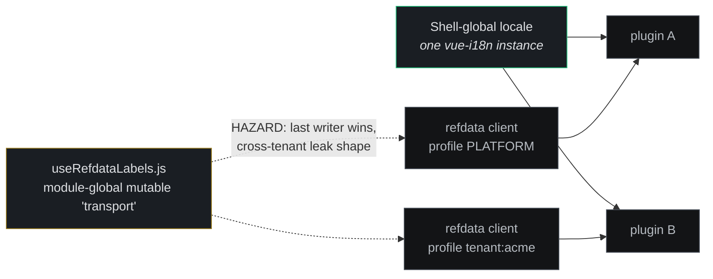

# Architecture — Application Shell

Reference for the proposed extensible frontend application shell: runtime plugin discovery,
shell-owned composition, lazy remote loading, contribution contracts, and the migration boundary
for the three existing Vue applications under
[`demos/01-dictionary/frontend/`](../../../../demos/01-dictionary/frontend/).

> **Status: Phase 1a IMPLEMENTED; Phase 2 design gate PASSED 2026-08-28.**
>
> Parts of this document now describe shipped code (the plugin contract, the contribution registry,
> the federated loader) and parts still describe a proposal — the migration of the three existing
> Vue applications is not authorized by anything here. Phase status and the business rules live in
> [Application-Shell-Microfrontend-Plan.md](../../../../.claude/plans/Application-Shell-Microfrontend-Plan.md)
> and [BUSINESS_RULES-APP-SHELL.md](../../../../demos/01-dictionary/BUSINESS_RULES-APP-SHELL.md);
> read those for what is built, not this line.

For the source discussion, see
[application-shell-microfrontend-chat.md](../../../../lab-shell/application-shell-microfrontend-chat.md).
For the formatted review, see
[Application-Shell-System-Design-Review.docx](../../../../lab-shell/Application-Shell-System-Design-Review.docx).

---

## System context


> Editable source:
> [application-shell-overview.html](../../../../lab-shell/diagrams/application-shell-overview.html)
> — hand-authored HTML + inline SVG, not a Draw.io workbook page, so
> `./diagrams/export-png.sh` does **not** regenerate it. Re-export from the repository root with:
>
> `node demos/01-dictionary/diagrams/export-html-png.mjs \
>   lab-shell/diagrams/application-shell-overview.html \
>   obsidian/V3-Platform/Architecture/Dictionary-POC/images/application-shell-overview.png \
>   1024 --clip=".wrap"`
>
> The 1024px width is the geometry reviewed by the SVG layout audit. The
> `--clip=".wrap"` argument is required to keep the export bounded to the diagram page.

The diagram carries proposed rules `BR-AS01`, `BR-AS02`, `BR-AS04`, `BR-AS08`, `BR-AS09`,
`BR-AS10`, `BR-AS12`, and `BR-AS13`. These identifiers remain proposed until the design gate is
approved and a dedicated application-shell business-rules document is created.

---

## Architectural intent

`lab-shell/` becomes the permanent host rather than another application beside the existing
frontends. It remains Vue 3 + Vite and retains the repository's shared UniFi presentation system.
The host begins with no service-specific feature imports: a curated registry declares which
compatible frontend plugins exist and what they contribute.

The governing invariant is **metadata before code**. The shell must know a plugin's stable identity,
contract compatibility, permissions, routes, navigation, and extension assignments before it loads
that plugin's executable remote module. A route match or active extension assignment then triggers
the remote loader on first use.

This is a trusted first-party plugin model, not a browser sandbox. Runtime discovery removes the
need for host source changes and coordinated rebuilds; it does not make arbitrary remote JavaScript
safe.

### Ownership boundaries

| Concern | Owner | Architectural consequence |
|---|---|---|
| Application frame | Shell | Exactly one `AppShell`, topbar, sidebar, content region, footer outlet, and bottom-right sidebar toggle |
| Global UI providers | Shell | One router, Pinia root, PrimeVue setup, UniFi preset/theme state, toast outlet, locale selection, and global error boundary |
| Plugin discovery | Platform-controlled registry | Only curated, allowlisted metadata may nominate executable frontend code |
| Contribution placement | Host of the route or extension point | The host owns layout, capacity, ordering, target version, and readonly contextual data |
| Feature components and state | Plugin | Plugins own domain UI, namespaced stores, endpoint adapters, watchers, and cleanup |
| NATS credentials and connections | Plugin runtime profile | Admin, Operator, and SeaFreight identities stay separate; migration cannot widen or merge them |
| Backend authorization | Service and NATS permissions | Shell visibility and route guards improve UX but never replace server-side enforcement |
| Design system | `shared/unifi-theme` and `shared/ui-shell` | Plugins consume the common visual system; they do not mount a nested shell or replace global providers |

---

## Shell structure

### Shell kernel

The kernel boots once and owns the application-wide facilities that cannot safely be duplicated:

- Vue Router and browser history;
- the root Pinia instance;
- PrimeVue configuration and the shared UniFi preset;
- theme state, toast outlet, and global locale selection;
- authorization gates and shell diagnostics;
- global load, activation, and render error boundaries.

The shell therefore supplies a stable runtime environment to feature remotes. A plugin contributes
feature components and metadata; it does not call `createApp`, install another router, mount another
`AppShell`, or register competing global providers.

### Curated frontend plugin registry

The registry is an aggregated, versioned contract under platform control, **served at runtime by an
operator-curated NATS `api.*` endpoint on `mfe-registry-service`** (Phase 4, 2026-08-30; split out of
`accounts-service` on 2026-08-31). It is deliberately not a
JSON file inside the shell's bundle: that would make BR-AS03 only nearly true, since adding a plugin
would still require redeploying the shell's deployment unit.

`accounts-service` was the original owner because it was already the context-free service
administering the platform/tenant axis, and already owned the auth and token lifecycle supplying the
permission claims that gate the registry's entries. What the split showed is that only the *second*
half of that argument was load-bearing, and that it never required co-location: **credential minting
stayed in `accounts-service`, which still names the registry's subjects when it mints the shell's
and the operator's browser grants (BR-AS25/AS27).** Those subject literals now live in
`shared/mferegistry`, read by the service that serves them and the service that grants them, so the
two cannot drift apart across the new boundary — drift is exactly what
`TestShellReadIsUngatedAndEverythingElseIsNot` exists to catch, and it now catches it across a
service boundary rather than within one process.

The move cost neither frontend a line of code. Phase 4 had already retired the registry's HTTP
surface, and NATS resolves a subject to whichever process is listening: the shell and the Admin UI
address a subject, not a host.

Its first schema contains at least:

| Field | Purpose |
|---|---|
| `schemaVersion` | Registry contract version; an unsupported major version fails closed |
| `plugins[].id` | Stable, globally unique, namespaced plugin identity |
| `version` | Exact plugin release named by the registry snapshot |
| `shellApiVersion` | Compatible shell contract range |
| `remote` | Allowlisted HTTPS entry, Module Federation name, exposed module, and export |
| `contributions.routes` | Namespaced paths, titles, component references, and permission requirements |
| `contributions.navigation` | Ordered labels, icons, route targets, groups, and permission requirements |
| `contributions.extensions` | Typed assignments to compatible, versioned, host-owned extension points |

The registry is not discovered from arbitrary NATS services and does not contain credentials. Its
permission metadata controls shell presentation and direct route access, while backend and NATS
authorization remain authoritative.

**Permission source.** The shell evaluates those requirements against the **auth-service JWT claims**
it holds for the user (BR-AS05) — one source for every plugin, independent of which NATS credential
a plugin later opens. A credential-derived source was rejected: it would require a connection before
navigation could render, breaking the metadata-before-code ordering that BR-AS08 depends on, and it
would have to reconcile four separate credential profiles (BR-AS10) into one nav decision. Hiding UI
never replaces server-side authorization; the same claims gate the server.

### Registration paths and plugin activation — Phase 8 (2026-08-31)

All paths write the same curated registry and pass the origin allowlist. They
have different authority and defaults:

| Path | Input and authority | Result |
| --- | --- | --- |
| Admin curation | Operator `api.*` writes with a revision check | Operator controls enablement and lifecycle; actor `admin`. Lifecycle editing in the Admin UI is Phase 5 work. |
| Preload | Optional mounted `registry.json` at service boot | Insert only when the id has never existed; default `static`, actor `preload`; restart never overwrites curation |
| Service announcement | Signed manifest over `rpc._platform.registry.entries.announce.v1` | Verified publisher identity, default `dynamic`; a new entry remains `announced` and withheld until operator enablement |

**Announcement is not activation.** A publisher can report its own manifest but
cannot grant itself permission to execute. An enabled dynamic entry can update
within its approved origin; an origin change returns it to `announced` until
operator reapproval. Static curation wins. Announcement is absent from browser
and operator grant lists. Phase 7 now supplies publisher verification, ownership
and commit-time trust checks; there is no verification bypass.

Browser activation is a later, separate step: the shell reads the enabled,
allowlisted registry document, validates metadata and indexes contributions.
Only first use fetches the remote and calls `activate(shellApi)`. It receives
one shared frozen object, `{ version: 1, ui: { ExtensionRegion } }`, whose `ui`
container is also frozen. Vue's component definition remains unfrozen. No
connection, credential or host registry is exposed; plugins that need NATS use
their own connection. This narrow API is not a sandbox for same-realm code.

**Two files, two owners.** Each plugin serves `public/manifest.json` to describe
its identity, version, remote and contributions. It cannot claim `source`,
`lifecycle`, `enabled` or `revision`. The operator's
`demos/01-dictionary/registry.json` is a preload wrapper containing those manifests
and optional enablement. The service supplies provenance and lifecycle defaults.
That file is also the single input to the explicit operator seeder. Editing it
and restarting does not change existing rows; use Admin curation or the seeder
for an intentional update. A plugin can later switch registration paths without
rebuilding its feature code.

**Every plugin is independently built.** The catalog is on 7112; the healthy
example on 7111; slow, activation-throws and incompatible fixtures on 7113–7115.
Each has its own package, lockfile, Dockerfile, nginx server and single `plugin`
exposure. The missing-remote fixture has no service and points to a real 404 on
7111. Compose marks the five services `com.nats-tech-lab.mfe.source=preload`.
**Manifest drift (Phase 8c).** The registry makes two outbound HTTP reads, kept apart on purpose:
`/manifest.json` for preload entries on its own schedule, and the bounded `/healthz` probes
described below (BR-AS45/61, Phase 5d, mapped by `REGISTRY_HEALTH_ORIGINS`). Drift compares a
deployed declaration against curated content; health observes availability. Neither curates. The optional
`REGISTRY_FETCH_ORIGINS` JSON map translates an already allowlisted browser
origin to a service-reachable origin; it cannot grant an origin, and missing
mappings never fall back to browser localhost. Compose supplies all five.
Each attempt is bounded to two seconds and 1 MiB, redirects are refused, and
failure gets one retry after 200 ms. Serial passes are separated by one minute.
The worker shares the service lifetime, not the startup deadline.

The domain compares manifest content without platform-owned state. Admin's
separate Manifest column reads `checked`, `drift` (differing fields named), or
`not checked` (including failed and invalid responses). Observations are held
in memory, invalidated by a curated edit, and exposed only through `EntryView`.
Refresh reads that snapshot and never initiates HTTP. Neither disagreement nor
failure writes to the catalogue or changes whether a plugin is served: the
curated copy still wins, as decisions 77/85 require.

Remote builds include their stylesheet assets in the federation expose loader
(`bundleAllCSS`). The host and catalog share `@primeuix/styled` as a singleton,
so PrimeVue widgets use the host-configured UniFi theme rather than an empty
remote theme store. Browser verification checks the existing 320px sidebar and
styled controls at 1920×1080.

The catalog owns `/demos`, `/demos/:id` and
`demo-catalog/details-sidebar/v1`. It saves the API in module scope and exports
a plugin-local `ExtensionRegion` wrapper for nested views. The demo README stays
a `?raw` import in this package and is copied only into this image. The host
imports no catalog code, names no plugin and has no `builtin` loader path.
If discovery fails, native Home and Plugins render with the failure reason and
zero plugins. A later failed read preserves already-discovered contributions.

### Focused contribution registries

The shell maintains separate registries for routes, navigation, topbar controls, footer content,
and named extension assignments. This keeps each contribution kind explicit and independently
validated instead of building one untyped global bag.

Every plugin and contribution ID is namespaced. Duplicate IDs or incompatible contribution shapes
reject the conflicting entry without blocking valid siblings. Ordering is deterministic and comes
from accepted registry metadata rather than remote activation timing.

### Host-owned extension points

An extension point belongs to the shell or feature screen that renders it. Its owner declares:

- a stable, versioned target ID;
- the accepted contribution type;
- layout and capacity rules;
- deterministic ordering behavior;
- the readonly context exposed to contributors;
- any permission or visibility constraints.

Plugins cannot query for arbitrary DOM elements and attach themselves. The host chooses where and
how a contribution renders, which preserves accessibility, visual fidelity, and local layout
ownership.

### Shell-owned remote loader

Module Federation is an implementation mechanism behind a shell adapter, not the application
architecture itself. The loader resolves only registry-approved remotes and activates each accepted
plugin once per plugin ID and version.

The adapter provides one place for allowlists, timeouts, diagnostics, retry behavior, compatibility
checks, and future loader replacement. Plugin code remains lazy: declaring navigation or a route
does not download or execute its implementation.

---

## Phase 5 — as built (2026-09-01)

Designed 2026-08-31 (14 approved decisions), built 5a–5e over 2026-09-01. Canonical rules
**BR-AS52–65** and the now-implemented test matrix live in
`demos/01-dictionary/BUSINESS_RULES-APP-SHELL.md`. Totals: registry Ginkgo **358/358, 0 Skipped**;
`shared/natsready` 6/6; lab-shell Vitest **480/480**; Admin Vitest **335/335**.

**One limitation, stated plainly:** the live 1920×1080 walkthrough — stop a service and watch the
signal move, restart and watch it recover, lose telemetry and watch it go stale — is not covered by
any unit spec and has not been run. The NATS grant changed, so the stack needs
`docker compose down -v && docker compose up --build` before health works in Docker.

The sections below describe what the code does. Where a promise is deliberately NOT made — resource
disposal, callback cancellation, component state surviving a withdrawal — it is called out.

### Lifecycle and authority

Lifecycle is explicit platform metadata, independent of source. Legacy unclassified entries become
static without changing enabled state or publisher-signed bytes. Operator class edits take effect
on reload; a running shell continues using its admitted class. Native Home/Plugins views remain the
fallback, not a special set of static plugins.

| Event | Admitted static plugin | Admitted dynamic plugin |
| --- | --- | --- |
| Operator disable | Keep content, offer reload | Withdraw contributions live |
| Accepted signed publisher unregister | No live withdrawal; static curation remains authoritative | Withdraw contributions live, preserve operator approval |
| Service stop / failed health / lost NATS connection | Decorate only | Decorate only |
| Unchanged authorized return | Retract obsolete reload offer under existing rules | Restore cached contributions without activating twice |
| Changed runtime definition | Offer reload | Offer reload, no hot replacement |
| Operator class edit | Offer reload, retain admitted class | Offer reload, retain admitted class |
| Publisher/key security revocation | BR-AS49 forced reload | BR-AS49 forced reload |

Publisher availability is separate persisted state from operator enablement. The new service-only
unregister command must bind the signed action, plugin/publisher identity and replay-ordering data;
reuse Phase 7 ownership/trust checks, including at commit. Retain rows, history and operator approval.
An owned, trusted return within the approved origin may clear publisher withdrawal, never operator
disable. Cross-origin return requires operator approval. Persist ordering across unregister/return
and restart; transaction specs cover concurrent disable and trust revocation. Exact transport schema
and subjects are specified before implementation, through shared builders and narrow grants.

The shell acts on authoritative disable/unregister state, never on an entry merely missing from a
filtered or degraded read. Security revocation wire tombstones retain their existing precedence,
including on degraded reads. They are distinct from the new UI tombstone for an occupied route.

### Withdrawal and restoration

Withdrawal removes owned navigation, routes for new navigation, extension placements, controls and
footer items; retains the loaded module and activation result; and records `withdrawn`. Import or
activation completing late cannot register withdrawn contributions. Duplicate events are idempotent.
Full `scope.dispose()`, callback cancellation and JavaScript isolation are outside this phase.

The occupied route stays at the same URL with a shell-owned explanation and link back. New navigation
cannot enter it. Unchanged authorized return restores contributions and the route without a second
activation; a never-loaded plugin remains lazy. Version, remote, contract, permission, label/order,
route or contribution changes require reload. Control/signature/health metadata is compared separately
from runtime definition, without bypassing trust or held-class checks. Component/form state is not
promised to survive withdrawal.

If a withdrawn plugin owns a slot, only placements into that slot suspend. Their contributors remain
active elsewhere; eligible placements return exactly once when the unchanged slot returns. Withdrawing
an owner must not withdraw its contributors or affect unrelated host-owned slots.

### Independent health observations

The registry centrally probes frontend `GET /healthz` and configured backend NATS readiness subjects,
then shares read-only snapshots/update hints with shells. Frontend HTTP reuses BR-AS45's explicit
allowlisted browser-origin → service-origin mapping: no redirects, arbitrary URLs, ambient proxy or
fallback to browser addresses. Frontend services need the dedicated small-response endpoint; a healthy
endpoint does not prove a browser can load JavaScript assets. Phase 8c manifest drift remains separate
and preload-only; health covers both lifecycle classes regardless of source.

Deployment configuration maps plugin IDs to backend service IDs, never manifest-supplied targets.
Absent mapping means not configured; an explicit empty list means frontend-only/not applicable. Keep
individual dependency results; any unavailable makes the backend summary unavailable, otherwise any
unknown/stale makes it unknown/stale, and all healthy makes it healthy. Presence alone is insufficient.
Subject builders/grants must keep probe RPC away from browser credentials and avoid broad registry
or `$SYS` permissions.

Each target is checked every **5 seconds**, times out after **2 seconds**, becomes unavailable after
**2 consecutive failures** and recovers after **1 success**. Counters are independent. Start unknown,
and show unknown/stale after **15 seconds** without a fresh observation, with the last-check time.
Old snapshots and hints cannot refresh it. Initial read, subscription catch-up and reconnect resync
close delivery gaps; bounded workers run off request paths and cancel/join at shutdown.

Frontend/backend status appears separately in navigation and the Plugins inventory. Health never
removes, reorders, disables or reloads content. Failures stay inline with safe codes and no unsolicited
modal, independently of existing loader errors.

**As built.** Health is its own subject (`api._platform.registry.frontend-plugins.health.v1`) with
its own hint (`notify._platform.registry.frontend-plugins.health`) and its own reply shape, carrying
no revision, no entries and no signed bytes — the checker holds a read-only `Curated` interface, so
the code that would move a revision or write an audit row is not reachable from a probe. A second
subject rather than more fields on the catalogue read, because the catalogue is signed manifests
that change on curation and health changes every few seconds; folding them would make a shell
re-read the whole signed catalogue on a five-second timer.

Ageing happens at READ time on both sides — `worker.Snapshot(now)` in Go, `signalsFor(id)` in the
browser — so a stale reading stops claiming to be current with nothing awake, and there is no
interval to leak. The browser restates `HEALTH_FRESHNESS_MS = 15_000` locally, so a registry cannot
make a browser trust a reading for longer. A cause is one short lowercase word from a closed
vocabulary (`^[a-z][a-z0-9-]{0,31}$` in the browser); hosts, ports and messages never leave the
process.

A hint is sent at most once per pass and only when the SERVED snapshot moved — two failures below
the threshold are the same news as none, and a hint every five seconds would train every shell to
ignore the one that mattered. `unavailable` renders as a warning, not a failure: the plugin has not
failed, something it depends on is not answering, and it may answer again in five seconds. In the
navigation the load-status dot wins and the health dot is `v-else-if`, because two marks in one
corner of the eye compete rather than inform.

Readiness lives in `shared/natsready`, mounted today by `refdata-service` against `db.PingContext`:
every ask runs the real check with a 2-second deadline and nothing is cached, because a service
holds its NATS connection open while its database is gone.

---

## Frontend injection lifecycle

1. **Boot the host once.** The shell initializes the router, Pinia, PrimeVue, UniFi theme, toast
   outlet, locale, authorization gates, and global error boundaries.
2. **Fetch and validate metadata.** The shell checks registry schema, unique IDs, allowed origins,
   shell API compatibility, contribution shapes, and shell-visible permissions.
3. **Index contributions.** Navigation, route, topbar, footer, and extension metadata becomes
   available without executing a remote module.
4. **Wait for first use.** A route match or active extension assignment asks for the implementation
   named by the accepted metadata.
5. **Load and activate.** The shell-owned loader resolves the Module Federation remote and activates
   that plugin exactly once.
6. **Render through a host boundary.** The selected Vue component receives a versioned API and
   readonly context. The host retains control of layout and error presentation.
7. **End the runtime.** Reload ends the browser runtime. Full plugin resource disposal remains a
   future contract; Phase 5 contribution withdrawal does not promise to close plugin-owned watchers,
   requests or NATS connections — it removes contributions and keeps the module.

The first release uses a page reload to adopt a new registry or plugin version. A browser session
therefore uses one accepted registry snapshot and never mixes policy, metadata, contract, and
executable versions.

---

## Mechanisms — stage by stage

The lifecycle above is the summary. This section is the detail: one diagram per mechanism, each
naming the rule it satisfies. Rules are in
[`BUSINESS_RULES-APP-SHELL.md`](../../../../demos/01-dictionary/BUSINESS_RULES-APP-SHELL.md)
(BR-AS01–BR-AS15, approved 2026-08-28).

### Plugin status — the seven observable states

Every plugin is in exactly one of these at any moment. The status surface in the shell renders this
machine directly; the mockups' **Plugins** artboard is its visual form.



`incompatible` and `failed` are deliberately distinct: the first means *we refused it*, the second
means *we tried and it broke*. Collapsing them would hide the case BR-AS13 exists to make visible.

---

### Stage 1–3 — Boot, discovery, and indexing

The shell paints its native Home and Plugins frame before minting a credential or
connecting (BR-AS30). It then opens its own least-privilege PLATFORM WebSocket
connection, reads the curated registry over NATS, validates every entry independently,
and indexes contribution **metadata**. Remote navigation arrives after the native
navigation; neither read fetches remote code (BR-AS08). A cold deep link initially
resolved by the catch-all is re-resolved when its admitted route arrives (BR-AS12).

```mermaid
sequenceDiagram
    autonumber
    participant U as Browser tab
    participant Shell as Shell kernel<br/>(lab-shell)
    participant Auth as accounts-service<br/>(auth claims)
    participant Reg as mfe-registry-service<br/>(registry endpoint)
    participant Idx as Contribution registries

    U->>Shell: load /
    Shell->>Shell: init router, Pinia, PrimeVue,<br/>UniFi theme, toast, locale,<br/>global error boundary (BR-AS09)
    Shell->>Idx: initialize empty contribution registries
    Shell-->>U: first paint — Home and Plugins are usable
    Shell->>Auth: GET /api/auth/shellConnectInfo
    Auth-->>Shell: short-lived lab-shell PLATFORM JWT + NKey seed
    Shell->>Shell: NATS WebSocket connect (unlimited reconnect attempts)
    Note over Shell: NATS credential is not permission-evaluator claims.<br/>The POC evaluator still grants '*'.
    Shell->>Reg: api._platform.registry.frontend-plugins.read.v1<br/>{heldRevision: null}
    alt registry unreachable or malformed
        Reg--xShell: error
        Shell-->>U: native frame stays usable; connection notice<br/>after 5000 ms down (BR-AS30)
    else registry accepted
        Reg-->>Shell: {ok, unchanged, revision, schemaVersion, entries[], degraded}
        loop per entry, independently
            Shell->>Shell: check schemaVersion, shellApiVersion,<br/>unique namespaced ID, allowed origin,<br/>contribution shapes, declared permissions
            alt entry rejected
                Shell->>Idx: mark incompatible — no fetch issued<br/>(BR-AS13, per entry not per registry)
            else entry accepted
                Shell->>Idx: register contribution METADATA<br/>(route, navigation, extension,<br/>shell-control, shell-footer)
            end
        end
        Shell->>Idx: filter by claims (BR-AS05)
        Idx-->>Shell: nav tree, route table,<br/>extension assignments
        Shell-->>U: full chrome + nav rendered<br/>0 remote entry points fetched
    end
    Shell->>Reg: subscribe notify._platform.registry.frontend-plugins.changed
    Shell->>Reg: conditional catch-up read after subscription flush
    Note over Shell,Reg: Notify is a hint only. Every reconnect reads unconditionally.<br/>No focus/interval polling and no HTTP fallback.
```

**Ordinary-change behavior:** the snapshot is almost frozen for the session, and the exceptions
are precise (decision 46). BR-AS49 security revocation forces reload. Phase 5 added dynamic
withdrawal and return as described above, so as built there are exactly three ordinary differences
a running shell applies to itself: **a new plugin id, a withdrawal, and an unchanged return.** Everything else a
later read carries — a changed label, order, route prefix, permission, version, remote or
contribution list, or a withdrawn entry — is offered as a reload and never applied, because the
status machine has no transition out of `active` and re-placing a plugin already mounted would
tear it down under the user.

That keeps the guarantee the frozen-snapshot wording was protecting: an id the shell has already
admitted keeps exactly the policy, metadata, contract and executable version it was admitted
with, for the life of the session. What a live addition can do is add an id that was not there.
Anything less than this whitelist would be unsound rather than merely conservative, because the
write path replaces a whole entry: one transaction that edits plugin A and adds plugin B arrives
as a single document, and a shell that applied only the addition would hold a catalog that
existed at no revision on the server.

Comparison is a deep equality over the **validated** manifest, so both sides are normalised the
same way — a raw entry and its validated form differ in defaulted and derived fields, and
comparing the two forms directly would report every plugin as edited on every read.

---

### Stage 4–6 — First use: lazy load, activate once, render

Nothing below happens until a route matches or an extension target becomes active. `activate()` runs
**at most once per plugin ID and version** regardless of how many contributions that plugin has or
how often the user navigates back to them.



---

### Deep link into a not-yet-loaded remote

A cold load directly at a plugin route must work without having first visited the shell root. This
is the stage ordering that makes it possible: discovery and permission evaluation both complete
before any remote is needed, so the route is *known* before it is *loadable* (BR-AS12).



Sibling plugins are untouched — one deep link loads exactly one remote.

---

### Failure isolation at contribution granularity

BR-AS04 is isolation per *contribution*, not per plugin. A plugin whose route fails still renders
its sound panel elsewhere. This is the mechanism the **Failed** mockup artboard depicts.



Registration is transactional enough that a failed activation cannot leave half-installed routes,
navigation entries or extension assignments behind.

---

### Host-owned extension points, including the cross-owner case

A region's **owner** declares it, versions it, sets order and capacity, and freezes the context it
passes. Contributors fill targets; they never choose where a target lives (BR-AS07). The case worth
diagramming is the one a shell-only proof would miss: a target owned by a **federated feature**,
filled by two independent remotes.


Context is frozen on the way in: a contributor mutating it affects neither the host nor any sibling.
A target declaring capacity N renders at most N contributions and **reports** the overflow rather
than silently dropping it.

---

### Credential-scoped connection lifecycle

The shell never opens a business NATS connection on a plugin's behalf. Connections are keyed by
permission profile, so two plugins on the same profile share one and two plugins on different
profiles get two — never a union grant (BR-AS10). Teardown is part of the contract, not a hope.



Tech Lab Operator is the case that proves the design: it is the only app holding **two** profiles
simultaneously (PLATFORM `refdata-admin` and a tenant Organizations connection), which is why it
migrates last.

---

### Locale versus refdata content

Locale belongs to the **person**; refdata content belongs to the **credential**. Splitting them along
that line is what lets locale stay shell-global while refdata clients stay credential-scoped
(BR-AS11).



The hazard is not a migration nicety — two plugins on different credentials would silently share one
transport. It must be fixed **before a second plugin exists**, which places it in Phase 1a.

---

## Failure and compatibility model

| Scenario | Required behavior |
|---|---|
| Registry is unavailable or malformed | Render native Home and Plugins, with an explicit registry diagnostic and no plugin loads on an initial failed read |
| One registry entry is invalid | Reject that entry before code execution; continue with valid siblings |
| Duplicate plugin or contribution ID | Reject the conflict rather than accepting nondeterministic registration order |
| Remote load times out or fails | Render a local retryable fallback; keep the shell and sibling plugins operational |
| Plugin activation throws | Roll back partial registration and expose the failure against the stable plugin ID/version |
| Contribution render fails | Contain the error at the route or extension host boundary |
| Registry changes during a session | Index a new plugin id live; offer a reload for every other difference, and apply none of it (decision 46) |
| Shell API or extension-point version is unsupported | Reject before the remote implementation executes |

Failure isolation is architectural, not merely a visual error message. Registration must be
transactional enough that a failed activation cannot leave half-installed routes, navigation, or
extension assignments behind.

---

## Security and trust boundaries

Only platform-curated, allowlisted HTTPS remote locations may nominate executable code. Production
delivery also requires CSP, immutable versioned assets, and an approved artifact provenance or
integrity mechanism. The registry, loader, and plugin diagnostics must never log tokens, NATS
credentials, certificate material, or sensitive message payloads.

Migration preserves the current credential split:

| Frontend | Runtime identity that must remain separate |
|---|---|
| Admin | Restricted PLATFORM NATS connection plus its REST diagnostics/adapters |
| Tech Lab Operator | PLATFORM `refdata-admin` connection plus a distinct tenant connection for Organizations |
| SeaFreight Flow | Tenant-account connection that reconnects when tenant selection changes |

The plugin system must not turn convenience into privilege aggregation. A shared connection broker
may coordinate lifecycle mechanics in the future, but it cannot substitute a broader credential for
the profiles above.

### The three trust gates (Phase 7, as built 2026-08-31)

An entry that no operator typed in passes **three independent gates**, in this order, all three in
the service and none in the browser (BR-AS36):

1. **Ownership** — does this publisher own this plugin id? Checked first and on its own cause,
   because a valid signature over someone else's id is a different failure from a bad signature and
   an operator must be able to tell them apart (BR-AS46).
2. **Signature** — do the signed bytes verify against a key that is *trusted and enabled* right now?
   Retired keys still verify; revoked ones do not (BR-AS35, BR-AS38).
3. **Release** — is this release number higher than the highest already accepted for that id? Lower
   is refused, equal is a no-op so a retry is safe (BR-AS47).

The gates are re-checked where the write commits, not only where it was verified: the publisher's
key state is read again inside the same transaction that checks the document revision, so a key
revoked in the gap fails the write (BR-AS48). The lock order is always `publisher_revision` then
`registry.revision`; the announce path takes only the second, so the two cannot deadlock.

**What signing does not cover.** A signature proves *who published a manifest*, and nothing else. It
does not say what the code does — a trusted publisher shipping hostile code is trusted hostile code.
It does not cover the remote the manifest points at: those bytes are unsigned and unchecked, and the
BR-AS20 origin allowlist, not the signature, is what bounds where code may come from. It does not
bind the announcing service's identity, deliberately (gate question 1): ownership already stops a key
speaking for another plugin, and the release counter already stops replay, so binding the announcer
would buy nothing and would rule out handing a signed manifest to an operator to place by hand. And
the publisher keypair is deliberately not the NATS account trust chain — a leaked publisher key
cannot connect to NATS as anything.

### What revocation does, and what it does not promise

Revoking a key withholds, in the same transaction, every entry that key signed (BR-AS38). Withheld is
its own column, not a flavour of `enabled = false`: `disabled` means "not reviewed yet" and `withheld`
means "we withdrew this", and only the second unloads anything. **Revocation is bulk and automatic;
restoration is one entry at a time and manual** — re-enabling the key restores nothing by itself.

A withheld entry is served to the shell as a **tombstone** — `{id, withheld: true}`, with no remote,
no manifest and no contributions — carried *in the document*, not in the change notification. A
notify is fire-and-forget and recovered by the next unconditional read; a revocation must not depend
on a message arriving. The shell's diff reports a tombstone for a plugin it is running as a `forced`
reload, and the banner takes it rather than offering it, overriding the rule that a `static` plugin
is never unloaded under the user (BR-AS49).

**Stated as plainly as the rule deserves: the only promise is that the plugin stops at the next
paint.** An in-flight callback is not interrupted. A timer already scheduled still fires. Anything
the plugin wrote into shared state stays written. This is **not runtime isolation** and must never
be described as such — the plugin's code runs in the shell's own page, and the whole of the
containment is that the next page load will not include it. Anyone who needs more than that needs a
different mechanism, not a stronger reading of this one.

### The degraded read

With Postgres unavailable the read falls back to the NATS KV cache rather than failing, because
refusing would turn a rare security event into a routine availability outage — one database restart
would drop every shell to its native frame. Two properties make that safe enough to ship (BR-AS51):

- **Cache writes are monotonic.** `domain.SupersedesCached` refuses a lower revision, and the KV
  write is a compare-and-swap loop on the revision it read, so a late writer cannot resurrect a
  document from before a revocation.
- **The staleness is visible, not merely bounded.** The served copy carries its revision and the time
  it was stored, and the shell shows `degraded, as of revision N`. Monotonic writes alone were
  explicitly judged insufficient: stale trust presented as current is the thing that was refused.

A degraded document may say what was **withdrawn**, never what **exists**. The shell still refuses to
diff it — an absent entry in a stale document is not evidence of a removal — but it does take the
tombstones out of it, because withdrawal is the safe direction to be wrong in. So a degraded read
raises a forced reload and never retracts a standing one.

The Admin has no degraded label, deliberately: its curated read goes straight to Postgres with no
cache in front of it, so it cannot serve a stale copy and has nothing to label.

---

## Existing frontend migration map

Each current application is initially one independently built remote. Splitting an application into
smaller remotes is deferred until measurements or ownership boundaries justify the extra deployment
surface.

| Application | Natural first contributions | Migration-specific risks |
|---|---|---|
| SeaFreight Flow | Fleet, Port Management, Pricing routes; tenant/business-unit/locale controls | Tenant reconnect lifecycle, origin-relative `/api`, `/nats`, `/files`, and `/geo` endpoints |
| Admin | Overview, Settings, Frontend Shell, Accounts, Users, Services, Connections, Pub/Sub, Request/Reply, Streams, KV, Logs, Tables, telemetry footer | Restricted PLATFORM identity, REST diagnostics, large navigation surface, footer and route-specific controls |
| Tech Lab Operator | Reference Data, Shippers, Transporters routes and contextual controls | Two NATS identities, shared refdata transport isolation, persisted context and locale behavior |

The recommended migration sequence is **SeaFreight Flow → Admin → Tech Lab Operator**. SeaFreight
provides a meaningful tenant-scoped proof with a smaller navigation surface; Admin exercises the
broadest shell-contribution set; Operator then validates the most sensitive multi-connection and
shared-refdata boundaries. The sequence remains an approval question, not a committed schedule.

### Repository hazards that migration must resolve

- all three current `main.js` entry points create their own Vue app and global providers;
- Pinia store ID `tenant` appears in all three applications;
- Pinia store ID `dictionary` appears in Admin and Tech Lab Operator;
- the shared `useRefdataLabels.js` module contains mutable transport state that would cross-wire
  consumers if shared as a singleton;
- each application currently assumes origin-relative service paths that need an explicit shell
  proxy or per-plugin base-URL contract;
- global i18n ownership and persisted locale/context preferences need a single migration rule;
- each app has its own cleanup semantics for watchers and NATS connections.

These are contract inputs for the independent remote proof, not cleanup work to defer until after
the applications have been combined.

---

## UI composition and fidelity

The visual shell is constrained by the existing shared implementation:

- [`shared/ui-shell/AppShell.vue`](../../../../shared/ui-shell/AppShell.vue) owns the single topbar,
  optional sidebar, main content region, footer outlet, theme toggle, and collapse state;
- [`shared/ui-shell/NavList.vue`](../../../../shared/ui-shell/NavList.vue) defines the supported
  navigation hierarchy;
- [`shared/unifi-theme/unifi.css`](../../../../shared/unifi-theme/unifi.css) and
  [`preset.js`](../../../../shared/unifi-theme/preset.js) own the UniFi surface and PrimeVue styling;
- [`shared/unifi-theme/LAYOUT.md`](../../../../shared/unifi-theme/LAYOUT.md) is the composition
  contract;
- shell and migration designs are reviewed at 1920×1080 first.

Migration preserves create/edit actions, row menus, nested tabs, secondary views, status behavior,
localization, and the one bottom-right sidebar toggle. A plugin contributes feature UI into the
frame; it does not reinterpret the frame.

### Pending regions animate

Anywhere the shell is waiting on remote code, the placeholder moves. The route panel's skeleton
rows carry a left-to-right highlight sweep; a **reserved extension point** — a region whose
contributors are known from metadata but whose chunks have not arrived — renders a soft breathing
block with a blurred radial highlight drifting across it, labelled with the contributing plugin
(`port-insights · awaiting chunk`).

The distinction matters more at an extension point than in the route panel: the route is the thing
the user just asked for and they will wait for it, while an extension point is a region they did not
ask about, filled by a third party's chunk, and therefore the likeliest place to stall silently. A
static gray block there is indistinguishable from a broken render, so it reads as a defect within a
second or two. Motion is the only cheap signal that the shell is still working.

Under `prefers-reduced-motion: reduce` every animation is dropped and the static block is what
remains — the user has explicitly asked for that trade. The implementation lives in
`lab-shell/diagrams/phase1-shell-mockups/parts/head.html` (`.skel`, `.skel-ext`) as the reference the
Phase 1b component is built from; the rule is BR-AS08.

---

## Design gate — PASSED 2026-08-28

The gate's nine questions were resolved on 2026-08-28. The full record, including the reasoning per
question, is in the plan's
["Design-gate decisions — resolved"](../../../../.claude/plans/Application-Shell-Microfrontend-Plan.md)
section. Approved rules are BR-AS01–BR-AS15 in
[`BUSINESS_RULES-APP-SHELL.md`](../../../../demos/01-dictionary/BUSINESS_RULES-APP-SHELL.md).

Settled at the gate, beyond the original nine:

| Question | Outcome |
|---|---|
| Registry production, hosting and ownership | Operator-curated endpoint, not a bundled file. Ran inside `accounts-service` through Phases 2–4; extracted to `mfe-registry-service` on 2026-08-31 |
| Permission source for shell-side gating | auth-service JWT claims held by the shell (BR-AS05) |
| Global locale vs. reference-data boundary | Locale shell-global; refdata clients credential-scoped (BR-AS11) |
| Demo catalog | Independent **federated plugin** on 7112 at `/demos`, using the public contribution API with no privileged path |
| Migration order | SeaFreight Flow → Admin → Tech Lab Operator, ordered by *credential-profile complexity ascending* |
| Test runner | Mandatory. Vitest in `lab-shell/` is Phase 1a's first task — no rule here is enforceable without it |
| Mockup gate for migrations | **Delta** mockups for Phases 10–12; capability-complete for Phase 1 only (satisfied 2026-08-28) |

Phase 1 is split: **1a** proves the contract with no remote at all (built-in `demo-catalog` as the
fixture), **1b** introduces Module Federation and the example plugin.

**No real application moves into the shell until the Phase 1b example plugin has been built,
deployed independently, and reviewed by the project owner** (BR-AS15). That plugin is the capability
review rather than a smoke test: it must contribute one of every kind — route, navigation, extension
into both a shell-owned and a built-in-owned target, route-scoped shell control, and footer — and be
able to demonstrate the `loading`, `failed`, `incompatible` and activation-throws states on demand,
so failure isolation can be seen rather than only asserted.

## As built — Phase 1a (2026-08-28, historical)

The bundled catalog and builtin adapter described in this historical section
were retired in Phase 8d; the current registration/runtime contract is above.

Phase 1a is the contract with no remote in it: every mechanism above exists and is tested, and the
only plugin is built into the shell's own bundle. What the tree actually contains, and the four
places the as-built shape differs from the design above.

`lab-shell/src/shell/` — the frame, and nothing else:

| Module | What it owns |
|---|---|
| `versions.js` | `REGISTRY_SCHEMA_VERSION`, `SHELL_API_VERSION` — the two numbers a manifest is checked against |
| `registry/manifestSchema.js` | Manifest and document validation; every rejection is a status, never an exception |
| `registry/pluginStatus.js` | The seven states and the transition table; an illegal transition throws, because that is a shell bug rather than a plugin fault |
| `registry/registryClient.js` | The fetch, its timeout, and `RemoteAllowlist` |
| `auth/permissions.js` | Claim evaluation, NATS-style wildcards, fail-closed on a malformed grant |
| `extensions/extensionPoints.js` | Declaration, capacity, version-major refusals, the read-only context handed to a contribution |
| `contributions/contributionRegistry.js` | Indexing, ordering, refusals — and no import of the loader, which is what makes "a fully indexed shell has fetched nothing" structural rather than incidental |
| `loader/pluginLoader.js` | The adapter seam, the two pre-adapter guards, activate-once, and the built-in adapter |
| `routing/shellRoutes.js` | Route contributions → vue-router records, resolved through the loader |
| `state/pluginStores.js` | `{plugin-id}/{store-id}` Pinia namespacing |
| `connections/connectionRegistry.js` | The four credential profiles, keyed and never merged |
| `bootShell.js` | The single place they meet: discovery → validation → status records → indexing |

Outside the frame: `src/plugins/demo-catalog/` (the catalog as a plugin), `src/App.vue` (the frame
component — nav built from contributions, nothing feature-specific), `src/main.js` (the one file
that names a plugin, in the built-in adapter's module map), and `tools/frameOwnership.js`.

**Four as-built deltas**, each recorded in full in the rules file:

1. **`routePrefix`** — an optional manifest field defaulting to the plugin id, so `demo-catalog`
   serves `/demos` and a migrated SeaFreight plugin can serve `/fleet`. Uniqueness across plugins is
   enforced at index time (`route-prefix-conflict`), where the other plugins are in view.
2. **Plugin-owned extension points are declared in the manifest**, not from `activate()`. This is
   what makes the cross-owner case above work without loading the owner: a contribution can be
   placed into `demo-catalog/details-sidebar/v1` while the catalog's own code has never been
   fetched. The owner segment must match the declaring plugin's id.
3. **`available → failed` is legal.** The loader refuses an uncurated remote or a missing adapter
   before any fetch begins; routing that through `loading` would show the Loading artboard's spinner
   for work nobody started.
4. **The registry endpoint is `GET /api/accounts/frontend-plugins`** on `accounts-service` — under
   that prefix for the proxy rewrite every frontend here already has, not because it is
   account-scoped. It is BasicAuth-gated like its neighbours: the document names every remote the
   shell will fetch, and that inventory is reconnaissance.

**The frame-ownership rule is checked two ways** (BR-AS09). `eslint.config.js` restricts imports
inside `src/shell/**` at edit time; `tools/frameOwnership.js` walks the real import graph, which is
what catches a bare package the pattern list cannot enumerate. Its spec includes the negative cases —
a shell module importing `MenuView`, a plugin, `demos.js`, or a PrimeVue widget — so the check is
known to fail when it should, rather than only known to pass on a tree that happens to be clean.

**Not in 1a, by design:** Module Federation and any federated remote (1b), `shell-control` and
`shell-footer` *rendering* (indexed and refusable now, rendered when a plugin contributes one in
1b), the pending-region animation component (1b, built from the mockups' `.skel`/`.skel-ext`), and
real auth claims — the permission evaluator is wired with a grant-all claim set, so the shape at
every call site is already the one Phase 10 will use.

---

## As built — Phase 1b (2026-08-28)

Phase 1b is the same contract with a real remote behind it. Nothing in `src/shell/` changed shape:
the loader gained a second adapter, and the host gained the surfaces on which a contribution becomes
DOM. The federation runtime is reachable from exactly one file.

| Module | What it owns |
|---|---|
| `loader/federatedAdapter.js` | `registerRemotes` + `loadRemote`, and nothing else. Registration is per container name, once; the host's federation identity is initialised lazily with **no** remotes. The runtime is injectable, so its specs run with no network at all. |
| `ui/PluginSlot.vue` | One contribution, rendered — the only place a plugin's component becomes DOM. Loading starts here (not at boot), both failure surfaces are caught here (chunk and render), and the error card is shell-owned text: stage and cause code, never the underlying message. |
| `ui/ExtensionRegion.vue` | A host renders a *point*; the region resolves which contributions were placed and freezes the context on every render rather than trusting its caller. |
| `ui/PendingExtension.vue`, `ui/SkeletonRows.vue`, `ui/loading.css` | The pending affordances from the mockups — the fuzzy region placeholder and the sweeping panel rows, both silent under `prefers-reduced-motion`. |
| `ui/ShellFooter.vue` | The footer bar and its `shell-footer` contributions, plus the degraded notice when the registry was unreachable. |
| `routing/navigationPending.js` | The gap a deep link opens: vue-router renders nothing while a route contribution's chunk is in flight, and for a shell whose premise is runtime features, "nothing happened" is the wrong reading of a slow remote. Raised only for plugin routes; lowered on settle *and* on error. |
| `views/HomeView.vue`, `views/PluginsView.vue` | Shell-owned screens: the host of `shell/home-main/v1`, and the plugin inventory with each plugin's status and cause. Frame, not feature — `tools/frameOwnership.js` still passes. |
| `tools/hostBundleFingerprint.mjs` | The no-host-rebuild proof: builds the host, refuses if any asset's digest moved across a plugin deployment, and refuses if the host bundle contains a plugin name, container name or remote URL. |

Outside the shell: `lab-shell/plugins/example-plugin/` — its own `package.json`, its own Vite
config, its own `node_modules`, its own dev server on 7111. The shell has never compiled it. That
separation is the *only* thing that makes BR-AS03 a measurement rather than an assertion.

**Curation is service state** (Phase 2a; NATS transport in Phase 4). It lives in the
`registry` module, its own bounded context sharing no table and no foreign key with `accounts` —
which is why extracting it into **`mfe-registry-service`** (2026-08-31: its own Postgres instance on
5437, its own PLATFORM credential `mfe-registry-service.creds`, and 7206 serving `/healthz` and
nothing else) was a deployment change rather than an untangling. Postgres (`registry.entries`, `registry.revision`, `registry.audit`) is
the source of truth; a single NATS KV entry (`mfe-registry` bucket, key
`_platform.frontend-plugins.current`) caches the whole serialized document so the shell keeps
booting through a Postgres outage; the read order is Postgres → KV → a degraded document at
revision 0. The KV bucket is `mfe-registry` (renamed with the service; a bucket name is a stream
name, so this was a `down -v` and a reseed, not a migration). The shell reads `api._platform.registry.frontend-plugins.read.v1`,
conditionally with `{heldRevision}` (`null` means unconditional); a matching healthy
revision answers `unchanged`, never a degraded one. The adapter returns `entries`
and the shell transport maps them to the existing `plugins` contract. Operator
writes name `ifRevision`, are audited accepted *and* refused, and no delete/remove
subject exists. Explicit zero is valid for the first write; absent/null yields
`revision-required`, stale yields `conflict: true` plus `currentRevision` and
`yourRevision`, and an origin refusal yields `origin-not-allowed`. Which origins a
shell may fetch plugin code from is `REGISTRY_ALLOWED_ORIGINS` — configuration, never a stored row,
so a compromised write path cannot widen the envelope it sits inside. A development remote on
`localhost` still does not belong in the platform's source: `demos/01-dictionary/registry.json`
is the input to `cmd/seed-registry`, an operator CLI that mints an Admin credential
and calls the same curated/upsert NATS subjects as the Admin UI. It is never run at
service startup.

### Phase 4 transport and capability boundary (2026-08-30)

The shell owns a fifth credential profile, `shell-platform`, which cannot merge
with either existing operator PLATFORM profile. `MintShellToken` uses the normal
ephemeral-session mint/registry path: name `lab-shell`, publish only the shell read
plus `_INBOX.>`, subscribe only the registry notify plus `_INBOX.>`. Federated code
shares the shell's realm and therefore its credential; no operator grant is present.
The Vite proxy exposes only the exact shell mint route, never all `/api/auth`.

Admin keeps its existing PLATFORM connection and gains four explicit subjects:
`api._platform.registry.entries.{curated,upsert,set-enabled}.v1` and
`api._platform.registry.audit.list.v1`. The shared error envelope retains its
`error`/`conflict` fields; registry-specific code/revision details are additive.
Both operator panels re-read on connection epochs, including a late initial mint.
All former registry HTTP routes and proxy rules are retired; **no HTTP boot fallback**.

`registrySession` waits for first paint, connects, performs the boot read, subscribes,
flushes, then catches up conditionally to close the read/subscribe gap. All results
still use `bootShell.applyRegistry`; only error storage became reactive for late
reads. Notifications install nothing, coalesce bursts, and retain a trailing read
if a later hint exceeds the completed snapshot. Every reconnect queues an
unconditional read. Failed/degraded reads clear the conditional token; recovery at
the same revision clears the degraded state. `registryWatcher.js` is deleted.
`ShellFooter` debounces down-state 5000 ms, clears immediately on recovery, and
never removes contributions. All styling reuses the existing UniFi footer tokens.

**The four failure states are curated entries, not switches.** `loading` is a six-second delay in a
separate service on 7113; `failed` is either a curated URL with no chunk behind it or an `activate()`
that throws (distinguished by cause code, not by a shrug); `incompatible` is an entry declaring
`shellApiVersion: 2`, refused on metadata with its remote never fetched. A fifth failure — a
contribution throwing while it renders — sits inside the healthy plugin, next to a working panel on
the home screen. None of them is selectable from the browser: a remote nominated by a query
parameter or a message is refused (BR-AS01), so a demo switch in the URL would contradict the rule
it exists to show.

**Two as-built deltas**, both recorded in the rules file: `remote.name` (the federation container
name, optional, defaulting to the id with hyphens turned to underscores) and `remote.module`
tolerating federation's own `./` prefix. Both are revisions of the 1a loader contract, recorded
rather than edited in silently.

### What the live review changed (2026-08-28)

Running a real remote exercised three paths no built-in plugin can reach, and each turned up a
Phase 1a defect:

- `PluginErrorView` rendered the raw error, which for a federation failure contains the remote's
  URL — a BR-AS04 leak. The route-level panel now carries stage and cause code only, matching
  `PluginSlot`.
- `PluginStatusRecord` instances were plain objects, so the Plugins inventory never showed the
  transition to `failed` that happened on first use. `bootShell` now wraps each record in
  `reactive()`; the state machine itself stays framework-free.
- The provided shell object was assembled with `{...shell, loader, ...}`, which evaluated the
  `inventory` getter once and froze it at boot. Composition is now `withRuntime()` in
  `bootShell.js`, which delegates through the prototype and keeps the getter live.

---

## As built — Phase 1b mockup-fidelity pass (2026-08-28)

The Phase 1b build satisfied the behaviour the mockups described but not the chrome they drew.
This pass closed the gap; the artboards remain the reference, and the deltas below are the parts
of the contract they implied and the rules file did not yet state.

**Registry document — two optional display fields.** A registry entry may state `version`, and the
document may state `revision`. Both are display-only: compatibility stays decided by
`schemaVersion` and `shellApiVersion` alone, and a document omitting either is served and accepted
unchanged. `accounts-service` carries them through (`LoadCuratedFrontendRegistry` +
`SetCuratedFrontendRevision`); the shell surfaces them on the Plugins screen and in the footer, so
"which build is on screen, from which curated set" is answerable without opening a console.

**Shell chrome carries plugin load/compatibility status.** These existing signals do not probe
frontend or backend availability; that is approved Phase 5 work. Three signals, all derived from
the same status records, all shell-authored:

- a **nav dot** beside a feature whose plugin is `failed` (err tone) or `incompatible` (warn tone).
  `disabled` is deliberately unmarked — an operator switch-off is not a fault.
- a **topbar aggregate** (`1 need attention`) linking to `/plugins`, silent when nothing is wrong.
- a **two-segment breadcrumb** — owner then leaf, where the owner is `Shell` for shell-owned
  routes and the plugin's curated name for a plugin route, falling back to its id. Never a URL.

**The route-level failure panel is a real retry.** `failed → loading` is a legal transition and the
loader has dropped its cached in-flight promise, so Retry re-runs the whole load rather than
reloading the page. The panel shows plugin id, version, shell API, the route contribution, the
shell-authored stage label and the cause code — and says the detail is in the console (BR-AS04).

**Placed contributions, not declared ones.** `contributions.all` excludes anything in `refusals`,
so the Plugins screen's per-plugin summary can never claim a contribution the index rejected.

Checks: `statusRollup.spec.js`, `inventoryText.spec.js`, `failureStage.spec.js`, `breadcrumb.spec.js`,
`navigationPending.spec.js`, `PluginErrorView.spec.js` (BR-AS04 denylist), and the placed-contribution
spec in `contributionRegistry.spec.js`. Rules-file detail:
`demos/01-dictionary/BUSINESS_RULES-APP-SHELL.md` § "As-built contract deltas".

---

## Related artifacts

- [Application shell plan](../../../../.claude/plans/Application-Shell-Microfrontend-Plan.md)
  — phases renumbered 2026-08-28: the three migrations are now **10, 11, 12**; the dynamic
  platform registry is **2**; the registry service and publishing lifecycle stays **6**
- [Application shell plan — ARCHIVE](../../../../.claude/plans/Application-Shell-Microfrontend-Plan-ARCHIVE.md)
  — Phase 1 (1a + 1b) in full, archived 2026-08-28 once the BR-AS15 review passed, plus the
  renumbering history. Append-only; not read into context by default
- [Application shell design discussion](../../../../lab-shell/application-shell-microfrontend-chat.md)
- [System design review](../../../../lab-shell/Application-Shell-System-Design-Review.docx)
- [Editable diagram source](../../../../lab-shell/diagrams/application-shell-overview.html)
- [Phase 1 shell mockups — working files](../../../../lab-shell/diagrams/phase1-shell-mockups/)
  (seven 1920×1080 artboards: Main, ExtensionPoints, Composition, Empty, Loading, Failed, Plugins;
  rebuild with `build.sh`, re-seed with the design canvas helper)
- [Phase 1 shell mockups — published canvas](https://claude.ai/code/artifact/2bd8787c-79a0-4e40-ac39-41429a405da3)
- [Phase 2 registry mockups — working files](../../../../lab-shell/diagrams/phase2-registry-mockups/)
  (six artboards: Main, ShellSignal, EntryEditor, AuditTrail, StaleRevision, OriginRefused —
  the four screens at 1920×1080, the two write refusals as 640×460 panel excerpts; rebuild with
  `build.sh`, re-seed with the design canvas helper)
- [Phase 2 registry mockups — published canvas](https://claude.ai/code/artifact/c7d139c4-1e7a-4ac2-9d41-cb0611409118)
- [Phase 2 registry mockups — contact sheet PNG](../../../../lab-shell/diagrams/phase2-registry-mockups/phase2-registry-mockups.png)
  (all six artboards on one 4112×3750 sheet; regenerate with `render-png.sh`, which needs a local
  Chrome — the `.dc.html` artboards wrap their body in `<x-dc>`/`<helmet>` for the canvas and do not
  render standalone, so the script reassembles them from `parts/` before shooting)
- [Canonical shell composition reference](../../../../shared/unifi-theme/app-shell-reference.html)
- [Shared layout contract](../../../../shared/unifi-theme/LAYOUT.md)
- [Shared AppShell.vue extraction plan (DONE, 2026-07-23)](../../../../.claude/plans/AppShell-Extraction-Plan.md)
  — the prior phase that produced `shared/ui-shell/AppShell.vue`, which this shell builds on
