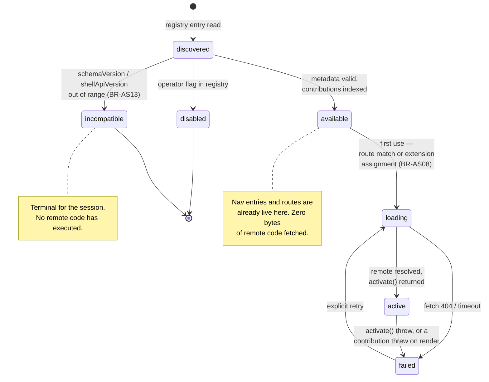
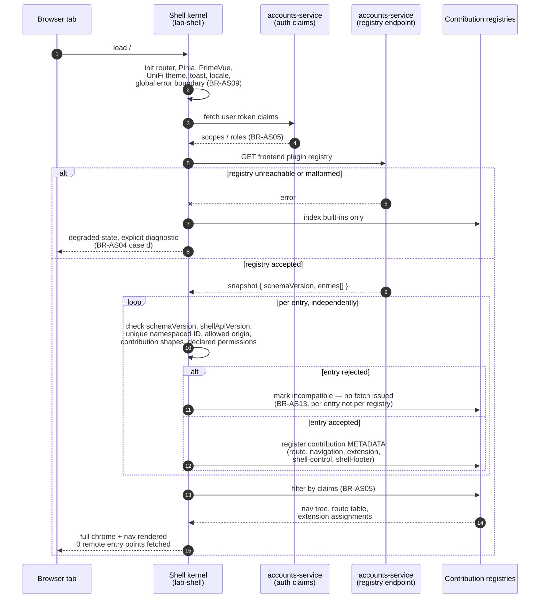
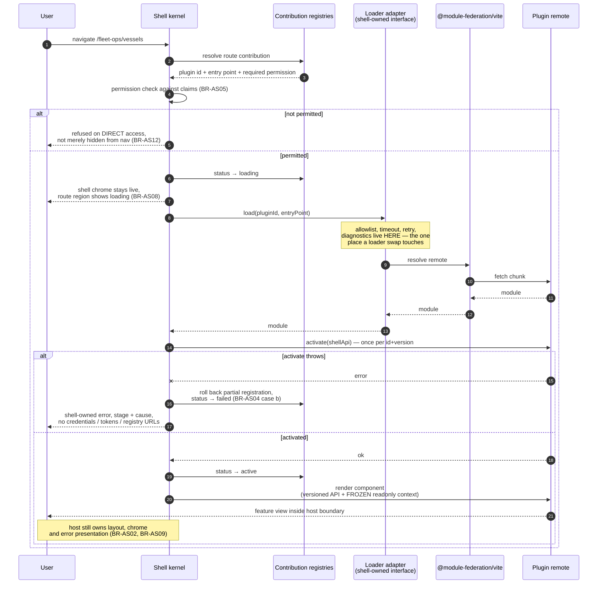
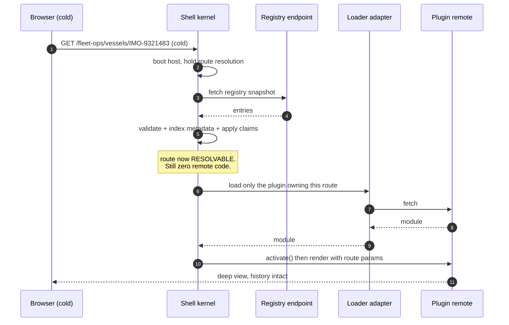
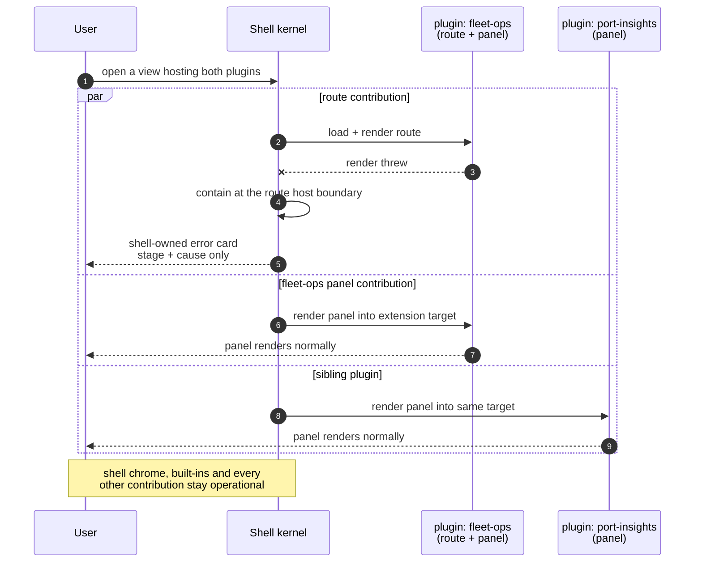
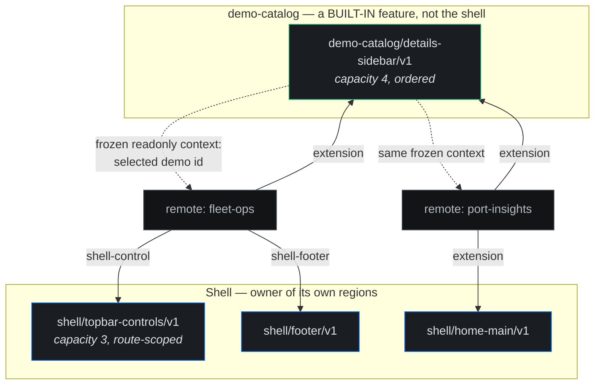
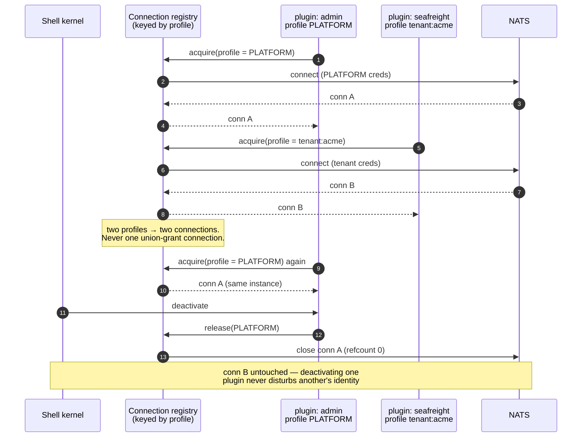
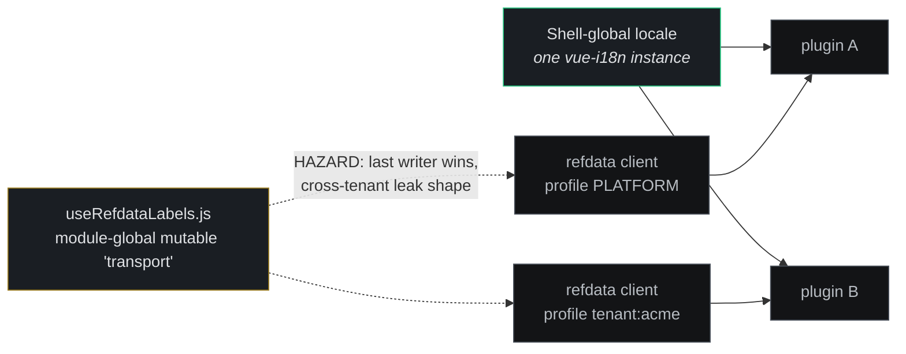

# Architecture — Application Shell

Reference for the proposed extensible frontend application shell: runtime plugin discovery,
shell-owned composition, lazy remote loading, contribution contracts, and the migration boundary
for the three existing Vue applications under
[`demos/01-dictionary/frontend/`](../../../../demos/01-dictionary/frontend/).

> **Status: Phase 1a IMPLEMENTED; Phase 2 design gate PASSED 2026-08-28.**
>
> Parts of this document now describe shipped code (the plugin contract, the contribution registry,
> the federated loader) and parts still describe a proposal — the migration of the three existing
> Vue applications is not authorized by anything here. Phase status and the business rules live in
> [Application-Shell-Microfrontend-Plan.md](../../../../.claude/plans/Application-Shell-Microfrontend-Plan.md)
> and [BUSINESS_RULES-APP-SHELL.md](../../../../demos/01-dictionary/BUSINESS_RULES-APP-SHELL.md);
> read those for what is built, not this line.

For the source discussion, see
[application-shell-microfrontend-chat.md](../../../../lab-shell/application-shell-microfrontend-chat.md).
For the formatted review, see
[Application-Shell-System-Design-Review.docx](../../../../lab-shell/Application-Shell-System-Design-Review.docx).

---

## System context

> Editable source:
> [application-shell-overview.html](../../../../lab-shell/diagrams/application-shell-overview.html)
> — hand-authored HTML + inline SVG, not a Draw.io workbook page, so
> `./diagrams/export-png.sh` does **not** regenerate it. Re-export from the repository root with:
>
> `node demos/01-dictionary/diagrams/export-html-png.mjs \
>   lab-shell/diagrams/application-shell-overview.html \
>   obsidian/V3-Platform/Architecture/Dictionary-POC/images/application-shell-overview.png \
>   1024 --clip=".wrap"`
>
> The 1024px width is the geometry reviewed by the SVG layout audit. The
> `--clip=".wrap"` argument is required to keep the export bounded to the diagram page.

The diagram carries proposed rules `BR-AS01`, `BR-AS02`, `BR-AS04`, `BR-AS08`, `BR-AS09`,
`BR-AS10`, `BR-AS12`, and `BR-AS13`. These identifiers remain proposed until the design gate is
approved and a dedicated application-shell business-rules document is created.

---

## Architectural intent

`lab-shell/` becomes the permanent host rather than another application beside the existing
frontends. It remains Vue 3 + Vite and retains the repository's shared UniFi presentation system.
The host begins with no service-specific feature imports: a curated registry declares which
compatible frontend plugins exist and what they contribute.

The governing invariant is **metadata before code**. The shell must know a plugin's stable identity,
contract compatibility, permissions, routes, navigation, and extension assignments before it loads
that plugin's executable remote module. A route match or active extension assignment then triggers
the remote loader on first use.

This is a trusted first-party plugin model, not a browser sandbox. Runtime discovery removes the
need for host source changes and coordinated rebuilds; it does not make arbitrary remote JavaScript
safe.

### Ownership boundaries

| Concern | Owner | Architectural consequence |
|---|---|---|
| Application frame | Shell | Exactly one `AppShell`, topbar, sidebar, content region, footer outlet, and bottom-right sidebar toggle |
| Global UI providers | Shell | One router, Pinia root, PrimeVue setup, UniFi preset/theme state, toast outlet, locale selection, and global error boundary |
| Plugin discovery | Platform-controlled registry | Only curated, allowlisted metadata may nominate executable frontend code |
| Contribution placement | Host of the route or extension point | The host owns layout, capacity, ordering, target version, and readonly contextual data |
| Feature components and state | Plugin | Plugins own domain UI, namespaced stores, endpoint adapters, watchers, and cleanup |
| NATS credentials and connections | Plugin runtime profile | Admin, Operator, and SeaFreight identities stay separate; migration cannot widen or merge them |
| Backend authorization | Service and NATS permissions | Shell visibility and route guards improve UX but never replace server-side enforcement |
| Design system | `shared/unifi-theme` and `shared/ui-shell` | Plugins consume the common visual system; they do not mount a nested shell or replace global providers |

---

## Shell structure

### Shell kernel

The kernel boots once and owns the application-wide facilities that cannot safely be duplicated:

- Vue Router and browser history;
- the root Pinia instance;
- PrimeVue configuration and the shared UniFi preset;
- theme state, toast outlet, and global locale selection;
- authorization gates and shell diagnostics;
- global load, activation, and render error boundaries.

The shell therefore supplies a stable runtime environment to feature remotes. A plugin contributes
feature components and metadata; it does not call `createApp`, install another router, mount another
`AppShell`, or register competing global providers.

### Curated frontend plugin registry

The registry is an aggregated, versioned contract under platform control, **served at runtime by an
operator-curated endpoint on `accounts-service`** (decided 2026-08-28). It is deliberately not a
JSON file inside the shell's bundle: that would make BR-AS03 only nearly true, since adding a plugin
would still require redeploying the shell's deployment unit. `accounts-service` is the owner because
it is already the context-free service administering the platform/tenant axis, and it already owns
the auth and token lifecycle supplying the permission claims that gate the registry's own entries —
so the registry and the claims that gate it share one owner rather than two.

Its first schema contains at least:

| Field | Purpose |
|---|---|
| `schemaVersion` | Registry contract version; an unsupported major version fails closed |
| `plugins[].id` | Stable, globally unique, namespaced plugin identity |
| `version` | Exact plugin release named by the registry snapshot |
| `shellApiVersion` | Compatible shell contract range |
| `remote` | Allowlisted HTTPS entry, Module Federation name, exposed module, and export |
| `contributions.routes` | Namespaced paths, titles, component references, and permission requirements |
| `contributions.navigation` | Ordered labels, icons, route targets, groups, and permission requirements |
| `contributions.extensions` | Typed assignments to compatible, versioned, host-owned extension points |

The registry is not discovered from arbitrary NATS services and does not contain credentials. Its
permission metadata controls shell presentation and direct route access, while backend and NATS
authorization remain authoritative.

**Permission source.** The shell evaluates those requirements against the **auth-service JWT claims**
it holds for the user (BR-AS05) — one source for every plugin, independent of which NATS credential
a plugin later opens. A credential-derived source was rejected: it would require a connection before
navigation could render, breaking the metadata-before-code ordering that BR-AS08 depends on, and it
would have to reconcile four separate credential profiles (BR-AS10) into one nav decision. Hiding UI
never replaces server-side authorization; the same claims gate the server.

### Focused contribution registries

The shell maintains separate registries for routes, navigation, topbar controls, footer content,
and named extension assignments. This keeps each contribution kind explicit and independently
validated instead of building one untyped global bag.

Every plugin and contribution ID is namespaced. Duplicate IDs or incompatible contribution shapes
reject the conflicting entry without blocking valid siblings. Ordering is deterministic and comes
from accepted registry metadata rather than remote activation timing.

### Host-owned extension points

An extension point belongs to the shell or feature screen that renders it. Its owner declares:

- a stable, versioned target ID;
- the accepted contribution type;
- layout and capacity rules;
- deterministic ordering behavior;
- the readonly context exposed to contributors;
- any permission or visibility constraints.

Plugins cannot query for arbitrary DOM elements and attach themselves. The host chooses where and
how a contribution renders, which preserves accessibility, visual fidelity, and local layout
ownership.

### Shell-owned remote loader

Module Federation is an implementation mechanism behind a shell adapter, not the application
architecture itself. The loader resolves only registry-approved remotes and activates each accepted
plugin once per plugin ID and version.

The adapter provides one place for allowlists, timeouts, diagnostics, retry behavior, compatibility
checks, and future loader replacement. Plugin code remains lazy: declaring navigation or a route
does not download or execute its implementation.

---

## Frontend injection lifecycle

1. **Boot the host once.** The shell initializes the router, Pinia, PrimeVue, UniFi theme, toast
   outlet, locale, authorization gates, and global error boundaries.
2. **Fetch and validate metadata.** The shell checks registry schema, unique IDs, allowed origins,
   shell API compatibility, contribution shapes, and shell-visible permissions.
3. **Index contributions.** Navigation, route, topbar, footer, and extension metadata becomes
   available without executing a remote module.
4. **Wait for first use.** A route match or active extension assignment asks for the implementation
   named by the accepted metadata.
5. **Load and activate.** The shell-owned loader resolves the Module Federation remote and activates
   that plugin exactly once.
6. **Render through a host boundary.** The selected Vue component receives a versioned API and
   readonly context. The host retains control of layout and error presentation.
7. **Dispose plugin resources.** Plugin-owned watchers, requests, and NATS connections close through
   the lifecycle contract when the runtime ends.

The first release uses a page reload to adopt a new registry or plugin version. A browser session
therefore uses one accepted registry snapshot and never mixes policy, metadata, contract, and
executable versions.

---

## Mechanisms — stage by stage

The lifecycle above is the summary. This section is the detail: one diagram per mechanism, each
naming the rule it satisfies. Rules are in
[`BUSINESS_RULES-APP-SHELL.md`](../../../../demos/01-dictionary/BUSINESS_RULES-APP-SHELL.md)
(BR-AS01–BR-AS15, approved 2026-08-28).

### Plugin status — the seven observable states

Every plugin is in exactly one of these at any moment. The status surface in the shell renders this
machine directly; the mockups' **Plugins** artboard is its visual form.

`incompatible` and `failed` are deliberately distinct: the first means *we refused it*, the second
means *we tried and it broke*. Collapsing them would hide the case BR-AS13 exists to make visible.

---

### Stage 1–3 — Boot, discovery, and indexing

The shell boots with no service knowledge, fetches one curated registry snapshot, validates every
entry independently, and indexes contribution **metadata**. Navigation is fully rendered at the end
of this stage with no remote code fetched — that ordering is the whole point of metadata-first
discovery (BR-AS08), and it is what allows permission gating to run before any plugin exists in
memory (BR-AS05).

The snapshot is frozen for the session. A registry change mid-session is adopted only by page
reload, so one browser session never mixes policy, metadata, contract and executable versions.

---

### Stage 4–6 — First use: lazy load, activate once, render

Nothing below happens until a route matches or an extension target becomes active. `activate()` runs
**at most once per plugin ID and version** regardless of how many contributions that plugin has or
how often the user navigates back to them.

---

### Deep link into a not-yet-loaded remote

A cold load directly at a plugin route must work without having first visited the shell root. This
is the stage ordering that makes it possible: discovery and permission evaluation both complete
before any remote is needed, so the route is *known* before it is *loadable* (BR-AS12).

Sibling plugins are untouched — one deep link loads exactly one remote.

---

### Failure isolation at contribution granularity

BR-AS04 is isolation per *contribution*, not per plugin. A plugin whose route fails still renders
its sound panel elsewhere. This is the mechanism the **Failed** mockup artboard depicts.

Registration is transactional enough that a failed activation cannot leave half-installed routes,
navigation entries or extension assignments behind.

---

### Host-owned extension points, including the cross-owner case

A region's **owner** declares it, versions it, sets order and capacity, and freezes the context it
passes. Contributors fill targets; they never choose where a target lives (BR-AS07). The case worth
diagramming is the one a shell-only proof would miss: a target owned by a **built-in feature**,
filled by two independent remotes.

Context is frozen on the way in: a contributor mutating it affects neither the host nor any sibling.
A target declaring capacity N renders at most N contributions and **reports** the overflow rather
than silently dropping it.

---

### Credential-scoped connection lifecycle

The shell never opens a business NATS connection on a plugin's behalf. Connections are keyed by
permission profile, so two plugins on the same profile share one and two plugins on different
profiles get two — never a union grant (BR-AS10). Teardown is part of the contract, not a hope.

Tech Lab Operator is the case that proves the design: it is the only app holding **two** profiles
simultaneously (PLATFORM `refdata-admin` and a tenant Organizations connection), which is why it
migrates last.

---

### Locale versus refdata content

Locale belongs to the **person**; refdata content belongs to the **credential**. Splitting them along
that line is what lets locale stay shell-global while refdata clients stay credential-scoped
(BR-AS11).

The hazard is not a migration nicety — two plugins on different credentials would silently share one
transport. It must be fixed **before a second plugin exists**, which places it in Phase 1a.

---

## Failure and compatibility model

| Scenario | Required behavior |
|---|---|
| Registry is unavailable or malformed | Start safe built-in capabilities only and expose an explicit degraded diagnostic state |
| One registry entry is invalid | Reject that entry before code execution; continue with valid siblings |
| Duplicate plugin or contribution ID | Reject the conflict rather than accepting nondeterministic registration order |
| Remote load times out or fails | Render a local retryable fallback; keep the shell and sibling plugins operational |
| Plugin activation throws | Roll back partial registration and expose the failure against the stable plugin ID/version |
| Contribution render fails | Contain the error at the route or extension host boundary |
| Registry changes during a session | Retain the accepted snapshot until a page reload |
| Shell API or extension-point version is unsupported | Reject before the remote implementation executes |

Failure isolation is architectural, not merely a visual error message. Registration must be
transactional enough that a failed activation cannot leave half-installed routes, navigation, or
extension assignments behind.

---

## Security and trust boundaries

Only platform-curated, allowlisted HTTPS remote locations may nominate executable code. Production
delivery also requires CSP, immutable versioned assets, and an approved artifact provenance or
integrity mechanism. The registry, loader, and plugin diagnostics must never log tokens, NATS
credentials, certificate material, or sensitive message payloads.

Migration preserves the current credential split:

| Frontend | Runtime identity that must remain separate |
|---|---|
| Admin | Restricted PLATFORM NATS connection plus its REST diagnostics/adapters |
| Tech Lab Operator | PLATFORM `refdata-admin` connection plus a distinct tenant connection for Organizations |
| SeaFreight Flow | Tenant-account connection that reconnects when tenant selection changes |

The plugin system must not turn convenience into privilege aggregation. A shared connection broker
may coordinate lifecycle mechanics in the future, but it cannot substitute a broader credential for
the profiles above.

---

## Existing frontend migration map

Each current application is initially one independently built remote. Splitting an application into
smaller remotes is deferred until measurements or ownership boundaries justify the extra deployment
surface.

| Application | Natural first contributions | Migration-specific risks |
|---|---|---|
| SeaFreight Flow | Fleet, Port Management, Pricing routes; tenant/business-unit/locale controls | Tenant reconnect lifecycle, origin-relative `/api`, `/nats`, `/files`, and `/geo` endpoints |
| Admin | Overview, Accounts, Users, Services, Connections, Pub/Sub, Request/Reply, Streams, KV, Logs, Tables, Settings, telemetry footer | Restricted PLATFORM identity, REST diagnostics, large navigation surface, footer and route-specific controls |
| Tech Lab Operator | Reference Data, Shippers, Transporters routes and contextual controls | Two NATS identities, shared refdata transport isolation, persisted context and locale behavior |

The recommended migration sequence is **SeaFreight Flow → Admin → Tech Lab Operator**. SeaFreight
provides a meaningful tenant-scoped proof with a smaller navigation surface; Admin exercises the
broadest shell-contribution set; Operator then validates the most sensitive multi-connection and
shared-refdata boundaries. The sequence remains an approval question, not a committed schedule.

### Repository hazards that migration must resolve

- all three current `main.js` entry points create their own Vue app and global providers;
- Pinia store ID `tenant` appears in all three applications;
- Pinia store ID `dictionary` appears in Admin and Tech Lab Operator;
- the shared `useRefdataLabels.js` module contains mutable transport state that would cross-wire
  consumers if shared as a singleton;
- each application currently assumes origin-relative service paths that need an explicit shell
  proxy or per-plugin base-URL contract;
- global i18n ownership and persisted locale/context preferences need a single migration rule;
- each app has its own cleanup semantics for watchers and NATS connections.

These are contract inputs for the independent remote proof, not cleanup work to defer until after
the applications have been combined.

---

## UI composition and fidelity

The visual shell is constrained by the existing shared implementation:

- [`shared/ui-shell/AppShell.vue`](../../../../shared/ui-shell/AppShell.vue) owns the single topbar,
  optional sidebar, main content region, footer outlet, theme toggle, and collapse state;
- [`shared/ui-shell/NavList.vue`](../../../../shared/ui-shell/NavList.vue) defines the supported
  navigation hierarchy;
- [`shared/unifi-theme/unifi.css`](../../../../shared/unifi-theme/unifi.css) and
  [`preset.js`](../../../../shared/unifi-theme/preset.js) own the UniFi surface and PrimeVue styling;
- [`shared/unifi-theme/LAYOUT.md`](../../../../shared/unifi-theme/LAYOUT.md) is the composition
  contract;
- shell and migration designs are reviewed at 1920×1080 first.

Migration preserves create/edit actions, row menus, nested tabs, secondary views, status behavior,
localization, and the one bottom-right sidebar toggle. A plugin contributes feature UI into the
frame; it does not reinterpret the frame.

### Pending regions animate

Anywhere the shell is waiting on remote code, the placeholder moves. The route panel's skeleton
rows carry a left-to-right highlight sweep; a **reserved extension point** — a region whose
contributors are known from metadata but whose chunks have not arrived — renders a soft breathing
block with a blurred radial highlight drifting across it, labelled with the contributing plugin
(`port-insights · awaiting chunk`).

The distinction matters more at an extension point than in the route panel: the route is the thing
the user just asked for and they will wait for it, while an extension point is a region they did not
ask about, filled by a third party's chunk, and therefore the likeliest place to stall silently. A
static gray block there is indistinguishable from a broken render, so it reads as a defect within a
second or two. Motion is the only cheap signal that the shell is still working.

Under `prefers-reduced-motion: reduce` every animation is dropped and the static block is what
remains — the user has explicitly asked for that trade. The implementation lives in
`lab-shell/diagrams/phase1-shell-mockups/parts/head.html` (`.skel`, `.skel-ext`) as the reference the
Phase 1b component is built from; the rule is BR-AS08.

---

## Design gate — PASSED 2026-08-28

The gate's nine questions were resolved on 2026-08-28. The full record, including the reasoning per
question, is in the plan's
["Design-gate decisions — resolved"](../../../../.claude/plans/Application-Shell-Microfrontend-Plan.md)
section. Approved rules are BR-AS01–BR-AS15 in
[`BUSINESS_RULES-APP-SHELL.md`](../../../../demos/01-dictionary/BUSINESS_RULES-APP-SHELL.md).

Settled at the gate, beyond the original nine:

| Question | Outcome |
|---|---|
| Registry production, hosting and ownership | Operator-curated endpoint on `accounts-service`; not a new service, not a bundled file |
| Permission source for shell-side gating | auth-service JWT claims held by the shell (BR-AS05) |
| Global locale vs. reference-data boundary | Locale shell-global; refdata clients credential-scoped (BR-AS11) |
| Demo catalog | Remains, as a **built-in plugin** at `/demos`, using the public contribution API with no privileged path |
| Migration order | SeaFreight Flow → Admin → Tech Lab Operator, ordered by *credential-profile complexity ascending* |
| Test runner | Mandatory. Vitest in `lab-shell/` is Phase 1a's first task — no rule here is enforceable without it |
| Mockup gate for migrations | **Delta** mockups for Phases 10–12; capability-complete for Phase 1 only (satisfied 2026-08-28) |

Phase 1 is split: **1a** proves the contract with no remote at all (built-in `demo-catalog` as the
fixture), **1b** introduces Module Federation and the example plugin.

**No real application moves into the shell until the Phase 1b example plugin has been built,
deployed independently, and reviewed by the project owner** (BR-AS15). That plugin is the capability
review rather than a smoke test: it must contribute one of every kind — route, navigation, extension
into both a shell-owned and a built-in-owned target, route-scoped shell control, and footer — and be
able to demonstrate the `loading`, `failed`, `incompatible` and activation-throws states on demand,
so failure isolation can be seen rather than only asserted.

## As built — Phase 1a (2026-08-28)

Phase 1a is the contract with no remote in it: every mechanism above exists and is tested, and the
only plugin is built into the shell's own bundle. What the tree actually contains, and the four
places the as-built shape differs from the design above.

`lab-shell/src/shell/` — the frame, and nothing else:

| Module | What it owns |
|---|---|
| `versions.js` | `REGISTRY_SCHEMA_VERSION`, `SHELL_API_VERSION` — the two numbers a manifest is checked against |
| `registry/manifestSchema.js` | Manifest and document validation; every rejection is a status, never an exception |
| `registry/pluginStatus.js` | The seven states and the transition table; an illegal transition throws, because that is a shell bug rather than a plugin fault |
| `registry/registryClient.js` | The fetch, its timeout, and `RemoteAllowlist` |
| `auth/permissions.js` | Claim evaluation, NATS-style wildcards, fail-closed on a malformed grant |
| `extensions/extensionPoints.js` | Declaration, capacity, version-major refusals, the read-only context handed to a contribution |
| `contributions/contributionRegistry.js` | Indexing, ordering, refusals — and no import of the loader, which is what makes "a fully indexed shell has fetched nothing" structural rather than incidental |
| `loader/pluginLoader.js` | The adapter seam, the two pre-adapter guards, activate-once, and the built-in adapter |
| `routing/shellRoutes.js` | Route contributions → vue-router records, resolved through the loader |
| `state/pluginStores.js` | `{plugin-id}/{store-id}` Pinia namespacing |
| `connections/connectionRegistry.js` | The four credential profiles, keyed and never merged |
| `bootShell.js` | The single place they meet: discovery → validation → status records → indexing |

Outside the frame: `src/plugins/demo-catalog/` (the catalog as a plugin), `src/App.vue` (the frame
component — nav built from contributions, nothing feature-specific), `src/main.js` (the one file
that names a plugin, in the built-in adapter's module map), and `tools/frameOwnership.js`.

**Four as-built deltas**, each recorded in full in the rules file:

1. **`routePrefix`** — an optional manifest field defaulting to the plugin id, so `demo-catalog`
   serves `/demos` and a migrated SeaFreight plugin can serve `/fleet`. Uniqueness across plugins is
   enforced at index time (`route-prefix-conflict`), where the other plugins are in view.
2. **Plugin-owned extension points are declared in the manifest**, not from `activate()`. This is
   what makes the cross-owner case above work without loading the owner: a contribution can be
   placed into `demo-catalog/details-sidebar/v1` while the catalog's own code has never been
   fetched. The owner segment must match the declaring plugin's id.
3. **`available → failed` is legal.** The loader refuses an uncurated remote or a missing adapter
   before any fetch begins; routing that through `loading` would show the Loading artboard's spinner
   for work nobody started.
4. **The registry endpoint is `GET /api/accounts/frontend-plugins`** on `accounts-service` — under
   that prefix for the proxy rewrite every frontend here already has, not because it is
   account-scoped. It is BasicAuth-gated like its neighbours: the document names every remote the
   shell will fetch, and that inventory is reconnaissance.

**The frame-ownership rule is checked two ways** (BR-AS09). `eslint.config.js` restricts imports
inside `src/shell/**` at edit time; `tools/frameOwnership.js` walks the real import graph, which is
what catches a bare package the pattern list cannot enumerate. Its spec includes the negative cases —
a shell module importing `MenuView`, a plugin, `demos.js`, or a PrimeVue widget — so the check is
known to fail when it should, rather than only known to pass on a tree that happens to be clean.

**Not in 1a, by design:** Module Federation and any federated remote (1b), `shell-control` and
`shell-footer` *rendering* (indexed and refusable now, rendered when a plugin contributes one in
1b), the pending-region animation component (1b, built from the mockups' `.skel`/`.skel-ext`), and
real auth claims — the permission evaluator is wired with a grant-all claim set, so the shape at
every call site is already the one Phase 10 will use.

---

## As built — Phase 1b (2026-08-28)

Phase 1b is the same contract with a real remote behind it. Nothing in `src/shell/` changed shape:
the loader gained a second adapter, and the host gained the surfaces on which a contribution becomes
DOM. The federation runtime is reachable from exactly one file.

| Module | What it owns |
|---|---|
| `loader/federatedAdapter.js` | `registerRemotes` + `loadRemote`, and nothing else. Registration is per container name, once; the host's federation identity is initialised lazily with **no** remotes. The runtime is injectable, so its specs run with no network at all. |
| `ui/PluginSlot.vue` | One contribution, rendered — the only place a plugin's component becomes DOM. Loading starts here (not at boot), both failure surfaces are caught here (chunk and render), and the error card is shell-owned text: stage and cause code, never the underlying message. |
| `ui/ExtensionRegion.vue` | A host renders a *point*; the region resolves which contributions were placed and freezes the context on every render rather than trusting its caller. |
| `ui/PendingExtension.vue`, `ui/SkeletonRows.vue`, `ui/loading.css` | The pending affordances from the mockups — the fuzzy region placeholder and the sweeping panel rows, both silent under `prefers-reduced-motion`. |
| `ui/ShellFooter.vue` | The footer bar and its `shell-footer` contributions, plus the degraded notice when the registry was unreachable. |
| `routing/navigationPending.js` | The gap a deep link opens: vue-router renders nothing while a route contribution's chunk is in flight, and for a shell whose premise is runtime features, "nothing happened" is the wrong reading of a slow remote. Raised only for plugin routes; lowered on settle *and* on error. |
| `views/HomeView.vue`, `views/PluginsView.vue` | Shell-owned screens: the host of `shell/home-main/v1`, and the plugin inventory with each plugin's status and cause. Frame, not feature — `tools/frameOwnership.js` still passes. |
| `tools/hostBundleFingerprint.mjs` | The no-host-rebuild proof: builds the host, refuses if any asset's digest moved across a plugin deployment, and refuses if the host bundle contains a plugin name, container name or remote URL. |

Outside the shell: `lab-shell/plugins/example-plugin/` — its own `package.json`, its own Vite
config, its own `node_modules`, its own dev server on 7110. The shell has never compiled it. That
separation is the *only* thing that makes BR-AS03 a measurement rather than an assertion.

**Curation moved to a file.** `accounts-service` reads `FRONTEND_PLUGIN_REGISTRY_FILE` at startup
(compose mounts `registry.dev.json` read-only) and falls back to the compiled-in set when the file
is missing or malformed, logging rather than failing to start. A development remote on `localhost`
does not belong in the platform's source, and a registry that can be swapped without rebuilding
either side is what independent deployment actually claims — for the service as much as the shell.

**The four failure states are curated entries, not switches.** `loading` is a six-second delay in a
second exposed module; `failed` is either a curated URL with no chunk behind it or an `activate()`
that throws (distinguished by cause code, not by a shrug); `incompatible` is an entry declaring
`shellApiVersion: 2`, refused on metadata with its remote never fetched. A fifth failure — a
contribution throwing while it renders — sits inside the healthy plugin, next to a working panel on
the home screen. None of them is selectable from the browser: a remote nominated by a query
parameter or a message is refused (BR-AS01), so a demo switch in the URL would contradict the rule
it exists to show.

**Two as-built deltas**, both recorded in the rules file: `remote.name` (the federation container
name, optional, defaulting to the id with hyphens turned to underscores) and `remote.module`
tolerating federation's own `./` prefix. Both are revisions of the 1a loader contract, recorded
rather than edited in silently.

### What the live review changed (2026-08-28)

Running a real remote exercised three paths no built-in plugin can reach, and each turned up a
Phase 1a defect:

- `PluginErrorView` rendered the raw error, which for a federation failure contains the remote's
  URL — a BR-AS04 leak. The route-level panel now carries stage and cause code only, matching
  `PluginSlot`.
- `PluginStatusRecord` instances were plain objects, so the Plugins inventory never showed the
  transition to `failed` that happened on first use. `bootShell` now wraps each record in
  `reactive()`; the state machine itself stays framework-free.
- The provided shell object was assembled with `{...shell, loader, ...}`, which evaluated the
  `inventory` getter once and froze it at boot. Composition is now `withRuntime()` in
  `bootShell.js`, which delegates through the prototype and keeps the getter live.

---

## As built — Phase 1b mockup-fidelity pass (2026-08-28)

The Phase 1b build satisfied the behaviour the mockups described but not the chrome they drew.
This pass closed the gap; the artboards remain the reference, and the deltas below are the parts
of the contract they implied and the rules file did not yet state.

**Registry document — two optional display fields.** A registry entry may state `version`, and the
document may state `revision`. Both are display-only: compatibility stays decided by
`schemaVersion` and `shellApiVersion` alone, and a document omitting either is served and accepted
unchanged. `accounts-service` carries them through (`LoadCuratedFrontendRegistry` +
`SetCuratedFrontendRevision`); the shell surfaces them on the Plugins screen and in the footer, so
"which build is on screen, from which curated set" is answerable without opening a console.

**Shell chrome now carries plugin health.** Three signals, all derived from the same status
records, all shell-authored:

- a **nav dot** beside a feature whose plugin is `failed` (err tone) or `incompatible` (warn tone).
  `disabled` is deliberately unmarked — an operator switch-off is not a fault.
- a **topbar aggregate** (`1 need attention`) linking to `/plugins`, silent when nothing is wrong.
- a **two-segment breadcrumb** — owner then leaf, where the owner is `Shell` for shell-owned
  routes and the plugin's curated name for a plugin route, falling back to its id. Never a URL.

**The route-level failure panel is a real retry.** `failed → loading` is a legal transition and the
loader has dropped its cached in-flight promise, so Retry re-runs the whole load rather than
reloading the page. The panel shows plugin id, version, shell API, the route contribution, the
shell-authored stage label and the cause code — and says the detail is in the console (BR-AS04).

**Placed contributions, not declared ones.** `contributions.all` excludes anything in `refusals`,
so the Plugins screen's per-plugin summary can never claim a contribution the index rejected.

Checks: `statusRollup.spec.js`, `inventoryText.spec.js`, `failureStage.spec.js`, `breadcrumb.spec.js`,
`navigationPending.spec.js`, `PluginErrorView.spec.js` (BR-AS04 denylist), and the placed-contribution
spec in `contributionRegistry.spec.js`. Rules-file detail:
`demos/01-dictionary/BUSINESS_RULES-APP-SHELL.md` § "As-built contract deltas".

---

## Related artifacts

- [Application shell plan](../../../../.claude/plans/Application-Shell-Microfrontend-Plan.md)
  — phases renumbered 2026-08-28: the three migrations are now **10, 11, 12**; the dynamic
  platform registry is **2**; the registry service and publishing lifecycle stays **6**
- [Application shell plan — ARCHIVE](../../../../.claude/plans/Application-Shell-Microfrontend-Plan-ARCHIVE.md)
  — Phase 1 (1a + 1b) in full, archived 2026-08-28 once the BR-AS15 review passed, plus the
  renumbering history. Append-only; not read into context by default
- [Application shell design discussion](../../../../lab-shell/application-shell-microfrontend-chat.md)
- [System design review](../../../../lab-shell/Application-Shell-System-Design-Review.docx)
- [Editable diagram source](../../../../lab-shell/diagrams/application-shell-overview.html)
- [Phase 1 shell mockups — working files](../../../../lab-shell/diagrams/phase1-shell-mockups/)
  (seven 1920×1080 artboards: Main, ExtensionPoints, Composition, Empty, Loading, Failed, Plugins;
  rebuild with `build.sh`, re-seed with the design canvas helper)
- [Phase 1 shell mockups — published canvas](https://claude.ai/code/artifact/2bd8787c-79a0-4e40-ac39-41429a405da3)
- [Phase 2 registry mockups — working files](../../../../lab-shell/diagrams/phase2-registry-mockups/)
  (six artboards: Main, ShellSignal, EntryEditor, AuditTrail, StaleRevision, OriginRefused —
  the four screens at 1920×1080, the two write refusals as 640×460 panel excerpts; rebuild with
  `build.sh`, re-seed with the design canvas helper)
- [Phase 2 registry mockups — published canvas](https://claude.ai/code/artifact/c7d139c4-1e7a-4ac2-9d41-cb0611409118)
- [Phase 2 registry mockups — contact sheet PNG](../../../../lab-shell/diagrams/phase2-registry-mockups/phase2-registry-mockups.png)
  (all six artboards on one 4112×3750 sheet; regenerate with `render-png.sh`, which needs a local
  Chrome — the `.dc.html` artboards wrap their body in `<x-dc>`/`<helmet>` for the canvas and do not
  render standalone, so the script reassembles them from `parts/` before shooting)
- [Canonical shell composition reference](../../../../shared/unifi-theme/app-shell-reference.html)
- [Shared layout contract](../../../../shared/unifi-theme/LAYOUT.md)
- [Shared AppShell.vue extraction plan (DONE, 2026-07-23)](../../../../.claude/plans/AppShell-Extraction-Plan.md)
  — the prior phase that produced `shared/ui-shell/AppShell.vue`, which this shell builds on
