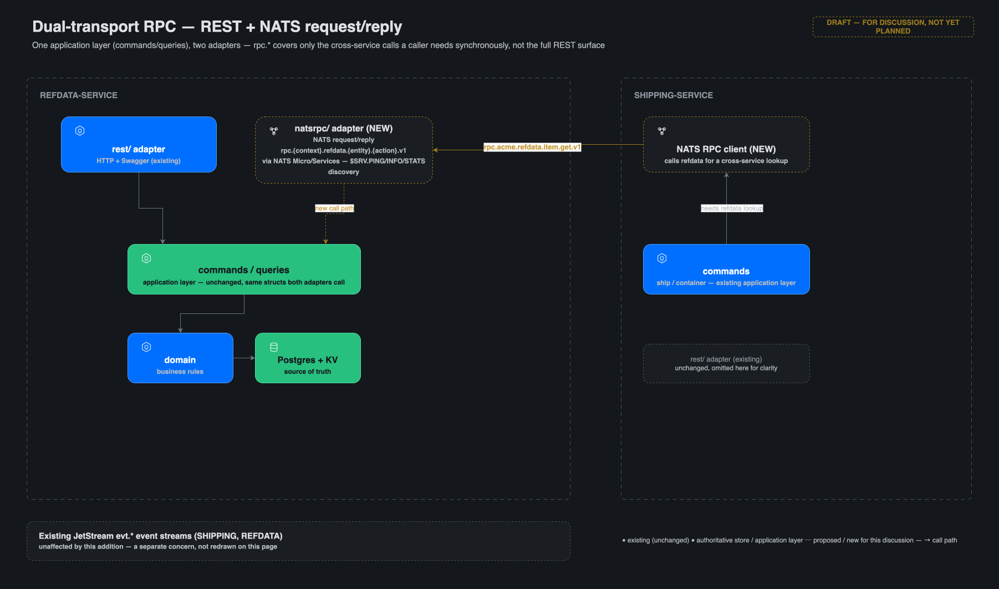
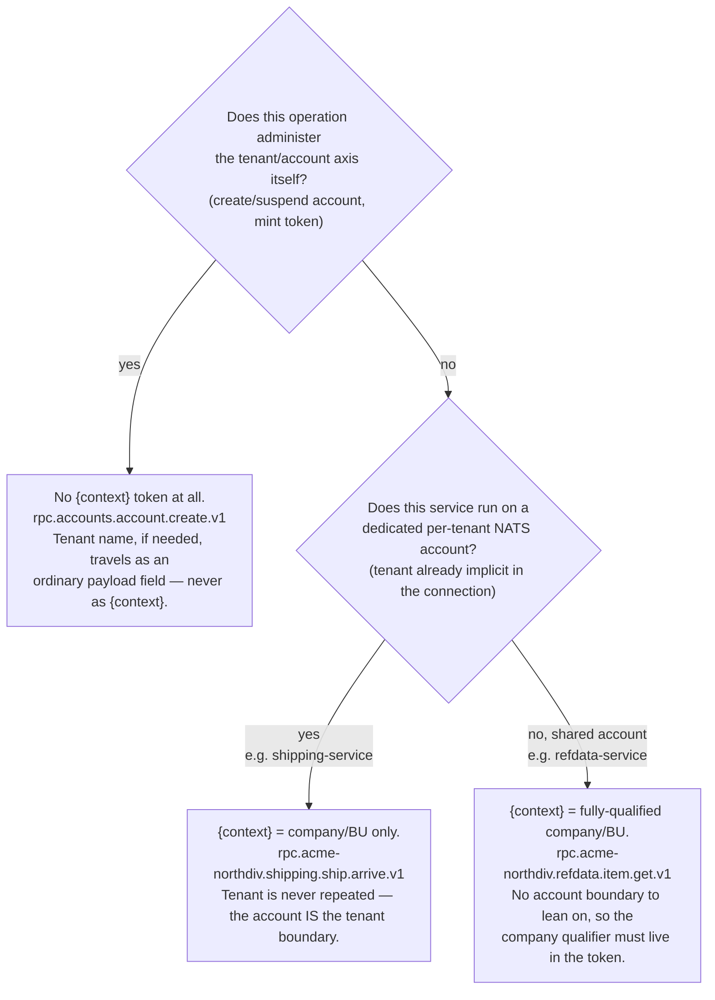
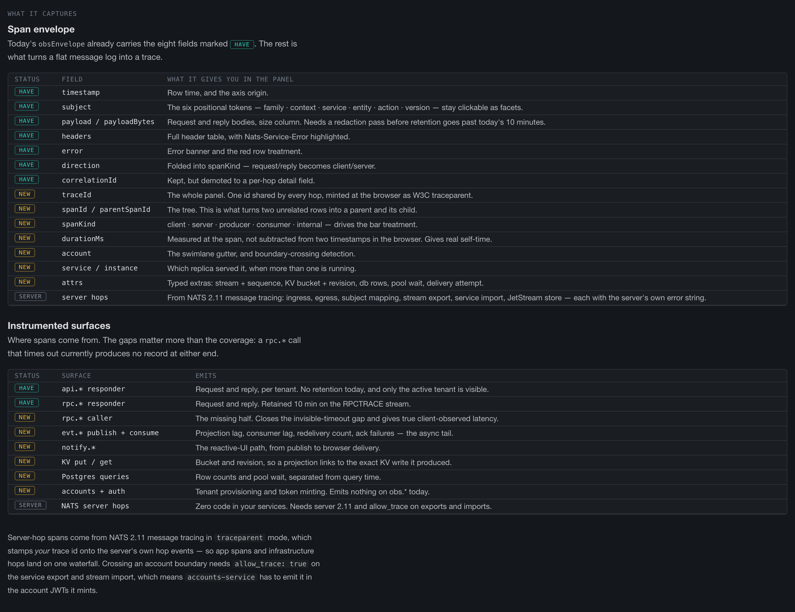
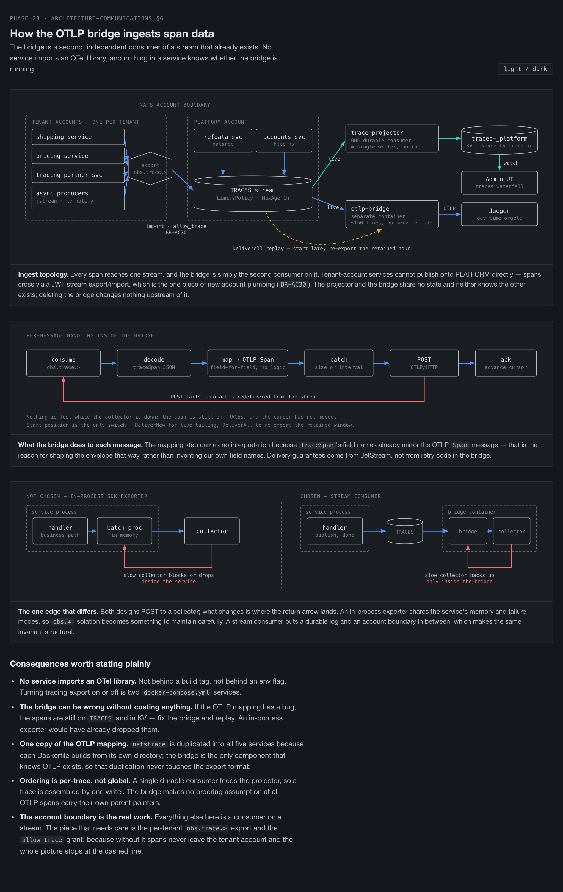

# Architecture — Inter-Service Communications

Deep reference for how services in this demo talk to each other and to
clients: REST/Swagger, NATS core request/reply (`rpc.*` service-to-service and
`api.*` frontend-to-service), `notify.*` change notification, the
`obs.rpc.*`/`obs.api.*` debugging side-channel, and how these relate to the
JetStream `evt.*` event backbone. **§ 2 is the authoritative definition of the
subject families and of `{context}`.** For the CQRS shape taxonomy see
[ARCHITECTURE.md](ARCHITECTURE.md); for refdata-service's own seeding/schema
design see
[ARCHITECTURE-DICTIONARY.md](ARCHITECTURE-DICTIONARY.md).

**Status: IMPLEMENTED (Phase 12.10, 2026-07-24).** The design below is built
as described: `refdata-service`'s `internal/natsrpc/adapter.go` (built on
`github.com/nats-io/nats.go/micro`) serves `rpc.{context}.refdata.item.get.v1`
off the same `commands.LocalizationHandler.ResolveItem()` method
`GET /api/refdata/{context}/{type}/{code}` calls (BR-D25); `shipping-service`'s
`internal/refdataconsumer` consumes it as an optional fallback ahead of REST
(`refdataconsumer.WithNATS(nc)`); the `obs.rpc.*` best-effort observability
side-channel (BR-D26) feeds a live "RPC Traffic" panel in the Admin UI
(`frontend/admin`) via a new SSE bridge (`GET /api/rpc-watch`). See
`BUSINESS_RULES-REFDATA.md`'s BR-D25/BR-D26 for the enforced rules and their
tests (`refdata/natsrpc_test.go`). The diagram below remains the accurate
reference for the shape actually built (page "PROPOSED — Dual-transport RPC
(draft)" in [architecture-dictionary.drawio](architecture-dictionary.drawio)
— title kept as-is; only this status line changed).

**Amendment status: IMPLEMENTED (Phase 12.11, 2026-07-24).** An audit of
actual inter-service traffic found `rpc.*` was a minority transport under
the design as first shipped — only `Lookup`/`item.get` had an RPC path at
all, gated behind a KV cache miss, with any RPC error (or the absence of
`WithNATS`) falling straight through to REST; `ResolveType`,
`LookupAtVersion`, and `Locales` had no RPC path whatsoever and always used
REST. The requirement changed twice in discussion (RPC-primary-with-REST-
fallback, then RPC-primary-with-circuit-breaker) before landing on what's
now built: **NATS-only for backend-to-backend calls, full stop.** No REST
fallback, no circuit breaker, no host:port coupling between backend
services at all. `refdata-service`'s `internal/natsrpc/adapter.go` now
serves all four operations (`item.get`, `type.list`, `item.get-versioned`,
`locales.list`, all via a `natsrpc.Deps` struct — see § 3);
`shipping-service`'s `internal/refdataconsumer` calls `rpc.*` exclusively
(`New(kv, nc, ...)` — `nc` is a required constructor argument, not an
option), with a bounded number of retries and backoff
(`WithRPCRetries`/`WithRPCBackoff`/`WithRPCTimeout`, defaulting to 2 retries,
150ms linear backoff, 3s per-attempt timeout) before returning
`ErrRPCUnavailable`. All REST-client coupling
(`REFDATA_SERVICE_URL`/`refdataServiceURL()`/`http://localhost:7201`,
`baseURL`/`httpc`, `fetchViaAPI`/`fetchTypeViaAPI`/`fetchVersionedViaAPI`) was
deleted from `refdataconsumer` and from `docker-compose.yml`. Frontend/edge
REST traffic is unaffected. See § 7 for the full design record and
`BUSINESS_RULES-REFDATA.md`'s BR-D28 for the enforced rule and its tests.

**Amendment status: IMPLEMENTED (Phase 12.12, 2026-07-27).** Phase 12.11 made
`rpc.*` the sole *transport*, but `refdataconsumer` still read the
`refdata-{context}` KV bucket directly as its hot-path *cache* — a bounded-
context violation: that bucket is refdata-service's own internal projection,
and a consumer coupled to its shape has to change in lockstep whenever the
producer's cache shape changes (as happened when `kvcache.Entry`'s `Item`
field was slimmed from `domain.DictionaryItem`/`attrs` to a leaner
`CacheItem` with resolved `label`/`description` — a refdata-service-internal
change that nonetheless forced a `refdataconsumer` mirror-struct update).
**The KV-first cache-read tier now lives entirely inside refdata-service's
own `natsrpc` handler** (`resolveItemKVFirst`/`resolveTypeKVFirst` call
`kvcache.Projector.ReadEntry`/`ReadType` before falling through to Postgres),
not in the consumer. `refdataconsumer.Consumer` holds only a `*nats.Conn` —
no `*kvstore.Store`, no KV bucket naming knowledge at all — and every
`Lookup`/`ResolveType`/`LookupAtVersion`/`Locales` call goes straight to
`rpc.*`; the shipping backend's `/api/refdata-watch` SSE endpoint likewise
now subscribes to refdata-service's published `evt.{context}.refdata.*.changed`
change-event stream (the `REFDATA` JetStream stream, § 2's subject taxonomy
and § 8's event-backbone note) instead of watching the KV bucket directly.
See § 9 for the full design record and `BUSINESS_RULES-REFDATA.md`'s BR-D08
for the enforced rule and its tests.



---

## 1. Overview

Two transports serve different purposes and are not interchangeable:

| Transport | Use for | Feature |
|---|---|---|
| REST + Swagger | Frontend/edge clients (UIs, third parties), full CRUD surface. **Inbound only** — a service exposes REST for callers outside the backend, but never acts as an HTTP *client* to another backend service (see amendment below) | Existing `rest/` adapter per service |
| NATS core request/reply (`rpc.*`) | **Sole transport for backend-to-backend synchronous calls** — no REST fallback (Phase 12.11, proposed) | `natsrpc/` adapter (Phase 12.10, extending to full coverage in 12.11) |
| NATS core request/reply (`api.*`) | **Frontend-to-service** synchronous calls, reached over WebSocket — replaces REST for a NATS-native browser client (Phase 15/16) | `browserrpc/` adapter (`shipping-service`; Sea Freight Flow only so far) |
| NATS core pub/sub (`notify.*`) | Service-side change notification carrying current state — replaces SSE for a NATS-native browser client (Phase 15b) | Published by projectors; see BR-024 |
| JetStream (`cmd.*` / `evt.*`) | Durable async commands and immutable domain facts | Existing — see [ARCHITECTURE.md](ARCHITECTURE.md) and CLAUDE.md's stream/subject rules |

**Backend-to-backend vs. frontend-to-backend.** These are separate families
with separate rules — see § 2.4. `rpc.*` is service-to-service only; a
frontend never calls it. Frontends reach the backend either over REST/Swagger
(+ SSE for live views) — still the case for `frontend/admin` and
`frontend/refdata` — or, since Phase 15d, over a single NATS WebSocket
connection using `api.*` + `notify.*`, which is what `frontend/seafreight-app`
now does. Since Phase 12.12
(BR-D08, § 9), the KV-first cache-read pattern lives entirely inside
refdata-service's own `rpc.*` handler — a consumer's `rpc.*` call may still
be served from a warm cache without a Postgres round-trip, but that cache
tier is internal to refdata-service and invisible to the caller; no other
service ever reads refdata-service's KV bucket directly.

**Backend services should only be aware of NATS.** For inter-service calls, a
backend service holds a NATS connection and nothing else — no HTTP client, no
base URL, no hostname/port config pointing at a peer backend service. REST
stays purely as the surface a service exposes *inbound* to frontend/edge
callers; no backend service is itself a REST *client* of another backend
service. This is a hard architectural invariant (location transparency), not
a preference — see § 7.

`rpc.*` was originally scoped deliberately narrow — only the specific
cross-service lookups a caller needed synchronously, not a 1:1 mirror of the
REST surface. As of the Phase 12.11 amendment, "narrow" no longer means
"optional/fallback-only": every backend-to-backend synchronous operation
must have an `rpc.*` counterpart and use it as its only path. It's still not
a 1:1 mirror of the *entire* REST surface — operations no other backend
service calls synchronously (e.g. admin-only writes) don't need one.

## 2. Subject taxonomy

**Formalized Phase 16a (2026-07-31).** This section is the single source of
truth for subject families and for what `{context}` means. Earlier revisions
described `{context}` as "tenant/region scope" and listed only three
families; both were stale — see § 2.3 and the Phase 16 decision record in
`.claude/plans/Main-POC-Plan.md`.

### 2.1 Subject families

Six families, grouped by role. **Core** families carry business traffic;
**Supportive** families exist so diagnostics never share a subject with the
operations they observe — a slow or absent debugging subscriber must never be
able to add latency to, or apply backpressure against, a subject in the Core
group.

| Group | Family | Purpose | Transport |
|---|---|---|---|
| Core | `evt.*` | Immutable domain facts — the event-sourcing backbone | JetStream, `LimitsPolicy` (replayable) |
| Core | `rpc.*` | **Service-to-service** synchronous calls (machine-to-machine) | NATS core request/reply (Micro) |
| Core | `api.*` | **Frontend-to-service** synchronous calls | NATS core request/reply (Micro), reached over WebSocket |
| Core | `notify.*` | Service-side change notification to interested subscribers | Core pub/sub, fire-and-forget |
| Supportive | `obs.rpc.*` / `obs.api.*` | Debugging/observability side-channel for RPC and API traffic; consumed by Admin and technical tooling only | Core pub/sub (+ `RPCTRACE` retention, BR-D29) |
| Supportive | `obs.trace.*` | Distributed-trace spans — the same envelope enriched with W3C trace identity, joined across hops by `traceId` (Phase 28, BR-036/BR-D39) | Core pub/sub on the **PLATFORM account only** (+ `TRACES` retention, 1h) |

`cmd.*` remains **reserved, not in use**: durable asynchronous intent —
publish, then observe the result via events or a status/read model. Named
here so it is not repurposed for something else.

Hard distinctions:

- `evt.*` is a record of fact, **not** an alternate API method. Never map
  `evt.*` to a Swagger-shaped request/response contract.
- `notify.*` is a *notification carrying current state*, not an event — it has
  no retention, no ordering guarantee, and no replay. It is never a substitute
  for `evt.*`, and a consumer must never treat a missed `notify.*` as data
  loss: recovery is a fresh `api.*`/`rpc.*` read, not a replay.
- `obs.*` is diagnostics only. Nothing in a business path may read it, and no
  correctness property may depend on it being delivered.

### 2.2 Grammar

```
evt.{context}.{service}.{entity}.{id}.{event}
rpc.{context}.{service}.{entity}.{action}.v{n}
api.{context}.{service}.{entity}.{action}.v{n}
notify.{context}.{service}.{entity}.changed
obs.rpc.{context}.{service}.{entity}.{action}
obs.api.{context}.{service}.{entity}.{action}
obs.trace.{context}.{service}.{entity}.{action}
```

- The leading token is always a **fixed literal**, never a wildcard — a stream
  subject filter with an unbounded wildcard in first position can textually
  overlap `$SYS.>` / `$JS.API.>` / `$SRV.>`, which JetStream refuses without
  `NoAck` (and `NoAck` would break the synchronous Publish/PubAck flow every
  command handler relies on).
- `{service}` — the service that owns/answers the call.
- `{entity}.{action}` — mirrors the `commands.XHandler` / `queries.X` method
  name 1:1, so Swagger `operationId`, subject, and Go method stay aligned.
- `v{n}` — same versioning discipline as event subjects.

Examples: `rpc.acme-northdiv.refdata.item.get.v1` (service-to-service),
`api.acme-northdiv.shipping.ship.arrive.v1` (browser),
`notify.acme-northdiv.shipping.ship.changed`.

> A caution on reading examples: this repo's **tenants** are named `acme` /
> `globex` / `default`, and a **company context** may legitimately carry the
> same string (company `acme` → context `acme`). They are still different axes
> — the context token in a subject is *never* interpreted as the tenant. Where
> a doc needs to be unambiguous it uses the hyphenated business-unit form
> (`acme-northdiv`), which can only be a context value.

### 2.3 `{context}` — company / business unit, never tenant, never region

`{context}` identifies **which company, or which business unit within a
company, the data belongs to**. It is a *soft partition inside a single
tenant's own subject space* — an addressing and routing concern, not a
security boundary.

Three axes are deliberately separate and must not be conflated:

| Axis | Mechanism | Appears in a subject? |
|---|---|---|
| **Region** | Separate stack deployment, its own NATS instance | **No** — implicit in which regional deployment you are connected to |
| **Tenant** | **NATS account** (hard, server-enforced isolation + per-tenant resource limits) | **No** — implicit in which account the connection authenticated into |
| **Company / business unit** | `{context}` subject token + KV bucket suffix | **Yes** |

**Tenancy is enforced strictly and only by NATS accounts.** This follows
NATS's own guidance: an account is an isolated tenant with its own subject
space, and an account boundary is absolute — two accounts using an identical
literal subject never see each other's traffic, with no cross-visibility
absent an explicit export/import. Accounts additionally carry independent
resource limits (connections, JetStream storage, streams, consumers) that a
naming convention cannot express. Subject-prefix/permission-based separation
inside one shared account is the pattern NATS documents as *legacy* and
explicitly weaker; it is not used here for tenancy. Proven in
`shipping-service/internal/natsaccounts/isolation_test.go` (identical
subjects, identical stream names, and identical KV bucket names across two
accounts, all mutually invisible) and again for runtime-minted accounts in
`accounts-service/accounts/provisioner_test.go`.

Consequently `{context}` **never contains the tenant name**. Encoding it
there would be redundant (a connection on `acme`'s account can only ever
reach `acme`'s subjects regardless of token text) and actively misleading —
it implies the isolation lives in the subject string when it does not. This
reverses the pre-Phase-13 model, where tenancy *was* only a string
convention in this token; see `ARCHITECTURE.md` § "Multi-Tenancy Isolation
Spike (Phase 13)".

**Context vocabulary is per-tenant.** Because the account boundary already
scopes it, two tenants could in principle use identical context strings without
collision — but see the fully-qualified rule below, which means in practice they
do not.

#### One tenant may host a company *group*

The hierarchy level is `company or company group`: a single tenant account can
contain **more than one company**. This is why a company qualifier inside
`{context}` is meaningful rather than a redundant echo of the account name —
for a single-company tenant it is simply a harmless degenerate case.

#### Contexts are fully qualified

A context value carries its company, even where the account boundary already
implies it:

```
acme                       # company-wide (all of Acme)
acme-atlantic-fleet        # business unit within Acme
```

The reasoning is worth stating because the alternative looks cheaper.
`refdata-service` runs on a **single shared account** and so has no boundary to
tell it whose corpus a request concerns — the company qualifier *must* be in the
value. `shipping-service` does have a per-tenant account and could use the bare
`atlantic-fleet`. Allowing each service its locally-minimal form would mean the
same logical scope has two different canonical names depending on which service
you ask, and every cross-service call would need a composition rule to translate
between them — which is a smaller copy of exactly the divergence § 2.3 exists to
eliminate. So: **one vocabulary everywhere.** The cost is a prefix that is
technically redundant inside shipping's own account; the benefit is that a
context value means one thing everywhere and crosses a service boundary
unchanged.

#### Composite form and the wildcard trade-off

A business unit is expressed by **hyphenating it into the single token**, not
by adding a token:

```
acme                 # company, no business units
acme-northdiv        # business unit within a company
```

This is mandatory, not stylistic. Every subject family above has **fixed
arity**, and parsers depend on it — `domain.SubjectDetails` rejects anything
that is not exactly 6 tokens, and the `browserrpc`/`natsrpc` adapters read
`{context}` by fixed position. Dot-separating company from business unit
would make arity vary (7 tokens with a business unit, 6 without) for the same
subject family, so a parser could no longer tell whether token 3 is a
business unit or a `{service}` that shifted position. Hyphenation keeps
`{context}` exactly one opaque token whether or not a business unit exists.

`{context}` must also satisfy `^[A-Za-z0-9_-]+$` (BR-020,
`domain.ValidateContext`) — stricter than NATS subjects alone require,
because the value is also a **KV bucket-name component** (`{prefix}-{context}`),
and bucket names permit only `[A-Za-z0-9_-]`. This is why sigils such as `$`
cannot be used in a context value: `dict-$global$` is an invalid bucket name.

**Known limitation (accepted):** NATS wildcards match whole tokens, never a
prefix within a token, so `evt.acme-*.shipping.>` is **not** valid and there
is no way to subscribe to "every business unit of company `acme`" by subject
matching. Where that grouping is needed it is answered by the KV/Postgres
lookup that already resolves contexts, not by subject matching. Treat the
hyphenated value as **opaque** — do not split on `-` to recover company vs.
business unit; if that decomposition is needed, store the two parts as
separate fields alongside the context, as `refdata.contexts` does.

**No hard isolation between business units.** Two contexts inside one tenant
account are mutually *visible* — the separation is organizational, enforced
by application-layer scoping, not by NATS. If two business units ever need to
be mutually opaque (e.g. regulatory separation between divisions of one
company), that requires a **separate NATS account**, i.e. modelling them as
distinct tenants. `{context}` cannot provide it, and no design should assume
otherwise.

#### Reserved contexts (`_` prefix)

Context values beginning with `_` are **reserved for platform/system use** and
may never be claimed by a company or business unit — enforced (Phase 16c),
not merely conventional, at **both** points where such a value could
originate: `refdata-service`'s `ValidateContextName` (BR-D33) is the primary
enforcement point, since a context is its own resource, registrable
independently of any NATS account; `accounts-service` (BR-AC07) additionally
rejects `_`-prefixed account names at provisioning time, because in the
common case (no company-group split — § 2.3 above) a tenant's own name
doubles as its company context, so an unguarded account name could smuggle a
`_`-prefixed value in through that reuse. The reserved namespace echoes
NATS's own `_INBOX` convention.

- `_platform` — the platform-wide root corpus (standards-based reference data,
  shared templates). Root of refdata-service's context inheritance tree.

#### Context-free services

Platform services whose operations *administer the tenant/company axis
itself* take **no `{context}` token at all**, because scoping them by company
is not a coherent question — creating an account is what brings a company into
existence:

```
rpc.accounts.account.create.v1
rpc.auth.token.mint.v1
```

This is the rule for `accounts-service` (whose `auth` sub-package owns the
`rpc.auth.*` example above — folded in from the former `auth-service` in
Phase 19, see `BUSINESS_RULES-ACCOUNTS.md`). It is not a blanket "platform
services skip context" exemption: `refdata-service` is
equally a platform service but its *data* is genuinely company-scoped, so it
keeps `{context}`.

#### 2.3.1 Decision rule for a new or changed service

The common mistake is sorting services into "platform" vs. "tenant-facing"
and inferring `{context}`'s meaning from that label — e.g. assuming a
platform service should carry the tenant name. That's not the axis that
matters. The question that actually decides `{context}`'s shape is: **what
does this service's data belong to, and does it have a dedicated per-tenant
NATS account to lean on?**



| | Administers the tenant axis itself | Company-scoped, dedicated per-tenant account | Company-scoped, shared account |
|---|---|---|---|
| **Example** | `accounts-service` (incl. `auth`) | `shipping-service` | `refdata-service` |
| **`{context}` token** | absent | `{bu}` (e.g. `atlantic-fleet`) | `{company}` or `{company}-{bu}` (e.g. `acme-atlantic-fleet`) |
| **Tenant identity** | ordinary payload field, when the operation needs one (e.g. account name at creation) | implicit — the NATS account | implicit — the NATS account, but restated in the context value because the service has no per-tenant boundary of its own |
| **Rejects `_`-prefixed values** | yes — BR-AC07 | n/a | yes — BR-D33 |

**Rule of thumb for any new service:** never write "tenant" into a subject
or an RPC/event payload — tenant is always the NATS account, full stop. Then
ask only whether the service's data is company/BU-scoped (→ `{context}`
carries it, fully qualified if the account is shared) or whether the
operation *is* tenant-lifecycle management (→ no `{context}`, tenant travels
as a normal field where the operation genuinely needs to name one).

### 2.4 `rpc.*` vs `api.*` — separation rule

The two families never collide as subject strings, but the same *operation*
may legitimately need to be reachable by both a backend service and a
browser. Rule:

> An operation may be registered on both `rpc.*` and `api.*` when both a
> backend and a browser caller genuinely need it, but each registration is
> **independent** — its own adapter and its own permission grant. A browser
> credential must **never** be granted `rpc.>`, and backend code must
> **never** call `api.>`.

- Both registrations call the **same** `commands.*Handler` / `queries.*`
  method (§ 3), so dual exposure costs adapter boilerplate, never duplicated
  business logic.
- The subject prefix declares *who an operation was designed for*;
  **permissions** decide who may actually call it. The prefix is not itself an
  enforcement mechanism. Concretely, `accounts-service/auth`'s
  `MintBrowserToken` grants only `api.>` / `notify.>` — never `rpc.>` — so
  adding a backend-only `rpc.*` endpoint inside a tenant account can never
  become browser-reachable by accident.
- If backend code appears to need `api.>`, that is a signal the operation
  should also be registered on `rpc.*` for that caller — not a reason to call
  through the browser family.
- Contracts must not drift: if a browser genuinely needs a different shape
  from the backend one (lighter, paginated), introduce an explicit
  `api.*.v2`, never a silent divergence of a nominally shared `v1`.

A useful side effect for tooling: because `obs.rpc.*` and `obs.api.*` are
distinct, Admin/technical tooling can tell backend-originated from
browser-originated traffic without inspecting payloads.

## 3. Dual-adapter pattern

Each service keeps one transport-neutral application layer
(`commands.*Handler` / `queries.*`) behind two adapters:

- `rest/` — existing HTTP + Swagger adapter. No business logic; translates
  HTTP ↔ application calls. **Inbound-only**: a service exposes this for
  frontend/edge callers; no other backend service in this repo is an HTTP
  client of it.
- `natsrpc/` (proposed) — NATS request/reply adapter, built on the NATS
  Micro/Services framework, calling the **same** `commands`/`queries`
  methods as `rest/`. No changes needed to `commands`/`domain` to add it —
  both services already isolate transport from application logic behind
  `rest.Deps`, which is exactly the seam a second transport plugs into. This
  is the **only** adapter a backend service uses to call another backend
  service.

```
HTTP adapter                         Application                    NATS adapter

GET /api/refdata/.../item  ───►  Items.Get(id)  ◄───  rpc.acme.refdata.item.get.v1
```

Wire `rpc.*` for every operation another service calls synchronously — see
§ 7 for why this is now "every operation," not an opportunistic subset — and
see the diagram in § 1 above for the concrete shipping-service →
refdata-service example.

### 3.1 Which services have which adapters (as built, 2026-08-13)

| Service | REST | `api.*` (browser) | `rpc.*` (backend callers) | `micro.AddService` |
|---|---|---|---|---|
| `shipping-service` | yes | yes (`internal/browserrpc`) | — | yes |
| `refdata-service` | yes | — | yes (`internal/natsrpc`) | yes |
| `pricing-service` | yes (no browser proxy route) | yes (`internal/browserrpc`) | — | yes |
| `accounts-service` | yes | — | — | no |
| `trading-partner-service` | yes | yes (`internal/browserrpc`, Phase 26h) | — | yes (Phase 26g) |

Two notes worth carrying forward from Phase 26g/26h:

- **`micro.AddService` is what makes a service visible in the Admin UI's
  Services panel**, and it wires the `$SRV.PING/INFO/STATS` responders
  independently of `AddEndpoint`. A service that only makes *outbound* `rpc.*`
  requests answers nothing on `$SRV` and is invisible there even while running
  — which is exactly how `trading-partner-service` sat unlisted until Phase
  26g registered it. Registration and endpoints are separable: 26g shipped the
  registration with zero endpoints, 26h added the endpoints.
- **A service gets `rpc.*` endpoints only once a backend caller exists.**
  `trading-partner-service` has none yet: the Admin UI is its only caller, and
  a browser credential is never granted `rpc.>` (§ 2.4). Its `rpc.*` surface
  arrives with the marketplace/tender phase that first calls it from another
  backend.

A third note, on what every `api.*` row in that table costs: an `api.*` adapter
has to be registered on a connection authenticated *as* the tenant whose
browsers will call it, so each of the three services above independently grew a
per-tenant connection manager to mount its adapter on. Those three managers are
near-duplicates of one another and are a standing extraction candidate — see
[ARCHITECTURE-ACCOUNTS.md](ARCHITECTURE-ACCOUNTS.md) § "Three services now open
per-tenant connections" for the duplication map, the bug it has already caused,
and the Go-module prerequisite that keeps it deferred.

## 4. Discovery & documentation

### What `nats.go/micro` provides

Both `rpc.*` and `api.*` handlers (`natsrpc/adapter.go` in refdata-service,
`browserrpc/adapter.go` in shipping-service) are built on the official **NATS
Micro/Services framework**, `github.com/nats-io/nats.go/micro`
(docs: <https://docs.nats.io/using-nats/developer/services>, API reference:
<https://pkg.go.dev/github.com/nats-io/nats.go/micro>). It's a thin layer over
plain core-NATS request/reply, not a replacement for JetStream — no
persistence or streams involved, purely a request/reply convenience +
discovery layer. It gives:

- **Structured services/endpoints** — `micro.AddService(nc, config)` then
  `svc.AddEndpoint(...)`, instead of hand-rolling `nc.Subscribe` plus reply
  logic per handler.
- **Free runtime discovery** — every service automatically answers
  `$SRV.PING`/`$SRV.PING.<name>` (who's alive), `$SRV.INFO.<name>` (declared
  endpoints/subjects), and `$SRV.STATS.<name>` (call counts, errors,
  latency) control-subject queries — queryable via `nats micro list` /
  `nats micro info <name>`. Each service self-declares its endpoints at
  startup; zero separate registry to keep in sync.
- **A standard error convention** — `req.Error(code, description, data)` sets
  the `Nats-Service-Error`/`Nats-Service-Error-Code` headers on the reply
  automatically; this is the mechanism BR-D36/BR-026 build on top of for the
  Admin UI's Request/Reply panel.
- **Grouping/versioning helpers** — endpoints can be organized under
  subject groups, which is what lets this repo's fixed
  `family.context.service.entity.action.version` subject arity (§ 2 decision
  4) stay declarative rather than hand-parsed per handler.

- **Static documentation** — Swagger/OpenAPI (already generated from
  `@Summary`/`@Param`/`@Router` annotations, served at `/swagger/` in both
  services) documents REST. `rpc.*` and `evt.*` should be documented in
  AsyncAPI (or a shared operation/schema definition both docs generate
  from), keeping `operationId` (Swagger), subject (NATS), and application
  method name aligned three ways.

## 5. Benefits

**Location independence and transparency (NATS).** A `natsrpc/` caller
addresses a subject, not a host:port — the client doesn't know or care which
instance of refdata-service answers, whether it's been rescheduled, scaled
out, or moved between nodes. NATS's subject-based addressing plus
Micro/Services discovery means service-to-service calls stay correct through
deploys and topology changes without service-discovery infrastructure,
client-side load balancer config, or DNS/registry updates — the caller's code
never changes when the callee's location does.

**Dual transport as a built-in test/debugging harness (Swagger + REST) — for
humans and test suites, not for any backend service's own runtime code.**
Because `rest/` and `natsrpc/` call the identical `commands`/`queries`
methods, the existing Swagger-documented REST surface effectively doubles as
an isolation tool for the RPC layer — but only ever exercised by a person or
a test process, never by another backend service acting as an HTTP client
(that coupling is exactly what § 1's "backend services should only be aware
of NATS" invariant rules out):

- Manual/exploratory testing via Swagger UI (`/swagger/`) already served by
  both services — no NATS client needed to exercise a service's behavior.
- Contract/integration tests (run by CI or a developer, not by the other
  backend service) can hit REST directly, decoupled from whether the NATS
  RPC layer works — REST and RPC can be verified independently.
- Debugging: a person can hit the equivalent REST endpoint for the same
  `commands` method to isolate whether a misbehaving `rpc.*` call is a bug
  in the adapter (`natsrpc/` vs `rest/`) or in the domain logic — since both
  adapters call the identical function, a REST failure with the same input
  rules out the transport and points at the application/domain layer
  instead. This is a manual diagnostic step, not an automatic fallback the
  system takes on its own.

## 6. RPC observability (Admin UI live view)

The Admin UI wants to show `rpc.*` calls and replies as they happen, with no
requirement to see history from before the panel was opened. This is **not**
a JetStream concern — it's a separate, best-effort side-channel off the
`natsrpc/` adapter.

> **Extended (Phase 16, "Request/Reply" panel):** the same panel now also
> carries `api.*` request/reply traffic via `obs.api.>` — shipping-service's
> `browserrpc/` adapter publishes the identical two-message pattern, but on
> the **tenant** account its adapter is registered on. `/api/rpc-watch`
> therefore subscribes `obs.rpc.>` on the PLATFORM-account connection (with
> the `RPCTRACE` replay below) *and* `obs.api.>` on the **active tenant's**
> connection — the `obs.api.*` half is live-only (no `RPCTRACE` retention
> exists inside tenant accounts) and pinned to the tenant active when the
> SSE connection opened (the Admin UI reconnects on tenant switch).
> Non-active tenants' `obs.api.*` traffic remains invisible until a
> cross-account-imports phase — see the KNOWN GAP doc comment in
> `browserrpc/adapter.go`. Everything below describes the original
> `obs.rpc.*` design, which is unchanged.
>
> **Extended again (Phase 17a) — headers, timestamp, payload size
> (BR-D36/BR-026):** the `obsEnvelope` gained three fields on both the
> request-side and reply-side event: `headers` (the message's real NATS
> headers — the reply side includes any error headers the framework
> attaches), `timestamp` (set by the publishing adapter at publish time, not
> inferred from SSE arrival time — the only way to get a truthful ordering
> when `RPCTRACE` replay and live delivery interleave), and `payloadBytes`.
> All three are additive/optional, so events retained before this change
> still decode. `respondError` in both adapters now attaches real
> `Nats-Service-Error`/`Nats-Service-Error-Code` headers to the actual wire
> reply too (via `micro.WithHeaders`), not just the observability copy — the
> Admin UI's Request/Reply panel (Phase 17b) shows headers that genuinely
> traveled on the wire.
>
> **Phase 17b rebuilt the Admin UI panel itself** to surface all of this:
> free-text + family/status filtering, click-a-subject-token-to-filter
> (positional facets, exploiting the fixed 6-token subject arity —
> `SubjectPath.vue`'s new `clickable` prop), a pause control that freezes
> the visible list without dropping the SSE, and a bottom detail split with
> paired **Request** / **Reply** panes (headers table + syntax-tinted JSON
> body each) — mirroring the channel's actual two-message structure rather
> than a DevTools-style single-message drawer. Built to the approved static
> reference, `frontend/admin/request-reply-reference.html`. See
> `Main-POC-Plan.md` Phase 17 for the full design rationale and layout
> options considered.
>
> **Extended again (Phase 18) — Nats-Requestor/Nats-Responder identity
> headers (BR-D37/BR-027):** BR-D36/BR-026 made the real headers on a message
> visible in the panel, but no header actually carried caller or responder
> *identity* — NATS doesn't attach that itself. Both headers share one
> instance-qualified format, `"<name>/<instance ID>"` — the same
> `service.name`/`service.instance.id` split OpenTelemetry's resource
> conventions use, so replicas of one service stay distinguishable and a
> future OTel integration maps the halves directly. `refdataconsumer`
> (shipping-service's `rpc.*` caller) sets `Nats-Requestor` to
> `nats.Name(...)` plus a NUID generated once per `Consumer`;
> `useNatsConnection.js`'s `request()` (the browser's `api.*` caller) sets
> `"seafreight-app/"` plus a random ID generated once per tab — making
> concurrent tabs tellable apart, which a bare app name never could;
> `natsrpc`/`browserrpc`'s reply paths set `Nats-Responder` to
> `"<service's nats.Name>/<micro instance ID>"` on every reply, success or
> error. Instance IDs are random per process/tab; a stable infra identity
> (e.g. a Kubernetes pod name) can seed the instance half later without a
> format change. Fixing this exposed a pre-existing inconsistency: each adapter's
> `micro.AddService` `Config.Name` (`refdata-rpc`, `shipping-api`) didn't
> match its own connection's `nats.Name` (`refdata-service`,
> `shipping-service`) — so `Nats-Requestor` and `Nats-Responder` would have
> shown two different names for the same service. Both `Config.Name` values
> were renamed to match their connection's `nats.Name` as part of this
> change.

> **Extended again (Phase 23) — `/api/rpc-watch`'s single SSE stream is
> retired; the browser subscribes to both halves directly instead.** The
> pattern above — one Go handler holding both a `RPCTRACE` ordered consumer
> and a tenant-account `obs.api.>` subscription, merging them into one SSE
> feed — is gone. Two independent browser-held NATS WebSocket connections
> (Phase 15's model, now extended to `frontend/admin`) each carry one half
> directly:
>
> ```mermaid
> flowchart LR
>     subgraph Platform["Admin/Platform connection (opened once, never reconnects)"]
>         RPCTRACE[("RPCTRACE stream<br/>PLATFORM account")]
>         Bridge["eventhandler.RegisterRPCTraceNotify<br/>permanent background bridge"]
>         NotifyRPC["notify._platform.rpctrace.entry<br/>(live tail only)"]
>         RPCTRACE --> Bridge --> NotifyRPC
>     end
>     subgraph Tenant["Tenant connection (reconnects on tenant switch)"]
>         ObsApi["obs.api.&gt;<br/>tenant account, published directly<br/>by browserrpc/adapter.go"]
>     end
>     Replay["GET /api/rpctrace/replay<br/>one-shot REST bootstrap"]
>     Browser["RpcPanel.vue<br/>merges both into one row list by correlationId"]
>     RPCTRACE -.snapshot at page load.-> Replay --> Browser
>     NotifyRPC --> Browser
>     ObsApi --> Browser
> ```
>
> `RPCTRACE`'s retained backlog ("last N minutes," `BR-D29`) is now served by
> a one-shot `GET /api/rpctrace/replay` bootstrap fetch instead of an
> SSE-replay-then-live merge — the panel calls it once on mount, then relies
> on the two subscriptions above for anything published afterward. `obs.api.>`
> is no longer relayed through a Go handler at all: the tenant browser JWT
> (`auth/token.go`'s `MintBrowserToken`) already carries a direct `obs.api.>`
> subscribe grant, so `RpcPanel.vue` subscribes to it on its own tenant
> connection — removing a hop, and removing the "pinned to whichever tenant
> was active when the SSE connection opened" staleness this section
> previously called out, since the tenant connection itself now reconnects
> on tenant switch (`stores/tenant.js`'s `useNatsConnection().switchTenant`)
> rather than requiring the whole panel to reconnect. See `BR-AC18` in
> `BUSINESS_RULES-ACCOUNTS.md` for the Admin/Platform connection's own
> credential (`MintAdminToken`) and `Main-POC-Plan.md`'s Phase 23 entry for
> the full design (this same shape — permanent background bridge,
> `notify.*` publish, REST bootstrap — replaced the Admin UI's other three
> SSE streams too: dictionary KV watch, KV inspector, and JetStream raw
> watch).

> **Extended again (Phase 28) — `obs.trace.*`, W3C `traceparent`
> propagation, and the exporter as a consumer rather than a library.** The
> envelope above pairs a request with *its own* reply and nothing more: its
> correlation key is `req.Reply()`, an inbox subject generated fresh by each
> requestor and never propagated, so a `browser → shipping → refdata` call
> emits two unrelated envelopes and a fire-and-forget publish (`evt.*`,
> `notify.*`, a KV write) emits none at all — with no reply inbox there is no
> correlation id even in principle. `obs.trace.*` (§ 2.1, § 2.2) adds W3C
> trace identity: a `traceId` minted at the browser and carried in a
> `traceparent` header across every hop, plus `spanId`/`parentSpanId` for the
> tree. `traceSpan` is a **strict superset** of the `obsEnvelope` above — no
> field is renamed or retyped, every addition is `omitempty` — which is why
> the flat Request/Reply view keeps working unchanged and why both views read
> one feed (`ARCHITECTURE-ADMIN.md` § 4.5). `correlationId` is retained as a
> per-hop field; it is **not** the span id.
>
> 
>
> `HAVE` is what the `obsEnvelope` above already carries; `NEW` is what turns a
> flat message log into a trace. In the second table the **gaps matter more
> than the coverage** — an `rpc.*` call that times out currently produces no
> record at either end, from either side. `SERVER` rows need no service code at
> all (Phase 41, renumbered 2026-08-17 from Phase 29 — still not started).
> Editable source:
> [admin-traces-panel.html](../../../../demos/01-dictionary/diagrams/admin-traces-panel.html),
> re-exported with `--clip="section.cap"`.
>
> Instrumentation is structural rather than by convention: all four micro
> adapters register endpoints through a single `svc.AddEndpoint` call inside a
> table loop, and both `micro.Handler` and `micro.Request` are interfaces, so
> one decorator at that call site replaces the 58 hand-pasted request-side
> `publishObs` lines. Outcome still comes from the existing
> `respond`/`respondError` tails, which already hold the typed error and its
> 404/500 classification — the span is reached there by upcast, not by a
> correlation map.
>
> 
>
> Editable source: [otlp-bridge-ingest.html](../../../../demos/01-dictionary/diagrams/otlp-bridge-ingest.html)
> — hand-authored inline SVG rather than a Draw.io workbook page, so
> `./diagrams/export-png.sh` does **not** regenerate it. Re-export with
> `node diagrams/export-html-png.mjs diagrams/otlp-bridge-ingest.html \`
> `  ../../obsidian/V3-Platform/Architecture/Dictionary-POC/images/otlp-bridge-ingest.png 1024`
> from `demos/01-dictionary/`. The 1024px width is the geometry the page was
> reviewed at; changing it changes the layout.
>
> **The exporter is a consumer, not a library, and that is a capability
> decision rather than a cost one.** No service imports
> `go.opentelemetry.io/*`. The OTel Go API is `context.Context`-based —
> `tracer.Start(ctx, …)` returns a new ctx and children are found via
> `trace.SpanFromContext` — but every adapter here hands the application layer
> a fresh `context.Background()` at roughly 60 call sites, so real nesting
> would mean changing every command and query signature it reaches, down
> through the domain layer Quality Rule 3 keeps framework-free. Adopting OTel
> only at the adapter boundary would pay that dependency cost for a *flat*
> trace. Meanwhile the SDK's bulk — exporters, batching, retry — solves span
> *delivery*, which `obs.*` already solves, with retention for replay.
>
> So `natstrace` is hand-rolled (~250 lines, duplicated per service like
> `obsEnvelope` already is, because each service's Dockerfile uses its own
> directory as build context), W3C-compatible on the wire, and its field names
> mirror the OTLP `Span` message 1:1 so the bridge is a field-for-field copy
> with no interpretation. Four things follow from the bridge being a stream
> consumer:
>
> - **Retroactive export.** An in-process batch exporter can only ship spans
>   it currently holds in memory; if the collector is down, or Jaeger is
>   started *after* something odd is noticed, those spans are gone. A
>   `DeliverAll` consumer re-exports the retained window on demand.
> - **Toggling costs no code.** Two `docker-compose.yml` services added or
>   removed. Not an env flag threaded through five binaries.
> - **One copy of the OTLP mapping.** `natstrace` is duplicated five times;
>   the bridge is the only component that ever needs to know OTLP exists, so a
>   format bug is one fix.
> - **It cannot touch a business path.** An in-process exporter shares the
>   service's memory and failure modes, and a slow OTLP endpoint makes the
>   batch processor block or drop *inside* the service. A separate consumer
>   makes the `obs.*` isolation invariant (§ 2.1) structurally true instead of
>   carefully maintained.
>
> Revisit the real SDK if this POC graduates — `otelpgx`/`otelhttp`
> auto-instrumentation is the genuine loss, and because the wire format is
> already OTLP-shaped, adopting it later is additive rather than a rewrite.
> Recorded as an explicit deferred decision, not a silent one.
>
> **Implemented (Phase 28g).** `backend/otlp-bridge/` landed as designed
> above — a standalone `~230`-line module (not hexagonal; a translation
> utility has no domain layer), `internal/otlpmap` doing the pure
> field-for-field mapping and `cmd/main.go` wiring the `TRACES` consumer,
> the size/interval batcher, and the ack-only-on-2xx HTTP POST.
> `docker-compose.yml`'s `jaeger` + `otlp-bridge` pair sits behind Compose's
> `otlp` profile, exactly the "two services added or removed" toggle this
> section calls for. **One correction made against a live rejection, not
> assumed up front:** trace/span ids are passed through as the same hex
> `natstrace` emits, not re-encoded to base64. Generic protobuf JSON
> mapping would base64-encode a `bytes` field (which is what `trace_id`/
> `span_id` are declared as in `opentelemetry-proto`), and that was this
> bridge's first implementation — but Jaeger's OTLP/HTTP receiver decodes
> ids through OTel collector's `pdata` codec, whose `TraceID`/`SpanID`
> types marshal as hex specifically, not generic `bytes`. A base64-encoded
> id came back rejected with `"invalid length for ID"` against the real
> running container; since `natstrace`'s ids are already hex of the exact
> byte lengths OTLP requires, the fix was to delete the encoding step
> entirely rather than add a different one — one less thing to get wrong,
> pinned by `otlpmap`'s `TestMarshalExportRequestPassesIdsThroughAsHex`.
> Verified live: real `refdata`/`accounts` spans, correctly parented,
> visible in Jaeger's UI and `/api/traces` query API.

**No dedicated stream (original decision, since revised — see below).** A
`RPCTRACE`-style JetStream stream (`LimitsPolicy`, short `MaxAge`) was
considered as a way to give a reconnecting tab a few seconds of catch-up
buffer, but was rejected as unnecessary: the stated requirement at the time
was "only show when the app is visible," which plain Core NATS pub/sub
already satisfies for free — no stream to provision, retain, or monitor. The
explicit condition for revisiting this was: reach for a `RPCTRACE` stream
only if a genuine "catch up on reconnect" requirement emerges; don't build it
speculatively.

**Revised (BR-D29): `RPCTRACE` added once the requirement became concrete.**
The requirement narrowed from "live while visible" to "show whatever
happened in the last 10 minutes, even if the tab wasn't open for it" — a
genuine catch-up-on-reconnect need, exactly the condition above. `RPCTRACE`
is a `LimitsPolicy` stream with subject filter `obs.rpc.>` and `MaxAge: 10m`,
provisioned by `refdata-service`'s `composition.go` alongside the `REFDATA`
change stream. `publishObs()` now publishes via `PublishAsync` when
JetStream is configured (falling back to the original `nc.Publish` otherwise)
— `PublishAsync` only blocks for the send, never the server's ack, so the
"must never block the real RPC reply" invariant this section's design
already establishes is unchanged. Because a JetStream publish is still an
ordinary NATS message on the wire, the live-tail design below (`obs.rpc.*`
fire-and-forget publish) is otherwise untouched: `shipping-service`'s
`/api/rpc-watch` SSE handler now opens an ephemeral ordered consumer on
`RPCTRACE` (`DeliverAllPolicy`) to drain the retained backlog *before*
falling through to the same live core subscribe it always used, established
first so nothing published during the drain is missed. See `BR-D29` in
`BUSINESS_RULES-REFDATA.md` for the full rule.

**Design: `obs.rpc.*` fire-and-forget publish, both directions.** Each
`natsrpc/` Micro endpoint handler publishes two observability messages
around the real call — one for the request, one for the reply — on a subject
distinct from `rpc.*` itself (e.g. `obs.rpc.{context}.{service}.{entity}.{action}`),
so the Admin UI subscribes to `obs.rpc.>` independently of the actual RPC
traffic:

```go
func (a *Adapter) getItemHandler(req micro.Request) {
    a.publishObs("request", subject, correlationID, req.Data())

    result, err := a.queries.GetItem(...)
    reply := ...

    a.publishObs("reply", subject, correlationID, reply)   // include on error too
    req.Respond(reply)
}
```

- **Reply payload is captured, but only because it's explicitly published a
  second time** — Core NATS request/reply is peer-to-peer, so nothing about
  the response is visible to a third-party observer unless the adapter emits
  it itself. There is no way to pair this "for free."
- **Correlation** — reuse the request's reply-to inbox (or a generated
  `correlationID`) in both the request and reply obs publishes, so the Admin
  UI can join them into one row instead of two unrelated list entries.
- **Failure case** — publish the reply-side obs event even when the handler
  errors, so a failed call is visible in the UI, not just successes.
- **Decoupled from the real call path** — the obs publish is best-effort and
  async; it must never add latency to, or be able to fail, the actual RPC
  reply to the caller. A slow or disconnected Admin UI subscriber is a
  no-op for the real cross-service call (core NATS drops published messages
  with no subscriber).
- **Payload sensitivity** — the obs publish is a second copy of the same
  payload on a subject anyone subscribed to `obs.rpc.>` can see. Apply the
  same redaction rules to it as would apply to logging that payload
  elsewhere; not expected to be an issue for the reference-data lookups this
  repo currently scopes `rpc.*` to, but worth checking per-operation as new
  `rpc.*` endpoints are added.

  **Amended (Phase 28) — advisory becomes enforced.** The paragraph above was
  guidance that nothing implemented, and the exposure was wider than it
  states: `obs.api.*` is published on the *tenant* account and the tenant
  browser JWT carries a matching `obs.api.>` subscribe grant
  (`auth/token.go`'s `MintBrowserToken`), so every `api.*` payload was
  duplicated verbatim onto a subject the browser could read. Three changes
  make the rule real for `obs.trace.*` (BR-036/BR-D39): it publishes to the
  **PLATFORM account only** and no browser credential is granted
  `obs.trace.>`; a `Redactor` hook runs at publish time, listing what it
  replaced in `redacted[]` so a reader can tell "field was empty" from "field
  was withheld"; and payloads are capped at 4 KiB with `truncated: true`
  rather than cut silently. Redaction runs *before* the cap, and the
  `Redactor` is a per-adapter dependency rather than a package global, because
  three of the four adapters are constructed per tenant. Note that truncation
  must re-marshal the prefix as a JSON string — `Payload` is a
  `json.RawMessage`, so a naked byte slice produces an envelope the consumer
  cannot decode — while `payloadBytes` keeps the true pre-truncation length.

## 7. `rpc.*` as the sole backend-to-backend transport (Phase 12.11, IMPLEMENTED 2026-07-24)

**Requirement — this supersedes two earlier drafts of this section
(RPC-primary-with-REST-fallback, then RPC-primary-with-circuit-breaker):**
for backend-to-backend synchronous calls (frontend-to-backend is
unaffected), `rpc.*` is the **only** transport. No REST fallback in any
form — not a per-call fallback, not a circuit breaker that degrades to REST.
A bounded number of retries against `rpc.*` (with backoff), then an error
returned to the caller. **Backend services should only be aware of NATS**
for inter-service calls — no HTTP client, base URL, or hostname/port config
pointing at a peer backend service. This is a hard invariant (location
transparency), not a resilience trade-off to weigh case by case.

**What the Phase 12.10 audit found (2026-07-24):** actual consumer traffic
from `shipping-service` → `refdata-service` breaks down as:

| Consumer method | KV direct | NATS RPC | REST |
|---|---|---|---|
| `Lookup` (single item) | yes (`refdata-{context}`) | yes — but only on a KV miss, and only because `WithNATS` happens to be wired | yes — final fallback, always |
| `ResolveType` (list) | yes (enumerates bucket) | only indirectly, once per item, via `Lookup` | yes, if the bucket's empty/absent |
| `LookupAtVersion` (pinned corpus version) | yes (`refdata-{context}-v{N}`) | no RPC path exists at all | yes, final fallback |
| `Locales` | no | no | yes, sole transport |

Only `Lookup` had any RPC path, and even there it was the third tier: a KV
cache hit short-circuited everything; only on a miss did it try
`rpc.{context}.refdata.item.get.v1`, and any RPC error fell straight
through to REST. `Locales` in particular had **no RPC path at all** — so
12.11 landed full `rpc.*` coverage for all four operations *first*, then cut
REST out *after*, rather than in the same commit as a half-covered
transport (per this section's own sequencing note when it was still
PROPOSED).

**What was built:**

- All four `refdataconsumer` operations have an `rpc.*` counterpart, served
  by `refdata-service`'s `internal/natsrpc/adapter.go` via a `natsrpc.Deps`
  struct (`Localizations`, `Items`, `VersionReader`, `Projector`, `Log` —
  each nil-safe, mirroring the REST layer's own nil checks): `item.get`
  (Phase 12.10, unchanged), new `type.list` (`ResolveType` — reuses
  `ItemGetResponse` per item), `item.get-versioned` (`LookupAtVersion` — the
  corpus version travels in the request body, not the subject; response is
  `kvcache.VersionedEntry` directly, no separate wire shape), and
  `locales.list` (`Locales`).
- On a KV cache miss/stale entry, the consumer calls `rpc.*` via
  `requestRPC()`, which makes a bounded number of attempts (default: 1
  initial + 2 retries = 3 total) with linear backoff (default 150ms ×
  attempt number) and a 3s per-attempt timeout, all overridable via
  `WithRPCRetries`/`WithRPCBackoff`/`WithRPCTimeout` (tests use these to stay
  fast). If every attempt fails, the call returns `ErrRPCUnavailable`
  (wrapping the last underlying error) — there is no other transport to fall
  through to.
- **Not-found vs. other errors, without HTTP status codes to lean on:**
  every `natsrpc` endpoint's error response now carries a `notFound bool`
  alongside `error string` (`isNotFoundErr()` in `adapter.go`, mirroring the
  same domain-sentinel set REST's `writeError` status-code switch checks —
  `ErrItemNotFound`, `ErrTypeNotFound`, `ErrReferenceNotFound`,
  `ErrContextNotFound`, `ErrDraftNotFound`, `kvcache.ErrVersionedKeyNotFound`).
  The consumer's `checkRPCError()` maps `notFound: true` to this package's
  `ErrNotFound`, anything else to a generic wrapped error — the one
  categorization the old REST-fallback path used to get "for free" from
  REST's own not-found handling, now made explicit at the wire level instead.
- **All REST-client coupling is removed from `internal/refdataconsumer`**,
  not just deprioritized: the `REFDATA_SERVICE_URL` env var
  (`docker-compose.yml`), the `refdataServiceURL()` function and its
  hardcoded `http://localhost:7201` default (`dictionary/composition.go`),
  the `baseURL`/`httpc` fields, and the `fetchViaAPI` / `fetchTypeViaAPI` /
  `fetchVersionedViaAPI` / REST-based `Locales` methods on `Consumer` are all
  deleted. `Consumer` holds a `*kvstore.Store` and a `*nats.Conn` and nothing
  else; `New(kv, nc, ...)` takes `nc` as a required constructor argument, not
  the old `WithNATS` option. *(Superseded by Phase 12.12, § 9: `Consumer` no
  longer holds a `*kvstore.Store` either — `New(nc, ...)` takes just the NATS
  connection.)*
- REST/Swagger continues to exist as `refdata-service`'s inbound surface for
  frontend/edge clients and for humans/test suites debugging directly (§5)
  — that is unaffected. What's removed is `shipping-service` (or any other
  backend service) acting as an HTTP *client* of it.
- Frontend/edge REST traffic is unaffected — see § 1's "Backend-to-backend
  vs. frontend-to-backend" note. The KV-first cache-read pattern (BR-D08) was
  still consumer-side direct-KV-read at this phase; § 9 moves it inside
  refdata-service.

**Product-behavior consequence, resolved:** before this change, a KV miss
always eventually succeeded via REST — the consumer's only failure mode was
a wrong/missing item. After this change, a sustained NATS outage on a KV
miss produces `ErrRPCUnavailable` with no fallback, where none existed
before. This is handled at the REST layer: `dictionary/internal/rest`'s
`getRefdataDemo`, `listRefdataType`, and `listRefdataLocales` handlers now
share a `writeRefdataError()` helper that maps `refdataconsumer.ErrNotFound`
→ 404 (unchanged) and `refdataconsumer.ErrRPCUnavailable` → 503 ("reference
data temporarily unavailable, try again"), distinct from the generic 500 for
a genuine internal fault — a "the dependency is down" signal rather than
"something is broken." BR-D11's existing pattern (frontend falls back to a
bundled string catalog when refdata is unreachable) remains the precedent
for the frontend-to-backend layer, unaffected by and unrelated to this
backend-to-backend change. This 503 mapping is REST-layer error handling for
a Phase 11.3/11.6 demo endpoint, not a Ship/Container domain invariant, so it
is not tracked as a `BUSINESS_RULES-SHIPPING.md` BR entry — its tests are
`dictionary/internal/rest/refdata_demo_error_test.go`.

See `BUSINESS_RULES-REFDATA.md`'s BR-D28 for the corresponding business rule
and its tests, and `.claude/plans/Main-POC-Plan.md`'s Phase 12.11 for
the task checklist (all tasks complete).

## 8. Relationship to the existing event backbone

JetStream `evt.*` streams (`SHIPPING`, `REFDATA`) are unaffected by this
addition — a separate concern from the RPC layer described here. See
[ARCHITECTURE.md](ARCHITECTURE.md) and CLAUDE.md's "Stream / subject design"
section for the event-stream rules (`LimitsPolicy`, the fixed `evt` leading
token, etc.).

---

## 9. refdata-service's KV cache becomes internal-only (Phase 12.12, IMPLEMENTED 2026-07-27)

**Problem:** Phase 12.11 made `rpc.*` the sole *transport* for backend-to-
backend calls, but `refdataconsumer` still read the `refdata-{context}` KV
bucket *directly* as its hot-path cache, ahead of any `rpc.*` call. That
bucket is refdata-service's own internal projection — Postgres is the source
of truth, KV is a derived read cache rebuilt from Postgres on every mutation
(see `ARCHITECTURE-DICTIONARY.md`'s Q5 versioned-read protocol). A consumer
reading another service's internal cache bucket directly is the NATS-KV
equivalent of one microservice querying another's database tables: it
couples the two services to a storage shape neither transport (REST or
`rpc.*`) was meant to expose. This was concretely demonstrated the same week:
slimming `kvcache.Entry`'s `Item` field from `domain.DictionaryItem`
(carrying an `attrs map[string]any`) to a leaner `CacheItem` with the
default-locale `label`/`description` resolved inline — a refdata-service-
internal storage optimization — required a coordinated mirror-struct update
in `shipping-service`'s `refdataconsumer`, purely because that consumer had
its own copy of the KV entry's JSON shape.

**What changed:** the KV-first cache-read tier moved from the consumer into
refdata-service's own `rpc.*` handler.

- **`kvcache.Projector` gained two read-side methods**, the counterparts of
  its existing write-side `rebuildEntry`/`rebuildMeta`: `ReadEntry(ctx,
  itemContext, typeKey, code)` returns a type's cached `Entry` only if it
  exists and its stamped version matches the type's current `_meta` version
  (nil on a miss or stale entry, mirroring `rebuildEntry`'s own freshness
  check); `ReadType(ctx, itemContext, typeKey)` returns every entry for a
  type only if the cache is complete and every entry is fresh (a partial or
  stale cache is treated as a miss for the whole type, not patched
  entry-by-entry). `kvstore.Store` (refdata-service's copy) gained a
  `Keys()` method — refdata-service's own equivalent of the enumeration
  `refdataconsumer` used to do against the bucket it no longer touches.
- **`natsrpc.Adapter`'s `handleItemGet`/`handleTypeList`** now call
  `resolveItemKVFirst`/`resolveTypeKVFirst`, which try `ReadEntry`/`ReadType`
  first and only fall through to Postgres (`ResolveItem`/`ListAssignable`)
  on a miss — backfilling the cache afterward exactly as before (BR-D27).
  Label resolution against a cache hit reconstructs a `[]domain.Localization`
  from the entry's `map[string]domain.LocalizationValue` and calls the same
  `domain.ResolveLabel` (BR-D03) the Postgres path uses, so a cache hit and a
  cache miss resolve locale fallback identically. One known asymmetry: a
  cache-hit response's embedded `Item.Attrs` is always empty (the KV cache
  intentionally omits `attrs`, a Postgres/REST-only concern per the
  `CacheItem` refactor above), while a Postgres-served response carries real
  attrs — harmless today since no `rpc.*` consumer reads `Item.Attrs`, but
  worth knowing if that ever changes.
- **`refdataconsumer.Consumer` lost its `*kvstore.Store` field entirely.**
  `New(nc, ...)` takes only the NATS connection.
  `Lookup`/`ResolveType`/`LookupAtVersion` all call their `rpc.*` counterpart
  unconditionally — there is no KV read, no `_meta` version check, and no
  bucket-key enumeration left in this package. The one exception:
  `LookupAtVersion`'s wire protocol (`item.get-versioned`) still returns
  every locale rather than a pre-resolved label, so the consumer still
  applies the BR-D03 fallback chain locally via `resolveLocalization()`
  (renamed from `resolveLabel()` in Phase 12.13, § 10, once it also had to
  resolve `Description`) against that RPC response — this was already true
  before Phase 12.12 and is unchanged; what's gone is only the *KV-hit* path
  that used to short-circuit this call entirely.
- **The shipping backend's `/api/refdata-watch` SSE endpoint** no longer
  watches the `refdata-{acme}` KV bucket (`kvstore.Store.Watch`).
  Instead it subscribes to refdata-service's `REFDATA` JetStream stream,
  filtered to `evt.acme.refdata.>` (the same change-event pointers
  `kvcache.Projector.NotifyItemChanged` already publishes — § 2's subject
  taxonomy, § 8's event-backbone note) via an ordered consumer with
  `DeliverNewPolicy`. No historical replay: a client already does its own
  initial REST fetch on connect (`useRefdataLabels.js`'s `connect()`), so
  the stream only needs to signal "something changed" going forward, not
  reconstruct state. This removes the last direct KV read from
  `shipping-service` for the non-versioned refdata path; `KVRefdata` is
  gone from `dictionary/composition.go` and `rest.Deps` entirely.
- **`shipping-service`'s `internal/kvstore.Store` lost `GetVersioned`/
  `PutVersioned`** (and the `versionedBucketName` helper) — these existed
  solely to seed/read the `refdata-{context}-v{N}` bucket directly, which
  nothing does anymore now that `LookupAtVersion` is `rpc.*`-only.

**What did not change:** REST/Swagger's role for frontend/edge clients (§5);
the `rpc.*` subject taxonomy and wire shapes (§2, §3); the bounded-retry/
`ErrRPCUnavailable` behavior for a sustained `rpc.*` outage (BR-D28, § 7);
Postgres as the single source of truth (`ARCHITECTURE-DICTIONARY.md`'s Q5
protocol is unchanged — only *which side of the RPC boundary* reads the
cache moved).

See `BUSINESS_RULES-REFDATA.md`'s BR-D08 for the corresponding business rule
and its tests.

---

## 10. `CacheItem` drops `Label`/`Description` — default locale becomes mandatory-first (Phase 12.13, IMPLEMENTED 2026-07-27)

§9's `CacheItem` (and `VersionedEntry.Item`, which is the same type) still
carried `Label`/`Description` fields — a "resolved fallback label" computed
at write time by picking the default locale's localization, or, if that was
absent, **whichever locale happened to be first** in the order the
repository returned (`kvcache.go`'s `fallbackLoc()`, and an independent
inlined duplicate of the same logic in `versioned.go`'s `Materialize`). That
"first available" branch was an implicit, unenforced assumption: an item
could end up with only a `fr` localization and have it silently become the
item-level fallback, with nobody having decided `fr` should be the default.

**BR-D30** closes this by making the assumption an explicit, enforced
invariant instead: `LocalizationHandler.SetLocalization` now rejects setting
any locale other than the context's effective default (BR-D15) until that
default locale's localization already exists for the same item. Once that's
true, the default locale's entry in `Entry.Localizations` /
`VersionedEntry.Localizations` is a **guarantee**, not a hope, whenever an
item has any localizations at all — so `CacheItem.Label`/`Description`
become pure duplication and are removed entirely. A reader resolves the
default-locale label straight from `Localizations[defaultLocale]`.

This has a small ripple into `refdataconsumer`: `fetchVersionedViaRPC` used
to read `Description` straight off `entry.Item.Description` (a shortcut that
only worked because that field happened to hold the write-time-resolved
fallback) while resolving `Label` per-locale via the BR-D03 chain. With
`Item.Description` gone, `Description` is now resolved the same way `Label`
is — the function doing so was renamed `resolveLabel` →
`resolveLocalization` and returns both fields together.

This is also a REST wire-format change:
`GET /api/refdata/{context}/{type}/versions/{version}/items/{code}` (and its
list variant) marshal `kvcache.VersionedEntry` straight to the response
body, so `item.label`/`item.description` no longer appear there. No
frontend reads those sub-fields today (confirmed, same search as § 9).

See `BUSINESS_RULES-REFDATA.md`'s BR-D30 for the corresponding business rule
and its tests.

---

## 11. Admin UI account-name resolution — two-tier fallback, composed in the browser (historical — see Phase 30d amendment below)

The Connections panel (`ConnectionsPanel.vue`) shows a friendly account name
("PLATFORM", "acme", "sys"...) next to every live NATS connection instead of
a raw NKey. That name comes from two independent resolvers, one server-side
and one client-side, composed in the browser rather than merged in either
backend:

```mermaid
sequenceDiagram
    participant U as Admin UI (browser)
    participant P as nginx/vite proxy
    participant S as shipping-service
    participant A as accounts-service
    participant N as NATS server

    U->>P: GET /api/nats/connections
    P->>S: (same-origin passthrough)
    S->>N: GET /connz (monitoring)
    N-->>S: every live connection + raw account NKey
    S->>S: tenantLabelsByAccount() —<br/>match each NKey against accounts<br/>*this process itself* holds a<br/>connection on (deps.NC / TenantResources)
    S-->>U: connections[] with tenantLabel<br/>set ONLY where resolvable

    U->>P: GET /api/platform/accounts
    P->>P: inject shared BasicAuth secret<br/>(browser never holds it)
    P->>A: (forwarded, authenticated)
    A-->>U: accounts[] — every known<br/>{name, publicKey}, incl. sys

    Note over U: resolveLabel(row) =<br/>row.tenantLabel ?? accountNameByKey[row.account] ?? null<br/>— server-resolved always wins; the accounts-service<br/>list only fills rows the server left blank.
```

**Why two resolvers instead of one.** `shipping-service` can only resolve a
connection's account by comparing it against accounts it *itself* holds a
live connection on (PLATFORM, plus one per active tenant) — it has no
general "list every account" capability, and reaching into
`accounts-service`'s Postgres from Go would mean shipping-service (Layer B)
taking on a runtime dependency on accounts-service (Layer A) just to render
a label, which is the wrong direction for a business service (see the
[[context definition]] discussion — Layer B should never need to reach
into Layer A's data to do its own job). `accounts-service`'s own connection
authenticates as **SYS**, an account shipping-service holds no connection on
by design (§ 2.3's account-isolation model — nothing outside accounts-service
should ever need SYS), so that row is structurally unresolvable server-side
no matter what shipping-service does internally.

**Why the browser, not a new backend call.** The Admin UI already talks to
`accounts-service` directly for the Accounts panel (`GET
/api/platform/accounts`, BasicAuth injected by the proxy layer — see
`api.js`'s doc comment) — same origin, no new secret, no new service-to-
service dependency. Adding a second consumer of that same call in
`ConnectionsPanel.vue` costs nothing structurally; the alternative (piping
the lookup through shipping-service) would have added a new
shipping-service → accounts-service credential and coupling for a
display-only concern. Composing two purpose-built backends' data in the
browser — rather than one backend reaching into another's domain — is the
preferred shape for this kind of gap going forward.

**What this does and doesn't fix.** It's additive, not a replacement:
`resolveLabel()` always prefers the backend's `tenantLabel` (free, and
already correct for every connection shipping-service can see); the
accounts-service list only fills in names for rows the backend left blank.
Best-effort on both sides — if accounts-service is unreachable, those rows
fall back to the raw NKey exactly as before this existed. This also
generalizes past SYS: any future connection on an account shipping-service
holds no connection on (a runtime-provisioned tenant it hasn't connected to
yet, for instance) resolves the same way, with no code change required.

> **Phase 30d amendment — the server-side resolver moved services and
> changed shape; it is no longer connection-matching.** This mechanism
> (BR-028) shipped on `shipping-service` (§ 12 below explains why it grew a
> second connection in the first place) and moved to `observability-service`
> in Phase 30d, alongside Connections/Services/Account Activity/Log. The
> move also **simplified** the server-side half rather than just relocating
> it: `observability-service` holds exactly one PLATFORM connection (no
> per-tenant fan-out the way `shipping-service`'s `TenantResources` gave
> it), so the old `tenantLabelsByAccount()` — matching an NKey against
> connections *this process itself* holds — had nothing left to compare
> against. It was replaced outright by `AccountsClient.Labels()`
> (`observability-service/observability/internal/rest/accounts_client.go`),
> which does the same `GET /api/accounts` lookup the browser's own
> `accountNameByKey` tier already made, but server-side — so `tenantLabel`
> now arrives on every `/connz`/`/accstatz` row pre-resolved via a single
> accounts-service-backed source, not two independent ones. The mermaid
> diagram above still describes the *shape* accurately (one server-side
> resolver, one client-side, composed via `resolveLabel()`) — only
> participant `S` is now `observability-service`, and its box no longer
> reads a live-connection table, it calls the same endpoint `A` already
> answers. `ConnectionsPanel.vue`'s `resolveLabel()` composition itself was
> not simplified away in this phase even though it's now closer to
> belt-and-suspenders than two genuinely independent sources — left as-is
> since it's still correct and free, just no longer strictly necessary; a
> candidate cleanup for whoever next touches that file, not done here.

---

## 12. Cross-account introspection — the diagnostic axis is not the tenant axis (Phase 30, moved from shipping-service — was Phase 24 pre-2026-08-16)

The Admin UI's **KV Buckets** and **Streams** panels each answer "what exists
on this deployment?". Both were originally scoped to whichever tenant the
topbar had selected, which made them answer a different and much less useful
question — "what exists in one account?" — and hid PLATFORM entirely. Both are
now cross-account, grouped by account.

**Why the tenant selector was the wrong scope.** `Deps.JS` and the other
mirror fields exist so a *command or query* runs against one tenant's
resources; that is the correct scope for anything that reads or writes
business data, and `SwitchTenant` swapping them is the whole tenancy
mechanism. A read-only diagnostic view has no such affinity: the operator
asking "is GLOBEX's SHIPPING stream provisioned?" or "did refdata-service's
KV caches get built?" is asking about the deployment, and forcing that
question through a tenant switch answers it one account at a time. These two
endpoints therefore read `introspectableAccounts()` — every entry in
`Deps.TenantResources` plus PLATFORM — and never consult `Deps.Tenant`/
`Deps.JS` at all.

```
GET /api/kv/buckets        → {"buckets":[{"bucket":"dict-a","account":"acme", …}]}
GET /api/jetstream/streams → {"streams":[{"stream":"SHIPPING","account":"acme", …}]}
```

**Names are unique only within an account, so every row carries its account.**
Every tenant provisions its own `dict-a`/`dict-b`/`container`/`meta` and its
own `SHIPPING`. A bare-name response would collapse three tenants' `SHIPPING`
into one indistinguishable row, so both endpoints return objects tagged with
the account, sorted by (account, name) — deterministic despite
`TenantResources` being a map, which matters because the frontend re-renders
the rail from a 15s poll. Any endpoint keyed by one of those names needs the
account too, which is why `/api/kv/buckets/{account}/{bucket}/entries` takes
it as a path segment and `/api/jetstream/replay` takes `?account=`, both
resolving through the same `jsForAccount()` helper. Replay's `?account=`
defaults to the active tenant, which is exactly the behaviour it had when it
read `Deps.JS` directly.

**The `KV_` exclusion is a rule, not a detail.** NATS backs every KV bucket
with a `KV_<bucket>` JetStream stream. Without the prefix filter the Streams
panel would list all of them and simply duplicate the KV Buckets panel next
door, so the filter is what keeps the two panels answering different
questions. With current seed data the Streams panel shows exactly four rows
across three accounts — `SHIPPING` under `acme` and `globex`, `REFDATA` and
`RPCTRACE` under `platform` — and no `KV_*`.

**Which PLATFORM credential does what.** Listing needs
`$JS.API.STREAM.LIST`, which `shipping-admin` is deliberately denied, so both
list endpoints go through the second unrestricted PLATFORM connection
(`PlatformFullJS`); replaying `REFDATA`/`RPCTRACE` works on either, since
`shipping-admin` holds ordered-consumer grants for exactly those two streams.
See [ARCHITECTURE-ACCOUNTS.md](ARCHITECTURE-ACCOUNTS.md) § "Two PLATFORM
connections, not one" for the full split and its failure mode.

**Snapshot crosses accounts; live tail cannot.** The snapshot half of each
panel is backend-mediated, so it reaches every account. The live half is the
browser's own NATS connection, which is authenticated into one account and
server-isolated from the rest — no workaround exists, and the panels state the
reason in place of the feed rather than leaving it silently empty. See
[ARCHITECTURE-ACCOUNTS.md](ARCHITECTURE-ACCOUNTS.md) § "What the tenant
connection can and cannot reach".

**The generalizable shape.** Two axes that look like one: *tenant scope*
(which account's data a business operation acts on — hard, server-enforced,
the thing `SwitchTenant` moves) and *diagnostic scope* (which accounts an
operator is inspecting — read-only, deliberately unbounded). Whenever a panel
answers "what exists?" rather than "what is this tenant's data?", it belongs
on the second axis, and the row shape has to carry the account because names
are only unique within one.

> **Phase 30 amendment — everything above describes where this lived before
> 2026-08-16; it now lives on `observability-service`, not
> `shipping-service`, and the credential story changed with it.** The whole
> diagnostic surface this section describes — both endpoints, `KV_`
> exclusion, account-tagging, the snapshot/live-tail split — was extracted
> into a new, separate PLATFORM-account service (Phase 30e/30f), for the
> same reason Connections/Services/Account Activity/Log moved alongside it
> (§ 11's own Phase 30d amendment): none of this is shipping domain logic,
> and `shipping-service` was only ever the host because it happened to be
> the one service already holding live connections into every account
> (Phase 21's partitioning note). Concretely:
> - `GET /api/kv/buckets*` and `GET /api/jetstream/streams|replay` now live
>   on `observability-service`'s own port (7205), not `shipping-service`'s;
>   the Admin UI's dev-mode proxy and `nginx.conf` repoint there.
> - `introspectableAccounts()` and `jsForAccount()` moved with them
>   (`observability-service/observability/internal/rest/{kv,streams,replay}.go`),
>   reading `AccountsClient.TenantNames` (a `GET /api/accounts` call, Phase
>   30e) in place of `Deps.TenantResources` — `observability-service` never
>   held a live per-tenant connection fan-out the way `shipping-service`
>   did, so there was no map to iterate; it asks accounts-service which
>   tenants exist instead.
> - **"Which PLATFORM credential does what" changed shape entirely.**
>   `PlatformFullJS` — the second, unrestricted connection this section
>   originally pointed to for `STREAM.LIST` — is gone; `cmd/main.go` and
>   `internal/monolith` no longer construct it, and `shipping-service` is
>   back to its one `shipping-admin` connection (see
>   [ARCHITECTURE-ACCOUNTS.md](ARCHITECTURE-ACCOUNTS.md) § "Two PLATFORM
>   connections, not one" for that side of the story). Listing now goes
>   through `observability-service`'s own PLATFORM connection instead — also
>   restricted, but via an explicit, narrower `$JS.API` subject allow-list
>   (BR-AC32, `BUSINESS_RULES-ACCOUNTS.md`) scoped to exactly the subjects
>   `kv.go`/`streams.go`/`replay.go` actually call, not the unrestricted
>   namespace `PlatformFullJS` had. Getting that allow-list right took a full
>   live-verification pass to find every subject actually needed —
>   `$JS.API.INFO`, the filtered-`CONSUMER.CREATE` wildcard form,
>   `$JS.API.DIRECT.GET`, `$JS.ACK`, and `$JS.FC.KV_trace-request-reply.>` —
>   documented in `BUSINESS_RULES-SHIPPING.md`'s trace-store rule and this
>   plan's Phase 30i/Phase 42 notes.
> - The **design itself — cross-account vs. tenant-scoped as two different
>   axes, snapshot-crosses/live-tail-cannot, account-tagged rows** — carried
>   over unchanged; only *which process* answers the two endpoints changed.
>   Nothing about the account-isolation argument in "Snapshot crosses
>   accounts; live tail cannot" above needed to change, since that's a
>   property of the browser's own NATS connection, not of which backend
>   process the snapshot half talks to.
