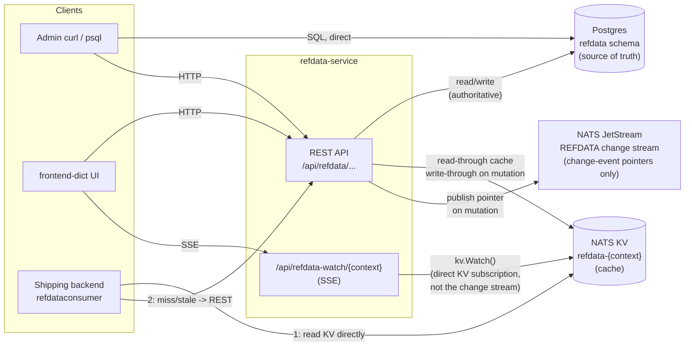
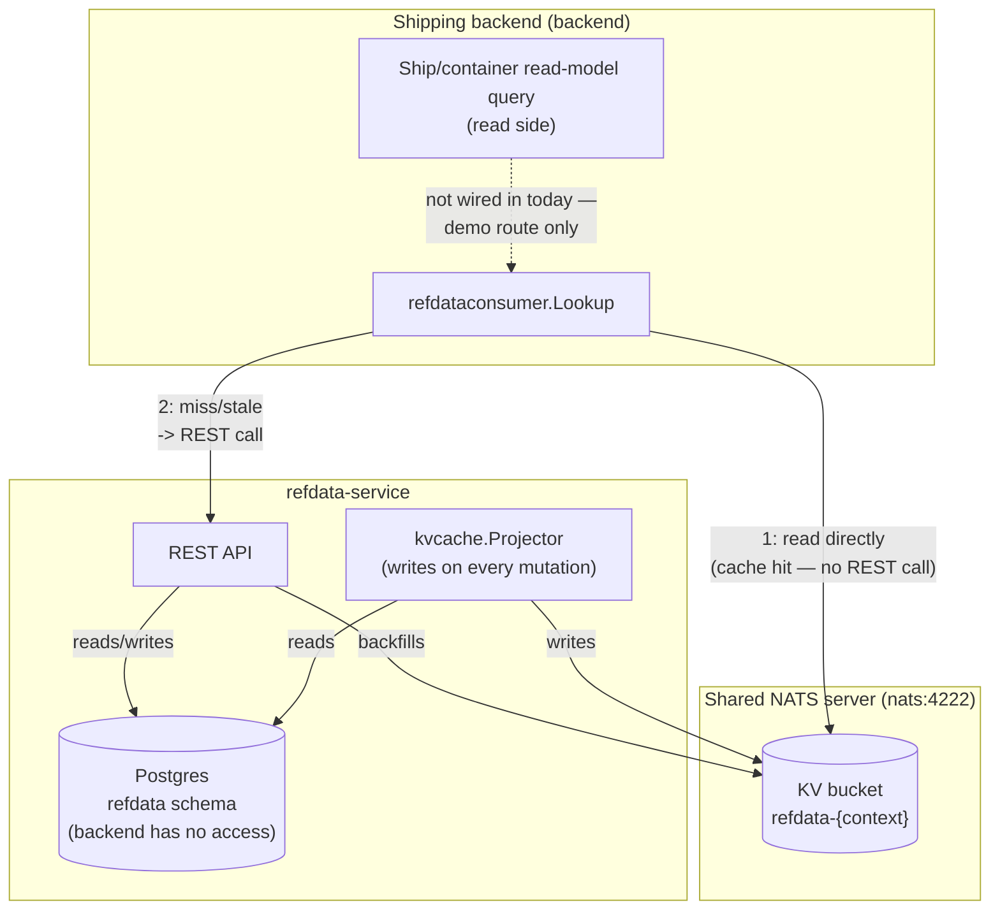
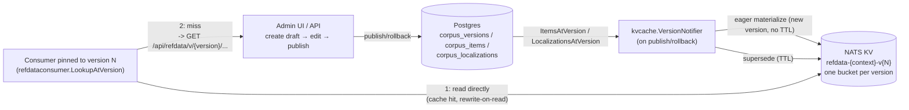
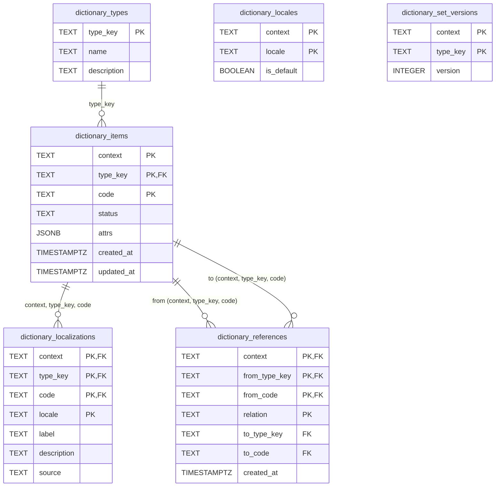

# Dictionary — Reference Data Service

Reference for `refdata-service`: how it's seeded, and its Postgres schema. For
the service's design rationale (Q5 versioned-read cache protocol, event-sourced
vs plain CRUD, KV bucket layout) see [ARCHITECTURE.md](ARCHITECTURE.md) §
"Reference Data Service" and `../../../../.claude/plans/Dictionary-Service-Plan.md`.

> This document owns the Reference Data feature's own backend/schema depth.
> For the operator-facing frontend surface over it (`frontend/refdata`,
> being rebranded "Tech Lab Operator" per Phase 36) — nav taxonomy, and how
> this feature relates to the platform's other operator-facing
> features — see [ARCHITECTURE-PLATFORM.md](ARCHITECTURE-PLATFORM.md),
> which treats this document's scope as one subset of its own.

---

## Seeding

`backend/refdata-service/refdata/seed.go` runs once at service startup
(`Startup` → `Seed`, `composition.go`), idempotently registering a
demo-sized subset of standard reference data across a two-level context tree
(Phase 16d flattened, Phase 22 updated — the tenant name never doubles as a
context, see BUSINESS_RULES-REFDATA.md's Phase 16 amendments):

```
_platform                     (reserved root, no tenant — PlatformContext)
  └── _default_bu              (platform-owned template, no tenant — DefaultBuContext)
```

`seed.go` itself only ever registers these two reserved roots — it has
never seeded any tenant-specific context, and Phase 22b did not change that.
What changed is what `_default_bu` *is*: through Phase 22 it was a shared
context directly assigned to any account with no business units of its
own — a real collision waiting to happen, since refdata's item tables key on
`(context, type_key, code)` with no tenant column, so two such accounts
wrote to the same rows. As of Phase 22b it is never assigned to a tenant at
all; it is the template every tenant's own default business unit (`{tenant}
-default`) is parented to instead — see "Contexts form a tree" below for
the full three-level shape this produces.

Every other context — `acme-pacific-fleet`, `acme-atlantic-fleet`,
`acme-default`, `globex-default`, and anything an operator registers through
the Admin UI — is registered dynamically by accounts-service, which calls
this service's `POST /api/refdata/admin/contexts` at BU-creation time: at
its own startup (`seedPreexistingAccounts` for each tenant's default,
`seedDemoBusinessUnits` for acme's two demo real BUs), and live via `POST
/api/accounts/{name}/business-units`. This keeps `seed.go` authoring only
the two reserved platform-level roots, and every tenant-specific or demo BU
context authored by accounts-service — the single writer of the
business-unit tier.

`_platform` is seeded via `ContextHandler.RegisterPlatformRoot`, the first
sanctioned exception to `ValidateContextName`'s rejection of a leading `_`
(BR-D33). `_default_bu` is seeded via `ContextHandler.RegisterDefaultBu`
(Phase 22, BR-D38) — the second and currently last exception. Both bypass
only the `_` prefix check; the NATS subject-token charset check still
applies. The public `POST /api/refdata/admin/contexts` endpoint always
rejects `_`-prefixed names via the full `ValidateContextName` — a tenant's
own default is not a third exception, since `{tenant}-default` carries no
leading `_` at all and registers through the same ordinary path as any real
business unit. See
[ARCHITECTURE-COMMUNICATIONS.md](ARCHITECTURE-COMMUNICATIONS.md) § 2.3 for
the `{context}` rule and `.claude/plans/Main-POC-Plan.md` Phase 16 decisions
11–13 for the fully-qualified-naming rationale.

**The seed data itself demonstrates inheritance**, not just registers a tree:
standards-based types (currency, country, incoterm, uom, hazard-class) are
seeded once under `_platform`; `ship-status` and `string` (UI-copy) are also
seeded under `_platform` — deliberately, since that data is universal and not
business-unit-specific (see `shipping-service`'s `refdataCompanyContext`,
which always resolves to `_platform`). `hazard-class` demonstrates all three
inheritance states from BR-V06/BR-V07 — codes `1`/`2`/`4`–`9` are plain
**inherited** from `_platform`, code `3` is **overridden** at `_default_bu`
with an Acme-specific advisory label, and code `X1` is an **addition** that
exists only at `_default_bu`. Because every tenant default now parents to
`_default_bu` rather than being `_default_bu`, this override/addition pair
demonstrates the same three inheritance states for *every* tenant's default
business unit, not just one shared context — a live check against
`acme-default`'s versioned corpus after Phase 22b shipped confirmed every
`_platform` currency item flows through with `sourceContext: "_platform"`.
`Seed` also idempotently drafts and publishes an initial corpus version for
each context it registers, parent-first — required for the chain to
actually inherit (a child's draft silently sees nothing from an ancestor
that has never published, see `publishInitialCorpus`'s doc comment) — so
this is genuinely observable via `GET /api/refdata/v/{version}/{context}/...`,
not just present in the working tables. accounts-service's own provisioning
of each tenant default reproduces this same parent-first drafting sequence,
gated on `_default_bu` already having a published corpus to inherit from
(`RefdataClient.WaitForPublishedAncestor`, BR-AC29) — necessary because
accounts-service and refdata-service start as independent containers with
no ordering guarantee between them.

Seeded types, each a `DictionaryType` (`type_key`, `name`, `description`):

| Type key | Description | Item count |
|---|---|---|
| `currency` | ISO 4217 currency codes (subset) | 35 |
| `country` | ISO 3166-1 alpha-2 country codes (subset) | 52 |
| `incoterm` | Incoterms 2020 delivery terms (complete) | 11 |
| `uom` | UNECE Recommendation 20 unit codes (subset) | 12 |
| `hazard-class` | UN dangerous goods hazard classes (complete) | 9 |
| `ship-status` | AIS navigational status (mirrors backend `ShipStatus`) | 5 |
| `string` | Port-UI chrome, actions, feedback, and accessibility copy | see `l10nSeed` |

`ship-status` is the first Shipping-domain enum onboarded into refdata — its
5 codes (`in-transit`, `docked`, `at-anchor`, `not-under-command`,
`restricted-manoeuvrability`) are duplicated by value from
`backend/shipping-service/dictionary/internal/domain/ship.go`'s `ShipStatus` constants; this
module has no Go dependency on the shipping backend, so the codes live here
as plain strings, not an import. The shipping backend does not yet read
these values back through `refdataconsumer` — today they exist in refdata
for lookup/localization purposes only, not as the backend's runtime source
for status codes.

For each type, `Seed` walks a `[]seedItem{code, name, nameEs}` list and:

1. `RegisterType` — upserts the `DictionaryType` row (idempotent; ignores
   `ErrDuplicateItemCode` on repeat runs).
2. For every `seedItem`, `RegisterItem` — creates the `DictionaryItem` with
   `Attrs: {"name": item.name}` (the `en` name only — `Attrs` is a
   set-level display convenience, not the localization mechanism).
3. `SetLocalization` — writes an `en` `Localization` row (`Label: item.name`)
   and an `es` `Localization` row (`Label: item.nameEs`) for the item. This
   is what makes the seed data resolvable through the locale-aware read path
   (`ResolveLabel`, BR-D03) rather than only available via the raw
   `Attrs["name"]`.

Before the per-type loop, `Seed` registers three locales — `en` (**default**),
`es`, and `af-za` — for each of the two reserved roots it owns, `_platform`
and `_default_bu`. Locales are **not** covered by corpus-inheritance
flattening (they sit on the same flat, non-inheriting read path as the live
item queries — see "Contexts form a tree" below), so a context with none of
its own has no effective default locale no matter how correctly its items
inherit. Every other context needs this done for it explicitly by whoever
registers it: accounts-service registers the same three locales for `acme`'s
and `globex`'s own default business units as part of provisioning them
(`RefdataClient.ProvisionDefaultContext`, BR-AC29) — real business units
(`acme-pacific-fleet`, `acme-atlantic-fleet`) do not currently get this same
treatment and rely on `_platform`'s locales alone. `en` as default gives
`ResolveLabel` a fallback to
land on when a caller requests a locale that hasn't been localized (e.g.
`fr-FR` with no French translations entered); the non-default locales exist
purely so the locale switcher and completeness tooling in the dictionary UI
(`refdata`) have more than one populated locale to exercise.

Net effect: every seeded item has an English `Attrs["name"]` plus proper
`en` and `es` localization rows (the fields the locale-resolution protocol
actually reads). No locale beyond `en`/`es` is seeded — further translations
are added at runtime through the dictionary UI, not by `Seed`.

`Seed` is safe to run repeatedly: `RegisterType`/`RegisterItem` tolerate
duplicates, and `SetLocalization` is an upsert keyed on
`(context, type_key, code, locale)`, so re-seeding does not create duplicate
localization rows or bump the type's set version beyond what the upsert
itself triggers.

## Type Categories & Governance

> **Status:** implemented in Phase 11.7. Every `DictionaryType` has a controlled
> `category`, and the Dictionary UI groups types by it. The categorization below
> is the governance model behind that field.

As the type registry grows, the types are not interchangeable — they fall into
categories that carry **different rules about who edits them and whether codes
are safe to change at runtime**. That governance difference (not cosmetics) is
the reason to formalize categories.

| Category | Examples | Source of truth | Who edits | Codes at runtime |
|---|---|---|---|---|
| Standards-based reference data | currency, country, incoterm, uom, hazard-class | external standards (ISO 4217/3166, Incoterms, UNECE, UN) | data stewards | rarely change; adds are safe |
| Domain enums | ship-status | the backend domain (`ShipStatus` consts) | developers own codes; stewards translate | ⚠️ adding/removing a code here is meaningless unless the domain emits it |
| UI copy / domain-string | domain-string | the frontend | translators | keys owned by devs; only labels are translatable |

The functionally critical line is **UI copy vs. everything else**: UI copy is
not reference data at all, and must be namespaced so its keys never leak into
business/reference-data queries. The standards-vs-domain-enum distinction is
more informational, but still worth surfacing — e.g. a steward should not
invent `ship-status` codes the shipping backend will never emit.

`category` is orthogonal to `context` (the company / business-unit scope —
**not** the tenant, which is the NATS account, and **not** the region, which is
a deployment concern; see
[ARCHITECTURE-COMMUNICATIONS.md](ARCHITECTURE-COMMUNICATIONS.md) § 2.3):
context scopes *which data set*, category classifies *what kind of type* it is.

## Shipping UI Dictionary Map

The Port UI uses the Dictionary service in two deliberately different ways:
`string` owns all human-facing chrome, while `ship-status` owns the labels for
the one coded shipping enum the UI currently renders. The selected locale is
shared across both paths. Free-form port names and client-derived container
buckets are intentionally not Dictionary types.

The editable Draw.io source workbook lives beside this document, and the exported
PNGs are kept in `images/` for Markdown rendering. Regenerate all exports
from `demos/01-dictionary/` with `./diagrams/export-png.sh`.


Editable Draw.io source: [architecture-dictionary.drawio](architecture-dictionary.drawio), page `Shipping UI dictionary ownership map`

### Localized rendering lifecycle

The generated fallback makes first paint deterministic. Once live data is
available, `useL10nCopy` and `useRefdataLabels` overlay the selected locale and
refresh after the KV-watch-backed SSE signal. The fallback is therefore a
resilience layer, not a second editorial source.


Editable Draw.io source: [architecture-dictionary.drawio](architecture-dictionary.drawio), page `Localized rendering lifecycle`

### Runtime sequence

The runtime sequence makes the client-facing query contract explicit: a normal
KV hit, the miss/stale REST fallback, and the mutation-to-SSE refresh path.


Editable Draw.io source: [architecture-dictionary.drawio](architecture-dictionary.drawio), page `Shipping UI Dictionary read sequence`

## Data Access Paths

Three ways to reach the same data, one source of truth. Postgres is
authoritative; NATS KV is a cache kept in sync with it; the NATS JetStream
change stream carries only invalidation *pointers*, never values.



**Path 1 — Postgres directly.** SQL against `refdata.*` tables. Always
correct, bypasses every cache. Use this when you need ground truth or are
debugging a stale-cache suspicion.

**Path 2 — REST.** The service's own read path (`GET
/api/refdata/{context}/{type}/{code}`, etc.). Internally it's cache-first:
check KV → if present and its stamped version matches
`dictionary_set_versions`, return it; if missing or stale, read Postgres,
backfill KV, then return. This is what `refdata` and most callers
should use — it always resolves to something correct, and it's what keeps
KV warm.

**Path 3 — NATS KV, refdata-service-internal only.** The `refdata-{context}`
bucket is read cache-first inside the service's own handlers — both REST
(Path 2) and `rpc.*` (see `ARCHITECTURE-COMMUNICATIONS.md` § 9) — checking a
key's stamped `version` against its type's `_meta`, and backfilling from
Postgres on a miss or mismatch. It is **not** a retrieval path for another
service. Until Phase 12.12 the shipping backend's `refdataconsumer` read this
bucket directly and fell back to REST; that was a bounded-context violation —
one service reaching into another's internal datastore — and was removed
(BR-D08/BR-D28). Cross-service reads go through `rpc.*` exclusively; the
cache tier still serves them, but invisibly, from inside refdata-service.

> **Not contradicted by the Admin UI's cross-account panels (Phase 30, moved
> from shipping-service — was Phase 24 pre-2026-08-16).**
> `observability-service` (not `shipping-service`, since Phase 30h) enumerates
> these buckets and the `REFDATA` stream, and returns their contents, via
> `GET /api/kv/buckets` and `GET /api/jetstream/streams|replay` on its own
> port (see [ARCHITECTURE-COMMUNICATIONS.md](ARCHITECTURE-COMMUNICATIONS.md)
> § 12, and that section's own Phase 30 amendment for the extraction detail).
> That is an **operator diagnostic surface, not a retrieval path**: nothing in
> the shipping domain reads it, no business logic depends on it, and removing
> it would change no behaviour — true before and after the Phase 30 move.
> BR-D08/BR-D28's rule is about where a service gets the reference data it
> acts on — that answer is still `rpc.*` only. The distinction to hold onto is
> *who is asking*: a human inspecting a deployment is not a bounded context.

### KV Key Layout

Keys are subject tokens, and the layout uses that (BR-D31):

```
{namespace}{type_key}.{code}    an item's cache entry
{namespace}{type_key}._meta     the type's version/count stamp
```

`{namespace}` is `enum.` for a type whose category (BR-D09) is `domain-enum`,
and empty for every other category — so `enum.ship-status.in-transit` and
`enum.ship-status._meta`, but plain `currency.EUR` and `currency._meta`. A
type's items and its stamp share one namespace, giving each type exactly one
addressable subtree and each category one wildcard (`enum.>`) for watches and
NATS permissions.

The namespace is derived from the type's existing category via
`kvcache.TypeNamespaces` (memoized, so a cache hit never costs a Postgres
lookup) — items carry no namespace field of their own. This is deliberately
key-prefix namespacing rather than bucket-per-type: a bucket is a JetStream
stream, so per-type buckets would multiply to `contexts × types × versions`
streams and make type registration a stream-admin operation, all to obtain
filtering that prefixes already give. See BR-D31 for the full trade-off.

**Not a retrieval path — the change stream.** The `REFDATA` JetStream stream
carries only a pointer (`{context, type_key, code}` + the new version),
published on every mutation. It cannot answer "what is this item's value"
by itself; nothing in this codebase currently consumes it as a push
signal — it exists as a bounded, replayable audit trail of *that* a change
happened. The live cache-status widget in `refdata` is driven by a
separate mechanism: its SSE stream (`/api/refdata-watch/{context}`) does its
own direct `kv.Watch()` on the KV bucket, not a subscription to this stream.
See "Push for freshness, version for truth" in
`.claude/plans/Dictionary-Service-Plan.md` (Q5).

## Cross-Service Consumption

How the shipping backend (`demos/01-dictionary/backend/shipping-service/`) reads this
service's reference data — read-side only. Reference-data lookups
(resolving a display label, a hazard-class name, a port's country) are
never part of the shipping domain's write path — commands validate against
fixed business rules, not against refdata — and today's ship/container
**read-model queries don't depend on refdata at all** (see
`backend/shipping-service/dictionary/internal/application/queries/` and
`internal/eventhandler/` — neither references it). The one place the
backend does consume refdata is its standalone demo route, `GET
/api/refdata-demo/{context}/{type}/{code}`, which exercises the pattern any
future read-side reconstruction would use if it needed to resolve a label
while assembling a response.

That consumption works because **both services connect to the same NATS
server** — `NATS_URL=nats://nats:4222` for both `shipping-service` and
`refdata-service` in `docker-compose.yml`. What they no longer share is an
*account*: `refdata-service` authenticates on **PLATFORM**, while
`shipping-service` opens one connection per tenant account (plus its
restricted PLATFORM admin connection). So the `refdata-{context}` buckets live
on PLATFORM, and a tenant connection cannot address them at all.

- `refdata-service` owns and writes the `refdata-{context}` bucket (via its
  `kvcache.Projector`, on every mutation).
- The shipping backend reaches reference data over `rpc.*` only
  (`refdataconsumer`, BR-D08/BR-D28 — the `Deps.Refdata` field is annotated
  "no KV dep" precisely so this doesn't regress).

> **Superseded — this was once a convention, and is now an enforced boundary.**
> Through Phase 12.11 the shipping backend's `refdataconsumer` opened a
> `KeyValue` handle to that same bucket name over its own connection and read
> it directly, and this section correctly noted that nothing at the NATS level
> stopped it: "refdata-service owns this bucket" was a codebase convention, no
> accounts or permissions were configured, and only a comment in
> `composition.go` marked the line. Two changes since then made it real. Phase
> 12.12 removed the direct read (BR-D08/BR-D28) as a bounded-context
> violation, and **operator mode put the two services in different NATS
> accounts**, which the server enforces — a tenant-credentialed connection
> asking for `refdata-acme` does not get a permission warning about someone
> else's bucket, it gets nothing, because that bucket is not in its account's
> namespace. The convention is now the weaker of the two guarantees.
>
> The one place this is visible from shipping-service is the Admin UI's
> cross-account KV/Streams panels, and only because they were given a
> *separate, unrestricted PLATFORM credential* to do it with — see § 12 of
> [ARCHITECTURE-COMMUNICATIONS.md](ARCHITECTURE-COMMUNICATIONS.md). That the
> panels needed a second credential at all is the clearest demonstration that
> the boundary holds: the ordinary connections genuinely cannot see across it.

Postgres is isolated more strongly still, and by a second mechanism: since the
database-per-service split, `refdata` is not a schema in the shared Postgres
but its **own Postgres instance** (`lb-refdata-postgres`, host port 5433). The
shipping backend has no credential for it and no network path to its data that
isn't `rpc.*`.



Net effect: if reconstruction ever needed a reference-data label, it would
be a **read-only, KV-first lookup** — cheap and local on a hit, falling
through to a REST call to refdata-service only on a miss or a stale
version, exactly as described above in "Data Access Paths".

## Corpus Versioning, Tenancy & Template Inheritance (Phase 12)

Full design rationale, data model, and open-question resolutions live in
[Refdata-Versioning-Tenancy-Design.md](../../../../.claude/plans/Refdata-Versioning-Tenancy-Design.md).
This section covers what changed for a *consumer* of the service, once
Phase 12 sits alongside the unversioned Q5 protocol described above — the
unversioned `refdata-{context}` bucket and REST paths are unchanged and
keep serving "current working-table state" exactly as before; everything
below is additive.

**Contexts form a tree**, not a flat namespace. The real demo tree (Phase
16d flattened, Phase 22b re-shaped — see this document's Seeding section
above) is now three levels, not two:

```
_platform
  ├── acme-pacific-fleet         (real BU, tenant: acme)
  ├── acme-atlantic-fleet        (real BU, tenant: acme)
  └── _default_bu                (platform-owned template, untenanted)
        ├── acme-default         (tenant acme's own default BU)
        └── globex-default       (tenant globex's own default BU)
```

Real business-unit contexts parent directly to `_platform`; a tenant's
default business unit parents to `_default_bu` instead, so its own hazard-
class demo override (below) reaches every tenant default without also
reaching every tenant's real, named business units. Contexts are registered
via `POST /api/refdata/admin/contexts` for ordinary business-unit contexts
(real or default alike — only the `parent` value differs), or
`ContextHandler.RegisterPlatformRoot`/`RegisterDefaultBu` for the two
reserved roots (the only two exceptions `POST /api/refdata/admin/contexts`
itself always rejects — BR-D33/BR-D38). A context inherits every item its
ancestors registered; it may add its own items or override an inherited one,
but it can never delete an inherited item (BR-V06) — an override only ever
wins for that item, never removes it from view.

**This inheritance is corpus-path only.** The flattening described next
happens when a draft is created and published — the *unversioned*
`refdata-{context}` bucket and the plain `GET /api/refdata/{context}/...`
REST routes read a flat `WHERE context = $1` with no ancestor traversal at
all, so a freshly-provisioned context (a new tenant default, for instance)
resolves correctly through the versioned API but appears empty through
those unversioned paths until that gap is closed (`Main-POC-Plan.md` Phase
106).

**A corpus version is an immutable, flattened snapshot** of one context's
full effective item set — every inherited item plus every local
addition/override, already resolved, so a read never walks the inheritance
chain. Versions go through `draft → published`, and a rollback creates a
**new** forward-numbered published version rather than rewriting history
(BR-V04/V05) — old and new versions **coexist indefinitely**, which is what
makes version pinning (below) meaningful.

**Hybrid KV materialization (Phase 12.5):** every publish or rollback
eagerly writes that version's full flattened content into its own bucket,
`refdata-{context}-v{N}` — distinct from the unversioned `refdata-{context}`
bucket. The version that is currently the latest published one has no TTL;
every other version's bucket carries a 30-day TTL (`kvcache.SupersededVersionTTL`),
and every versioned read rewrites the key it just fetched back to the
bucket — "rewrite-on-read" — which resets that key's TTL clock. A version a
consumer is actively pinned to therefore never expires under it; a version
nobody reads anymore ages out on its own.



**Version-pinned consumption (Phase 12.7):** `refdataconsumer.Consumer` gained
`LookupAtVersion(ctx, context, version, typeKey, code, locale)` alongside the
existing unversioned `Lookup` — the two are independent read paths, not a
replacement. `LookupAtVersion` reads `refdata-{context}-v{N}` directly (a
cache hit needs no call into refdata-service at all, same "shared NATS
server" convention the unversioned path already relies on — see "Cross-Service
Consumption" above); a miss falls back to
`GET /api/refdata/v/{version}/{context}/{type}/{code}` (or `.../v/latest/...`
for "whatever is currently published"), which returns the full materialized
entry — every locale, no server-side `?locale=` resolution — so the consumer
resolves the label locally with the same fallback chain (BR-D03) it already
uses for the unversioned path.

A plain list of changed keys between any two versions is available via
`GET /api/refdata/admin/corpus/{context}/diff/{v1}/{v2}` — added/removed/changed,
per the deliberately minimal audit-scope decision (§6.2 of the design doc).

**Known gaps, left for a later phase:** the admin versioning UI (context
hierarchy viewer, draft editor, publish/rollback controls, diff viewer) is
not yet built into `frontend/refdata`; KV bucket cleanup once a version has
no pinned consumers is deferred to a future pin registry (the design doc's
resolved open question 4); and `corpus_references` exists in the schema but
nothing yet populates or flattens typed references the way items and
localizations are.

## Database Schema

Own Postgres schema (`refdata`) on its own Postgres *instance* — `refdata-postgres` in
`docker-compose.yml`, a fully separate database server from the `postgres` container the shipping
backend uses (tightened 2026-07-27; previously the same physical database, `dictionary`, with only
schema-level separation). No shared tables, no shared instance — `CREATE SCHEMA IF NOT EXISTS
refdata` (`internal/postgres/migrate.go`) runs against a database refdata-service exclusively owns.
Postgres is the sole source of truth; NATS JetStream/KV are cache and change-notification only, and
now the only infrastructure this service shares with the shipping backend at all (see
ARCHITECTURE.md § "Reference Data Service").



Notes on the model:

- **Identity has no surrogate key.** `dictionary_items` is keyed on the
  natural composite `(context, type_key, code)` — reference data has no
  external interchange standard forcing a surrogate, unlike `Container`
  (Phase 8.3).
- **No per-item version column.** Versioning is a property of the *type's
  whole set*, not the row — tracked in `dictionary_set_versions` and stamped
  onto the KV cache entry (`kvcache.Entry.Version`) on every mutation
  (BR-D04). `dictionary_items` originally had a `version` column; it's now
  dropped (`ALTER TABLE ... DROP COLUMN IF EXISTS version`) in favor of the
  set-level version.
- **`dictionary_localizations.source`** is `"manual"` or `"ai"` (BR-D07 —
  AI-translation review gating is not yet enforced). `Seed` always writes
  `"manual"`.
- **`dictionary_locales.is_default`** — at most one default locale per
  context; `AddLocale` unsets any prior default in the same transaction
  before upserting.
- **Cascades:** deleting an item cascades to its localizations
  (`ON DELETE CASCADE`) and to references where it is the `from` side; it
  does not cascade on the `to` side (an item cannot be hard-deleted while
  still referenced — BR-D02 — enforced in the domain layer, not by the FK).
