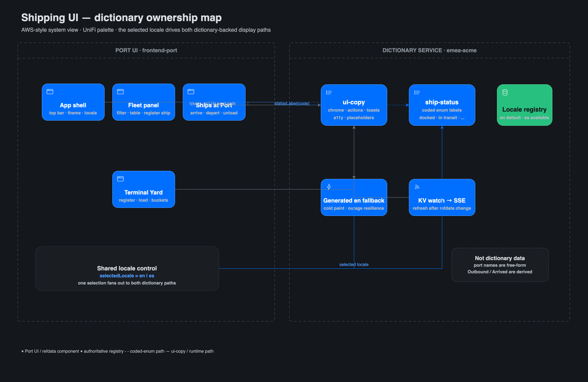
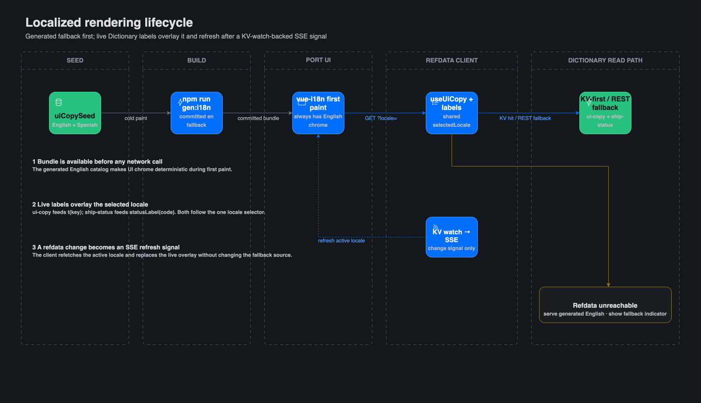
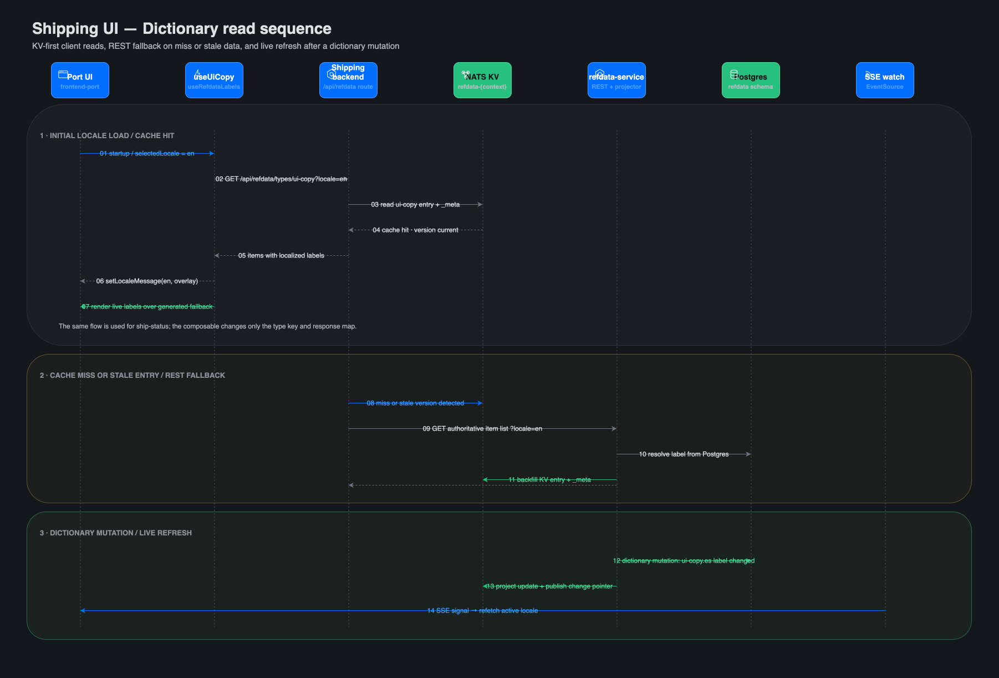
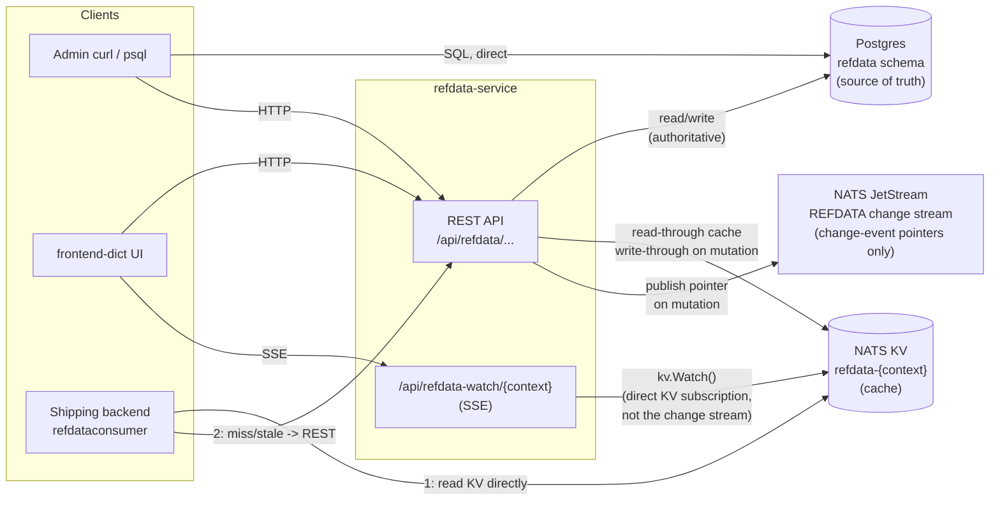
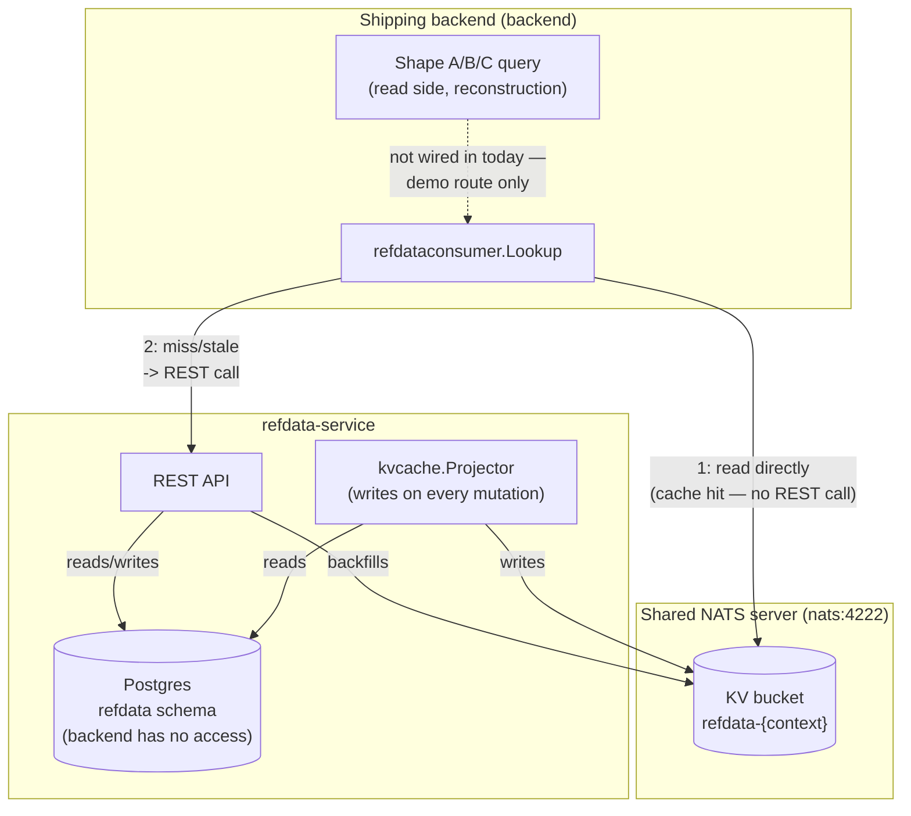
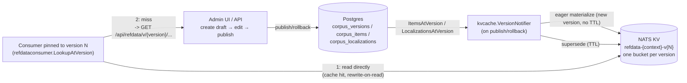
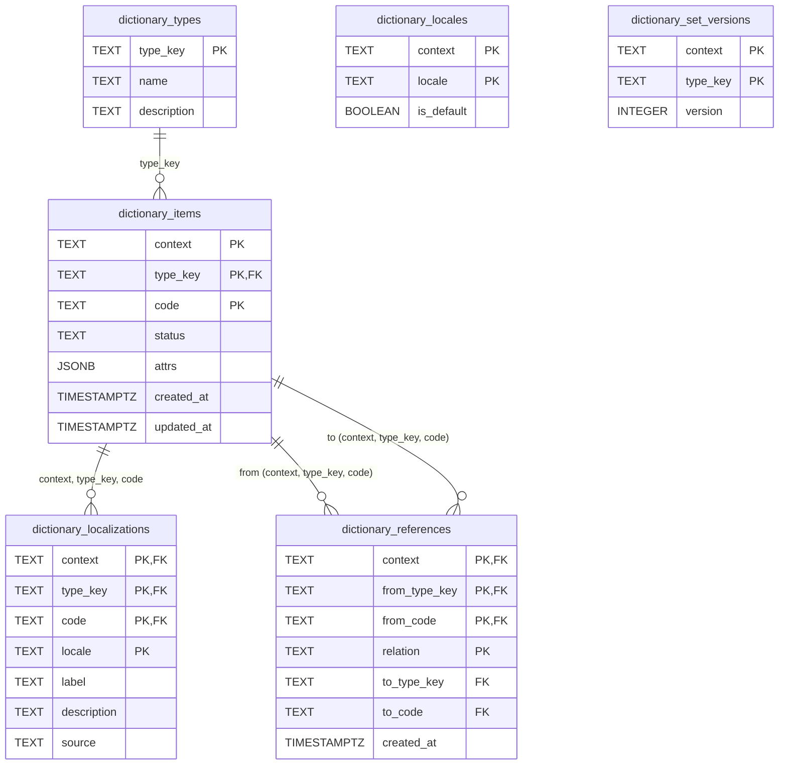

# Dictionary — Reference Data Service

Reference for `refdata-service`: how it's seeded, and its Postgres schema. For
the service's design rationale (Q5 versioned-read cache protocol, event-sourced
vs plain CRUD, KV bucket layout) see [ARCHITECTURE.md](ARCHITECTURE.md) §
"Reference Data Service" and `../../../../.claude/plans/Dictionary-Service-Plan.md`.

---

## Seeding

`backend/refdata-service/refdata/seed.go` runs once at service startup
(`Startup` → `Seed`, `composition.go`), idempotently registering a
demo-sized subset of standard reference data under the tenant/region context
`emea-acme` (`DefaultContext`, matching the shipping backend's convention).

Seeded types, each a `DictionaryType` (`type_key`, `name`, `description`):

| Type key | Description | Item count |
|---|---|---|
| `currency` | ISO 4217 currency codes (subset) | 35 |
| `country` | ISO 3166-1 alpha-2 country codes (subset) | 52 |
| `incoterm` | Incoterms 2020 delivery terms (complete) | 11 |
| `uom` | UNECE Recommendation 20 unit codes (subset) | 12 |
| `hazard-class` | UN dangerous goods hazard classes (complete) | 9 |
| `ship-status` | AIS navigational status (mirrors backend `ShipStatus`) | 5 |
| `ui-copy` | Port-UI chrome, actions, feedback, and accessibility copy | see `uiCopySeed` |

`ship-status` is the first Shipping-domain enum onboarded into refdata — its
5 codes (`in-transit`, `docked`, `at-anchor`, `not-under-command`,
`restricted-manoeuvrability`) are duplicated by value from
`backend/shipping-service/dictionary/internal/domain/ship.go`'s `ShipStatus` constants; this
module has no Go dependency on the shipping backend, so the codes live here
as plain strings, not an import. The shipping backend does not yet read
these values back through `refdataconsumer` — today they exist in refdata
for lookup/localization purposes only, not as the backend's runtime source
for status codes.

For each type, `Seed` walks a `[]seedItem{code, name, nameEs}` list and:

1. `RegisterType` — upserts the `DictionaryType` row (idempotent; ignores
   `ErrDuplicateItemCode` on repeat runs).
2. For every `seedItem`, `RegisterItem` — creates the `DictionaryItem` with
   `Attrs: {"name": item.name}` (the `en` name only — `Attrs` is a
   set-level display convenience, not the localization mechanism).
3. `SetLocalization` — writes an `en` `Localization` row (`Label: item.name`)
   and an `es` `Localization` row (`Label: item.nameEs`) for the item. This
   is what makes the seed data resolvable through the locale-aware read path
   (`ResolveLabel`, BR-D03) rather than only available via the raw
   `Attrs["name"]`.

Before the per-type loop, `Seed` registers two locales for `emea-acme`:
`AddLocale(ctx, DefaultContext, "en", true)` — `en` as the **default**
locale, so `ResolveLabel` has a fallback to land on when a caller requests a
locale that hasn't been localized (e.g. `fr-FR` with no French translations
entered) — and `AddLocale(ctx, DefaultContext, "es", false)`, a second,
non-default locale seeded purely so the locale switcher and completeness
tooling in the dictionary UI (`refdata`) have more than one populated
locale to exercise.

Net effect: every seeded item has an English `Attrs["name"]` plus proper
`en` and `es` localization rows (the fields the locale-resolution protocol
actually reads). No locale beyond `en`/`es` is seeded — further translations
are added at runtime through the dictionary UI, not by `Seed`.

`Seed` is safe to run repeatedly: `RegisterType`/`RegisterItem` tolerate
duplicates, and `SetLocalization` is an upsert keyed on
`(context, type_key, code, locale)`, so re-seeding does not create duplicate
localization rows or bump the type's set version beyond what the upsert
itself triggers.

## Type Categories & Governance

> **Status:** implemented in Phase 11.7. Every `DictionaryType` has a controlled
> `category`, and the Dictionary UI groups types by it. The categorization below
> is the governance model behind that field.

As the type registry grows, the types are not interchangeable — they fall into
categories that carry **different rules about who edits them and whether codes
are safe to change at runtime**. That governance difference (not cosmetics) is
the reason to formalize categories.

| Category | Examples | Source of truth | Who edits | Codes at runtime |
|---|---|---|---|---|
| Standards-based reference data | currency, country, incoterm, uom, hazard-class | external standards (ISO 4217/3166, Incoterms, UNECE, UN) | data stewards | rarely change; adds are safe |
| Domain enums | ship-status | the backend domain (`ShipStatus` consts) | developers own codes; stewards translate | ⚠️ adding/removing a code here is meaningless unless the domain emits it |
| UI copy / i18n | ui-copy | the frontend | translators | keys owned by devs; only labels are translatable |

The functionally critical line is **UI copy vs. everything else**: UI copy is
not reference data at all, and must be namespaced so its keys never leak into
business/reference-data queries. The standards-vs-domain-enum distinction is
more informational, but still worth surfacing — e.g. a steward should not
invent `ship-status` codes the shipping backend will never emit.

`category` is orthogonal to `context` (tenant/region, e.g. `emea-acme`): context
scopes *which data set*, category classifies *what kind of type* it is.

## Shipping UI Dictionary Map

The Port UI uses the Dictionary service in two deliberately different ways:
`ui-copy` owns all human-facing chrome, while `ship-status` owns the labels for
the one coded shipping enum the UI currently renders. The selected locale is
shared across both paths. Free-form port names and client-derived container
buckets are intentionally not Dictionary types.

The editable Draw.io source workbook lives beside this document, and the exported
PNGs are kept in `images/` for Markdown rendering. Regenerate all exports
from `demos/01-dictionary/` with `./diagrams/export-png.sh`.

Editable Draw.io source: [architecture-dictionary.drawio](architecture-dictionary.drawio), page `Shipping UI dictionary ownership map`

### Localized rendering lifecycle

The generated fallback makes first paint deterministic. Once live data is
available, `useUiCopy` and `useRefdataLabels` overlay the selected locale and
refresh after the KV-watch-backed SSE signal. The fallback is therefore a
resilience layer, not a second editorial source.

Editable Draw.io source: [architecture-dictionary.drawio](architecture-dictionary.drawio), page `Localized rendering lifecycle`

### Runtime sequence

The runtime sequence makes the client-facing query contract explicit: a normal
KV hit, the miss/stale REST fallback, and the mutation-to-SSE refresh path.

Editable Draw.io source: [architecture-dictionary.drawio](architecture-dictionary.drawio), page `Shipping UI Dictionary read sequence`

## Data Access Paths

Three ways to reach the same data, one source of truth. Postgres is
authoritative; NATS KV is a cache kept in sync with it; the NATS JetStream
change stream carries only invalidation *pointers*, never values.

**Path 1 — Postgres directly.** SQL against `refdata.*` tables. Always
correct, bypasses every cache. Use this when you need ground truth or are
debugging a stale-cache suspicion.

**Path 2 — REST.** The service's own read path (`GET
/api/refdata/{context}/{type}/{code}`, etc.). Internally it's cache-first:
check KV → if present and its stamped version matches
`dictionary_set_versions`, return it; if missing or stale, read Postgres,
backfill KV, then return. This is what `refdata` and most callers
should use — it always resolves to something correct, and it's what keeps
KV warm.

**Path 3 — NATS KV directly.** Consumers embedded in another service (e.g.
the shipping backend's `refdataconsumer.Lookup`) read the
`refdata-{context}` bucket directly, keyed `{type_key}.{code}`, checking the
entry's `version` against the type's `{type_key}._meta`. On a hit, no
network call to refdata-service is needed at all — that's the point of the
cache. On a miss or version mismatch, the consumer falls back to **Path 2**
(REST), which also repairs the cache entry for the next reader.

**Not a retrieval path — the change stream.** The `REFDATA` JetStream stream
carries only a pointer (`{context, type_key, code}` + the new version),
published on every mutation. It cannot answer "what is this item's value"
by itself; nothing in this codebase currently consumes it as a push
signal — it exists as a bounded, replayable audit trail of *that* a change
happened. The live cache-status widget in `refdata` is driven by a
separate mechanism: its SSE stream (`/api/refdata-watch/{context}`) does its
own direct `kv.Watch()` on the KV bucket, not a subscription to this stream.
See "Push for freshness, version for truth" in
`.claude/plans/Dictionary-Service-Plan.md` (Q5).

## Cross-Service Consumption

How the shipping backend (`demos/01-dictionary/backend/shipping-service/`) reads this
service's reference data — read-side only. Reference-data lookups
(resolving a display label, a hazard-class name, a port's country) are
never part of the shipping domain's write path — commands validate against
fixed business rules, not against refdata — and today's Shape A/B/C
**reconstruction queries don't depend on refdata at all** (see
`backend/shipping-service/dictionary/internal/application/queries/` and
`internal/eventhandler/` — neither references it). The one place the
backend does consume refdata is its standalone demo route, `GET
/api/refdata-demo/{context}/{type}/{code}`, which exercises the pattern any
future read-side reconstruction would use if it needed to resolve a label
while assembling a response.

That consumption works because **both services connect to the same NATS
server** — `NATS_URL=nats://nats:4222` for both `shipping-service` and
`refdata-service` in `docker-compose.yml`. A JetStream KV bucket lives on
the NATS server itself, not inside whichever process created it, so:

- `refdata-service` owns and writes the `refdata-{context}` bucket (via its
  `kvcache.Projector`, on every mutation).
- The shipping backend's `refdataconsumer` opens a `KeyValue` handle to that
  *same* bucket name over its own JetStream connection and reads it
  directly — no call into refdata-service's process for a cache hit.

There's no NATS-level access control separating the two services (no
accounts/permissions configured) — "refdata-service owns this bucket" is a
codebase convention (see the comment in `backend/shipping-service/dictionary/composition.go`),
not an enforced boundary. Postgres, by contrast, *is* genuinely isolated:
the backend has no access to the `refdata` schema at all; every refdata read
that isn't served from the shared KV cache must go through refdata-service's
REST API.

Net effect: if reconstruction ever needed a reference-data label, it would
be a **read-only, KV-first lookup** — cheap and local on a hit, falling
through to a REST call to refdata-service only on a miss or a stale
version, exactly as described above in "Data Access Paths".

## Corpus Versioning, Tenancy & Template Inheritance (Phase 12)

Full design rationale, data model, and open-question resolutions live in
[Refdata-Versioning-Tenancy-Design.md](../../../../.claude/plans/Refdata-Versioning-Tenancy-Design.md).
This section covers what changed for a *consumer* of the service, once
Phase 12 sits alongside the unversioned Q5 protocol described above — the
unversioned `refdata-{context}` bucket and REST paths are unchanged and
keep serving "current working-table state" exactly as before; everything
below is additive.

**Contexts form a tree**, not a flat namespace: `global → emea → emea-acme`,
registered via `POST /api/refdata/admin/contexts`. A context inherits every
item its ancestors registered; it may add its own items or override an
inherited one, but it can never delete an inherited item (BR-V06) — an
override only ever wins for that item, never removes it from view.

**A corpus version is an immutable, flattened snapshot** of one context's
full effective item set — every inherited item plus every local
addition/override, already resolved, so a read never walks the inheritance
chain. Versions go through `draft → published`, and a rollback creates a
**new** forward-numbered published version rather than rewriting history
(BR-V04/V05) — old and new versions **coexist indefinitely**, which is what
makes version pinning (below) meaningful.

**Hybrid KV materialization (Phase 12.5):** every publish or rollback
eagerly writes that version's full flattened content into its own bucket,
`refdata-{context}-v{N}` — distinct from the unversioned `refdata-{context}`
bucket. The version that is currently the latest published one has no TTL;
every other version's bucket carries a 30-day TTL (`kvcache.SupersededVersionTTL`),
and every versioned read rewrites the key it just fetched back to the
bucket — "rewrite-on-read" — which resets that key's TTL clock. A version a
consumer is actively pinned to therefore never expires under it; a version
nobody reads anymore ages out on its own.

**Version-pinned consumption (Phase 12.7):** `refdataconsumer.Consumer` gained
`LookupAtVersion(ctx, context, version, typeKey, code, locale)` alongside the
existing unversioned `Lookup` — the two are independent read paths, not a
replacement. `LookupAtVersion` reads `refdata-{context}-v{N}` directly (a
cache hit needs no call into refdata-service at all, same "shared NATS
server" convention the unversioned path already relies on — see "Cross-Service
Consumption" above); a miss falls back to
`GET /api/refdata/v/{version}/{context}/{type}/{code}` (or `.../v/latest/...`
for "whatever is currently published"), which returns the full materialized
entry — every locale, no server-side `?locale=` resolution — so the consumer
resolves the label locally with the same fallback chain (BR-D03) it already
uses for the unversioned path.

A plain list of changed keys between any two versions is available via
`GET /api/refdata/admin/corpus/{context}/diff/{v1}/{v2}` — added/removed/changed,
per the deliberately minimal audit-scope decision (§6.2 of the design doc).

**Known gaps, left for a later phase:** the admin versioning UI (context
hierarchy viewer, draft editor, publish/rollback controls, diff viewer) is
not yet built into `frontend/refdata`; KV bucket cleanup once a version has
no pinned consumers is deferred to a future pin registry (the design doc's
resolved open question 4); and `corpus_references` exists in the schema but
nothing yet populates or flattens typed references the way items and
localizations are.

## Database Schema

Own Postgres schema (`refdata`), same physical database (`dictionary`) as the
shipping backend, no shared tables — `CREATE SCHEMA IF NOT EXISTS refdata`
(`internal/postgres/migrate.go`). Postgres is the sole source of truth; NATS
JetStream/KV are cache and change-notification only (see ARCHITECTURE.md §
"Reference Data Service").

Notes on the model:

- **Identity has no surrogate key.** `dictionary_items` is keyed on the
  natural composite `(context, type_key, code)` — reference data has no
  external interchange standard forcing a surrogate, unlike `Container`
  (Phase 8.3).
- **No per-item version column.** Versioning is a property of the *type's
  whole set*, not the row — tracked in `dictionary_set_versions` and stamped
  onto the KV cache entry (`kvcache.Entry.Version`) on every mutation
  (BR-D04). `dictionary_items` originally had a `version` column; it's now
  dropped (`ALTER TABLE ... DROP COLUMN IF EXISTS version`) in favor of the
  set-level version.
- **`dictionary_localizations.source`** is `"manual"` or `"ai"` (BR-D07 —
  AI-translation review gating is not yet enforced). `Seed` always writes
  `"manual"`.
- **`dictionary_locales.is_default`** — at most one default locale per
  context; `AddLocale` unsets any prior default in the same transaction
  before upserting.
- **Cascades:** deleting an item cascades to its localizations
  (`ON DELETE CASCADE`) and to references where it is the `from` side; it
  does not cascade on the `to` side (an item cannot be hard-deleted while
  still referenced — BR-D02 — enforced in the domain layer, not by the FK).
