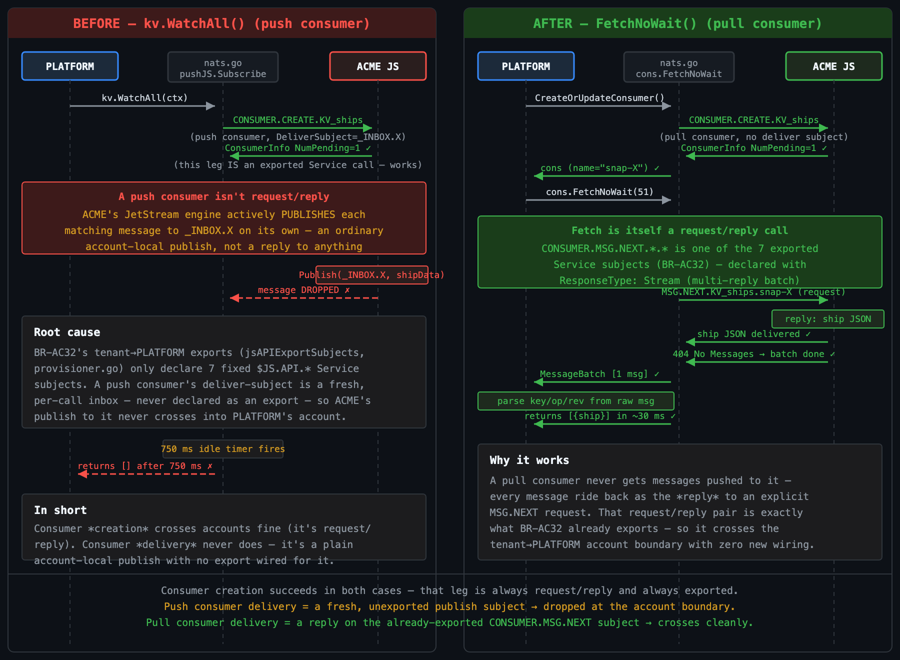
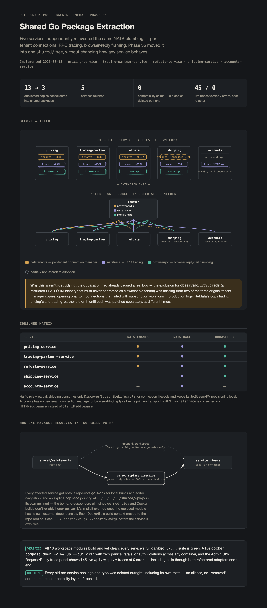

# Observability Service — Cross-Account NATS Diagnostics

Reference for `observability-service`: the PLATFORM-account service that owns
cross-account NATS/JetStream diagnostics and the request/reply trace store.
It was extracted from `shipping-service` in Phase 30 (2026-08-16), once
`shipping-service` was no longer the only service holding a PLATFORM
connection with visibility into every tenant account. For the underlying
NATS operator-mode trust chain and the "PLATFORM connection(s)" pattern this
service is an instance of, see
[ARCHITECTURE-ACCOUNTS.md](ARCHITECTURE-ACCOUNTS.md). For the `obs.*` subject
family, the `natstrace`/`browserrpc` wire protocol, and the cross-account
diagnostic-scope argument, see
[ARCHITECTURE-COMMUNICATIONS.md](ARCHITECTURE-COMMUNICATIONS.md) §6 and §12.

> This document owns `observability-service`'s own backend: its NATS
> credential/grant surface, its REST endpoint set, and its trace-store and
> account-activity-history internals. It does **not** re-describe the Admin
> UI panels that consume these endpoints — those panels' design history,
> shared UI conventions, and data-flow archetypes belong to
> [ARCHITECTURE-ADMIN.md](ARCHITECTURE-ADMIN.md) §3–4, which this doc treats
> as the UI-side counterpart. Read that document for "what the operator
> sees"; read this one for "how the backend answers it."

---

## 1. Why this is its own service

Six diagnostic REST endpoints and the `TRACES` stream's projection consumer
originally lived in `shipping-service` purely because it happened to be the
one service holding live NATS connections into both PLATFORM and every
tenant account — none of it is shipping domain logic. Phase 30 extracted
them into a new service, matching the `obs.*` subject family CLAUDE.md
reserves for observability, and giving future system/performance telemetry
a natural home that isn't a domain service.

`otlp-bridge` was evaluated and left separate — it is already correctly
scoped to OTLP re-export and has no cross-account NATS surface of its own.

**Design constraint carried through the whole extraction:** `observability-service`
ends with exactly **one** NATS connection, PLATFORM-scoped and narrowly
restricted — never a `.creds` file into any tenant account, and never a
second unrestricted PLATFORM connection (`shipping-service`'s old
`PlatformFullJS` pattern, deleted in Phase 30h once nothing else used it).
Cross-account visibility comes entirely from two new tenant-side
export/import pairs (§2), not from holding more connections.

## 2. NATS credential and account model

`observability-service` runs one connection, as user `observability` in the
PLATFORM account (`nsc add user --account PLATFORM observability` in
`nats/bootstrap-operator.sh`). `nats.Connect` sets `nats.Name("observability-service")`
per the repo-wide connection-naming rule.

### 2.1 Grants on the `observability` PLATFORM user

```
allow-pub: monitor.>, $SRV.>,
           $JS.API.INFO,
           $JS.API.STREAM.LIST, $JS.API.STREAM.INFO.*,
           $JS.API.CONSUMER.CREATE.*, $JS.API.CONSUMER.CREATE.*.*,
           $JS.API.CONSUMER.CREATE.*.*.>,
           $JS.API.CONSUMER.MSG.NEXT.*.*, $JS.API.CONSUMER.DELETE.*.*,
           $JS.API.STREAM.CREATE.TRACES, $JS.API.STREAM.UPDATE.TRACES,
           $JS.API.STREAM.CREATE.KV_trace-request-reply,
           $JS.API.STREAM.UPDATE.KV_trace-request-reply,
           $JS.API.DIRECT.GET.KV_trace-request-reply.>,
           $JS.ACK.TRACES.trace-store-projector.>,
           $JS.FC.KV_trace-request-reply.>,
           $KV.trace-request-reply.>,
           notify._platform.kv.trace-request-reply.>
allow-sub: monitor.>, $SRV.>, _INBOX.>
```

Every `$JS.API` grant is an explicit subject, never the `$JS.API.>`
wildcard — a wildcard would hand out stream *management*, not just
visibility. The list grew across Phase 30's sub-phases as each real call
path surfaced a missing subject (§5 documents the failures each addition
fixed):

- `STREAM.LIST` / `STREAM.INFO.*` — Streams and KV Buckets panels.
- `CONSUMER.CREATE.*` (nameless ephemeral) — KV-watch style reads.
- `CONSUMER.CREATE.*.*` / `CONSUMER.CREATE.*.*.>` — named ephemeral
  consumers for replay and filtered KV entry reads; the `.>` variant exists
  because `nats.go` embeds `FilterSubject` into the *published* subject for
  filtered creates, which does not match the unfiltered two-token form.
- `CONSUMER.MSG.NEXT.*.*` / `CONSUMER.DELETE.*.*` — pull and cleanup for
  both replay and KV entry reads.
- `STREAM.CREATE`/`UPDATE.TRACES` and `.KV_trace-request-reply` (scoped to
  exactly those two streams, never wildcarded), `DIRECT.GET.KV_trace-request-reply.>`,
  `$JS.ACK.TRACES.trace-store-projector.>`, `$JS.FC.KV_trace-request-reply.>` —
  the trace store's own provisioning, ack, and flow-control traffic (§4).
- `$KV.trace-request-reply.>` / `notify._platform.kv.trace-request-reply.>` —
  the trace store's KV writes and change-notify publish.

**`CONSUMER.DELETE.*.*` is not fully closed by subject scoping alone** — it
permits deleting any consumer on any stream this connection can reach. The
invariant that keeps it safe is application-layer, not NATS-layer: call
sites only ever pass a consumer name just received from this same
connection's preceding `CREATE` response (e.g. `replay.go`'s
`consumer.CachedInfo().Name`), never a caller-supplied name. This is
enforced by convention/code review, not by the permission grant.

### 2.2 Tenant-side exports feeding `monitor.>`

Two per-tenant export/import pairs, declared in
`nats/bootstrap-operator.sh` and `accounts-service`'s `CreateAccount`
(`accounts/provisioner.go`), give the single PLATFORM connection read
access into every tenant without a per-tenant credential:

- **BR-AC31 — `$SRV` discovery.** Each tenant exports `$SRV.>` as a
  **Service** export with `ResponseType: Stream` (not the library default
  `Singleton`) — `$SRV.STATS` is answered by every registered service
  instance, so a Singleton response type would silently drop all but one
  reply. PLATFORM imports per-tenant with local remap `monitor.{tenant}.srv.>`.
- **BR-AC32 — `$JS.API` introspection.** Each tenant exports the same
  narrow subject list as §2.1's `$JS.API` grants, remapped under
  `monitor.{tenant}.js.>`. This is what lets `jetstream.NewWithAPIPrefix(nc,
  "monitor."+name+".js")` (§3) address a specific tenant's JetStream API
  over the one PLATFORM connection.

Full account-lifecycle and export/import claim mechanics belong to
[ARCHITECTURE-ACCOUNTS.md](ARCHITECTURE-ACCOUNTS.md); this section only
covers the grants specific to `observability-service`'s own user.

## 3. REST endpoint surface

`observability/internal/rest/handlers.go`'s `Mount` registers, in this
order:

| Route | Backing file | Admin UI panel (see ARCHITECTURE-ADMIN.md) |
|---|---|---|
| `GET /healthz` | `handlers.go` | — |
| `GET /api/nats/connections` | `nats_connections.go` | Connections |
| `GET /api/nats/account-activity` | `nats_connections.go` | Accounts → Overview |
| `GET /api/nats/account-activity/history` | `account_activity_history.go` | Accounts → Overview trend charts |
| `GET /api/nats/log` | `nats_log.go` | Log |
| `GET /api/kv/buckets` | `kv.go` | KV Buckets |
| `GET /api/kv/buckets/{account}/{bucket}/entries` | `kv.go` | KV Buckets (bucket detail) |
| `GET /api/jetstream/streams` | `streams.go` | Streams |
| `GET /api/jetstream/replay` | `replay.go` | Streams (replay) |
| `GET /api/nats/services` | `nats_services.go` | Services |
| `/swagger/` | — | — |

Panel-side design, layout conventions, and the four data-flow archetypes
these endpoints participate in (poll-only, snapshot+live-notify, live-only)
are owned by [ARCHITECTURE-ADMIN.md](ARCHITECTURE-ADMIN.md) §3; Request/Reply
& Traces is served over a JetStream/KV path described in §4 below and in
[ARCHITECTURE-COMMUNICATIONS.md](ARCHITECTURE-COMMUNICATIONS.md) §6, not by
one of the routes in this table.

### 3.1 Cross-account introspection mechanism

`introspectableAccounts(ctx)` (`kv.go`) builds one `jetstream.JetStream` per
visible account: `jetstream.New(nc)` for PLATFORM itself, and
`jetstream.NewWithAPIPrefix(nc, "monitor."+name+".js")` per tenant, where
tenant names/statuses come from `AccountsClient.TenantNames`/`TenantStatuses`
(`accounts_client.go`) — a small HTTP client against accounts-service's
`GET /api/accounts`, mirroring accounts-service's own `RefdataClient`
pattern. `TenantNames` excludes reserved account names
(`"platform"`/`"sys"`, matched case-insensitively) so PLATFORM and SYS never
get treated as bogus tenants (§5 covers the bug this fixed). Both
`listKVBuckets` and `listStreams` iterate `introspectableAccounts` and tag
every row with its account, since bucket/stream names collide across
tenants (every tenant provisions its own `ships`/`container`/`meta`/`SHIPPING`).

`kvBucketEntriesOnce` cannot use `KeyValue.WatchAll()` across the
`monitor.{account}.js` prefix (it does not deliver messages against a
remapped API prefix), so it instead creates an explicit ephemeral pull
consumer (`FilterSubject: "$KV."+bucket+".>"`, `DeliverLastPerSubjectPolicy`,
`AckNonePolicy`, `MaxDeliver: 1`) and calls `FetchNoWait` directly, deleting
the consumer by its own `CachedInfo().Name` afterward.

#### 3.1.1 Incident: `kv.WatchAll()` hangs/returns empty cross-account

**Symptom** — `GET /api/kv/buckets/{tenant}/{bucket}/entries` either hung
indefinitely or returned `[]` for a tenant account (e.g. `acme`) even though
`GET /api/kv/buckets` correctly reported a non-zero `Values()` count for that
same bucket. PLATFORM's own buckets were unaffected.

**Root cause** — the original implementation called `kv.WatchAll(ctx)` and
looped on `watcher.Updates()` until the `nil` INIT_DONE marker arrived.
Tracing nats.go's source (`jetstream/kv.go`, `WatchFiltered`) showed
`WatchAll` is built on a **push consumer**
(`kv.pushJS.Subscribe(..., nats.OrderedConsumer())`): consumer *creation* is
a `CONSUMER.CREATE.*` request/reply call, which crosses the account boundary
fine because it's one of BR-AC32's seven exported `$JS.API.*` Service
subjects. But consumer *delivery* for a push consumer is not request/reply
at all — ACME's JetStream engine independently **publishes** each matching
message to a deliver-subject generated fresh per call (`_INBOX.X`). That
subject is never declared as an export in `jsAPIExportSubjects`
(`accounts-service/accounts/provisioner.go`), so the publish never crosses
into PLATFORM's account — every message is silently dropped, and the
INIT_DONE marker that should follow them never arrives either.

**Fix** — replace `kv.WatchAll()` with an explicit pull consumer
(`CreateOrUpdateConsumer` + `FetchNoWait`), as described just above. A pull
consumer's messages ride back as the *reply* to an explicit
`CONSUMER.MSG.NEXT.*.*` request — also one of BR-AC32's seven exports,
declared with `ResponseType: Stream` specifically because one pull request
can yield a multi-message batch reply. Same account-export contract, zero
new wiring — just a different consumer mode.



*Both paths call `CONSUMER.CREATE.*` successfully — that leg is always
request/reply and always exported. Push-consumer delivery is a fresh,
unexported publish subject that gets dropped at the account boundary;
pull-consumer delivery is a reply on the already-exported
`CONSUMER.MSG.NEXT` subject and crosses cleanly.*

**Generalization** — every KV convenience method built on `WatchFiltered`
(`Watch`, `WatchAll`, `Keys`, `ListKeys`, `History`, `PurgeDeletes`) shares
this push-consumer mechanism, so none of them work cross-account against a
`NewWithAPIPrefix`-remapped `jetstream.JetStream`. Any future cross-account
KV read in this service needs the same explicit pull-consumer treatment —
this is not specific to the entries endpoint. A *continuous* cross-account
watch (not just a one-shot snapshot) is possible the same way — a polling
loop over `Fetch`/`FetchNoWait`, or `Consume()` on an explicit pull consumer
— since nats.go's pull path (`jetstream/pull.go`'s `fetch()`) also rides
`CONSUMER.MSG.NEXT.*.*` under the hood. True low-latency server push would
instead need a fixed, well-known subject declared as a matching
`jwt.Stream` export/import pair, the same pattern `obs.trace.>` already uses
(§4) — an account-contract change, not something this service can add
unilaterally from the PLATFORM side.

Service discovery (`nats_services.go`) fans a single `$SRV.STATS` request
out over `discoverySubjects`: the bare subject for PLATFORM plus
`monitor.{tenant}.srv.STATS` for every tenant — one connection answering for
every account, rather than the pre-Phase-30 model of one connection per
tenant answering for its own account.

## 4. Trace store

`observability/internal/tracestore/tracestore.go` (Phase 30g) owns the
`TRACES` stream consumer and the `trace-request-reply` KV bucket it
projects into — the mechanism behind the Admin UI's Request/Reply & Traces
panel. It does not implement the generic `internal/kvstore.Store` port used
elsewhere in this repo; it inlines just the get/put-with-notify operations
it actually needs. `Register(ctx, js, nc, log)` is idempotent (safe to call
against streams/buckets that already exist) and provisions `TRACES` and
`KV_trace-request-reply` itself via the scoped `STREAM.CREATE`/`UPDATE`
grants in §2.1 — the one write-shaped exception to this service's otherwise
read-only NATS surface.

The wire protocol for what a trace span contains (`obs.trace.*`, OTLP-shaped
span fields, redaction) is owned by
[ARCHITECTURE-COMMUNICATIONS.md](ARCHITECTURE-COMMUNICATIONS.md) §6; this
section only covers where the projection lives and what it needs
permission-wise.

## 5. Account activity history (Phase 45)

`account_activity_history.go`'s `AccstatzHistory` is an in-memory ring
buffer, not a Postgres or KV projection — deliberately transient telemetry,
per the same event-sourcing-vs-CRUD test used elsewhere in this repo
(nothing ever needs to replay it as domain history). `composition.go`'s
`Startup` wires `history := rest.NewAccstatzHistory(cfg.NatsMonitorURL, log)`
and runs `history.Run(ctx, 10*time.Second)` in the background, polling the
NATS monitoring endpoint's `/accstatz` every 10 seconds and retaining one
hour of samples (`accstatzHistoryRetention`). Cumulative counters
(bytes/messages in/out) are stored as deltas between buckets, since the raw
values are cumulative since server start and would otherwise chart as an
ever-climbing line. `GET /api/nats/account-activity/history?duration=5m|30m|1h`
serves pre-bucketed series at a resolution that scales with the window
(~30s/5m, ~2min/30m, ~5min/1h).

The UI this feeds — the Accounts → Overview tab's trend charts and
sparklines, the duration selector, and the design history behind both — is
owned by [ARCHITECTURE-ADMIN.md](ARCHITECTURE-ADMIN.md) §4.3; this section
only covers the backend buffer that serves it.

## 6. Shared package dependencies (Phase 35)

Phase 35 extracted three packages duplicated across four to five services
into `shared/` — `natstenants` (tenant discovery/lifecycle), `natstrace`
(request/reply span tracing), and `browserrpc` (reply-tail plumbing) — with
a repo-root `go.work` plus an explicit `replace` directive in each
consumer's `go.mod`.



*Phase 35 consumer map: which services pulled `shared/natstenants`,
`shared/natstrace`, and `shared/browserrpc` out of per-service duplication.*

`observability-service`'s `go.mod` has no `shared/*` require or replace
directive — it is **not** a consumer of any of the three packages. It
predates the need for two of them structurally (it holds no per-tenant
credentials for `natstenants` to manage) and built its own narrow
`internal/tracestore` package in Phase 30g, independently of `natstrace`'s
request/reply span model, since its job is to *host* the trace projection
rather than emit spans about its own RPC calls. It is still listed in the
root `go.work`'s `use` block alongside every other module, and its own REST
handlers are plain `net/http`, not spans-emitting RPC — so there is
currently no call path in this service that `natstrace`/`browserrpc` would
attach to.

## 7. Known rollout gotchas

Phase 30's live-verification pass (30i) surfaced several failures worth
recording as operational knowledge, since none of them were caught by unit
tests — they only appeared against a live multi-account NATS deployment:

- **`observability.creds` silently never generated.** The day-0 bootstrap
  script only regenerates credentials when `operator.jwt` doesn't already
  exist; on a repo with a pre-existing operator, adding a new user step
  requires `--force` to actually run. Symptom was a Docker bind-mount
  silently creating an empty *directory* at the missing host path, and the
  service looping in `waitForNATS` with zero log output — no crash, just
  permanent retry.
- **`$JS.API.INFO` missing from the grant.** `jetstream.CreateOrUpdateKeyValue`
  calls `AccountInfo()` before anything else; without this grant every
  startup failed closed on the very first JetStream call.
- **Filtered vs. unfiltered `CONSUMER.CREATE` subjects differ.** `nats.go`
  embeds `FilterSubject` into the published `$JS.API` subject for filtered
  consumer creates, so the plain `CONSUMER.CREATE.*.*` grant does not cover
  it — needed the extra `CONSUMER.CREATE.*.*.>` subject (§2.1).
- **`$JS.ACK` and `$JS.FC` are server-generated reply subjects**, not
  client-constructed ones — easy to miss when scoping grants by "what
  subjects does my code publish to" rather than "what subjects will the
  server ask me to reply to." Missing `$JS.ACK.TRACES.trace-store-projector.>`
  caused silent ack failures and infinite redelivery; missing
  `$JS.FC.KV_trace-request-reply.>` caused `WatchAll`'s flow-control acks to
  fail once the flow-control window filled, stalling the watch with no
  error surfaced.
- **Case-sensitive reserved-name comparison.** `accounts-service` stores
  account names lowercase (`"platform"`, `"sys"`); an early
  `AccountsClient.TenantNames` filter compared with `==` against the
  uppercase forms and let both slip through as bogus tenants, each building
  a `monitor.{name}.js` context with no matching tenant-side import — the
  very next real `$JS.API` call after either bogus account then failed
  closed with "no responders," discarding already-successful results for
  every real tenant in the same response. Fixed by matching
  accounts-service's own `strings.ToUpper()` comparison exactly.
- **`nonTenantCredsFiles` exclusion lists need updating whenever a new
  `.creds` file lands in the shared `nats/creds/` directory.** Every
  service that does its own tenant discovery by scanning that directory
  (`shipping-service`, `trading-partner-service`, `pricing-service`) has its
  own copy of this exclusion set; `observability.creds` landing in Phase
  30c was missed in all three, and each one either failed to provision
  resources for a phantom "observability" tenant or threw subscription
  violations for it. Any new non-tenant `.creds` file must be added to all
  such lists at once, not just the one service under active change.
