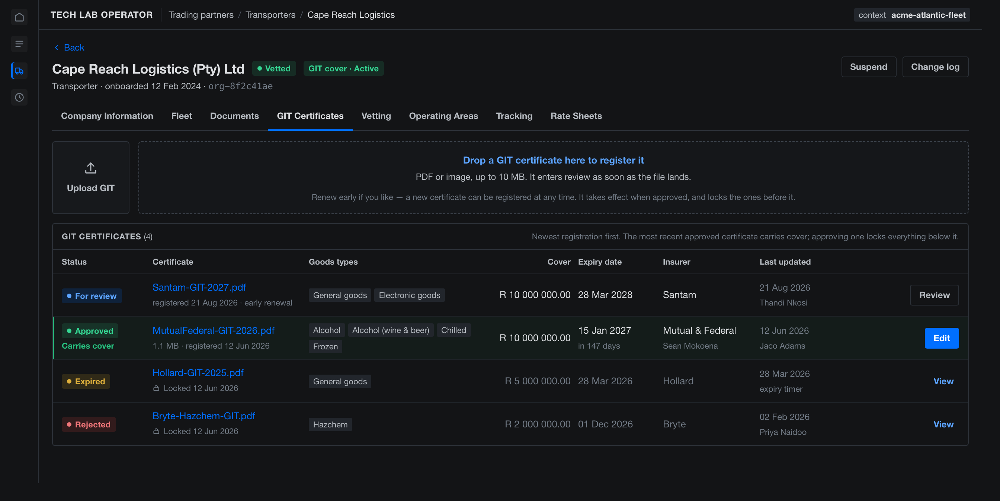
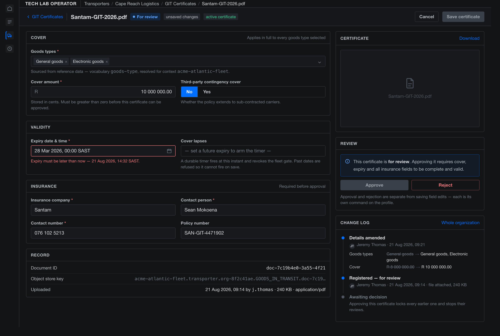
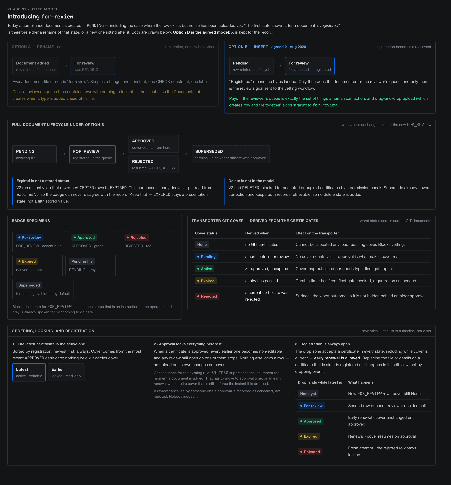
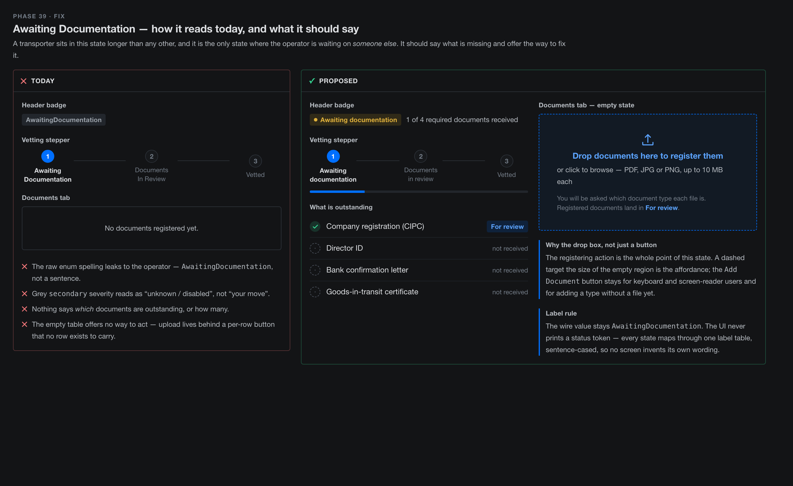
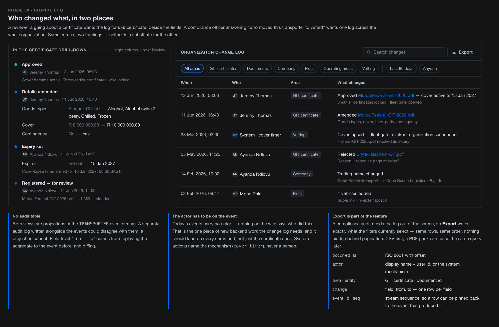
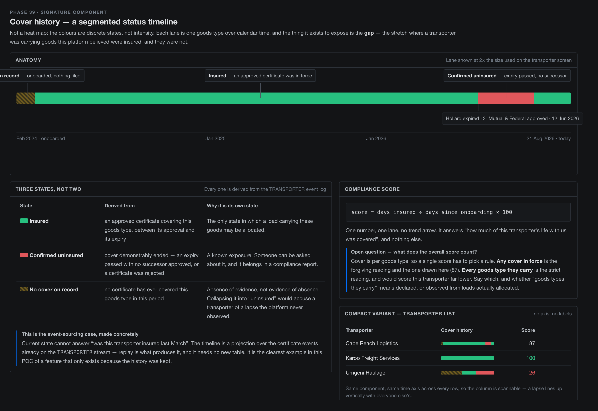

# Architecture — Organizations: Transporters

The standing architecture reference for the **Transporter** feature of
`organizations-service`: how the code works today, and the UI designs
proposed but not yet built. Written to be readable on its own — a reader
should not need to open the siblings below to understand the shape.

| Doc | What it owns |
| --- | --- |
| **This doc** | The Transporter feature as it stands: aggregate, storage, saga, API, UI, and proposed designs. |
| [`ARCHITECTURE-ORGANIZATIONS.md`](ARCHITECTURE-ORGANIZATIONS.md) | The Phase 38 *design record* — why the aggregate was split, the V2 fidelity investigation, the operating-area corpus, the open questions raised at design time. |
| `ADR-046` … `ADR-049` | The four decisions taken during Phase 38: aggregate split, Temporal saga, Object Store for documents, cross-aggregate concurrency. |
| [`ARCHITECTURE-COMMUNICATIONS.md`](ARCHITECTURE-COMMUNICATIONS.md) | Subject-family rules (`evt.*` / `rpc.*` / `api.*` / `notify.*`) and what `{context}` means. |
| [`ARCHITECTURE-PLATFORM.md`](ARCHITECTURE-PLATFORM.md) | The `refdata` ("Tech Lab Operator") frontend's overall nav taxonomy, of which the Transporters screen is one branch. |
| `demos/01-dictionary/BUSINESS_RULES-ORGANIZATIONS.md` | The authoritative rule list (BR-TP*). This doc describes structure; that one states rules. |

---

## 1. System context

`organizations-service` is one bounded context in the Go monolith
(`cmd/main.go` bootstraps each module and calls its `Startup`). The module is
hexagonal: `internal/domain` has no framework dependencies, adapters live in
their own packages (`internal/postgres`, `internal/rest`,
`internal/browserrpc`, `internal/objectstore`, `internal/secrets`), and
`organizations/composition.go` is the single place where adapters bind to
domain ports.

The module carries **two different persistence styles on purpose**:

- **`Organization` — plain CRUD in Postgres.** Identity, company
  information, fleet assets, operating areas, tracking credentials,
  compliance documents. Nothing replays these; only current state matters.
- **`TransporterProfile` — event-sourced on JetStream.** The vetting
  lifecycle. Its history *is* the domain concern: an auditor asks how a
  transporter reached `Vetted`, and a replay answers.

That split is the worked example behind
`ARCHITECTURE.md` § "Event Sourcing vs Plain CRUD" — the deciding question is
"does anything need to replay this", not "does it change".

```
                    ┌──────────────────────── organizations-service ───────────────────────┐
  browser ──api.*──▶│ browserrpc adapter ─▶ application/commands ─▶ domain ─▶ postgres     │
                    │                                     │                                │
                    │                                     ├──▶ transporterprofile (ES)     │
                    │                                     │      └─ evt.* → TRANSPORTER    │
                    │                                     │           └─ projector → PG    │
                    │                                     │           └─ cache   → KV      │
  file up/download ─│ REST + one-shot tickets ────────────┴──▶ Object Store organizations-docs
                    │                                                                       │
                    │ Temporal worker ◀── signals ── vetting saga ── activities ────────────│
                    └───────────────────────────────────────────────────────────────────────┘
```

---

## 2. Identity — one organization, two aggregates

A Transporter is **not** a separate entity from an Organization. It is an
`Organization` (shared identity, shared row, shared ID) that additionally
carries a `TransporterProfile` keyed by that same ID. Consequences worth
holding on to:

- No second ID space, no mapping table, no "which id is this" ambiguity.
- An organization can be registered long before it has a profile; the profile
  is created when vetting starts.
- Cross-aggregate rules (fleet availability vs. vetting state) are a **saga
  concern**, not an invariant either aggregate can enforce alone — see
  `ADR-049` and § 6.

---

## 3. Event model — `TransporterProfile`

**Stream:** `TRANSPORTER` (JetStream, `LimitsPolicy` — replay is the point).

**Subject:** `evt.{context}.organizations.transporter.{organizationID}.{event}`
— fixed six-token arity, matching the platform taxonomy
`evt.{context}.{service}.{entity}.{entity-id}.{event}`. The leading token is
the literal `evt`, never a wildcard (an unbounded first token textually
overlaps `$SYS.>` / `$JS.API.>` and JetStream refuses the stream).

- Hydration / guard filter: `evt.{context}.organizations.transporter.{id}.>`
- Service-wide filter: `evt.*.organizations.transporter.>`

**Events** (`transporterprofile/domain/profile.go`):

| Event | Meaning |
| --- | --- |
| `created` | Profile minted for an existing organization. |
| `vetting-started` | Vetting attempt opened; `attemptNumber` increments. |
| `document-approved` / `document-rejected` | A reviewer decided one compliance document. **Emitted by the Temporal workflow today; from Phase 39a the *command* is the sole producer for `GOODS_IN_TRANSIT` — see below.** |
| `document-approval-reverted` | An earlier approval was withdrawn. |
| `git-verified` | GIT cover confirmed for this attempt. |
| `vetted` | Terminal-success for the attempt. |
| `rejected` | Terminal-failure for the attempt. |
| `vetting-resubmitted` | A rejected transporter re-entered the queue. |
| `fleet-availability-revoked` | The fleet gate closed (e.g. cover lapsed). |
| `tracking-credential-configured` | Provider + credential *type* only — **never the payload**. |

The last one is a deliberate rule: an event log is replayed and audited and
cannot be redacted the way a row can be updated, so a secret written onto the
stream would be permanently worse than V2's plaintext columns. Payloads live
in the encrypted KV bucket (§ 4).

> **Phase 39 (approved 2026-08-22, [ADR-050](ADR-050-git-certificate-change-log-provenance.md)) changes this event model for `GOODS_IN_TRANSIT` documents only.**
> Four changes, all landing in sub-phase 39a:
>
> - **Five new tokens**, on the same subject and arity:
>   `document-registered`, `document-details-updated`,
>   `document-file-attached`, `document-superseded`,
>   `document-review-cancelled`. The existing `document-approved` /
>   `document-rejected` tokens are **enriched with payloads, not forked** into
>   a `git-certificate-*` family — the other four document types are expected
>   to follow GIT onto the stream, and forking now would split the vocabulary
>   by type immediately beforehand.
> - **Events carry explicit `from` and `to`** per changed field, rather than
>   new values with the reader diffing. This keeps replay out of the read path
>   and is the only shape in which "field changed, values withheld" is
>   expressible — which the next point requires.
> - **The `tracking-credential-configured` rule above generalises.** The
>   insurance contact's **name and number never reach the stream**: events
>   record that those fields changed, values live in the projection. Same
>   reasoning, applied to personal data rather than secrets.
> - **The command becomes the sole producer of `document-approved`**, and the
>   workflow's emit is deleted; the workflow reads document state instead of
>   trusting a best-effort signal to carry the fact (§ 6, and ADR-047's
>   amendment).
>
> **`State` grows.** Certificate detail — insurer, cover per goods type,
> expiry, goods types, file reference — joins the struct below, which until
> now deliberately held only status, gates and two maps. The aggregate the
> saga replays gets materially bigger; that cost was accepted in preference to
> a second aggregate whose approval would need either two events or new
> machinery to reach the saga. **Amends [ADR-046](ADR-046-transporter-aggregate-split.md).**

**State** (`State` struct): `context`, `id`, `status`, `attemptNumber`,
`fleetAvailabilityGate`, `gitVerified`, `documentReviews` (reference →
`PendingReview` / `Approved` / `Rejected`), `trackingCredentials`,
`updatedAt`.

**Statuses:** `AwaitingDocumentation`, `DocumentsInReview`, `Vetted`,
`Rejected`, `CoverLapsed`.

**Computed, not stored:** `AvailableForAssignment()` is derived from
`Status == Vetted && FleetAvailabilityGate`. Storing it would let the flag
drift from the facts that produce it.

---

## 4. Storage map

Naming follows the repo rule: **streams `SCREAMING_SNAKE`, KV buckets and
Object Stores `lowercase-kebab`**, entity part American-spelled and plural.

| Kind | Name | Contents |
| --- | --- | --- |
| Stream | `TRANSPORTER` | The profile event log. |
| KV | `organizations` | Read-through cache of projected profile state (`transporterprofile/cache`). |
| KV | `organizations-secrets` | Tracking-credential payloads, at rest encrypted (BR-TP52). |
| Object Store | `organizations-docs` | Compliance-document bytes (`ADR-048`). |
| Postgres | `organizations.organizations` | Identity + company information. |
| Postgres | `organizations.compliance_documents` | Document projection (see below). |
| Postgres | `organizations.fleet_assets` | Registration number is the PK — BR-TP13's global uniqueness, not a surrogate. |
| Postgres | `organizations.transporter_operating_areas` | Operating areas. |
| Postgres | `organizations.tracking_credentials` | Non-secret credential metadata. |
| Postgres | `organizations.audit_events` | Organization-level audit rows. |
| Postgres | `organizations.transporter_profiles` | Projection of the event stream — status, attempt number, gate, `git_verified`, `document_reviews` JSONB. |

Tenancy is the **NATS account boundary**, not a name in a key: one bucket per
role per account. `{context}` is the company / business-unit scope and lives
inside keys and subjects, never in a bucket name.

A bucket name *is* a stream name (`KV_organizations`, `OBJ_organizations-docs`),
so renaming a bucket orphans the old stream rather than migrating it.

### `compliance_documents`

```
PRIMARY KEY (organization_id, id)          -- widened from (organization_id, type) in 38c-i
status CHECK IN (PENDING, APPROVED, REJECTED, SUPERSEDED)
expires_at TIMESTAMPTZ, coverage_cents BIGINT
file_name / content_type / size / … (nullable together — a document has no file until one is uploaded)
partial index (organization_id, type) WHERE status <> 'SUPERSEDED'
```

The file columns are a projection of what is in the Object Store, so listing
documents is one Postgres query and the bucket is touched only when bytes
actually move.

---

## 5. Compliance documents

`internal/domain/compliance_document.go`:

- **Types:** `CIPC`, `DIRECTOR_ID`, `BANK_CONFIRMATION_LETTER`,
  `TERMS_AND_CONDITIONS`, `GOODS_IN_TRANSIT`. Validated against the partner
  type.
- **Statuses:** `PENDING` → `APPROVED` / `REJECTED`, plus terminal
  `SUPERSEDED`. `Resubmit` returns a rejected document to review.
- **Files:** `AttachFile` is one-way (BR-TP43) and capped at
  `MaxDocumentFileBytes` = 10 MiB. Object name:
  `DocumentObjectName(context, partnerID, docType, documentID)`.
- **Expiry:** `SetExpiry` refuses a past instant (`ErrDocumentExpiryInPast`,
  BR-TP59). **Phase 39 adds a second guard at approval** (BR-TP67) — a
  certificate can sit in the review queue until its expiry passes, and
  approving it then would arm BR-TP60's cover timer on cover already dead.
  Phase 39 also **permits `SetExpiry` on a superseded document** for
  historical correction (BR-TP70), reversing today's refusal.
- **`EXPIRED` is never stored.** `DeriveGitStatus(docs, now)` (BR-TP38)
  computes the transporter's GIT cover status per read as the *worst* status
  across current GIT documents — `None`, `Pending`, `Active`, `Expired`,
  `Rejected` — with `now` passed in so the rule is testable at a fixed
  instant. V2 ran a nightly job that rewrote `ACCEPTED` rows to `EXPIRED`;
  deriving means the badge cannot disagree with the record. **Phase 39 leaves
  this unchanged**: `FOR_REVIEW` derives to `Pending` — a document waiting in
  a queue is not cover — so the gate, the timer and all 37 consumers of
  `GitVerified` / `FleetAvailabilityGate` keep their current meaning. Only
  `gitStatusOf`'s `default:` fall-through becomes an explicit branch
  (BR-TP68).

> **Phase 39 makes `GOODS_IN_TRANSIT` a projection, not a system of record**
> ([ADR-050](ADR-050-git-certificate-change-log-provenance.md), Option A
> scoped to that one type). `compliance_documents` keeps both roles for a
> while: authoritative for the other four types, projection-written for GIT.
> That is transitional and deliberate — a separate `git_certificates` table
> would become dead weight the moment the other four follow. Schema changes in
> 39a: a `created_at` column (there is none today, and both registration order
> and the change log need one), the `FOR_REVIEW` value added to the status
> CHECK constraint, and a **unique** partial index on
> `(organization_id, type) WHERE status = 'APPROVED'` — today's
> `compliance_documents_current_idx` is non-unique, so two live approved rows
> are structurally permitted and BR-TP69's invariant would fail silently. A new
> read query is also needed: `ListDocuments` excludes superseded rows by
> design and orders `BY type`, and § 9.1's flat table shows every certificate,
> newest registration first.

---

## 6. Temporal — the vetting saga

`transporterprofile/workflow`, `/activities`, `/worker`; composed into the
running service in Phase 38b (completion).

- **Workflow:** `TransporterVettingWorkflow`.
- **Activities:** `AppendProfileEvent`, `RequestGitVerification`,
  `HandleGitStatusDrop`, `CoverExpiry`.
- **Signals:** `DocumentReview` (a reviewer's decision), `CoverChanged`
  (re-arms the cover timer, BR-TP61).
- **Durable cover timer (BR-TP60–BR-TP63):** `CoverExpiry` reads the earliest
  expiry across the transporter's approved GIT documents and the workflow
  sleeps on a `workflow.NewTimer` until that instant; firing produces the
  `CoverLapsed` transition and revokes the fleet gate. This replaced BR-TP28's
  polling Temporal Schedule.
- **Two layers, not one:** the workflow orchestrates; the aggregate still
  enforces its own transitions. An activity cannot force an illegal state —
  it can only append an event the aggregate accepts. Compensation, not
  retraction, is the correction model (`ADR-047`).

---

## 7. API surface

Browser-facing subjects, all `api.*.organizations.{entity}.{verb}.v1` with
`{context}` as the second token:

- `organization.` — `register`, `list`, `get`, `update`, `activate`,
  `suspend`, `reactivate`, `audit`, `profile`, `submit-vetting`
- `document.` — `add`, `list`, `approve`, `reject`, `resubmit`, `set-expiry`,
  `upload-ticket`, `download-ticket`
- `fleet-asset.` — `add`, `list`
- `operating-area.` — `add`, `list`, `remove`
- `tracking-credential.` — `configure`, `list`

File bytes do **not** travel over NATS: `upload-ticket` / `download-ticket`
mint one-shot tickets (`internal/filetickets`) redeemed against the REST
endpoints in `internal/rest/document_files.go`, which stream to and from the
Object Store.

A browser credential is never granted `rpc.>`; backend code never calls
`api.>`.

---

## 8. Frontend

The Transporters screen lives in the `refdata` app ("Tech Lab Operator"),
`src/components/TransporterPanel.vue`, reached from `App.vue`'s top nav
(`topNav === 'transporters'`). Like every UI in this repo it consumes
`shared/unifi-theme` (tokens + PrimeVue preset) and `shared/ui-shell`
(`AppShell.vue`) — it does not define its own palette or page chrome.

Structure: a list view, then a drill-in detail view with tabs —
**Company Information · Fleet · Documents · Vetting · Operating Areas ·
Tracking · Rate Sheets**. Pinia stores are the deliberate client-side
analogue of a server-side materialized view: both are projected read models
derived from an event source.

---

## 9. Approved — Phase 39: GIT Certificates

**Status: APPROVED — design gate closed 2026-08-22.** Provenance decided in
[ADR-050](ADR-050-git-certificate-change-log-provenance.md) (Option A, scoped
to `GOODS_IN_TRANSIT`), which amends
[ADR-046](ADR-046-transporter-aggregate-split.md) and
[ADR-047](ADR-047-transporter-vetting-temporal-saga.md). Rules confirmed as
BR-TP64–BR-TP72. **§ 9.4 and § 9.5 moved out to Phase 46** — neither is on the
critical path to this screen, and 9.5's CSV cannot be written before 39a's
events exist. Plan entry:
`.claude/plans/Main-POC-Plan.md` § "Phase 39". Interactive canvas (five
artboards + decision notes):
<https://claude.ai/code/artifact/792f1401-eb47-4f6d-831e-83d3c3ebd8b4>.
Reference system: Linebooker V2's `GitCertificates.js`,
`TransporterDocumentEntityServiceImpl`, and `calculateGitValidity`.

### 9.1 The status view — a flat table



One list of every GIT certificate, newest registration first: Status /
Certificate / Goods types / Cover / Expiry date / Insurer / Last updated /
action. The certificate carrying cover is a highlighted row, not a separate
panel. Above it, an always-open drop zone.

Rules the screen encodes:

1. **Registration is never gated — early renewal is allowed.** A certificate
   can be dropped in any state, including while cover is current. Dropping
   changes no cover; approval does.
2. **Approval is the only thing that locks.** Approving a certificate makes
   every earlier one read-only and stops any review still open on them. A
   review cancelled this way is recorded as *cancelled*, not *rejected* —
   nobody judged it.
3. **Replacement of an already-registered certificate happens in its edit
   view**, not by dropping over it.

### 9.2 The drill-down edit view



Drill-down with explicit Save / Cancel, rather than V2's inline twelve-column
row editor — which is why V2's screen scrolls sideways and has nowhere to put
validation messages. Approve / Reject / Resubmit remain row actions on the
table.

### 9.3 State model, locking and registration



- **`FOR_REVIEW` is inserted after `PENDING`, not a rename of it.** `PENDING`
  keeps meaning "row minted, no file yet"; `FOR_REVIEW` means the bytes
  landed and it is in the reviewer's queue. Drag-and-drop upload creates row
  and file together and so goes straight to `FOR_REVIEW`.
- **BR-TP30's supersede moves from on-upload to on-approval** (agreed
  2026-08-21). With early renewal allowed, on-upload supersede would retire
  cover that is still in force the instant a renewal was dropped.
- `EXPIRED` stays derived; no `DELETED` state is added — supersede covers
  correction and keeps both records retrievable.

### 9.4 `AwaitingDocumentation` presentation fix — **moved to Phase 46**



Sentence-cased label from a single label table (wire value unchanged), amber
"your move" severity instead of grey, an outstanding-documents checklist with
progress, and a full-region dashed drop target.

### 9.5 Change log, with export — **moved to Phase 46**



> **Split out of Phase 39 at the 2026-08-22 design gate.** It is not on the
> critical path to the screen Phase 39 exists to build, and its CSV cannot be
> written before 39a's events exist. The **provenance** question it depends on
> *was* settled in Phase 39, because 39a builds the write path — see
> [ADR-050](ADR-050-git-certificate-change-log-provenance.md) and § 3's
> Phase 39 note. What follows is the design as agreed, with three amendments
> marked.

**Per-certificate only, for now.** The original design called for two framings
of one projection — per-certificate in the drill-down and per-organization on
the detail view. **The per-organization framing is deferred**: fleet assets
and tracking credentials have **no provenance record of any kind** — no
events, no audit rows — so a cross-area log built today would silently omit
three of five areas. That is the same flaw ADR-050 used to disqualify a
stream-projected log, reached from the other direction. Per-organization waits
for the phase that gives those two areas provenance.

**It is a projection of the `TRANSPORTER` stream**, not a separate audit
table. Note the original reason given for rejecting a table ("which could
disagree with the events") was vacuous when written — there were no document
events to disagree with. The real reason is decision 12's `event_id · seq`
export contract: stream coordinates presuppose a stream.

**Field-level "from → to" comes from the events themselves**, not from
replaying the aggregate and diffing. Diffing cannot represent "this field
changed, its values are withheld", which § 3's insurance-contact rule
requires.

**Export** writes exactly what the filters currently select — same rows, same
order, nothing hidden behind pagination. CSV first:

| Column | Contents |
| --- | --- |
| `occurred_at` | ISO 8601 with offset |
| `actor` | display name + user id, or the system mechanism |
| `actor_verified` | **always `false` until authenticated identity lands** — see below |
| `area · entity` | e.g. `GIT certificate · document id` |
| `change` | field, from, to — one row per field; **empty for the insurance-contact fields**, whose values never reach the stream (§ 3) |
| `event_id · seq` | stream sequence, so a row can be pinned back to the event that produced it |

A PDF pack can reuse the same query later.

**The actor is recorded, and is not trustworthy.** Phase 39 adds an actor to
every command — not just the certificate ones — spelled to match the
convention already in the wild (`Actor{Name: "temporal-git-monitor"}`) rather
than starting a second vocabulary for system actions. But the value is an
**unauthenticated, client-supplied header defaulting to the literal
`"admin"`** (`internal/browserrpc/adapter.go`), so an export column that
looked authoritative would manufacture false confidence in a compliance
review — worse than an absent column. Hence `actor_verified` on **every row**,
and the same caveat in the in-app log header. A per-row column rather than a
banner or footer, because a banner does not survive the file being opened in a
spreadsheet and re-saved, or a single row being pasted into an email — which
is how a compliance CSV actually gets used.

### 9.6 The model gap this phase closes

**Cover is per goods type.** V2 takes the highest cover for each commodity
category across approved certificates, and a load is allocatable only if
every category on it is covered at or above its declared goods value
(`calculateGitValidity`). Our `ComplianceDocument` has a single
`CoverageCents` and no categories at all.

> **Captured, never enforced (BR-TP65, confirmed 2026-08-22).** V2's
> allocation rule has **no consumer in this codebase** — there is no load
> allocation anywhere in the backend, and the single `CoverageCents` this
> replaces is already written and never read by any decision path (repository
> + domain + test only). Phase 39 models cover per goods type and reports it;
> nothing refuses anything on the strength of it. The model is still worth
> getting right now — it avoids a migration when a consumer appears, and it is
> what makes the deferred cover history (§ 9.8) a projection rather than a
> schema change — but no spec asserts an allocation refusal, because there is
> nothing to refuse.

**"Type" means goods type and comes from refdata.** It is V2's
`commodityCategoryEntities`, held there as both an enum and a table with a
display string — the tier-1 refdata duplicate already logged. So: a
context-scoped, localized `goods-type` vocabulary. **A corpus must be seeded
or the screen cannot be exercised in the dev stack** — the same gap that
already blocks fleet assets. Sub-phase 39b seeds a **~10-item representative
set**, replaced when the tier-1 commodity-taxonomy extraction happens; since
cover is capture-only, the corpus only has to be plausible enough to exercise
the screen. Both halves have a proven pattern to copy —
`refdata-service/cmd/seed-vehicle-types` for the seeder, BR-TP14's
`refdataclient` existence check for validating a code against the
certificate's own context.

### 9.7 No new workflow, no new stream

Editing a certificate is one command on the existing `TransporterProfile`
aggregate on the `TRANSPORTER` stream. The vetting saga and the durable cover
timer already exist. Phase 39 adds no Temporal workflow and no stream.

> **But the saga's relationship to document facts inverts (ADR-047's
> amendment).** "Signalled by the edit" was the as-designed mechanism; the
> signal is best-effort, and its own comment names the failure mode — a review
> that writes its row and then fails to signal reads as approved while the
> workflow still waits on it, with nothing reconciling the two. From 39a the
> **command** appends `document-approved`, the workflow's emit is deleted, and
> the workflow derives its view by **reading document state** rather than
> trusting a signal to carry it. This is also what makes § 9.3's locking safe:
> a failed *cancel* signal would otherwise leave the workflow waiting on a
> review that the UI could no longer re-drive, since locked certificates reject
> mutating commands. (A superseded certificate additionally keeps accepting
> review-resolution, so the outcome is recorded as *cancelled* rather than
> abandoned — BR-TP70.)

### 9.8 Deferred — cover history



The segmented status timeline (Insured / Confirmed uninsured / No cover on
record) and the compliance score are **out of Phase 39 scope**, to be
revisited as a later enhancement. It is a projection over the certificate
events this phase already puts on the stream, so it needs no migration to add
later — a property that holds because ADR-050 chose Option A, and would not
have held under Option B's audit-table alternative.

One interaction to remember when it is built: BR-TP70 permits `SetExpiry` on a
**superseded** certificate for historical correction, so correcting one
retroactively edits this timeline. It does not re-arm the cover timer, which
only considers approved documents.

*Terminology, settled 2026-08-21: this is a segmented status timeline, not a
heat map. The colours encode discrete states, not magnitude, and "confirmed
uninsured" is a different fact from "no insurance record".*

---

## 10. Business rules

The authoritative list is `demos/01-dictionary/BUSINESS_RULES-ORGANIZATIONS.md`.
As built, the Transporter feature covers **BR-TP18–BR-TP63** (plus
BR-D46–BR-D48 for operating-area reference data). Phase 39 adds
**BR-TP64–BR-TP72**, all **confirmed 2026-08-22** — the provisional list is
closed and written up in `BUSINESS_RULES-ORGANIZATIONS.md`.

The confirmed set, in one line each:

- **BR-TP64** at least one goods type, each existing in the certificate's own
  context. **BR-TP65** cover is per goods type, maximum across approved
  unexpired certificates — reported, never enforced (§ 9.6). **BR-TP66**
  insurer and insurance contact are required to *approve*, not to register.
  **BR-TP67** expiry is guarded at registration *and* at approval.
  **BR-TP68** registration is always permitted and enters `FOR_REVIEW`, which
  derives to `Pending`. **BR-TP69** approval supersedes, locks and cancels
  open reviews on earlier certificates — write-side invariant plus a unique
  partial index (amends BR-TP30, moving supersede from upload to approval).
  **BR-TP70** a superseded certificate accepts review-resolution and
  `SetExpiry`, nothing else (amends BR-TP59). **BR-TP71** every command
  records an actor, and anything derived from it that leaves the system
  declares it unverified. **BR-TP72** the insurance contact's name and number
  never reach the stream.

Two of these changed *on* confirmation rather than being rubber-stamped, and
the change is the interesting part: BR-TP67 gained its second guard because a
certificate can rot in the review queue, and BR-TP70 reversed BR-TP59's
refusal on superseded documents — which deletes a guard and contradicts a
comment that both have to be rewritten rather than left standing.

Every rule gets one Ginkgo `Context` with one or more `It` assertions, written
before the implementation.

---

## 11. Open questions

- Whether "cover for every goods type they carry" should mean *declared*
  goods types or those *observed* on allocated loads — relevant to any future
  compliance score, not to Phase 39 itself.
- Whether the change-log export needs a signed PDF pack in addition to CSV.
  Note this compounds with BR-TP71: a *signed* pack of unauthenticated actors
  would look more authoritative than the data supports.
- The `goods-type` corpus: who owns the canonical list, and whether it is
  seeded per context or platform-wide with per-context overrides. 39b's
  ~10-item set is explicitly a placeholder, not an answer to this.
- **When the remaining four document types follow `GOODS_IN_TRANSIT` onto the
  stream** (ADR-050's own "to revisit"). Until they do, `compliance_documents`
  carries two roles, and the change log covers one document type.
- **When fleet assets and tracking credentials get provenance at all.** They
  have neither events nor audit rows today, which is why § 9.5's
  per-organization framing is deferred rather than built.
- Whether the `AuditRecorder` port's best-effort contract ("a failed Record
  must never block or roll back the lifecycle operation it describes", with
  every caller discarding the error) is still the right trade now that an
  audit export is a requirement. It is not on Phase 39's path — GIT documents
  move to the stream instead — but it means BR-TP06's and BR-TP50's trails
  can silently lose rows.
