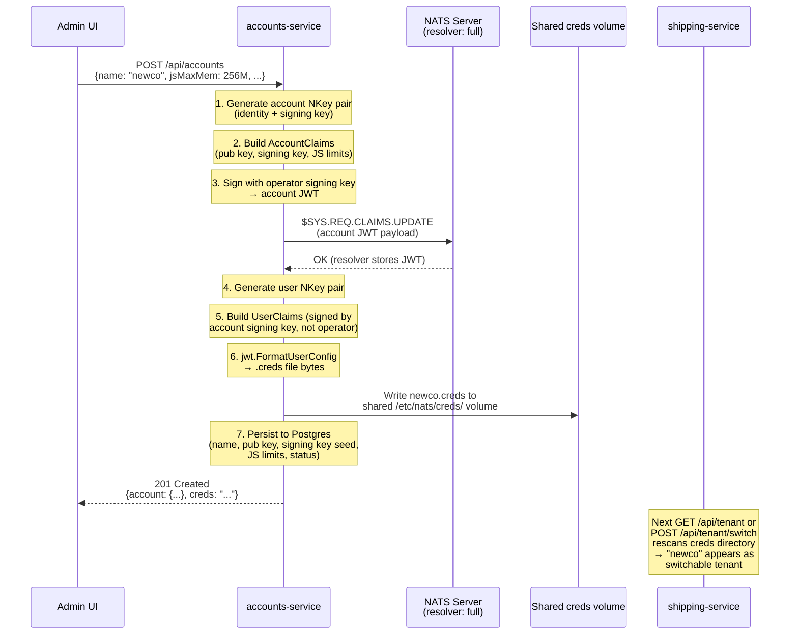

# Architecture — EventSourcing CQRS POC

Deep reference for how this demo is implemented. For the overview and run instructions see [README.md](../../../../demos/01-dictionary/README.md).

---

## Shape Classification — Variant Identifiers

The POC compares several CQRS/event-sourcing **variants** and measures how they
perform as it evolves. Each variant gets a **stable identifier** so the same
operation can be compared across implementations and phases — the k6 harness
tags every metric with its `shape` id (see [PERFORMANCE.md](../../../../demos/01-dictionary/PERFORMANCE.md)),
and these ids are frozen once assigned.

**Grammar:** `Shape<Surface>.<Mechanism>[.<Scope>]`

- **Surface** — the CQRS role: `Write` (command side — validates, produces
  events), `Proj` (consumer side — materialises read models from events),
  `Read` (query side — serves reads).
- **Mechanism** — a short code naming the *distinguishing technique* of the
  variant (grouped by facet below). An id names the code(s) that distinguish
  the variant and holds the rest as context; compose facets with `.` when more
  than one varies (e.g. `Write.FR.OB`).
- **Scope** — suffix: *(default)* single aggregate; **`.AGG`** = aggregation
  (fold/join/group across many aggregates, or a derived cross-cutting set). Sub-
  types may be suffixed later (`.AGG/join`, `.AGG/group`, `.AGG/set`).

### Code registry (grouped by facet)

**State access** — how current state is obtained/materialised:

| Code | Meaning | Status |
|---|---|---|
| `FR` | full replay (seq `1…end` of the relevant scope) | implemented |
| `S` | snapshot + tail replay | reserved (Phase 104) |
| `KV` | KV projection (materialised read model in NATS KV) | implemented |
| `PG` | Postgres canonical + KV write-through cache | implemented |
| `CRUD` | plain Postgres, non-event-sourced | implemented (ports) |

**Publish / commit reliability** — Write surface, how the event is durably produced:

| Code | Meaning | Status |
|---|---|---|
| `DP` | direct publish (`js.Publish`; the publish *is* the commit) | implemented (all commands) |
| `OB` | transactional outbox (atomic state-write + relay) | reserved |

**Consumer reliability** — Proj surface, how events are safely applied:

| Code | Meaning | Status |
|---|---|---|
| `AL1` | at-least-once, non-idempotent (redelivery on failure) | implemented |
| `IDEM` | idempotent consumer / inbox dedup | reserved (Phase 102) |

`FR` scope note: it means **whole-stream** replay on `Read.FR.AGG` (fleet) but
**per-aggregate** (filtered) replay on `Write.FR` (hydration) — scope is a
property of the surface, so it isn't repeated in the code.

### Phase-9 inventory

> **Phase 31 note.** The POC's shape comparison is decided — Shape B won.
> Phase 31 retired Shape A (`Proj.KV`, plus the unwired `Read.KV`) and Shape C
> (`Read.FR.AGG`), along with the legacy `A`/`B`/`C` alias map this inventory
> used to carry. The "we evaluated three and chose one" record now lives in
> `obsidian/POC-Dictionaries/` as a findings note; this inventory only
> describes what the code runs today. `Main-POC-Plan-ARCHIVE.md` has the
> retired shapes' original design detail if you need it.

**Write (command) surface** — publish reliability is `DP` throughout.

| Id | Path / fn | Distinguishing mechanism | Scope | File |
|---|---|---|---|---|
| `Write.FR` | ship arrive/depart (`hydrate`) | full replay, filtered per-ship | single | commands.go:84 |
| `Write.FR` | container register (`hydrateByNaturalKey`) | full replay, per-container | single | container.go:185 |
| `Write.FR.AGG` | container load/unload (`hydratePair`) | one replay folds **ship + container** | multi | container.go:148 |
| `Write.CRUD` | port register | Postgres INSERT (idempotent) | ref data | port.go:23 |

**Proj (projection/consumer) surface** — consumer reliability is `AL1` throughout.

| Id | Consumer (durable) | Writes to | Scope | File |
|---|---|---|---|---|
| `Proj.PG` | `ship-projector` | Postgres `ships` → `ships` KV cache | per-ship | handler.go:37 |
| `Proj.PG` | `container-projector` | Postgres `containers` → `container` KV | per-container | container_handler.go:19 |
| `Proj.KV.AGG` | `meta-projector` | `meta` KV `known-containers` (merge-set) | derived set | meta_handler.go:32 |

**Read (query) surface**

| Id | Route | Mechanism | Scope | File |
|---|---|---|---|---|
| `Read.PG` | `GET /api/shape-b/ships/{ctx}/{id}` | KV cache → Postgres fallback | single | get_entry.go:67 |
| `Read.KV.AGG` | `GET /api/manifest/{ctx}/{ship}` | filter `container` KV (join) | multi/join | terminal.go:65 |
| `Read.KV.AGG` | `GET /api/terminal/{ctx}/{port}` | filter `container` KV (group) | multi/group | terminal.go:49 |
| `Read.KV.AGG` | `GET /api/containers/{ctx}` | scan `container` KV | multi/set | terminal.go:25 |
| `Read.KV.AGG` | `GET /api/meta/{ctx}/known-containers` | get `meta` KV set | derived set | meta.go:34 |
| `Read.CRUD` | `GET /api/ports/{ctx}`, `GET /api/admin/ports/{ctx}` | Postgres SELECT | ref data | port_repository.go |

*(Out of scheme — observability, no read model: the raw `/api/jetstream/*` and `/api/kv/buckets*` introspection endpoints. The `/api/watch*` SSE streams that used to sit here were deleted in Phase 23; their replacements are a one-shot REST bootstrap plus a `notify.*` subscription held by the browser, so the live half is no longer an HTTP endpoint at all.)*

The ids are a **documentation / measurement layer**: the HTTP route slug
`/api/shape-b` and existing code are unchanged (Phase 31 deliberately left
that route alone — see BUSINESS_RULES-SHIPPING.md's Phase 31 notes).
Aggregation (`.AGG`) appears explicitly on all three surfaces —
`Write.FR.AGG` (`hydratePair`), `Proj.KV.AGG` (`meta-projector`), and the
`Read.*.AGG` queries.

---

## CQRS Pattern — Code Mapping

### Write Model — two aggregates, one stream

Phase 8 introduced a second aggregate. Both are co-located on the single
`SHIPPING` stream, partitioned by subject:

| Aggregate | Subjects | Rules |
|---|---|---|
| `ShipAggregate` (`domain/ship.go`) | `evt.{context}.shipping.ship.{id}.{registered\|arrived\|departed\|corrected}` | BR-001 … BR-003, BR-017, BR-020 … BR-022 |
| `ContainerAggregate` (`domain/container.go`) | `evt.{context}.shipping.container.{uuid}.{registered\|loaded\|unloaded}` | BR-008 … BR-016, BR-018 |

Ports (the `originPort`/`destPort`/arrival-port values referenced above) are
**not** a third aggregate — they're plain Postgres reference data (BR-017,
BR-018 check them, but don't event-source them). See "Event Sourcing vs Plain
CRUD" below.

**`dictionary/internal/application/commands/commands.go`**

- `ShipHandler` — `ArrivePort()`, `DepartPort()`, `RegisterShip()`, `CorrectShipID()`
- `hydrateByNaturalKey()` — resolves the ship whose *current* `shipID` matches the requested name by folding every ship's history in the context (`ShipContextWildcard`), then picking the match. A single-ship `FilterSubject` replay isn't enough once `shipID` is mutable (BR-022) — the requested name might belong to a different surrogate than it did historically. Shared with `CorrectShipID` via `foldAllShips()`.
- `replayStream()` — shared full-stream fold retained for cross-aggregate container commands
- `Publisher` interface — outbound port to JetStream

**`dictionary/internal/application/commands/container.go`**

- `ContainerHandler` — `RegisterContainer()`, `LoadContainer()`, `UnloadContainer()`
- `hydratePair()` — rebuilds **both** aggregates from **one atomic replay** of `SHIPPING`. Container identity is parsed from its subject; ship identity is resolved the same way `hydrateByNaturalKey` does (fold every ship event into a surrogate-keyed map, then match by current `shipID`) since the ship subject no longer carries the natural key. This keeps cross-aggregate rules strongly consistent until Phase 103 splits the stream.
- `RegisterContainer()` — mints a fresh surrogate id (`newSurrogateID()`, a dependency-free UUID v4) after `hydrateByNaturalKey()` confirms the natural key is free (BR-015, resolved against the event stream — authoritative, not from a read projection)

#### Container identity — surrogate key (Phase 8.3)

`Container`'s aggregate identity is an immutable **surrogate key** (`id`, a UUID) minted at registration — *not* the ISO 6346 `containerID`. The UUID is carried in the subject; `containerID` remains in the payload as the mutable natural key (BR-015).

- **Write side:** `hydratePair()` resolves `containerID → id` from the `.registered` event, then folds strictly by `id`.
- **Postgres:** `containers` primary key is `(context, id)`; `container_id` carries a `UNIQUE (context, container_id)` constraint.
- **KV read model:** the `container-{context}` bucket stays keyed by the human-facing `container.{containerID}` (query convenience) and carries `id` as a field — so it doubles as the natural-key → id lookup.

#### Ship identity — surrogate key

`Ship` gained the same surrogate-key architecture as `Container` once it became clear `shipID` behaves like a name/call-sign/internal-fleet-code — mutable, reassignable — rather than a permanent internal slug (superseding an earlier decision that a Ship surrogate would be "indirection without benefit"; see BR-021/BR-022 in `BUSINESS_RULES-SHIPPING.md`).

- **Write side:** `RegisterShip()` mints the surrogate `id` explicitly (BR-021); `ArrivePort` mints one implicitly on a ship's first arrival if none exists yet — pre-registering is optional, not a precondition. `CorrectShipID()` renames `shipID` without touching `id` (BR-022).
- **Postgres:** `ships` primary key is `(context, id)`; `ship_id` carries a `UNIQUE (context, ship_id)` constraint — a correction is a plain column update, no rekey.
- **KV read model:** the context-scoped bucket stays keyed by the human-facing `ship.{shipID}` (query convenience, mirrors Container) and carries `id` as a field. A correction (`.corrected` event, carrying `previousShipID`) is the one place a projector must **rekey** — delete the old `ship.{previousShipID}` entry, write the new `ship.{shipID}` one — since Postgres and the JetStream subject don't need to (both key by the immutable surrogate).
- **Known limitation (verified live):** `ContainerState.OnShipID` snapshots the ship's natural key at load time and isn't updated by a later correction. Renaming a ship while it carries a container leaves that container stuck — unload fails with **both** the new name (BR-013) **and** the old name (BR-012 — `hydrateByNaturalKey`/`hydratePair` resolve by *current* name, so a stale name matches nothing). Only unblocked by correcting back to the exact pre-correction name first.

**`dictionary/internal/domain/ship.go` / `container.go`**

- Command methods enforce invariants and return domain events; `Apply()` folds one event into state (used by the write side and by projectors via `FromState()`)
- Cargo is no longer part of the ship aggregate — a ship's manifest is the container join (`onShipID == shipID`)
- `ContainerState` models location as two explicit nullable fields (`terminalPort` / `onShipID`, exactly one non-nil) so queries never branch on status

**Event store:** JetStream stream `SHIPPING` (`internal/jstream/stream.go`), `LimitsPolicy` so replay is always possible.

---

### Projections

**`dictionary/internal/eventhandler/`**

- `RegisterShips()` consumes `evt.*.shipping.ship.>`
- `RegisterContainers()` consumes `evt.*.shipping.container.>`
- `RegisterMeta()` consumes `evt.*.shipping.container.>` and maintains the `meta.*` lookup sets
- `currentAgg()` / `currentContainerAgg()` — read current KV state into an aggregate via `FromState()` before applying one delta, so projectors never replay the full stream

Each consumer is independently position-tracked and can lag, replay, or rebuild on its own.

---

### Read Models

| Entity | Read model | Query type | Key file |
|---|---|---|---|
| Ships | Postgres (canonical) + KV `ships` (write-through cache) | `Ships.GetShip()` / `Ships.ListShips()` | `queries/get_entry.go` |
| Terminal | KV bucket `container-{context}` | `Terminal.ListByPort()` (yard) / `Terminal.ListByShip()` (manifest) | `queries/terminal.go` |
| Meta | KV bucket `meta-{context}` | `Meta.KnownContainers()` | `queries/meta.go` |
| Ports | Postgres `ports` table (not KV, not event-sourced) | `PortHandler.List()` | `postgres/port_repository.go` |

`Ships` also exposes `EvictCacheShip()` to force the KV miss → Postgres →
backfill path. (Phase 31 retired two other shapes that once lived here — KV
as the sole read model with no Postgres, and a full-JetStream-replay fleet
reconstruction with no KV/Postgres at all — once the POC's shape comparison
was decided; see `obsidian/POC-Dictionaries/` for the findings.)

---

### Materialized Views

- **KV buckets** (`internal/kvstore/kv.go`) — one per role per NATS account, `{context}` folded into the key rather than the bucket name: `ships` (write-through cache), `container` (container projection), `meta` (lookup sets)
- **Postgres `ships` + `containers` tables** (`postgres/`) — canonical projections; upserted via `INSERT … ON CONFLICT DO UPDATE` (containers conflict on the surrogate key `(context, id)`; `container_id` is `UNIQUE`)
- **Postgres `ports` table** (`postgres/port_repository.go`) — plain reference data, not a projection: no JetStream event ever writes it. Written directly by `POST /api/ports`; read by `ShipHandler`/`ContainerHandler` (BR-017/BR-018), `GET /api/ports/{context}` (names, for dropdowns), and `GET /api/admin/ports/{context}` (raw rows — name + `createdAt` — for the admin Postgres Tables panel, below). See "Event Sourcing vs Plain CRUD" below.
- **`ShipState` / `ContainerState` structs** (`domain/`) — shared projected value types stored in both KV and Postgres
- **Pinia stores** (frontends) — client-side materialized views; the same projection-from-event-stream pattern one layer further out. Fed by `notify.*` over a NATS WebSocket in `frontend/seafreight-app` (Phase 15d) and `frontend/admin` (Phase 23), each bootstrapped by a one-shot REST read; `frontend/refdata` is the last remaining SSE consumer (`/api/refdata-watch/{context}`, served by refdata-service). `shipping-service` no longer has an SSE handler at all — `rest/sse.go` was deleted in Phase 23. The Port Management frontend also performs the manifest join (`onShipID == shipID`) client-side over its projected containers.

---

### Metadata Projections (`meta.*`)

Beyond per-entity state, the KV store holds a namespace for cross-cutting derived lookup sets that any part of the UI may need. The working superset of KV namespaces is:

| Namespace | Bucket | Purpose | Status |
|---|---|---|---|
| `ship.*` | `ships` | Per-ship current state (write-through cache) | implemented |
| `container.*` | `container` | Per-container current state (terminal projection) | implemented (Phase 8) |
| `meta.*` | `meta` | Cross-cutting derived lookup sets | implemented (Phase 8) |
| `locale.*` | — | Localisation config per context | future |
| `tenant.*` | — | Tenant-specific configuration | future |

#### `meta.known-containers`

The container ID picker needs the **full history** of registered container
IDs — not just what current entity state happens to reference. This is
maintained as a sorted JSON array in the `meta-{context}` bucket by the
`meta-projector` durable consumer (`eventhandler/meta_handler.go`):

- `container.registered` → merge the container ID into `known-containers`

Exposed over REST: `GET /api/meta/{context}/known-containers`.

On `connect()` both frontends seed the container picker from this endpoint
before subscribing, then keep merging live `META` changes from
`notify.{context}.shipping.meta.changed` (`/api/watch-terminal/{context}`
until Phase 23 replaced it). Result: the full history survives app reload
without event replay and without client-side reconstruction.

Because a single durable consumer processes events sequentially, the
read-merge-write on the meta key has no concurrent writers.

`meta.known-ports` (the equivalent projection for ports) was **retired** —
see "Event Sourcing vs Plain CRUD" below for why ports moved to a Postgres
reference table instead of a derived KV projection.

---

### Event Sourcing vs Plain CRUD — Design Heuristic

Not every piece of state in this domain is event-sourced, and the ports
registry (`postgres/port_repository.go`, `POST/GET /api/ports`) is the
worked example of where the lab draws that line.

**The deciding question is "does anything need to replay this to reconstruct
state," not "does it change over time."**

| | Ship / Container | Ports |
|---|---|---|
| Write path | `ArrivePort`/`Register` etc. publish a JetStream event | `POST /api/ports` writes straight to Postgres, no event |
| State machine | Yes — `arrived → docked → departed`, `registered → loaded → unloaded`, with cross-aggregate rules that need a point-in-time replay of both aggregates together (BR-008, BR-012, BR-014) | No — a port is either registered or not; there is no transition to get wrong |
| Reconstructable from history? | Yes — the write-side `hydrate()` path replays an aggregate's own events before applying a new command (`ship.go`/`container.go`'s `Apply()`/`FromState()`). A retired shape (Phase 31) once exercised whole-fleet reconstruction directly, rebuilding every ship **and** container from `seq=1` with no KV/Postgres involved, purely to compare it against the shape that won. | No consumer ever asks "what ports existed as of sequence N" — the registry is looked up live at command time |
| Audit need | The sequence of transitions *is* the domain fact (BR-015's duplicate check is resolved against the authoritative log, not a projection) | Satisfied by a plain `created_at` column — no one needs to replay to answer "when was this port added" |

Before event-sourcing a new entity in this lab, check whether it actually
clears that bar. It's an "it depends" call the moment either of these becomes
true — and neither is true for ports today:

- The entity gains a **real state machine** (e.g. ports could be
  deactivated or renamed, and a stale in-flight command needs to know which
  state was in effect).
- Someone needs a **temporal query** (e.g. "which ports were valid when this
  historical container was registered"), not just current state.

Forcing event sourcing onto something that never clears this bar just adds
ceremony — subjects, consumers, projections — with no corresponding benefit.
Reference/master data (lookup tables, config, enums) is the common case that
fails the bar; but don't treat "is it reference data" as the test on its own,
since some reference-looking tables secretly need history (a rate table
where "what was in effect on date X" matters) and some lifecycle-looking
entities are simple enough for plain CRUD if nothing ever replays them.

---

### Postgres Tables Panel (Admin UI)

`frontend/admin/src/components/PostgresTablesPanel.vue`, mounted in `App.vue` right
after `JetStreamPanel` — the two panels pair the "raw source" views together:
JetStream shows the raw event log, this panel shows a raw Postgres table that
has **no** event log at all. It's the concrete UI counterpart to "Event
Sourcing vs Plain CRUD" above.

- Collapsible, same hand-rolled header/collapse pattern as `JetStreamPanel` (no shared composable — copy-pasted per existing convention).
- Contents are grouped under a heading (currently one: **Reference Data**), each group a `Tabs` block with one tab per table. Today that's just **Ports**. Adding another Postgres table later (e.g. a "Projections" group with the `ships`/`containers` tables) means adding another heading + `Tabs` block, not a redesign.
- Data source: `GET /api/admin/ports/{context}` (`rest/handlers.go` → `commands.PortHandler.ListRecords` → `domain.PortRepository.ListRecords` → `postgres/port_repository.go`), returning raw rows (`name`, `createdAt`) — distinct from `GET /api/ports/{context}`, which returns names only and backs the dropdowns.
- No live push channel (unlike KV, Postgres writes here aren't watched) — a manual refresh button re-fetches, and the table also refetches when the Fleet context changes.

---

### Frontend Data Store (Pinia) Bindings to Backend

Each demo frontend has its own Pinia store. Some are live browser-side
projections; Admin's legacy Overview store is now explicitly a point-in-time
snapshot.

| Frontend | Store | Live-update transport |
|---|---|---|
| `frontend/admin/` (admin, :7100) | `stores/dictionary.js` | **REST snapshot only** — `GET /api/kv/buckets/{account}/{bucket}/entries`; no raw tenant live tail and no tenant browser connection. Central trace/pub-sub panels separately use the single PLATFORM WebSocket. |
| `frontend/seafreight-app/` (Port Management, :7101) | `stores/port.js` | **NATS WebSocket** (Phase 15d) — `notify.{context}.shipping.{ship,container,meta,port}.changed`, bootstrapped by `api.*` list calls. **No SSE.** |
| `frontend/refdata/` (Tech Lab Operator, :7102) | `stores/dictionary.js` | **NATS WebSocket** — refdata `api.*` plus `notify._platform.refdata.*.changed`; no SSE. |

> **Current Admin topology.** Phase 23 originally replaced Admin's SSE feeds
> with PLATFORM and tenant WebSockets. Later phases centralized request/reply
> and pub/sub observations in PLATFORM and removed Admin's raw tenant live
> subscriptions. The leftover `admin-tenant` socket was then removed. Admin
> now has one PLATFORM WebSocket for centralized notifications and three exact
> read-only refdata requests; cross-account Stream/KV contents are REST
> snapshots served by observability-service.

The sections below describe **the admin store**. The port store no longer
follows this pattern for transport — only for the client-side joins
(`dockedShips`, `yardContainers`, `manifestFor`), which are unchanged.

#### Admin Overview snapshot lifecycle

```
GET /api/tenant                                  ← backend's active snapshot account label
api._platform.refdata.context.list.v1            ← exact read on Admin's PLATFORM connection
connect()
  └─ getKvBucketEntries(account, 'ships')         ← backend-mediated REST snapshot
       └─ applyWatchEvent({key, op:'PUT', revision, value})
```

`connect()` returns early when either context or account is empty. The account
is a REST selection parameter, not a credential: the browser never
authenticates into that tenant. No subscribe-before-bootstrap race exists
because this store has no live subscription.

Bootstrap rows arrive with the `{context}.` key prefix still attached, because
the REST entry reader reads the raw bucket, unlike the deleted SSE handler's
`kvstore.Store.Watch`, which stripped it. The store filters and strips it so
`ships` keeps the bare-key shape (`ship.SHIP1`) its consumers (Overview
panel's KV rev card, `TelemetryStrip.vue`) expect.

#### No raw tenant server-push path

The store applies only snapshot rows. Central observability remains live, but
through `useTraceFeed`/`usePubsubFeed` watching PLATFORM projection-bucket
notifications; it is intentionally separate from this legacy fleet snapshot.
`applyWatchEvent` is retained as the snapshot-row normalization helper.

```js
applyWatchEvent(event) {
  if (event.op === 'PUT') {
    this.ships[event.key] = { state: event.value, revision: event.revision }
  } else {
    delete this.ships[event.key]   // DEL or PURGE — ship removed from view
  }

  this.events.unshift({ ...event, at: new Date().toLocaleTimeString() })
  if (this.events.length > 50) this.events.pop()   // KV watch log, capped
}
```

#### EventSource vs WebSocket

The Admin UI has no SSE and one multiplexed PLATFORM WebSocket. Sea Freight
Flow and Tech Lab Operator own their separate app-specific WebSockets.

| | EventSource (SSE) | WebSocket |
|---|---|---|
| Direction | Server → browser only | Full duplex |
| Protocol | Plain HTTP | `ws://` upgrade |
| Proxy/firewall support | Works without config | Requires explicit support |
| Auto-reconnect | Built in | Must implement manually (`connectionFactory.js`'s `closed()` handler) |
| Used for | Retired in these three frontends | Per-app NATS connections; Admin has one PLATFORM connection |
| Connections per Admin tab | 0 | 1 — PLATFORM only, multiplexing central notifications and exact refdata reads |

#### Context scoping

The bootstrap resolves contexts for the backend's active account, chooses a
context, then filters the raw bucket snapshot by its `{context}.` key prefix.
Account and context remain different axes, but neither is encoded in an Admin
browser credential: account selects the backend-mediated REST read and context
filters that result. The Admin NATS connection stays in PLATFORM throughout.

---

### Snapshots

**Not formally implemented.** Two implicit approximations exist:

1. **Projector-side implicit snapshot** — `currentAgg()` in `eventhandler/handler.go` reads current KV state into a `ShipAggregate` via `FromState()`. KV acts as a rolling snapshot so projectors apply one delta per event rather than replaying from `seq=1`.

2. **Write-side has no snapshot** — `hydrateByNaturalKey()` in `commands.go` replays every ship's events from `seq=1` on every command (widened from a single-ship filtered replay once `shipID` became mutable, BR-022 — a ship's current name can no longer be targeted by subject alone). This is the main scalability gap, more so now than before: as the number of ships in a context grows, every ship command gets slower, not just as the stream grows overall. A proper snapshot would checkpoint aggregate state at a known sequence number and replay only the tail.

---

## Reference Data Service (`backend/refdata-service/`)

Phase 11, [Dictionary-Service-Plan.md](../../../../.claude/plans/Dictionary-Service-Plan.md) — a
**separate Go service and container**, not a module in the shipping backend's monolith. It runs
against its own Postgres database and role (`refdata`/`refdata` on the shared `postgres`
instance — ADR-052; 2026-07-27 to 2026-09-03 this was a fully separate database server);
it does not touch the `SHIPPING` stream, KV buckets, or Postgres
instance the shipping backend uses. NATS is the only infrastructure shared between the two
services.

**Why plain CRUD, not event-sourced.** Per the "Event Sourcing vs Plain CRUD" heuristic above:
nothing in the platform ever needs to replay a dictionary item's history to reconstruct it — only
its *current* value is ever consulted. So there is no aggregate and no event log. NATS JetStream
*is* used (Phase 11.3), but strictly for cache distribution and a bounded change-event feed —
never as this service's source of truth (Dictionary-Service-Plan.md's Q6). Postgres remains
authoritative throughout.

**Layout** mirrors the shipping backend's hexagonal style, scoped to its own module:

```
refdata-service/
  cmd/main.go                    — connects Postgres + NATS, runs migration + seed, starts HTTP
  refdata/
    composition.go               — wires Postgres repos + KV cache + REFDATA stream into handlers
    seed.go                      — idempotent ISO/UNECE/UN seed data (currencies, countries, …)
    internal/
      domain/                    — DictionaryType/Item/Reference/Localization, BR-D01–D06 sentinel errors
      application/commands/      — ItemHandler, ReferenceHandler, TypeHandler, LocalizationHandler
      postgres/                  — migrate.go (schema refdata) + repo implementations + VersionRepository
      kvcache/                   — Q5 versioned-read protocol: Projector (bump+rebuild+publish), Entry/MetaEntry
      jstream/, kvstore/         — same wrapper shape as the shipping backend's (separate module, so duplicated)
      rest/                      — REST + Swagger + SSE watch endpoint
```

**Identity.** A `DictionaryItem`'s identity is the natural composite key `(context, type_key,
code)` — no surrogate key. Unlike `Container` (Phase 8.3), a dictionary code is never an external
interchange standard a *different* system might correct out from under this service; the type
registry itself defines the code space, so there's no natural-key-correction pressure to design
around. There is deliberately no per-item version column either — versioning is a property of the
type's whole set (BR-D04), not of one row.

### Q5 versioned-read protocol (Phase 11.3)

Every mutation (`ItemHandler`/`ReferenceHandler`/`LocalizationHandler`, via the shared
`domain.ChangeNotifier` port implemented by `kvcache.Projector`) does three things, in order:

1. **Bump** `{context, type}`'s set version — a single atomic Postgres `UPSERT ... RETURNING`
   (`postgres.VersionRepository.Bump`), so a concurrent bump is never lost or torn.
2. **Rebuild** the affected item's KV cache entry (`refdata-{context}` bucket, key `{type}.{code}`)
   — the item plus its localizations and outbound references, stamped with the new version — and
   the type's `{type}._meta` entry (version + item count). A deleted item's key is removed instead.
3. **Publish** a bounded change-event *pointer* (`evt.{context}.refdata.{type}.changed` on the
   `REFDATA` stream, `LimitsPolicy` + explicit `MaxAge` — 48h in this lab) carrying only
   `{typeKey, context, version}`, never item state. `REFDATA` is a notification channel, not an
   event store; a consumer that missed a push can always re-derive truth from KV or the REST API.

**Cache miss / cold start.** `Projector.Backfill` performs the same rebuild at the type's *current*
version, without bumping it or publishing an event — used by the REST `GET` item handler as a
best-effort side effect after every successful read, so a consumer that hit a miss and fell
through to the API leaves the cache warm for the next reader (identical in spirit to the shipping
backend's own KV-cache-then-Postgres miss path).

**Consumer demo (shipping backend).** `backend/shipping-service/internal/refdataconsumer` reads the
`refdata-{context}` KV bucket directly — the shipping backend has no dependency on
refdata-service's Go code, only on the bucket-naming and JSON-shape convention, exactly as two
independent platform services would agree in the real system. `Consumer.Lookup` reads the item's
cache entry and the type's `_meta` in the same call: if the entry's stamped version doesn't match
`_meta`'s current version (or either key is missing), it falls through to
`GET /api/refdata/{context}/{type}/{code}` on refdata-service's REST API — the "updatable read on
version mismatch" this design targets. Exposed for the demo at
`GET /api/refdata-demo/{context}/{type}/{code}` on the shipping backend (`{"source": "kv-cache" |
"api-refetch"}`), the hazard-class type being the concrete example. `REFDATA_SERVICE_URL` (compose:
`http://refdata-service:8080`) points at the REST fallback.

**Testing.** Domain-rule Ginkgo specs (`refdata/item_test.go`, `refdata/reference_test.go`,
`refdata/localization_test.go`) run against in-memory fake repos (`refdata/fakes_test.go`) — no
real Postgres/NATS. `refdata/kvcache_test.go` runs against a real embedded in-process NATS server
(JetStream + KV), same convention as the shipping backend's `integration_test.go`, covering version
bump atomicity under concurrency, cache/`_meta` rebuild, change-event publication, cold start, and
miss backfill. The consumer demo's version-mismatch behavior is covered by
`backend/shipping-service/internal/refdataconsumer/consumer_test.go` (embedded NATS KV + `httptest` fake REST API).

### Dictionary frontend (`frontend/refdata/`, Phase 11.4)

A fourth Vue 3 + PrimeVue v4 app, same UniFi theme preset (`@unifi-theme`) and structural
conventions as `frontend/admin/` and `frontend/seafreight-app/` (dev port `7102`; nginx proxies `/api/` straight to
`refdata-service:8080` in the Docker build, not to `shipping-service`).

```
frontend/refdata/src/
  App.vue                       — topbar + two-column layout (type navigator, content)
  api.js                        — thin REST client, same request()/error convention as the other frontends
  stores/dictionary.js          — Pinia store: types+items fetched fresh from REST (plain CRUD, not
                                   an event-sourced read model); SSE watch on refdata-{context} only
                                   drives the cache-status widget's "something changed" signal
  components/
    TypeNavigator.vue           — left rail, types with item counts
    ItemGrid.vue                — main panel: locale selector, show-deprecated toggle, add/edit/
                                   deprecate/delete (BR-D02: delete offered but a 409 on a referenced
                                   item is caught and the toast points at Deprecate instead)
    ItemEditorDialog.vue        — Localizations tab + References tab, each list-then-add
    LocalesPanel.vue            — registered locales, add-locale form (with default flag),
                                   per-type localization completeness for a chosen locale
    CacheStatusWidget.vue       — Postgres set version vs KV _meta version (Q5, made visible);
                                   re-fetches on type change and on a matching SSE watch event
```

**Two REST additions this frontend needed** that weren't required by any earlier sub-phase:
`GET /api/refdata/{context}/{type}/{code}/localizations` and `.../references` (list, not just
single-relation `Get`/`Expand`) so the editor can show what's already there, and
`GET /api/refdata/{context}/{type}/cache-status` (Postgres version + KV `_meta` version + item
count + `inSync` bool in one response) so the widget doesn't have to parse KV JSON client-side.

AI-assisted translation is **out of scope** (parked per the Phase 11 approval decision) — the
Localizations tab only supports manual entry.

**Verified live** (2026-07-14): full stack via `docker compose up --build`, exercised in-browser —
type navigator counts, item grid CRUD, localization add + fallback-chain resolution, reference
creation (`country.AE --defaultCurrency--> currency.AED`), locales panel, and the cache status
widget correctly reporting `Postgres version == KV version, in sync` after a live mutation.

## Multi-Tenancy Isolation Spike (Phase 13)

> **Outcome (Phase 13/14b, terminology settled Phase 16).** The spike concluded
> in favour of **hard isolation: one NATS account per tenant**, now implemented
> (13a static accounts, 13b broad, 14b runtime provisioning via
> `accounts-service`) and proven by `natsaccounts/isolation_test.go` and
> `accounts/provisioner_test.go`. Consequently `{context}` is **no longer a
> tenancy mechanism at all** — it is the company/business-unit scope, and the
> tenant name never appears in a subject or KV bucket name. See DD-04a in
> `System Design - V3 Logistics Platform.md` and
> [ARCHITECTURE-COMMUNICATIONS.md](ARCHITECTURE-COMMUNICATIONS.md) § 2.3. The
> description below is the *pre-Phase-13 starting position* the spike set out
> to fix, retained for context.

Before Phase 13, tenancy was a **string convention**: one unauthenticated
`nats.Connect` per service, tenant scoping enforced only by the `{context}`
token the application happened to put into subjects (`evt.{context}.shipping...`)
and KV bucket names (`{prefix}-{context}`). Nothing stopped a bug — or a
compromised process — from reading or writing another tenant's data; the
isolation was a naming convention the application chose to honor, not something
the transport enforced. Phase 13 was a two-step spike
(13a narrow, 13b broad — `.claude/plans/Main-POC-Plan.md`) measuring whether NATS
**accounts** are worth the cost of closing that gap. That decision has since been taken:
the platform adopts **hard isolation** (System Design doc, DD-04a) — accounts, not subject
prefixes, are the tenant boundary.

### The invariant, demonstrated not assumed

**A tenant's credentials must not read or write another tenant's events, streams, or KV
buckets, and the server — not the application — enforces it.** This is a
**deployment/infrastructure invariant, not a numbered business rule**: it has no domain
error, no aggregate method that enforces it (the entire point is that the application
*cannot*), and it spans both services, so it doesn't fit `BUSINESS_RULES-SHIPPING.md`'s
format (every rule there names a domain `Error`, an `Enforced in` method, and a
`Domain Rules / BR-0xx` test).

Demonstrated twice, at two different layers:

- **13a** (`shipping-service/internal/natsaccounts/isolation_test.go`) — loads the actual
  shipped `nats/nats.conf` into an embedded server and proves it directly: `acme` and
  `globex` credentials cannot see each other's core-NATS pub/sub (invisibility, not a
  rejected call — matching the NATS docs' model of accounts as separate subject spaces,
  not a shared one filtered by prefix), cannot see each other's JetStream streams or KV
  buckets even when named identically, and wrong credentials are rejected outright.
- **13b** (`dictionary/tenant_switch_test.go`) — proves it through the real application
  path: register a ship as `acme`, switch the whole shipping-service to `globex` via
  `POST /api/tenant/switch`, confirm the ship is unreachable through the same
  `GET /api/shape-c/fleet` call `globex` would use — **and independently confirm, via a
  raw connection, that `globex`'s own `SHIPPING` stream (created fresh by the switch) has
  zero messages**, so the "unreachable" result is a server-side fact about a different
  stream, not an application-level filter silently hiding rows. Switching back to `acme`
  recovers the ship — its durable projector's stream position was never lost, because
  NATS durables are server-side state that outlives the client that created them (the
  switch stops the client-side `Consume()` loop; nothing is deleted or recreated
  server-side).

### Account-per-tenant vs shared-account-with-prefixes

The decisive structural fact: **JetStream assets are per-account.** Two accounts means
two independent `SHIPPING` streams and two independent sets of KV buckets, mutually
invisible — not one stream with tenant-wildcarded subjects filtered by account. That
collapses the taxonomy this POC originally built for soft isolation:

> **Account per tenant is the chosen and implemented model** (Phase 13/14b) —
> the right-hand column is "today", not a hypothetical. Note the sense in which
> `{context}` becomes redundant below: redundant **as a tenancy mechanism**, not
> redundant outright. It remains the company / business-unit partition
> (`ARCHITECTURE-COMMUNICATIONS.md` § 2.3), which is why the token survives.

| | Shared account (pre-Phase 13) | Account per tenant (**current**) |
|---|---|---|
| Event subject | `evt.{context}.shipping.ship.{id}.{event}` — `{context}` does the isolation work | `evt.{context}.shipping.ship.{id}.{event}` — `{context}` is redundant *for tenancy*; the account is the boundary. It still scopes company/business unit. |
| KV bucket | `{prefix}-{context}`, e.g. `ships-acme` where the suffix was the tenant — suffix does the isolation work | `{prefix}` alone, e.g. `ships`, where a tenant needs no suffix; a suffix reappears only to separate business units (`ships-northdiv`), never tenants |
| Enforcement | convention; a bug can cross tenants silently | the NATS server itself; a bug *cannot* cross tenants |
| `max_streams`/`max_consumers` | one shared ceiling across every tenant | one ceiling *per tenant*, independent of every other tenant |

The `{context}` token surviving inside an account isn't wasted, though — it scopes
company/business unit, and it can still drive consumer filtering (see "Consumer
partitioning" below), just without doing any isolation work.

### Consumer partitioning: three shapes, only one measured cost difference

Researched against the NATS docs directly (not assumed): the documented way to
partition a stream by tenant is **one durable consumer per tenant, filtered on the
tenant token** — the consumers doc's own example is a stream on `factory-events.*.*`
with a consumer filtered to `factory-events.A.*`. That is distinct from what this POC
had built before Phase 13:

1. **Pre-Phase-13 (this repo, until then)** — one durable per projector on a
   context-agnostic wildcard (`evt.*.shipping.ship.>`), with the scope taken from the event
   *payload* (`event.Context`) at write time. Convenient, and deliberate
   (`events.go`: projectors are "intentionally tenant-agnostic") — but not an isolation
   pattern, since nothing stopped one projector instance from seeing every tenant's events.
2. **Shared account, per-scope durables** — the NATS docs' own pattern:
   `FilterSubject: evt.acme-northdiv.shipping.ship.>` instead of `evt.*.shipping.ship.>`,
   one such durable per context per projector. **Rejected as a tenancy mechanism** (DD-04a
   — prefixes are *not* enough; accounts are the boundary), but this remains the right shape
   for partitioning by **company/business unit** *within* one account. Note the filter token
   is a `{context}` value, never a tenant name.
3. **Account per tenant (Phase 13b's shape — current)** — durables are per-account by
   construction, so tenancy needs no filter token at all; always exactly 3 durables per
   account (Phase 31 retired a fourth — see that phase's notes), regardless of tenant
   count. A `{context}` filter can still be layered on top to partition business units
   within the account.

The measured difference between shapes 2 and 3: `max_consumers` (like `max_streams`,
`max_mem`, `max_file`) is a **per-account** limit. Shape 2 accumulates every tenant's 3
durables against one account's ceiling (N tenants × 3, one shared budget); shape 3 is
always 3 per account, independent of how many tenants exist. This is a concrete scaling
argument for account-per-tenant, not just a philosophical one — **and it means that even
if this POC's answer to "are accounts required" turns out to be no, shape 1 above (the
current tenant-agnostic wildcard projector) should still change to shape 2** once real
multi-tenant data volume matters, since it's the pattern the NATS docs themselves
document for partitioning one stream by tenant.

One more docs-grounded correction that shaped 13b's implementation: durables are
designed to **outlive their client** — the docs state durables "remain even when there
are periods of inactivity" and a client "resumes" by rebinding, while only *ephemeral*
consumers are "automatically cleaned up... when no subscriptions are bound." So a tenant
switch is stop-and-rebind on the client side, never delete-and-recreate — and Phase 13b's
implementation (`rest/tenant.go`'s `SwitchTenant`) deliberately never sets
`InactiveThreshold` on any projector consumer, since that would let the server reap a
switched-away tenant's durable and lose its stream position — asserted directly in
`tenant_switch_test.go`, not just left as an intention.

### What Phase 13b actually rewired

`shipping-service` only — see below for why refdata-service is excluded. The service now
holds **two** long-lived NATS connections instead of one:

- **The permanent `PLATFORM`-account connection** (today's original unauthenticated
  `nats.Connect`, unchanged) — used only for refdata-service's `rpc.*` calls and its
  `REFDATA` change-event stream (the `obs.rpc.>` observability bridge this connection
  also carried at the time this was written was retired in Phase 28g — see
  `BUSINESS_RULES-REFDATA.md`'s BR-D29 amendment). These were
  already, quietly, PLATFORM-account concerns before Phase 13 existed (refdata-service
  isn't tenant-scoped at all) — the accounts spike just made that fact visible enough to
  require separating the field that carries it (`rest.Deps.PlatformJS`) from the one that
  swaps (`rest.Deps.JS`).
- **One tenant-scoped connection**, reconnected under a different account's credentials
  on every `POST /api/tenant/switch`. Everything derived from it — the `SHIPPING` stream,
  the three KV buckets, the three projector durables' client-side subscriptions, and the
  ship/container command/query handlers — is rebuilt as one unit and swapped into the
  REST layer atomically (`rest.Handlers.SetDeps`, backed by `atomic.Pointer[Deps]`), so no
  in-flight request ever observes a mix of old and new tenant resources.

**Why refdata-service is excluded, as a finding rather than a workaround:**
refdata-service is inherently cross-tenant — it answers `rpc.*.refdata.*.v1` for every
tenant, deriving the tenant from the *subject token* per request, not from which account
it's connected to. Putting it inside one tenant's account would make it unreachable from
every other tenant. Doing this properly needs a service **export** from a refdata account,
**imported** by each tenant account — exactly the mechanism Phase 13's scope deliberately
defers (see the accounts docs' `exports`/`imports` model). So: **any future hard-isolation
design that includes a shared cross-tenant service needs exports/imports designed in from
the start** — this is now a concrete requirement for that future work, not a hypothetical
one, feeding directly into `.claude/memory/tenant_service_separation_decision.md`'s
tenant-service/refdata-service split.

### What this spike does not answer

Per its own scope: operator/JWT mode (vs. the static server-config accounts used here —
see `.claude/memory/nats_tower_operator_mode_tradeoff.md` for the still-separate,
still-undecided question of converting the shared NATS server for NATS Tower), and any
cross-tenant sharing mechanism (exports/imports) beyond noting that refdata-service would
need one. The tenant credentials here are hardcoded, plaintext, spike-only fixtures
(`composition.go`'s `tenantCredentials`, matching `nats.conf`) — real tenant onboarding
would mint credentials, not hardcode them, and is itself a runtime-discovery question
deferred past Phase 13b (see the plan's Phase 13b breadcrumb on `GET :8222/accountz`).

**Phase 14 resolves the open questions above**: operator mode, dynamic JWT minting, and
runtime tenant discovery — see "Decentralized JWT Multi-Tenancy" directly below.

## Decentralized JWT Multi-Tenancy (Phase 14)

Phase 13's isolation invariant used static `accounts{}` blocks in `nats.conf` with
hardcoded user/password pairs — adding a tenant required editing the config and
restarting the server. Phase 14 replaces that entire mechanism with **NATS operator
mode** (decentralized Ed25519 JWTs, `resolver: full`), adds a new **`accounts-service`**
for dynamic tenant provisioning at runtime, and makes tenant discovery automatic.

See the [JWT minting & connection sequence](images/jwt-minting-sequence.png) diagram
for the visual overview of everything in this section.

### The JWT trust hierarchy

NATS operator mode uses a three-level Ed25519 signing hierarchy. Every entity is an
NKey keypair (public key + private seed); trust flows downward via JWT signatures:

```
Operator (lab-operator)
├── signs ──▶ Account JWT (PLATFORM)      ← 1G/5G/20/100 JetStream limits
├── signs ──▶ Account JWT (ACME)          ← 256M/1G/10/20
├── signs ──▶ Account JWT (GLOBEX)        ← 256M/1G/10/20
├── signs ──▶ Account JWT (SYS)           ← system account ($SYS.REQ.CLAIMS.*)
└── signs ──▶ Account JWT (<runtime>)     ← minted by accounts-service

Account (each)
└── signing key signs ──▶ User JWT        ← per-service connection credential
    └── bundled with user NKey seed ──▶ .creds file
```

The **operator signing key** (not the root operator key — a separate NKey) signs
account JWTs. Each **account's signing key** (also a separate NKey, distinct from the
account's own identity key) signs user JWTs. This two-key indirection at each level
means the identity key is never exposed for signing operations — it only appears as the
`sub` (subject) field of its own JWT.

A `.creds` file is the concatenation of a user JWT + the user NKey seed, formatted by
`jwt.FormatUserConfig`. The NATS client library reads both from this single file to
authenticate: it presents the JWT to prove its identity chain (user → account → operator),
and uses the NKey seed to complete the challenge-response handshake the server requires.

### How bootstrap-operator.sh seeds the hierarchy (Phase 14a)

`nats/bootstrap-operator.sh` is a one-shot idempotent script that uses the `nsc` CLI to
produce the seed artifacts checked into the repo:

```
nats/
├── operator.jwt                    ← operator JWT (public, loaded by nats.conf)
├── resolver/
│   ├── SYS.jwt                     ← system account JWT
│   ├── PLATFORM.jwt                 ← account JWTs for resolver_preload
│   ├── ACME.jwt
│   └── GLOBEX.jwt
├── creds/
│   ├── platform.creds               ← one .creds file per account user
│   ├── acme.creds
│   ├── globex.creds
│   └── sys.creds                   ← SYS user — accounts-service's $SYS connection
└── keys/
    └── operator-signing-key.nk     ← operator signing key seed (secrets-managed in prod)
```

The server loads `operator.jwt` at startup and resolves account JWTs from
`resolver_preload` (inline in `nats.conf`) and from pushed updates (the `resolver: full`
directory at `/data/jwt`). No `accounts{}` block, no `no_auth_user`, no plaintext
passwords — see [nats.conf](../../../../demos/01-dictionary/nats/nats.conf) for the full
config.

### How accounts-service mints accounts at runtime (Phase 14b)

`accounts-service` (`backend/accounts-service/`) holds the operator signing key and a
SYS-account NATS connection. When a new tenant is created via `POST /api/accounts`:



The minting sequence in `provisioner.go` is:

1. **`nkeys.CreateAccount()`** — generates the account identity keypair (public key
   becomes the JWT's `sub`).
2. **`nkeys.CreateAccount()`** again — generates the account's signing key (a separate
   keypair; its public key is added to `claims.SigningKeys`).
3. **`newAccountClaims(accountPub, signingPub, limits)`** — builds the
   `jwt.AccountClaims` with JetStream limits (mem, disk, streams, consumers).
4. **`claims.Encode(operatorSigningKey)`** — signs the claims with the operator signing
   key, producing the account JWT.
5. **`$SYS.REQ.CLAIMS.UPDATE`** — pushes the JWT to the server's resolver. No restart
   needed — the server accepts it immediately.
6. **`CreateUser(accountPub, accountSigningKeySeed, userName)`** — generates a user
   keypair, builds `jwt.UserClaims` with `IssuerAccount = accountPub` (because the
   signing key, not the account identity key, signs the user JWT), encodes it, and
   calls `jwt.FormatUserConfig(token, userSeed)` to produce the `.creds` file.

### Account suspension and reactivation

```mermaid
sequenceDiagram
    participant Admin as Admin UI
    participant AS as accounts-service
    participant NATS as NATS Server
    participant FS as Shared creds volume

    rect rgb(60, 20, 20)
        Note over Admin,FS: Suspend (POST /api/accounts/{name}/suspend)
        Admin->>AS: POST /api/accounts/acme/suspend
        Note over AS: Build self-signed GenericClaims<br>with accounts: ["<acme-pub-key>"]
        AS->>NATS: $SYS.REQ.CLAIMS.DELETE<br>(signed revocation)
        NATS-->>AS: OK
        Note over NATS: Account marked expired<br>in-memory — new connections<br>under this account are rejected
        AS->>FS: Remove acme.creds<br>(best-effort)
        AS-->>Admin: 200 {status: "suspended"}
    end

    rect rgb(20, 50, 20)
        Note over Admin,FS: Reactivate (POST /api/accounts/{name}/reactivate)
        Admin->>AS: POST /api/accounts/acme/reactivate
        Note over AS: Rebuild AccountClaims from<br>stored pub key + signing key + limits
        Note over AS: Add unique tag:<br>"reactivated-{nanoseconds}"<br>(defeats Ed25519 JWT determinism)
        AS->>NATS: $SYS.REQ.CLAIMS.UPDATE<br>(new account JWT)
        NATS-->>AS: OK
        Note over NATS: Account's expired flag cleared<br>(JWT differs from revoked one<br>thanks to the unique tag)
        Note over AS: Mint fresh user + .creds
        AS->>FS: Write acme.creds
        AS-->>Admin: 200 {account: {...}, creds: "..."}
    end
```



**The Ed25519 determinism trap (BR-AC04):** NATS account JWTs sign deterministically —
no nonce, no randomness. Claims rebuilt from identical inputs (same public key, signing
key, limits) encode to byte-identical JWTs. The server's resolver treats a
byte-identical update as a no-op ("same claims detected") and never re-runs the
account-refresh logic that clears the in-memory expired flag set by
`$SYS.REQ.CLAIMS.DELETE`. The `reactivated-<nanoseconds>` tag in the claims guarantees
the re-signed JWT always differs from whatever the account had before, forcing the
resolver to treat it as a genuine update.

**Signing-key establishment on reactivation:** Seeded pre-existing accounts
(`default`/`acme`/`globex`) start with no signing key seed in Postgres — `nsc` generated
their keys, not this service. When one of these accounts is reactivated for the first
time, the handler generates a fresh signing keypair on the fly, re-signs the account
claims with it, persists the seed, and then mints a user — rather than restoring the
account at the resolver level and leaving it with no way to ever produce working creds.
This closed a real incident (2026-07-28) where `acme`/`globex` were cycled through
suspend→reactivate and came back "active" but credless — see `BUSINESS_RULES-ACCOUNTS.md`
BR-AC04.

### How services connect with JWTs

Each service authenticates to NATS using a `.creds` file — the same mechanism for
bootstrap-seeded accounts and runtime-minted ones:

| Service | Creds file | Account | Purpose |
|---|---|---|---|
| **shipping-service** | `platform.creds` | PLATFORM | Permanent connection for cross-tenant concerns (refdata `rpc.*`, `REFDATA` stream; the `obs.rpc.>` observability bridge this row once also named was retired in Phase 28g) |
| **shipping-service** | `<tenant>.creds` | Per-tenant | Tenant-scoped connection, reconnected on `POST /api/tenant/switch` — all JetStream/KV for that tenant's `SHIPPING` stream, projectors, and KV buckets |
| **refdata-service** | `platform.creds` | PLATFORM | Single cross-tenant connection (BR-D08) — refdata is not tenant-scoped |
| **accounts-service** | `sys.creds` | SYS | System account — the only way to reach `$SYS.REQ.CLAIMS.UPDATE`/`DELETE` for minting/revoking accounts |

The `nats.UserCredentials(credsPath)` connect option handles the JWT presentation and
NKey challenge-response automatically — the service code never touches raw JWTs or keys
at the connection level.

**Shared creds volume:** `accounts-service` and `shipping-service` both mount
`./nats/creds/` — accounts-service writes new `.creds` files on create, removes them on
suspend; shipping-service reads them on tenant switch. This is the dynamic tenant
discovery mechanism: shipping-service's `discoverTenants` (`rest/tenant.go`) scans the
directory for `*.creds` files, excluding `platform.creds` and `sys.creds`
(case-insensitively — BR-AC06), and offers the rest as switchable tenants.

### Docker Compose topology (Phase 14)

The docker-compose stack added `accounts-service` and its Postgres in Phase 14b (its own
instance then; since Phase 53 / ADR-052 the `accounts` database and role on the shared
`postgres` instance).
See the [docker-compose network topology](images/docker-compose-network.png) diagram for
the full picture, or `demos/01-dictionary/docker-compose.yml` for the source.

Key additions:
- **accounts database** (`accounts` role, on `postgres`, host port 5432) — database-per-service,
  no table or credential shared with shipping-service or refdata-service
- **accounts-service** (host port 7202) — bridges frontend and backend networks (like
  shipping-service and refdata-service); mounts `sys.creds` (SYS account), the operator
  signing key, the resolver directory (read-only, for seeding), and the shared creds
  volume (read-write, for writing new `.creds` files)
- **admin-frontend** nginx routes `/api/platform/` to accounts-service (alongside
  existing `/api/` to shipping-service and `/api/refdata/` to refdata-service)

### Testing JWT connections locally

With the docker-compose stack running (`cd demos/01-dictionary && docker compose up`),
you can verify NATS operator-mode connections from the terminal using the `nats` CLI
(install: `brew install nats-io/nats-tools/nats`).

**Connect as a tenant account:**

```bash
# Connect as the 'acme' tenant and check account info
nats account info --creds nats/creds/acme.creds

# Publish/subscribe as acme — isolated to acme's account
nats pub --creds nats/creds/acme.creds "test.hello" "from acme"
nats sub --creds nats/creds/acme.creds "test.>"
```

**Verify JetStream isolation between accounts:**

```bash
# List streams visible to acme vs globex — each sees only its own
nats stream ls --creds nats/creds/acme.creds
nats stream ls --creds nats/creds/globex.creds

# List KV buckets per account
nats kv ls --creds nats/creds/acme.creds
nats kv ls --creds nats/creds/globex.creds
```

**Inspect the operator and accounts (SYS account required):**

```bash
# Server info — confirms operator mode
nats server info --creds nats/creds/sys.creds

# List all connections (who's connected, under which account)
nats server list connections --creds nats/creds/sys.creds

# Account info for a specific account (from SYS)
nats server request accountz --creds nats/creds/sys.creds
```

**Verify a .creds file connects successfully (Go test helper):**

```bash
# From demos/01-dictionary/backend/shipping-service/
# The isolation_test.go and tenant_switch_test.go specs both exercise
# real .creds-based connections against an embedded operator-mode server.
ginkgo -v ./internal/natsaccounts/...
ginkgo -v ./dictionary/...
```

**Mint a new account via the API and test it immediately:**

```bash
# Create a new tenant (returns one-time .creds content)
curl -s -u admin:accounts-spike-pass \
  -X POST http://localhost:7202/api/accounts \
  -H 'Content-Type: application/json' \
  -d '{"name":"testco","jsMaxMem":268435456,"jsMaxFile":1073741824,"jsMaxStreams":10,"jsMaxConsumers":20}' \
  | jq -r .creds > nats/creds/testco.creds

# Connect with the newly-minted creds
nats account info --creds nats/creds/testco.creds

# Confirm it's isolated — no streams from other accounts visible
nats stream ls --creds nats/creds/testco.creds

# Switch shipping-service to the new tenant
curl -s -X POST http://localhost:7200/api/tenant/switch \
  -H 'Content-Type: application/json' \
  -d '{"tenant":"testco"}'
```
