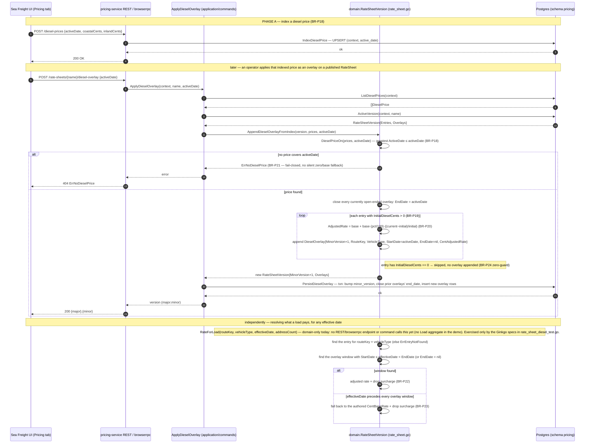

# How a diesel price update propagates into RateSheet pricing (pricing-service, as-built)

*Phase 25i — the Go pricing-service implementation.* Companion to [Effective-dated-diesel-sequence.md](Effective-dated-diesel-sequence.md), which covers the equivalent Linebooker source flow and cross-references it against this one. That document's Scope section carries a separate sequence diagram for Linebooker's own load-publishing branch (`Bidding` / `Allocation` / `Fixed Rate`) — this page is only the POC side.

*(Previously rendered as a Draw.io diagram — [pricing-diesel-overlay.drawio](pricing-diesel-overlay.drawio) / [images/diesel-overlay-sequence.png](images/diesel-overlay-sequence.png) remain on disk for reference; the Mermaid version above is now the source of truth for this page since it edits directly in Markdown.)*

## Three phases

1. **Index a diesel price** (BR-P18) — a plain upsert into `pricing.diesel_prices`, keyed by `(context, active_date)`.
2. **Apply the overlay** — an explicit, per-rate-sheet operator action (`POST .../diesel-overlay`). Resolves the diesel price in effect on the requested date (BR-P18), fails closed if none exists (BR-P21), closes every open overlay window, computes the adjusted rate for each entry that has an authored diesel baseline (BR-P20), skips entries that don't (BR-P24), and persists the result transactionally.
3. **Resolve a load's price** (`RateForLoad`) — shown for completeness, but flagged in the diagram as **domain-only today**: nothing in pricing-service's REST, browserrpc, or command layers calls it yet, because the demo has no Load aggregate. It's exercised only by the Ginkgo specs in `rate_sheet_diesel_test.go`.
