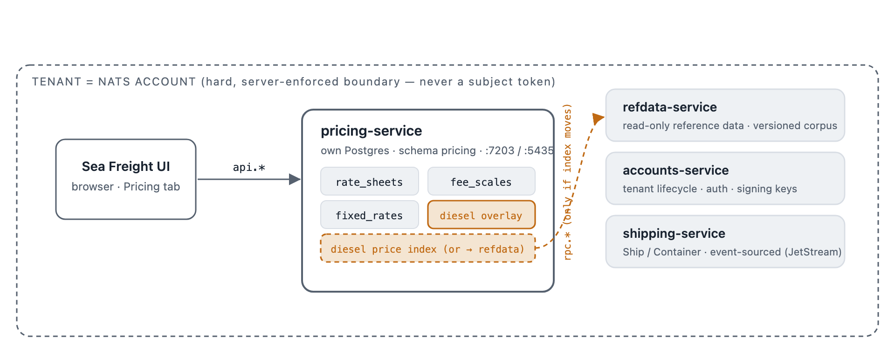
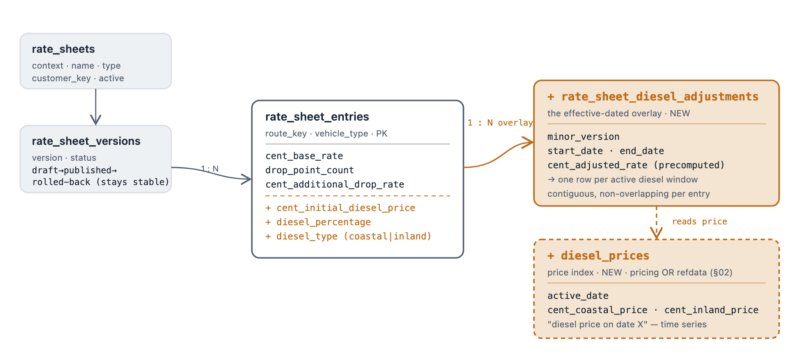
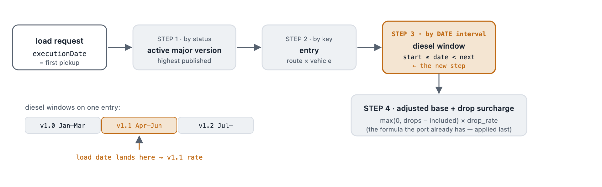

# Adding the effective-dated diesel overlay

*Phase 25 · Pricing Service · design sketch*

> **Status note:** this is the original design sketch that preceded implementation. Phase 25i built the overlay described here — Option A (§02) was chosen: the diesel price index lives inside `pricing-service`, not `refdata-service`. See `BUSINESS_RULES-PRICING.md` (BR-P17–BR-P24) for the as-built rules and `demos/01-dictionary/backend/pricing-service/pricing/internal/domain/rate_sheet.go` for the implementation.

The rate/fee domain is already ported and lives in its own service. This sketches the one dimension the port left out — diesel adjustments as a *date-effective overlay* on a stable rate sheet, not a re-publish — and shows exactly which tables, columns, and one cross-service decision it adds.

*source of record: Linebooker `RateSheetVersionEntryEntity` + `RateSheetDieselAdjustmentEntity` · target: `demos/01-dictionary/backend/pricing-service`*

---

## 01 · Where this lives — four services, not two

The rate domain is self-contained in `pricing-service`: the browser calls it directly over `api.*`, and `shipping-service` never consults it. The overlay adds no new service — it adds a diesel *price index* whose home is the only genuinely new question (see §02).

**Claim:** four services today; `pricing-service` owns the rate domain with no dependency on the others. The overlay's amber pieces are all internal to pricing — *except* the diesel price index, which is the one thing that could instead be fetched from `refdata-service` over `rpc.*` (dashed).

---

## 02 · The one new decision — where the diesel price index lives

Linebooker's `DieselRateEntity` is a time series of national diesel prices (coastal / inland, by `active_date`). It is pure *reference data* — "what was the diesel price on date X" — which is exactly refdata-service's shape. But the *adjustment* it feeds is pricing-domain math. So the price index is genuinely forkable; the adjustment logic is not.

**A · Index inside pricing-service — recommended for the POC** *(chosen — see status note above)*
One more table in schema `pricing`. Zero new cross-service calls; the whole overlay stays inside one service and one Postgres, keeping the demo self-contained and the CQRS story clean. Trades a little conceptual purity for a much simpler wiring.

**B · Index in refdata-service**
Truer to the taxonomy — a diesel-price series is textbook versioned reference data. Costs pricing a synchronous `rpc.{context}.refdata.diesel-price.get` hop on the calculation path, and re-opens the read-only-boundary question (BR-D28) that Phase 25 deliberately set aside. Worth it only if the platform wants a shared diesel index across services.

---

## 03 · The schema with the overlay added

Legend: **present today** · **added for the overlay** · **added, location TBD (§02)**

**Claim:** the major version stays exactly as-is (still `draft→published→rolled-back`). Everything new hangs off the *entry*: three diesel parameters on the row, plus a new child table of date-windowed adjustments that reads the diesel-price index. **No event sourcing** — every answer is a query over dated rows, so the plain-CRUD classification holds.

---

## 04 · How a load's date resolves a price

This is the behaviour "diesel repricing = just another publish" would have lost: a load priced with a pickup date of *last month* must resolve the diesel window that was active *then*, not today's. The major version is picked by status; the diesel rate is picked by **date interval**.

**Claim:** steps 1–2 and 4 already exist in the port. Only **step 3** is new: an interval lookup over the adjustment windows, driven by the load's own date. The adjusted rate itself is **precomputed** at adjustment-creation time via Linebooker's proportional formula — `rate + rate·(dieselPct/100)·((current−initial)/initial)` — so the read path stays a plain indexed query.

---

## 05 · Have · gap · add — the full mapping

| Element | Have today (Go port) | Gap vs source | To add |
|---|---|---|---|
| `rate_sheet_versions` | **present** — draft→published→rolled-back | none | **unchanged** — major version stays stable |
| `rate_sheet_entries` | **present** — base rate, drop count, drop rate | **partial** — no diesel parameters on the row | **add cols** — initial_diesel_price, diesel_percentage, diesel_type |
| `diesel_prices` | **missing** | **missing** — whole `DieselRateEntity` series | **new table** — coastal/inland by active_date · *location TBD* |
| `rate_sheet_diesel_adjustments` | **missing** | **missing** — the effective-dated overlay + windows | **new table** — minor_version, start/end_date, cent_adjusted_rate |
| date resolution | **partial** — "highest published" major only | **missing** — no date→window selection | **new logic** — ActiveDieselAdjustment(date) interval lookup |
| diesel repricing math | **absent** — doc claims "just a publish" (incorrect) | **missing** — proportional diesel formula | **new logic** — compute cent_adjusted_rate at create time |
| drop surcharge | **present** — extra drops × rate | none | **unchanged** — stays the last step |
| cost_calculation switch | **partial** — flat lane rate only | **missing** — per-ton, per-km-per-ton (BiddingUnit) | **deferred** — add only if demo needs weight/distance lanes |
| fixed_rate diesel sub-versions | **absent** — doc claims "just a publish" (incorrect) | **missing** — date-selected sub-versions | **same pattern** — apply the overlay to fixed rates too |
| load billing record | **n/a** — no Load aggregate yet | note — source uses a live FK, not a snapshot | **deferred** — decide snapshot-vs-live at load integration |

Two rows are worth reading as corrections, not just gaps: the diesel rationale currently written into `rate_sheet.go` / `fixed_rate.go` ("just another publish") is factually wrong about the source and should be fixed whether or not the overlay is built now.

---

## 06 · What's in, what waits

- **Build now (the overlay):** the three amber "new" rows — diesel params on the entry, the `diesel_prices` index, the `rate_sheet_diesel_adjustments` child table, the date-interval resolver, and the proportional repricing math. This is the single highest-value enrichment because it's the clean worked example of "reference-looking data that needs date-effective history but still isn't event-sourced" — the exact CQRS-taxonomy question this lab exists to explore.
- **Decide first (§02):** diesel price index in pricing (recommended, self-contained) vs refdata (truer taxonomy, adds an `rpc.*` hop). Everything else follows from this one call.
- **Correct regardless:** the "diesel = just another publish" rationale in two domain files, the plan, and `BUSINESS_RULES-PRICING.md` — it mischaracterises the source even if the overlay stays deferred.
- **Deferred, on purpose:** the `BiddingUnit` cost-calculation switch (flat vs per-ton vs per-km-per-ton) and the load-billing snapshot-vs-live decision — both wait for a Load aggregate and a decision that the demo needs weight/distance lanes.
