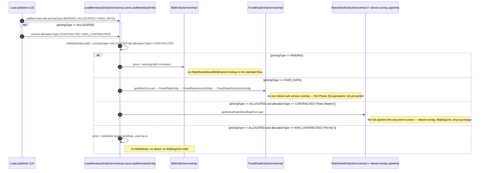

# How a diesel price update propagates into RateSheet pricing

*As-built, Phase 25i — cross-referenced against the Linebooker source at `/Users/jeremy/dev/github/linebooker/linebooker`*

Companion to [Effective-dated-diesel-pre-design.md](Effective-dated-diesel-pre-design.md) (the sketch written before implementation). This note documents the shipped Go behavior and checks it, claim by claim, against the original Java/Spring source it was ported from.

---

## Scope — which Linebooker publish path this document covers

A load in source is published under exactly one top-level `PricingType`, and — only when that type is `ALLOCATED` — one further `AllocationType`. That choice decides whether the RateSheet/diesel-overlay pipeline documented below runs at all; three of the four real paths never touch it.

| Top-level type (`PricingType`) | Sub-mode (`AllocationType`) | Price source | Touches the RateSheet/diesel pipeline? | Go port status |
|---|---|---|---|---|
| **`BIDDING`** ("Bidding") | n/a | Winning transporter bid, stored as-is (`BidEntityServiceImpl`) | **No** — only a separate admin "override bid" path ever calls into RateSheet logic | Not represented in the port — no Bid concept exists yet |
| **`ALLOCATED`** ("Allocation") | `CONTRACTED` ("Rate Sheets") | `RateSheetEntityServiceImpl.getActiveRateSheetRateForLoad` | **Yes — this is the path the rest of this document documents** | **Implemented** (Phase 25i) |
| **`ALLOCATED`** ("Allocation") | `NON_CONTRACTED` ("Ad Hoc") | Publisher-typed `laneRate` currency field, used directly | **No** | Not represented — source itself has no RateSheet entry for these loads either |
| **`FIXED_RATE`** ("Fixed Rate") | n/a | `FixedRateEntityServiceImpl.getRateForLoad` — its own contract-rate + diesel-sub-version pipeline | **No** — a structurally separate pipeline | Not yet built — deferred to **Phase 25j** |

**Net scope statement:** the pricing-service Go port, BR-P07–BR-P24, and everything documented in this file cover exactly one of Linebooker's four real load-pricing paths — `ALLOCATED` + `CONTRACTED` ("Allocation → Rate Sheets"). `FIXED_RATE` has a known, real reference implementation to port from (Phase 25j). `BIDDING` and `ALLOCATED` + `NON_CONTRACTED` ("Ad Hoc") have no RateSheet-equivalent concept in the port today, by design — source itself never routes them through diesel/BiddingUnit/drop-surcharge logic, so there is nothing to port for those two paths unless the demo's scope grows to represent bidding or ad-hoc pricing directly.

---

## The POC's own sequence diagram lives separately

The pricing-service (Go port) implementation's own diesel-overlay sequence — indexing a price, applying it as an overlay, and the (currently-unwired) load-price resolution path — is documented in its own file: [Effective-dated-diesel-poc-sequence.md](Effective-dated-diesel-poc-sequence.md). This document's Scope section above covers only the Linebooker-source branch; the rest of this document (below) is the cross-reference and formula comparison, not a second copy of the POC diagram.

---

## Cross-reference against the Linebooker source

The Go port reimplements `RateSheetVersionEntryEntity` + `RateSheetDieselAdjustmentEntity` + `DieselRateEntity` as `RateSheetEntry` + `DieselOverlay` + `DieselPrice`. The core arithmetic is a faithful port; several structural and failure-mode decisions diverge — mostly in ways that make the port *stricter* than source, not equivalent to it.

| Aspect | Linebooker source (Java/Spring, MySQL) | Go port (pricing-service) | Verdict |
|---|---|---|---|
| **Adjusted-rate formula** | `DieselAdjustmentServiceImpl.adjustDieselPrice`: `initialRate + initialRate·(pct/100)·((current−initial)/initial)`, using `BigDecimal` with **two intermediate roundings to 6dp** (HALF_UP) plus a final round to 0dp | `AdjustedRate()`: same algebraic formula, computed as one expression, rounded once via `math.Round` | **Algebraically identical**; can differ by ±1 cent in edge cases from source's extra intermediate rounding steps. Not a bug either side — just a different rounding strategy. |
| **Diesel price lookup (write time)** | `DieselRateEntityRepository.getDieselRatePreviouslyActiveFrom`: `active_date <= :date ORDER BY active_date DESC LIMIT 1` | `DieselPriceOn()`: greatest `ActiveDate` ≤ query date | **Matches exactly.** |
| **Diesel price lookup (load read time)** | **No live lookup.** The adjustment row's `DieselRateEntity` FK was fixed at creation time; resolution only ever compares the *adjustment's own* `startDate` to the load's execution date — `diesel_rate_entity` is never re-queried per load | `RateForLoad()` walks `Overlays` directly, matching `StartDate ≤ effectiveDate < EndDate` | Different mechanism, same effect for well-formed data — but the port's window (`start`/`end`) is load-bearing at read time; source's `end_date` is **not** (see next row). |
| **Overlay window `end_date`** | Column exists, but is **not used by the read-time resolution algorithm at all**. It's populated after the fact by a batch SQL recompute (`recalculateDieselAdjustmentEndDates`) for reporting/display; the actual "which adjustment applies" decision uses only `start_date` (`isBefore`, tie-broken by max `minorVersion`) | `EndDate` is set atomically when the *next* overlay is appended, and **is** the thing `RateForLoad` matches against | **Real divergence.** The port's `end_date` is functional; source's is decorative. The port is the more internally-consistent design. |
| **Overlay creation trigger** | Automatic, system-wide fan-out: one admin `POST /diesel-rate-entities` triggers `performDieselAdjustments` across **every active `RateSheetVersionEntity`** (and `createSubVersionsForActiveRates` across every active `FixedRateVersionEntity`) in one transaction, deleting and rebuilding all adjustments from that date forward | Manual, per-rate-sheet: `POST /rate-sheets/{name}/diesel-overlay` only ever touches the one named, already-published sheet | **Real divergence** — source reprices the whole tenant's book in one shot; the port requires one call per rate sheet. Worth deciding deliberately if/when Phase 25j (FixedRate) or a bulk-reprice UX is built. |
| **Booked-load recompute** | `performDieselAdjustments` publishes `RecalculateRateSheetLoadTotalsEvent`, consumed by `LoadRequestEntityServiceImpl` to re-save `LoadMonetaryEntity` for every affected **already-booked** load | **N/A** — no Load aggregate exists in the demo yet | Deferred, not divergent — flagged as a known gap since the original design sketch (§06, "load billing record"). |
| **Minor version** | Real: `RateSheetDieselAdjustmentEntity.minor_version`, incremented per diesel rate captured for a version; `major_version` lives on `RateSheetVersionEntity` | `RateSheetVersion.MinorVersion`, incremented per `AppendDieselOverlay` call | **Matches.** Confirms the port's major.minor scheme is a faithful mapping, not an invention — see BR-P17. |
| **No-diesel-price-at-all failure** | `calculateActiveDieselAdjustmentForDate` throws an **uncaught `EntityNotFoundException`** when an entry has zero adjustments — an unhandled 500-style failure, not a typed error | `AppendDieselOverlayFromIndex` returns typed `ErrNoDieselPrice` (BR-P21), mapped to HTTP 404 | **Port is stricter and cleaner.** Source fails closed by accident (an uncaught exception); the port fails closed by design. |
| **Effective date precedes every window** | Falls back to the **earliest-created overlay** row (min `startDate`, max `minorVersion` tiebreak) — in practice the "v0" overlay seeded at version creation | Falls back to the **authored `CentBaseRate`** directly (BR-P23) | Functionally similar outcome, different mechanism — source's fallback is "the oldest overlay row" (which usually *is* the base rate), the port's is an explicit, guaranteed base-rate fallback with no dependency on overlay history existing at all. |
| **Missing diesel baseline (`InitialDieselCents`/`centInitialDieselPrice` = 0 or null)** | **No guard.** `BigDecimal.divide(BigDecimal.ZERO, ...)` throws `ArithmeticException`; a null baseline throws `NullPointerException`. Either would abort the **entire** `performDieselAdjustments` transaction — i.e. one bad entry blocks diesel repricing for every rate sheet in the tenant that round | Explicit BR-P24 guard: entries with `InitialDieselCents <= 0` are skipped, not computed; they keep resolving to base rate | **Correction to the pre-design doc:** the original sketch worried the port might be *emulating* a source bug where this "silently corrupts to $0 via NaN→int64." That specific failure mode **does not exist in source** — Java's `BigDecimal` fails loudly (a hard exception), not silently. The port's guard isn't replicating a source bug; it's independently safer than source on both counts (no crash, no corruption). |
| **FixedRate diesel overlay** | Fully implemented (`FixedRateEntity`/`FixedRateVersionEntity`/`FixedRateSubVersionEntity`), sharing the same `adjustDieselPrice` formula, but a simpler model: no `minor_version`, no `end_date`, plain list ordered by `active_from desc`. Its own fail-open behavior differs *again* from RateSheet's — falls back to the base `centRate` directly and never throws, even with zero sub-versions | Not yet built — explicitly deferred to Phase 25j | Confirms Phase 25j has a real, working reference implementation to port from — and that source itself is inconsistent between RateSheet and FixedRate fail-open behavior, so 25j should pick one convention (recommend: reuse BR-P23's clean base-rate fallback) rather than porting source's inconsistency. |
| **API-level version display** | `buildMinorVersionFromDieselAdjustment` synthesizes a "vX.Y" DTO on the fly per diesel adjustment, per API call | `MinorVersion` is a persisted column, read directly | Different mechanics, same visible result. Port's is simpler to reason about (no synthesis step). |

---

## Rate sheet formula by cost-calculation category

Once an entry's diesel-adjusted rate is resolved (see [Effective-dated-diesel-poc-sequence.md](Effective-dated-diesel-poc-sequence.md) for the POC's own resolution sequence), source applies one more switch before adding the drop surcharge: `RateSheetVersionEntryEntity.costCalculation`, a `BiddingUnit` enum, picked per entry. All three categories share the same shape — `perUnitFormula(adjustedRate) + dropSurcharge` — computed in `RateSheetEntityServiceImpl.calculateRateFromRateSheetEntryForLoad`.

| `BiddingUnit` | Formula (source) | Inputs | Go port |
|---|---|---|---|
| **`LANE_RATE`** | `adjustedRate` — returned as-is, no multiplication | none | **Implemented.** This is the only category the port has — `RateForLoad` always returns `CentAdjustedRate` (or `CentBaseRate`) flat. |
| **`RAND_PER_TON`** | `adjustedRate × weightInTons` | `LoadRequestEntity.weight` (kg) ÷ 1000, `MathContext(0, HALF_UP)` | **Not implemented** — deferred (pre-design doc §06, "cost_calculation switch"). |
| **`RAND_PER_KM_PER_TON`** | `adjustedRate × distance × weightInTons` (distance multiplied first) | `LoadRequestEntity.distanceBenchmark` — a **stored field**, not a live geocode/route calculation — × weight in tons as above | **Not implemented** — deferred. |

Supporting details from source, all confirmed in `RateSheetEntityServiceImpl.java`:

- **Drop surcharge applies uniformly across all three categories** — `addAdditionalDropCost` takes whatever the per-unit formula produced as `baseCost` and adds `max(0, addressCount − dropPointCount) × centAdditionalDropRate`, with no `BiddingUnit` branch inside it. This matches the port's `AdditionalDropsCharge` exactly, so the port's drop-surcharge behavior stays correct regardless of which category gets built next.
- **No minimum-charge floor or maximum cap** exists anywhere in the chain, for any category — the only post-calculation adjustment is `Monetary.withRounding(decimalScale)`, a rounding step, not a clamp.
- **Benchmark rate** reuses the identical per-`BiddingUnit` formula — only the base-rate input changes (a benchmark diesel-adjustment lookup instead of the credit one).
- **Debit vs. credit** also reuses the same formula, but only for **fixed-rate rate sheets**. For ordinary (non-fixed-rate) sheets, debit skips this formula entirely and instead applies a fee-scale markup to the already-computed credit (`monetaryService.calculateCentDebit`). Benchmark's debit is deliberately set equal to its credit, with a source code comment explaining why: "cannot add our fee to a competitor's price."
- If a required input is missing for the selected category (e.g. no weight recorded for a `RAND_PER_TON` entry), source logs an error and returns `null` — a third, distinct fail-open behavior alongside the ones catalogued in the table above.

**For Phase 25j / a future per-ton or per-km-per-ton category on the port:** the formula itself is simple to port faithfully. The more consequential decisions are (1) where `distanceBenchmark`-equivalent data comes from, since the demo has no load/route distance concept yet, and (2) picking one fail-open convention for missing inputs rather than the `null`-and-log pattern source uses inconsistently across BiddingUnit, debit/credit, and diesel-adjustment lookups alike.

### Net assessment

The port is a faithful reimplementation of the pricing math and the major/minor version concept, and is **stricter and more internally consistent** than source on every failure-mode question (fail-closed vs fail-open, the zero-baseline guard, `end_date` actually being load-bearing). The two deliberate scope gaps — **system-wide fan-out on a single diesel-price save** and **booked-load recompute** — are real behavioral differences from source, not defects; both were already flagged as deferred in the original design sketch and should be revisited explicitly if/when Phase 25j or a Load aggregate is built, rather than assumed away.
